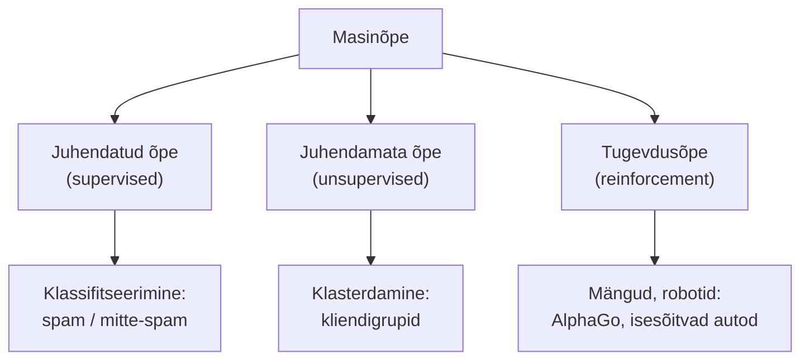

# 2.2 Masinõppe alused

::: tip Selle tunni järel...
- oskad selgitada oma sõnadega, mis on masinõpe (ML);
- tunned kolme peamist tüüpi: juhendatud, juhendamata, tugevdusõpe;
- toed elust näiteid, kus igat tüüpi kasutatakse.
:::

## Mis on masinõpe?

Masinõpe (ML) on tehisintellekti haru, kus arvuti õpib andmetest mustreid, ilma et talle iga reeglit eraldi öeldaks.

Klassikaline programm: sina kirjutad reeglid → arvuti annab vastuse. Masinõpe: sa annad andmed + vastused → arvuti leiab reeglid ise.

::: tip Huvitav fakt
Masinõppe termini võttis 1959. aastal kasutusele Arthur Samuel oma artiklis malemängu (kabe) mängiva programmi kohta, kuid alles ~2012. aastast muutis see valdkonda tegelikult tänu suurele arvutivõimsusele (GPU) ja tohutule andmehulgale ([Wikipedia — Arthur Samuel](https://en.wikipedia.org/wiki/Arthur_Samuel_(computer_scientist))).
:::

## Kolm peamist tüüpi

| Tüüp | Kuidas õpib | Näide elust |
|---|---|---|
| Juhendatud | Andmed + õiged vastused | E-posti filter (spam / mitte-spam) |
| Juhendamata | Ainult andmed, vastused puuduvad | Spotify soovitussüsteem, klientide segmenteerimine |
| Tugevdus | Katse ja eksitus + tasu | AlphaGo, isesõitvad autod, mängude AI |

*AlphaGo õppis go mängima tugevdusõppe abil — miljonite iseendaga mängitud partiide käigus, kus võit andis "tasu". 2016. aastal võitis see maailmameistri Lee Sedoli. Autor: Wesalius, [Wikimedia Commons](https://commons.wikimedia.org/wiki/File:Lee_Sedol_(B)_vs_AlphaGo_(W)_-_Game_1.svg) (CC BY-SA 4.0).*

## Viited ja lisalugemine

- [Wikipedia — Arthur Samuel (computer scientist)](https://en.wikipedia.org/wiki/Arthur_Samuel_(computer_scientist))
- [Google — Machine Learning Crash Course](https://developers.google.com/machine-learning/crash-course)
- [3Blue1Brown — But what is a neural network?](https://www.youtube.com/watch?v=aircAruvnKk)
