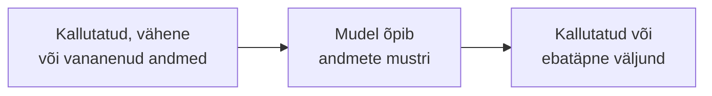

# 2.3 Treeningandmed

::: tip Selle tunni järel...
- oskad selgitada, miks treeningandmed on kõige tähtsam osa;
- tunned mõistet bias (kallutatus);
- toed reaalse näite halvasti kalibreeritud andmetest.
:::

## Reegel: garbage in, garbage out

Mudel õpib täpselt seda, mida andmed talle näitavad. Kui andmed on kallutatud, on kallutatud ka mudel.

::: tip Huvitav fakt
2015. aastal märkas Google Photosi kasutaja Jacky Alcine, et rakendus märgistas automaatselt tema ja ta tumedanahalise sõbra fotod sildiga "gorilla". Google vabandas avalikult ja lubas parandada nii keelekasutust kui pilditurvastust, kuid kiireima lahendusena eemaldas ta lihtsalt sõnad "gorilla", "šimpanss" ja "ahv" kogu rakenduse sõnavarast — probleemi juur (treeningandmestik, kus tumedama nahavärviga inimesi oli näotuvastuse õppimiseks liiga vähe) jäi aastateks lahendamata ([Forbes, 2015](https://www.forbes.com/sites/mzhang/2015/07/01/google-photos-tags-two-african-americans-as-gorillas-through-facial-recognition-software/); [CBC News, 2015](https://www.cbc.ca/news/trending/google-photos-black-people-gorillas-1.3135754)).
:::

## Kolm kvaliteediprobleemi

| Probleem | Reaalne näide |
|---|---|
| Vähe andmeid | Google Photos (2015) — näotuvastus polnud treenitud piisaval hulgal tumedanahaliste inimeste fotodel ja märgistas need valesti |
| Kallutatud jaotus | "Gender Shades" (2018) — näotuvastussüsteemid eksisid tunduvalt sagedamini tumedama nahavärviga naiste puhul, kuna treeningandmestikes oli neid alaesindatud |
| Vananenud | LLM ei tea sündmustest, mis juhtusid pärast tema treeningandmete "knowledge cutoff" kuupäeva (vt [tund 2.4](./tund-04-tokenid)) |

MIT Media Labi teadlane Joy Buolamwini uuris koos Timnit Gebruga 2018. aasta uuringus "Gender Shades" kolme suure tehnoloogiaettevõtte (IBM, Microsoft, Face++) näotuvastussüsteeme ja leidis just seda mustrit ([MIT Media Lab — Gender Shades](https://www.media.mit.edu/projects/gender-shades/overview/)).

*Joy Buolamwini, MIT Media Labi teadlane ja "Gender Shades" uuringu üks autoritest, Wikimania 2018 konverentsil. Foto: Niccolò Caranti, [Wikimedia Commons](https://commons.wikimedia.org/wiki/File:Joy_Buolamwini,_2018_(cropped).jpg) (CC BY-SA 4.0).*

::: details Veel üks näide — aga vaieldav (COMPAS)
2016. aastal avaldas ajakirjandusorganisatsioon ProPublica uurimuse "Machine Bias" USA kohtutes kasutatava riskihindamistarkvara COMPAS kohta: valgetest süüdimõistetutest, keda hiljem uut kuritegu toime ei pannud, liigitas algoritm ekslikult "kõrge riskiga" 24%, mustanahalistest sama grupi puhul aga 45% ([ProPublica, 2016](https://www.propublica.org/article/machine-bias-risk-assessments-in-criminal-sentencing)). See on hea näide keerulisemast juhtumist: tarkvara valmistaja ja mitmed teadlased vaidlesid ProPublica järeldusele vastu, näidates, et algoritm oli tegelikult kalibreeritud võrdselt täpseks mõlema rühma jaoks (*predictive parity*) — probleem oli hoopis selles, milline "õigluse" mõõdik valida. See näitab, et "kas AI on kallutatud" ei ole alati must-valge küsimus.
:::

## Viited ja lisalugemine

- [Forbes (2015) — Google Photos Tags Two African-Americans As Gorillas](https://www.forbes.com/sites/mzhang/2015/07/01/google-photos-tags-two-african-americans-as-gorillas-through-facial-recognition-software/)
- [CBC News (2015) — Google apologizes after app mistakenly labels black people 'gorillas'](https://www.cbc.ca/news/trending/google-photos-black-people-gorillas-1.3135754)
- [MIT Media Lab — Gender Shades](https://www.media.mit.edu/projects/gender-shades/overview/)
- [Wikipedia — Joy Buolamwini](https://en.wikipedia.org/wiki/Joy_Buolamwini)
- [ProPublica (2016) — Machine Bias](https://www.propublica.org/article/machine-bias-risk-assessments-in-criminal-sentencing)
