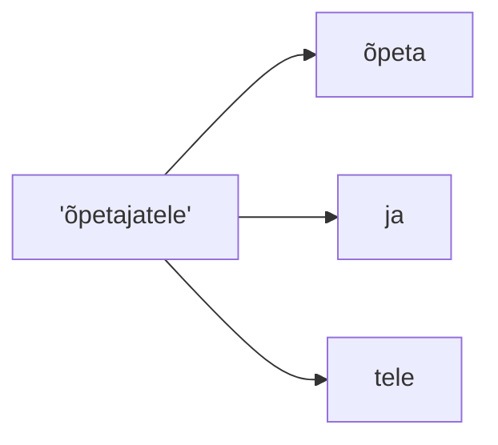
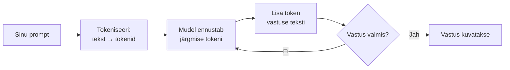
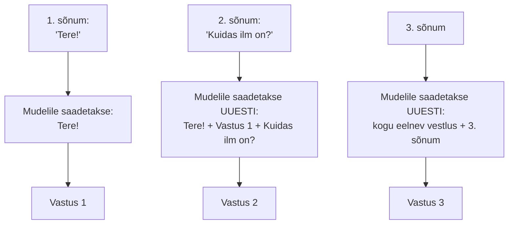
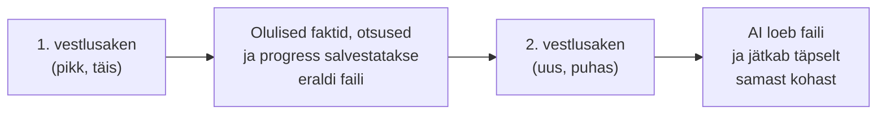

# 2.4 Tokenid ja suured keelemudelid (LLM-id)

::: tip Selle tunni järel...
- oskad selgitada, mis on token ja mis on suur keelemudel (LLM);
- mõistad, kuidas LLM genereerib vastuse token-tokeni haaval;
- tead, miks eesti keel "maksab" LLM-i kasutamisel sageli rohkem kui inglise keel.
:::

## Mis on suur keelemudel (LLM)?

Suur keelemudel (*Large Language Model*, LLM) on Transformer-arhitektuuril põhinev närvivõrk (vt [tund 1.2](/tehisintellekt/moodul-01-mis-on-ai/tund-02-ai-ajalugu)), mis on treenitud tohutul hulgal tekstil ennustama, milline sõna (täpsemalt: milline *token*) peaks tekstis järgmisena tulema. ChatGPT, Claude ja Gemini kõik põhinevad LLM-idel.

## Mis on token?

Enne kui LLM teksti töötleb, jagab ta selle **tokeniteks** — sõnadeks, sõnaosadeks või üksikuteks märkideks. Inglise keele puhul kehtib rusikareegel: **1 token ≈ 4 tähemärki ehk ~0,75 sõna** ([OpenAI Help Center](https://help.openai.com/en/articles/4936856-what-are-tokens-and-how-to-count-them)).

Sagedased sõnad (nagu "the", "and") saavad tavaliselt terve, ühe tokeni. Harvemad või pikad sõnad jagatakse mitmeks tokeniks:

::: warning Miks see eesti keeles oluliselt loeb
Enamik suuri keelemudeleid on treenitud valdavalt ingliskeelsel tekstil ja nende tokeniseerija (*tokenizer*) on ehitatud inglise keele struktuuri jaoks. Eesti keel on morfoloogiliselt rikas (palju käändeid ja tuletusi), mistõttu sama lause võtab eesti keeles tihti rohkem tokeneid kui inglise keeles — üks 2025. aasta uuring näitas, et eestikeelsele sõnavarale kohandatud tokeniseerija vähendab tokenite arvu sõna kohta ligikaudu 20% võrra ([Kuulmets jt, arXiv 2025](https://arxiv.org/pdf/2501.02631)). Praktikas tähendab see, et eestikeelne prompt või vastus võib maksta rohkem ja mahtuda kehvemini konteksti aknasse kui samasisuline ingliskeelne tekst.
:::

## Kuidas LLM vastuse genereerib

LLM ei kirjuta kogu vastust korraga — ta ennustab **ühe tokeni korraga**, lisab selle olemasolevale tekstile ja kordab protsessi:

Sellepärast "kirjutab" ChatGPT vastust ekraanile sõna-sõna haaval, mitte ei ilmuta seda korraga — nii see tehniliselt töötabki.

## Kontekstiaken

**Kontekstiaken** (*context window*) on maksimaalne arv tokeneid, mida mudel korraga "meeles" suudab hoida — sinna kuuluvad nii sinu senine vestlus kui ka mudeli vastus. Kui vestlus läheb kontekstiaknast pikemaks, "unustab" mudel varasema osa. Tänaste juhtivate mudelite kontekstiaknad ulatuvad sadadest tuhandetest kuni miljoni tokenini, kuid suurem aken ei tähenda automaatselt, et mudel kasutab kogu seda infot võrdselt hästi.

## Kuidas AI "mäletab" vestlust?

Siin on üks kõige rohkem valesti mõistetud asju AI kohta: **mudelil endal ei ole mälu.** Iga päring, mille sa mudelile saadad, on tema jaoks täiesti eraldiseisev ja uus — mudel ei "mäleta" sinu eelmist sõnumit mitte kuidagi ise.

See, mis paistab välja nagu "vestlus", tekib tegelikult nii: iga kord, kui sa saadad uue sõnumi, saadab rakendus (ChatGPT, Claude jt) mudelile **kogu senise vestluse tekstina uuesti kaasa**, koos sinu uue sõnumiga. Mudel "loeb" iga kord kogu vestluse otsast peale läbi ja vastab siis järgmisele reale.

Seda kinnitavad ka Anthropicu ja OpenAI enda dokumendid: mõlema ettevõtte peamised API-d on **olekuta (stateless)** — iga päring peab sisaldama kogu vestluse ajalugu, sest mudel ise midagi eelmisest päringust kaasa ei kanna ([Anthropic — Claude API dokumentatsioon](https://platform.claude.com/docs/en/build-with-claude/working-with-messages); [OpenAI API dokumentatsioon](https://developers.openai.com/api/docs/guides/conversation-state)).

::: info Miks see praktikas loeb
- **Pikk vestlus läheb kallimaks ja aeglasemaks** — iga uue sõnumiga saadetakse mudelile taas kogu varasem tekst, mitte ainult uus lause.
- **Vestlus võib "ummistuda"** — kui vestlus kasvab kontekstiaknast pikemaks, tuleb midagi ohverdada: kas vanemad sõnumid kärbitakse ära või tehakse neist kokkuvõte.
- **Uus vestlus = puhas leht** — kui alustad ChatGPT-s või Claude'is uue vestluse, ei tea mudel eelmisest vestlusest mitte midagi, kui keegi pole seda talle uuesti öelnud.
:::

## Tööriistad, mis aitavad konteksti hallata

- **Automaatne vestlushaldus** — ChatGPT, Claude ja teised rakendused teevad kogu eelneva selgituse töö sinu eest automaatselt: nad salvestavad vestluse oma serveris ja saadavad selle mudelile ise iga kord uuesti.
- **Kärpimine ja kokkuvõtted (truncation/summarization)** — kui vestlus läheneb kontekstiakna piirile, kärbivad paljud rakendused vanemad sõnumid ära või asendavad need lühikokkuvõttega, et uus info ikka ära mahuks.
- **Püsimälu funktsioonid** (nt ChatGPT "Memory", Claude "Memory"/Projects) — need salvestavad valitud faktid sinu kohta (nt sinu amet, eelistused) eraldi, väljaspool tavalist vestlust, ja lisavad need automaatselt igale UUELE vestlusele. Tehniliselt on see ikkagi sama põhimõte: fakt lihtsalt lisatakse uue päringu konteksti sisse, mudel ise ei "mäleta" midagi püsivalt ([OpenAI Help Center — Memory FAQ](https://help.openai.com/en/articles/8590148-memory-faq); [Claude Help Center — Personalization](https://support.claude.com/en/articles/10185728-understanding-claude-s-personalization-features)).

## Miks tasub vestlust vahepeal "puhastada" — ja kuidas seda õigesti teha

Väga pikk vestlus ei ole ainult kallim ja aeglasem — see võib muuta ka mudeli vastused kehvemaks. Uuring "Lost in the Middle" (Liu jt, 2023) näitas, et mudelid kasutavad konteksti keskel olevat infot tunduvalt halvemini kui konteksti alguses või lõpus olevat infot — mida pikem ja segasem vestlus, seda kergemini läheb oluline info "kaduma" keset kogu teksti ([Liu jt, arXiv 2307.03172](https://arxiv.org/abs/2307.03172)).

Sellepärast on hea tava aeg-ajalt vestlus n-ö nullida ja alustada uut, puhast kontekstiakent. Probleem: uus aken tähendab, et kogu senine vestluse sisu ("mida me juba otsustasime", "mis on veel pooleli") kaob mudeli jaoks täielikult.

Anthropic kirjeldab oma tehnilises juhendis kahte praktikat, mis seda probleemi lahendavad ([Anthropic — Effective context engineering for AI agents](https://www.anthropic.com/engineering/effective-context-engineering-for-ai-agents)):

1. **Kompaktimine (compaction)** — enne kui vestlus jõuab kontekstiakna piirini, lastakse mudelil ise teha kogu senisest vestlusest kokkuvõte (mis otsused tehti, mis on pooleli, mis probleemid lahendamata), ning uus vestlus jätkub selle kokkuvõtte pealt, mitte tühjalt lehelt.
2. **Struktureeritud märkmed (agent memory)** — AI kirjutab olulise info (progressi, otsused, tähtsad faktid) jooksvalt eraldi **faili**, mis jääb väljapoole kontekstiakent. Kui alustatakse uus vestlus/aken, loeb AI selle faili uuesti läbi ja jätkab täpselt sealt, kuhu eelmine vestlus pooleli jäi. Anthropic toob näiteks oma tööriista Claude Code, mis hoiab lihtsat `NOTES.md`-tüüpi märkmefaili, et jälgida keeruka ülesande käiku pikkade vestluste vältel.

::: tip Praktikas
See on täpselt sama põhimõte, mida see õppematerjal ise kasutab: pikkade projektide juures on kasulikum hoida olulisi otsuseid ja konteksti eraldi failis (nt plaanifail, märkmefail), mitte lootma jääda sellele, et AI "mäletab" kõike ühest tohutust vestlusest.
:::

## Viited ja lisalugemine

- [OpenAI Help Center — What are tokens and how to count them?](https://help.openai.com/en/articles/4936856-what-are-tokens-and-how-to-count-them)
- Kuulmets jt (2025). ["Prune or Retrain: Optimizing the Vocabulary of Multilingual Models for Estonian"](https://arxiv.org/pdf/2501.02631)
- Vaswani, A. jt (2017). ["Attention Is All You Need"](https://arxiv.org/abs/1706.03762)
- [Anthropic — Using the Messages API](https://platform.claude.com/docs/en/build-with-claude/working-with-messages)
- Liu, N. jt (2023). ["Lost in the Middle: How Language Models Use Long Contexts"](https://arxiv.org/abs/2307.03172)
- [Anthropic — Effective context engineering for AI agents](https://www.anthropic.com/engineering/effective-context-engineering-for-ai-agents)
- [OpenAI API — Conversation state](https://developers.openai.com/api/docs/guides/conversation-state)
- [OpenAI Help Center — Memory FAQ](https://help.openai.com/en/articles/8590148-memory-faq)
- [Claude Help Center — Understanding Claude's personalization features](https://support.claude.com/en/articles/10185728-understanding-claude-s-personalization-features)
