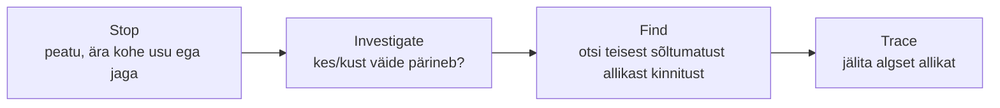

# 2.5 Miks AI eksib?

::: tip Selle tunni järel...
- oskad selgitada, miks LLM hallutsineerib (tehniline põhjus, mitte "AI on rumal");
- tunned nelja tüüpilist veakategooriat;
- oskad rakendada kontrollimeetodit iga AI-vastuse hindamisel.
:::

## Miks AI hallutsineerib?

Suur keelemudel (LLM) ei "tea" fakte. Ta teab statistilisi mustreid (vt [tund 2.4](./tund-04-tokenid)). Iga sõna järel arvutab ta, milline oleks järgmine kõige tõenäolisem token.

Kui sa küsid midagi väljamõeldu kohta, jätkab mudel ikkagi tuttavat mustrit ("Kes leiutas X-i? — Y leiutas selle aastal Z.") ja täidab tühjad kohad usutavalt kõlavate sõnadega. Tulemus: veenev, aga vale vastus.

::: info Info
Hallutsinatsioon ei ole viga tarkvaras — see on omadus sellest, kuidas mudel töötab. Mudel on ehitatud ennustama, mitte teadma. Sellepärast ei saa hallutsinatsiooni täielikult eemaldada, saab vaid vähendada.
:::

## Neli veakategooriat

1. **Faktiline hallutsinatsioon** — mudel väidab midagi, mis pole tõsi.
2. **Aegunud info** — mudel treeniti teatud ajani, aga küsid hilisemast ajast. Nt "Kes on praegune peaminister?" — mudel ei tea muudatusi, mis toimusid pärast tema koolitusandmete lõppemist.
3. **Vale allikas (fabricated citation)** — mudel viitab raamatule või artiklile, mida tegelikult ei eksisteeri.
4. **Loogikaviga** — mudel eksib matemaatikas või järelduskäigus (nt "Kui A > B ja B > C, siis C > A" — vale).

## Reaalsest elust: kui hallutsinatsioon jõuab uudistesse

**Faktiline hallutsinatsioon — Google Bard ja James Webb kosmoseteleskoop (2023).** Google esitles oma vestlusroboti Bardi avalikus reklaamvideos. Bardilt küsiti, mida uut on James Webbi kosmoseteleskoop avastanud — bot vastas, et see tegi esimese pildi meie Päikesesüsteemist väljaspool asuvast planeedist. Tegelikult tegi selle pildi hoopis teine teleskoop (VLT) juba 2004. aastal. Uudis levis kiiresti ja Google'i emaettevõtte Alphabeti aktsia langes ühe päevaga ligi 8%, kaotades turuväärtuses umbes 100 miljardit dollarit ([CNN Business, 2023](https://www.cnn.com/2023/02/08/tech/google-ai-bard-demo-error)).

*James Webbi kosmoseteleskoobi esimene avalikustatud pilt (2022) — sama teleskoop, mille kohta Google'i vestlusrobot Bard 2023. aastal vale fakti väitis. Foto: NASA, ESA, CSA, STScI, [Wikimedia Commons](https://commons.wikimedia.org/wiki/File:Webb's_First_Deep_Field.jpg) (avalik omand).*

**Vale allikas — advokaadid, kes usaldasid ChatGPT väljamõeldud kohtulahendeid (2023).** New Yorgi advokaadid Steven Schwartz ja Peter LoDuca kasutasid kohtule esitatava dokumendi koostamisel ChatGPT-d. Dokument viitas kuuele varasemale kohtulahendile, mis pidid nende argumenti toetama — kõik kuus olid ChatGPT poolt välja mõeldud ja ei eksisteerinud kunagi. Kohtunik trahvis mõlemat advokaati 5000 dollariga ([Wikipedia — Mata v. Avianca, Inc.](https://en.wikipedia.org/wiki/Mata_v._Avianca,_Inc.)).

## Kui hallutsinatsioon läheb ettevõttele kalliks

Hallutsinatsioon pole ainult piinlik — sellel võivad olla reaalsed rahalised ja õiguslikud tagajärjed ettevõttele, kes AI-d kasutab.

*Air Canada lennuk. 2024. aastal otsustas Kanada tsiviilvaidluste tribunal, et Air Canada peab hüvitama kliendile soodustuse, mille kohta ettevõtte enda kodulehe vestlusrobot andis vale info. Foto: abdallahh, [Wikimedia Commons](https://commons.wikimedia.org/wiki/File:Air_Canada_Airbus_A330-343_(C-GHKR).jpg) (CC BY 2.0).*

Klient Jake Moffatt küsis Air Canada veebilehe vestlusrobotilt matusega seotud soodushinna kohta ja sai vastuseks, et soodustust saab taotleda ka tagantjärele. See oli vale — tegelik reegel nõudis taotlemist enne lendu. Kui Moffatt hiljem soodustust taotles, keeldus Air Canada, väites kohtus, et "vestlusrobot on iseseisev juriidiline üksus", kelle sõnade eest ettevõte ei vastuta. Tribunal lükkas selle argumendi tagasi: ettevõte vastutab kogu oma kodulehel oleva info eest, olenemata sellest, kas selle kirjutas inimene või vestlusrobot ([American Bar Association, 2024](https://www.americanbar.org/groups/business_law/resources/business-law-today/2024-february/bc-tribunal-confirms-companies-remain-liable-information-provided-ai-chatbot/)).

::: warning Miks see ettevõttele loeb
Kui ettevõte võtab kasutusele AI vestlusroboti klienditeeninduses (vt [tund 1.3](/tehisintellekt/moodul-01-mis-on-ai/tund-03-kus-kasutatakse)), vastutab ta juriidiliselt selle antud info eest täpselt samamoodi nagu iga muu kodulehe sisu eest. "AI ütles nii" ei ole vastutusest vabastav põhjendus.
:::

## Kontrollmeetod: SIFT

Kui AI midagi väidab, tee lühike SIFT-kontroll ([Caulfield, 2019](https://hapgood.us/2019/06/19/sift-the-four-moves/)):

::: warning Hoiatus
Ära kunagi kasuta AI vastust otse meditsiini, seaduste või rahaasjade kohta ilma kvalifitseeritud spetsialistiga konsulteerimata. AI eksib nendes valdkondades ohtlikult veenvalt.
:::

## Viited ja lisalugemine

- [Mike Caulfield (2019) — SIFT (The Four Moves)](https://hapgood.us/2019/06/19/sift-the-four-moves/)
- [Wikipedia — Hallucination (artificial intelligence)](https://en.wikipedia.org/wiki/Hallucination_(artificial_intelligence))
- [CNN Business (2023) — Google shares lose $100 billion after AI chatbot demo error](https://www.cnn.com/2023/02/08/tech/google-ai-bard-demo-error)
- [Wikipedia — Mata v. Avianca, Inc.](https://en.wikipedia.org/wiki/Mata_v._Avianca,_Inc.)
- [American Bar Association (2024) — BC Tribunal Confirms Companies Remain Liable for Information Provided by AI Chatbot](https://www.americanbar.org/groups/business_law/resources/business-law-today/2024-february/bc-tribunal-confirms-companies-remain-liable-information-provided-ai-chatbot/)
