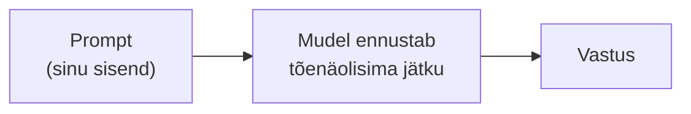

# 3.1 Mis on prompt?

::: tip Selle tunni järel...
- oskad selgitada, mis on prompt ja miks see AI-lt saadud vastust nii palju mõjutab;
- tead, mis vahe on heal ja halval promptil, ilma et peaksid uskuma "maagilisi võlusõnu";
- tead, mis sai "prompt engineer" ametist ja miks promptimisoskus on siiski oluline.
:::

## Mis on prompt?

**Prompt** on tekst (või pilt, heli — aga meie keskendume tekstile), mille sa AI-mudelile sisendiks annad. See võib olla küsimus, käsklus, alustatud lause või mitmeleheküljeline juhend.

Tuletame meelde [moodulist 2](/tehisintellekt/moodul-02-kuidas-ai-tootab/tund-04-tokenid): suur keelemudel (LLM) ei "mõtle" nagu inimene — ta ennustab statistiliselt, milline token peaks sinu sisendi järel järgmisena tulema. **Prompt ongi kogu see kontekst, mille põhjal mudel oma ennustuse teeb.** Mida rohkem ja täpsemat asjakohast infot prompt sisaldab, seda paremini suudab mudel "ära arvata", mida sa tegelikult tahad.

## Miks sõnastus nii palju loeb

Kuna mudel ei loe sinu mõtteid, vaid ainult sõnu, muudab isegi väike sõnastuse erinevus vastust märgatavalt:

| Prompt | Tõenäoline probleem |
|---|---|
| "Kirjuta midagi AI kohta." | Liiga üldine — mudel peab ise ära arvama teema, pikkuse, tooni, sihtgrupi |
| "Kirjuta 3 lauset AI kohta 10-aastasele lapsele." | Selge sihtgrupp ja pikkus, aga endiselt puudub kontekst, milleks seda vaja on |
| "Kirjuta 3 lihtsat lauset selle kohta, mis on tehisintellekt, mida saaks kasutada 4. klassi loodusõpetuse tunni sissejuhatuseks." | Selge ülesanne, sihtgrupp, pikkus ja eesmärk — mudelil on palju vähem ära arvata |

Ükski neist kolmest ei ole "vale" prompt — aga kolmas annab mudelile kordades rohkem infot otsuste tegemiseks, mistõttu on ka vastus tõenäolisemalt kasutuskõlblik esimesel katsel.

## "Prompt engineeri" tõus ja mõõn

Promptimise oskus sai omaette nimetuse — **prompt engineering** — 2020. aastal, kui OpenAI teadlased näitasid GPT-3 puhul, et suur keelemudel suudab uue ülesande "õppida" ainult mõne näite (*few-shot*) põhjal otse prompti sees, ilma mudelit ümber treenimata ([Brown jt, 2020](https://arxiv.org/abs/2005.14165)). Sellest kasvas välja idee, et hästi sõnastatud prompt on omaette oskus.

2023. aastal, pärast ChatGPT läbimurret, tekkis lühikeseks ajaks buum: ettevõtted otsisid palgale "prompt engineere", meediasse jõudsid lood kuuenumbrilistest palkadest. Aastaga 2026 on pilt muutunud märgatavalt:

::: info Faktikontroll: kas "prompt engineer" on ikka veel amet?
- Microsofti 2025. aasta Work Trend Indexi uuringus (31 000 töötajat 31 riigis) küsiti juhtidelt, milliseid uusi rolle nad järgmise 12–18 kuu jooksul palkama hakkavad — **"Prompt Engineer" jäi selles nimekirjas eelviimasele kohale**, samal ajal kui AI-treenerite, andmespetsialistide ja AI-agentide spetsialistide järele on nõudlus kasvamas ([Microsoft WorkLab, 2025](https://www.microsoft.com/en-us/worklab/work-trend-index)).
- Indeedi otsingustatistika näitab sarnast mustrit: "prompt engineer" tööotsingud kasvasid 2023. aasta alguses hüppeliselt, kuid on sellest ajast langenud ja stabiliseerunud oluliselt madalamal tasemel ([viidatud Salesforce Ben, 2025](https://www.salesforceben.com/prompt-engineering-jobs-are-obsolete-in-2025-heres-why/)).
- Põhjus pole see, et promptimine oleks kasutuks muutunud, vaid vastupidi: mudelid (Claude, GPT, Gemini) on muutunud palju paremaks loomuliku keele mõistmisel, mistõttu "täpse võlusõna" otsimine on suures osas kaotanud mõtte. Microsofti tehnoloogiajuht Jared Spataro kommenteeris: *"Sul ei pea enam olema perfektset prompti."*
:::

**Oluline vahe:** eraldiseisev **amet** "prompt engineer" on haruldane, aga **oskus** kirjutada selgeid, struktureeritud prompte on muutunud osaks peaaegu igast tööst, mis AI-tööriistu kasutab — samamoodi nagu "internetist otsimise oskus" ei ole ise amet, aga on kasulik peaaegu kõigil.

## Ei ole ühte "õiget" võlusõna

Levinud müüt on, et kusagil eksisteerib salajane sõnastus või fraas, mis "avab" mudeli tegeliku potentsiaali. Tegelikkuses põhineb hea promptimine paaril lihtsal, korduval põhimõttel — struktuur, kontekst, näited, tagasiside —, mida vaatame lähemalt järgmistes tundides.

## Viited ja lisalugemine

- Brown, T. jt (2020). ["Language Models are Few-Shot Learners"](https://arxiv.org/abs/2005.14165) (GPT-3 teadusartikkel, NeurIPS 2020)
- [Microsoft WorkLab — 2025 Work Trend Index](https://www.microsoft.com/en-us/worklab/work-trend-index)
- [Salesforce Ben — "Prompt Engineering Jobs Are Obsolete in 2025 – Here's Why"](https://www.salesforceben.com/prompt-engineering-jobs-are-obsolete-in-2025-heres-why/)
