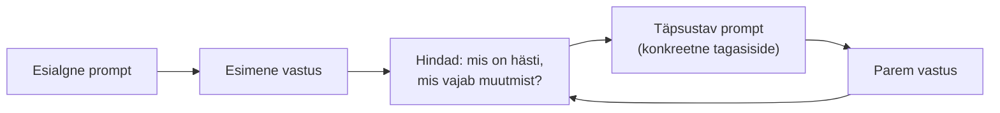

# 3.4 Iteratiivne promptimine ja vestluse juhtimine

::: tip Selle tunni järel...
- mõistad, et hea vastus tuleb tavaliselt mitme sammuga, mitte ühe täiusliku prompti pealt;
- oskad anda mudelile konkreetset tagasisidet, et vastust parandada;
- tead, millal on kasulik alustada uut vestlust ja miks.
:::

## Promptimine on dialoog, mitte üks katse

Algajad ootavad tihti, et esimene prompt peab olema täiuslik. Tegelikult töötavad kogenud kasutajad enamasti nii: kirjutavad esialgse prompti, vaatavad tulemust ja **täpsustavad** seda mõne lisalausega — täpselt nagu kolleegi tööd toimetades. See on kiirem kui üritada esimese korraga leida "ideaalset" sõnastust.

## Kuidas anda konkreetset tagasisidet

Ebamäärane tagasiside ("tee paremini") ei anna mudelile piisavalt infot. Konkreetne tagasiside nimetab, **mis täpselt** ei sobinud ja **mida** selle asemel soovid:

| Ebamäärane tagasiside | Konkreetne tagasiside |
|---|---|
| "See ei ole hea, tee uuesti." | "See on liiga formaalne. Kirjuta ümber lihtsamas, sõbralikumas toonis, nagu räägiksid kolleegiga." |
| "Liiga pikk." | "Lühenda kolme lauseni ja jäta viimane lõik täielikult ära." |
| "Ei meeldi struktuur." | "Kasuta loetelu vormingut, mitte pikki lõike, ja lisa alguses üherealine kokkuvõte." |

Sama põhimõte kehtib ka siis, kui vastus on sisuliselt vale — täpsusta, milline osa on vale ja miks, selle asemel et lihtsalt öelda "vale".

## Pikk vestlus ja kontekstiaken

[Tunnis 2.4](/tehisintellekt/moodul-02-kuidas-ai-tootab/tund-04-tokenid) õppisime, et mudelil endal mälu ei ole — iga vastuse juures saadetakse talle uuesti kaasa kogu senine vestlus, ning väga pikk vestlus võib muuta mudeli vähem täpseks (nn "lost in the middle" efekt). See mõjutab otse seda, kuidas tasub iteratiivset promptimist teha:

- **Ühe ülesande juures jätka samas vestluses** — nii säilib kontekst (varasemad täpsustused, otsused) automaatselt.
- **Uue, mitteseotud ülesande jaoks alusta uut vestlust** — see hoiab konteksti puhtana ega sega vana teema uude sisse.
- **Kui vestlus veniks väga pikaks**, tee vahepeal ise lühike kokkuvõte otsustest ("Kokkuvõtteks: me otsustasime X, Y, Z") ja jätka sellelt pealt — see on väiksem versioon [tunnis 2.4](/tehisintellekt/moodul-02-kuidas-ai-tootab/tund-04-tokenid) kirjeldatud kompaktimise põhimõttest.

::: tip Praktikas
Kui märkad, et mudel hakkab "unustama" varasemaid täpsustusi või kordama juba parandatud vigu, on see enamasti märk, et vestlus on liiga pikaks veninud — mitte, et mudel on "rikki".
:::

## Kokkuvõttev kontrollnimekiri

1. Ära oota esimest prompti täiuslikuks — planeeri 2–3 täpsustavat vooru.
2. Anna tagasisidet konkreetselt: mis, kus, mida selle asemel.
3. Hoia üks teema ühes vestluses; alusta uus vestlus uue teema jaoks.
4. Väga pikas vestluses tee vahepeal ise kokkuvõte, et vältida info kadumist.

## Viited ja lisalugemine

- [Anthropic — Prompt engineering overview](https://platform.claude.com/docs/en/build-with-claude/prompt-engineering/overview)
- Liu, N. jt (2023). ["Lost in the Middle: How Language Models Use Long Contexts"](https://arxiv.org/abs/2307.03172)
