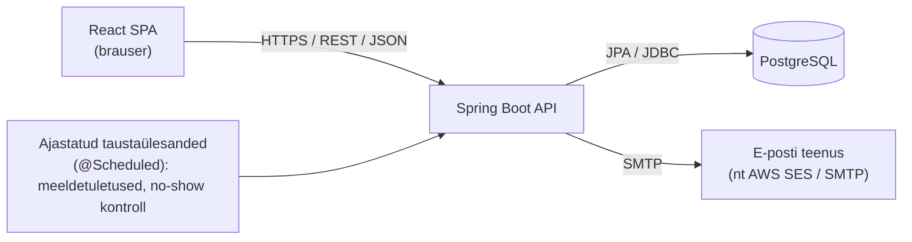
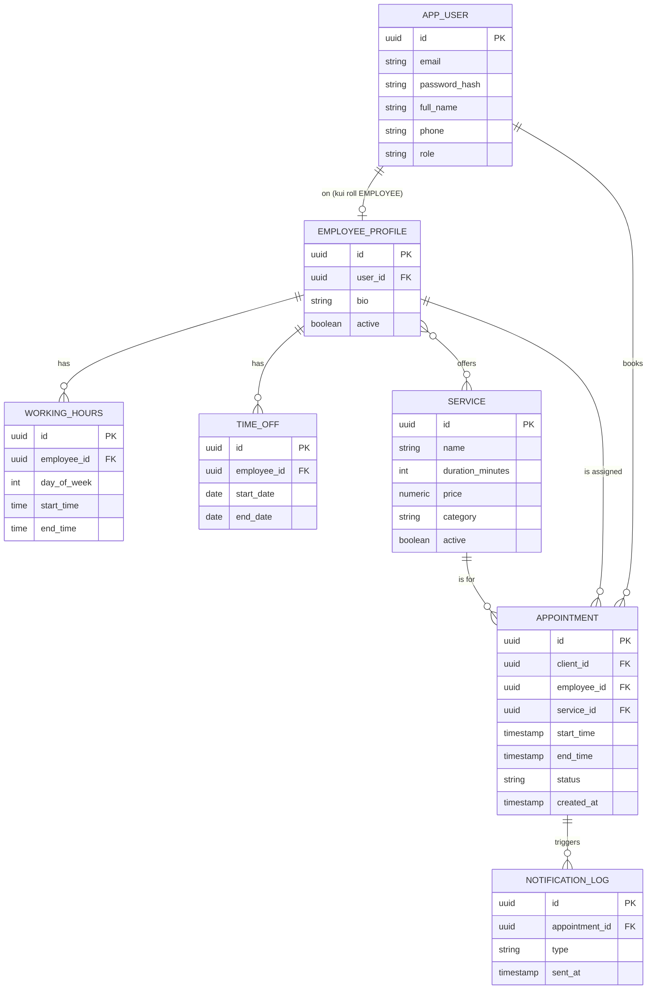

# 3.6 Praktikas — PRD kui kontekstifail

::: tip Selle tunni järel...
- mõistad, miks päris tarkvaraarendajad ei kirjelda AI-agendile suuremat ülesannet vestluse käigus lause-lauselt, vaid annavad ette struktureeritud dokumendi;
- tead, mis teeb tehnilise spetsifikatsiooni (PRD) heaks kontekstiks AI-koodiagendi jaoks;
- oled näinud tervikliku, produktsioonivalmis rakenduse PRD näidet, mida saab otse kasutusele võtta.
:::

## Miks fail, mitte chat?

Seni oleme selles moodulis vaadanud promptimist kui **vestlust** — kirjutad, vaatad vastust, täpsustad ([tund 3.4](./tund-04-iteratiivne-promptimine)). See sobib hästi lühikeste ülesannete jaoks: kirja mustand, kokkuvõte, üksik funktsioon.

Suurema tarkvaraprojekti puhul — nt terve rakenduse või uue suurema funktsionaalsuse loomisel — töötavad kogenud arendajad teisiti. Selle asemel, et sõnastada nõudeid vestluses samm-sammult, kirjutavad nad **korraga läbimõeldud spetsifikatsiooni failina** ja annavad selle AI-agendile kontekstiks ühe korraga.

Anthropic soovitab oma ametlikus Claude Code'i juhendis täpselt seda töövoogu suuremate funktsioonide jaoks: *"Let Claude interview you... Keep interviewing until we've covered everything, then write a complete spec to SPEC.md. Once the spec is complete, start a fresh session to execute it."* Sama juhend rõhutab, milline spetsifikatsioon on agendi jaoks kasulik: *"The most useful specs are self-contained: they name the files and interfaces involved, state what is out of scope, and end with an end-to-end verification step that proves the feature works."* ([Claude Code — Best practices](https://code.claude.com/docs/en/best-practices))

See ei ole ainult Anthropicu enda soovitus — see on muutunud laiemaks tööstusharu praktikaks, mida kutsutakse **spec-driven development'iks**. Näiteks GitHubi enda avatud lähtekoodiga tööriist **Spec Kit** (avaldatud 2026. aasta alguses) on kogunud üle 137 000 tärni GitHubis ja genereerib projekti jaoks just selliseid struktureeritud dokumente — `constitution.md` (projekti põhimõtted), `spec.md` (kasutajalood ja nõuded), `plan.md` (tehniline lahendus) ja `tasks.md` (tööde jaotus) — just eesmärgiga vältida "ad-hoc vibe coding'ut", kus nõuded elavad ainult vestluses ([github/spec-kit](https://github.com/github/spec-kit); [Augment Code — What Is Spec-Driven Development?](https://www.augmentcode.com/guides/what-is-spec-driven-development)).

| | Chat-põhine ("vibe coding") | Failipõhine (spec-driven) |
|---|---|---|
| Nõuete kirjeldus | Sõnastatakse jooksvalt, lause-lauselt vestluses | Kirjutatakse korraga läbimõeldud dokumendina enne kodeerimise algust |
| Korratavus | Kontekst kaob, kui vestlus lõpeb või läheb liiga pikaks ([tund 3.4](./tund-04-iteratiivne-promptimine)) | Fail jääb alles, käib versioonihalduses (git) kaasas ja on taaskasutatav |
| Täielikkus | Agent avastab puuduva info käigu pealt, katkestades tööd küsimustega | Äriloogika, piirid ja "valmis" kriteerium on juba kirjas — vähem katkestusi |
| Meeskonnatöö | Nõuded elavad ainult ühes vestluses, teised ei näe neid | Dokumenti saab enne kodeerimist üle vaadata ja kommenteerida, nagu iga muud tehnilist dokumenti |
| Sobib kõige paremini | Väikesed, selged, ühe-sammulised ülesanded | Uued funktsioonid, terved rakendused, keeruline äriloogika |

::: info Sama põhimõte, mida me juba nägime
See on sama loogika, mida käsitlesime [tunnis 2.4](/tehisintellekt/moodul-02-kuidas-ai-tootab/tund-04-tokenid) `CLAUDE.md`/`NOTES.md`-tüüpi failide juures: kuna mudelil endal mälu ei ole, tasub oluline, korduvalt vajaminev kontekst hoida eraldi failis, mitte lootma jääda sellele, et see "jääb meelde" pikast vestlusest.
:::

## Mis teeb spetsifikatsiooni AI-agendile heaks?

1. **Iseseisvalt mõistetav** — nimetab konkreetsed failid, kihid ja liidesed, mitte ei viita "sellele, millest me eile rääkisime".
2. **Ütleb selgelt, mis on väljaspool ulatust** — nii ei hakka agent "abivalmilt" lisama funktsioone, mida keegi ei tellinud.
3. **Sisaldab äriloogikat täpselt, mitte üldsõnaliselt** — nt broneeringute kattumise vältimise reegel peab olema kirjas sammhaaval, mitte lootma, et agent "arvab õigesti ära".
4. **Lõpeb kontrollitava definitsiooniga "valmis"** — Claude Code'i juhend rõhutab: *"Give Claude a way to verify its work... a test suite, a build exit code, a linter, a script that diffs output against a fixture"* ([Claude Code — Best practices](https://code.claude.com/docs/en/best-practices)) — spetsifikatsioon peaks andma agendile viisi ise kontrollida, kas töö on tehtud õigesti.

Allpool on tervik-näide sellisest dokumendist — täpselt sellises vormingus ja detailsuses, mida oleks reaalselt mõistlik anda AI-koodiagendile (nt Claude Code) kontekstiks, et see saaks iseseisvalt alustada keskmise suurusega, produktsioonivalmis rakenduse ehitamist.

---

## Näide: PRD.md — SalonBook, juuksurisalongi broneerimissüsteem

::: warning Kuidas seda näidet lugeda
See on **õppeotstarbeline näidisdokument**, mitte tegelik käimasolev projekt. Eesmärk on näidata, milline struktuur ja detailsuse tase muudab spetsifikatsiooni AI-agendile reaalselt kasulikuks — mitte pakkuda ammendavat juuksurisalongi äriprotsesside analüüsi.
:::

Nii näeb `PRD.md` tegelikult välja, kui selle avad tavalises tekstiredaktoris või GitHubis — pelgalt tavaline tekst, `#`-märkidega pealkirjad ja `|`-tähistusega tabelid, täpselt samasugune fail nagu iga teine `.js` või `.java` fail projektis, mitte binaarne Word-dokument:

::: details Vaata PRD.md toorfaili (nii see fail tegelikult tekstiredaktoris või GitHubis välja näeb)

````markdown
### 1. Kokkuvõte

**SalonBook** on veebipõhine broneerimissüsteem väikese kuni keskmise suurusega iluteenuste salongidele (juuksurid, maniküürid, kosmeetikud). Klient saab iseseisvalt valida teenuse, sobiva töötaja ja vaba aja ning broneeringu kinnitada — ilma telefonikõneta. Salongi haldur näeb kõiki broneeringuid, haldab töötajate graafikuid ja teenuste hinnakirja.

**Probleem, mida lahendatakse:** väiksemad salongid haldavad broneeringuid tänagi tihti telefoni ja paberkalendri või Excel-tabeli abil, mis tekitab topeltbroneeringuid, unustatud tühistamisi ja palju administratiivset aega.

### 2. Eesmärgid ja edukuse mõõdikud

| Ärieesmärk | Mõõdik |
|---|---|
| Vähendada telefonile kuluvat aega | ≥ 60% broneeringutest tehakse iseteeninduses (mitte telefoni teel) |
| Vähendada tühjalt seisvaid ajaslotte (no-show) | No-show määr langeb tänu automaatsetele meeldetuletustele |
| Vähendada topeltbroneeringuid | 0 kattuvat broneeringut ühe töötaja graafikus (kõva nõue, mitte eesmärk) |
| Kiirem broneerimine | Klient jõuab teenuse valikust kinnitatud broneeringuni ≤ 5 sammuga |

### 3. Kasutajarollid

| Roll | Kirjeldus | Peamised õigused |
|---|---|---|
| `CLIENT` | Registreerunud klient | Vaatab teenuseid, teeb/tühistab/lükkab edasi oma broneeringuid |
| `EMPLOYEE` | Juuksur/stilist | Näeb enda graafikut ja broneeringuid, märgib visiidi lõpetatuks |
| `ADMIN` | Salongi haldur/omanik | Kõik õigused: teenuste, töötajate, graafikute ja kõigi broneeringute haldus, aruanded |

### 4. Ulatus

**MVP-s sees:**
- Kliendi registreerimine/sisselogimine, teenuste sirvimine, vaba aja otsimine ja broneerimine
- Töötajate iganädalane töögraafik ja puhkuste/vabade päevade märkimine
- Broneeringu tühistamine ja edasilükkamine kliendi poolt (vastavalt tühistamisreeglile)
- E-posti kinnitused ja meeldetuletused
- Admini vaade: kõik broneeringud, teenuste ja töötajate haldus, lihtne käibearuanne

**Väljaspool MVP ulatust (Faas 2):**
- Online-maksed ja ettemaksud
- SMS-teavitused
- Mitme salongi/asukoha tugi
- Lojaalsusprogramm, allahindluskoodid
- Mobiilirakendus (natiivne)

### 5. Funktsionaalsed nõuded

#### Epic A — Autentimine ja kasutajahaldus
- **US-A1**: Kliendina saan luua konto e-posti ja parooliga, et broneeringuid teha.
- **US-A2**: Kasutajana saan sisse logida ja saan JWT-tokeni, mida kasutatakse edasistes päringutes.
- **US-A3**: Süsteem eristab rolle (`CLIENT`/`EMPLOYEE`/`ADMIN`) ja piirab ligipääsu vastavalt.

> **Vastuvõtukriteerium (US-A2):** Kui kasutaja logib sisse õige e-posti ja parooliga, *siis* tagastatakse 200 ja kehtiv JWT. Kui parool on vale, *siis* tagastatakse 401 ilma täpsustuseta, kas viga oli e-postis või paroolis (turvalisuse kaalutlusel).

#### Epic B — Teenuste ja hinnakirja haldus (ADMIN)
- CRUD teenustele: `name`, `description`, `durationMinutes`, `price`, `category`, `active`.
- Mitteaktiivseid (`active = false`) teenuseid kliendi vaates ei kuvata, aga ajaloolised broneeringud säilivad.

#### Epic C — Töötajate graafiku haldus (ADMIN, EMPLOYEE oma graafikut näeb)
- Iganädalane töögraafik nädalapäeva kohta: algus- ja lõppkellaaeg (või "vaba päev").
- Puhkuste/vabade perioodide sisestamine (algus- ja lõppkuupäev).
- Iga töötaja juures määratakse, milliseid teenuseid ta pakub (mitmene seos teenustega).

#### Epic D — Vaba aja leidmine ja broneerimine (kesksem äriloogika)

**Kasutajavoog:** klient valib teenuse → näeb, milliste töötajate valikus see teenus on → valib töötaja ja kuupäeva → süsteem arvutab vabad ajaslotid → klient valib slotti → kinnitab broneeringu.

**Vaba aja arvutamise reegel (kirjeldatud sammhaaval, et agent ei peaks seda ise "ära arvama"):**
1. Võta valitud töötaja tööaeg valitud nädalapäeval (Epic C). Kui see päev on märgitud vabaks päevaks või jääb puhkuseperioodi, ei ole vabu slotte.
2. Jaga tööaeg valitud teenuse kestuse (`durationMinutes`) suurusteks järjestikusteks plokkideks, alustades tööpäeva algusest.
3. Eemalda plokid, mis kattuvad töötaja olemasolevate broneeringutega staatuses `PENDING`, `CONFIRMED` või `COMPLETED` (mitte `CANCELLED`).
4. Lisa iga olemasoleva broneeringu järele konfigureeritav puhverintervall (vaikimisi 10 minutit koristuseks/ettevalmistuseks), enne kui järgmine plokk saab vabaks lugeda.
5. Eemalda plokid, mis on juba minevikus või jäävad lähemale kui konfigureeritav minimaalne ettebroneerimisaeg (vaikimisi 1 tund praegusest hetkest).
6. Tagasta ülejäänud plokid kliendile valikuks.

**Broneeringu konflikti vältimine (kõva nõue):** ühel töötajal ei tohi ühelgi hetkel olla kaks kattuvat aktiivset (mitte-tühistatud) broneeringut. See tuleb tagada **kahel tasandil**:
- Rakenduskihis: broneeringu loomine ja saadavuse kontroll toimuvad ühe `@Transactional` meetodi sees.
- Andmebaasi tasandil: PostgreSQL `EXCLUDE` piirang `appointment` tabelil (kasutades `btree_gist` laiendust), mis füüsiliselt ei luba samal töötajal kattuvaid ridu — see on viimane kaitseliin samaaegsete päringute vastu, mida ainuüksi rakenduskihi kontroll garanteerida ei suuda.

> **Vastuvõtukriteerium:** Kui kaks klienti üritavad samaaegselt broneerida sama töötaja sama ajaslotti, *siis* õnnestub ainult üks päring ning teine saab selge veateate ("See aeg ei ole enam saadaval"), mitte serveri vea.

#### Epic E — Broneeringu haldus (kliendi vaade)
- Kliendi tulevaste/varasemate broneeringute nimekiri.
- Edasilükkamine — kehtivad samad reeglid mis uue broneeringu tegemisel (Epic D).
- Tühistamine koos poliitikaga: tühistamine ≥ 24 h enne broneeringu algust on vaba; hilisem tühistamine märgitakse `LATE_CANCELLATION`-ina (MVP-s ilma rahalise trahvita, aga jälgitavana aruannetes).
- Kui klient ei ilmu ja töötaja ei ole broneeringut visiidi lõpus `COMPLETED`-ks märkinud, muudab ajastatud taustaülesanne selle `NO_SHOW`-iks pärast konfigureeritavat leebusaega (vaikimisi 30 min pärast planeeritud algust).

#### Epic F — Teavitused (e-post)
- Kinnituskiri kohe pärast broneeringu loomist.
- Meeldetuletus 24 tundi enne broneeringut (ajastatud taustaülesanne, mis kontrollib iga tunni tagant).
- Teavitus tühistamise/edasilükkamise kohta.
- SMS on **teadlikult väljaspool MVP ulatust** (vt jaotis 4).

#### Epic G — Admin dashboard
- Kõikide broneeringute vaade filtritega (töötaja, kuupäevavahemik, staatus).
- Lihtne käibearuanne: `COMPLETED` staatuses broneeringute hindade summa valitud perioodis.
- Töötajate ja teenuste haldus (Epic B, Epic C liidesed).

### 6. Mittefunktsionaalsed nõuded

| Valdkond | Nõue |
|---|---|
| **Turvalisus** | JWT-põhine autentimine; rollipõhine ligipääsukontroll (RBAC) igal endpointil; paroolid ainult BCrypt-räsituna; kõik sisendid valideeritakse (Jakarta Bean Validation); tootmises ainult HTTPS |
| **Andmekaitse (GDPR)** | Klient saab taotleda oma konto ja isikuandmete kustutamist; broneeringute ajalugu säilitatakse anonümiseeritult (isikuandmed eemaldatud, statistika säilib) |
| **Jõudlus** | Lugemispäringute p95 vastuseaeg < 300 ms; vaba aja arvutus < 500 ms tavapärase koormuse juures (~50 samaaegset kasutajat) |
| **Käideldavus** | Sihttase 99,5% (tööajaväline seisak on lubatavam kui tööaegne) |
| **Skaleeritavus** | Backend olekuta (stateless, JWT), horisontaalselt skaleeritav; andmebaasi ühendused pooli kaudu |
| **Jälgitavus** | Struktureeritud (JSON) logid; iga broneeringu staatusemuutus logitakse auditijäljena (kes, millal, mis muutus) |
| **Testitavus** | Teenusekihil minimaalselt 70% reakatvus; broneeringu-konflikti loogikale kohustuslikud integratsioonitestid (Testcontainers + reaalne PostgreSQL) |

### 7. Tehniline arhitektuur

#### 7.1 Kõrgtasemel arhitektuur



#### 7.2 Tehnoloogiapinu

**Backend:**
- Java 21 (LTS), Spring Boot 3.3.x
- Spring Web, Spring Data JPA + Hibernate, Spring Security 6 (JWT resource server)
- Jakarta Bean Validation
- PostgreSQL 16, Flyway (migratsioonid)
- Maven, Lombok, MapStruct (DTO mapping), springdoc-openapi (Swagger UI)
- JUnit 5, Mockito, Testcontainers, AssertJ

**Frontend:**
- React 18 + TypeScript 5, Vite
- React Router v6
- TanStack Query (server-state, cache)
- React Hook Form + Zod (vormid ja valideerimine)
- Axios, Tailwind CSS + shadcn/ui, date-fns
- Zustand (kerge lokaalne olek, nt autentimise olek)

**Infra:**
- Docker + docker-compose kohalikuks arenduseks (backend, frontend, postgres, mailhog)
- GitHub Actions CI (build + testid + lint igal PR-il)
- Keskkonnapõhine konfiguratsioon (`application-dev.yml`, `application-prod.yml`)
- Konteineriseeritud tootmisvalmis image, juurutatav suvalisse konteinerkeskkonda (VPS + docker-compose, või haldusteenus)

#### 7.3 Kihiline arhitektuur (backend)

```
com.salonbook
 ├── config       (SecurityConfig, OpenApiConfig, SchedulingConfig)
 ├── controller   (REST kontrollerid — ainult HTTP, äriloogikat ei sisalda)
 ├── service      (äriloogika, transaktsioonipiirid)
 ├── repository   (Spring Data JPA repositoorid)
 ├── domain       (JPA entiteedid)
 ├── dto          (päringu/vastuse DTO-d — entiteete kunagi otse ei tagastata)
 ├── mapper       (MapStruct entity <-> DTO)
 ├── exception    (kohandatud erindid + @ControllerAdvice)
 └── security     (JWT filter, UserDetailsService)
```

**Reegel:** kontroller ei pöördu kunagi otse repositoriumi poole — ainult teenusekihi kaudu. Entiteete ei tagastata kunagi kontrollerist otse, alati läbi DTO.

#### 7.4 Andmemudel



#### 7.5 API disain (peamised endpoint'id)

| Meetod | Tee | Kirjeldus | Ligipääs |
|---|---|---|---|
| POST | `/api/auth/register` | Uue kliendikonto loomine | Avalik |
| POST | `/api/auth/login` | Sisselogimine, JWT väljastamine | Avalik |
| GET | `/api/services` | Aktiivsete teenuste nimekiri | Avalik |
| GET | `/api/employees?serviceId=` | Teenust pakkuvad töötajad | Avalik |
| GET | `/api/employees/{id}/availability?serviceId=&date=` | Vabad ajaslotid (Epic D reegel) | Avalik |
| POST | `/api/appointments` | Uue broneeringu loomine | `CLIENT` |
| GET | `/api/appointments/me` | Minu broneeringud | `CLIENT` |
| PATCH | `/api/appointments/{id}/cancel` | Broneeringu tühistamine | `CLIENT`, omanik |
| PATCH | `/api/appointments/{id}/reschedule` | Broneeringu edasilükkamine | `CLIENT`, omanik |
| PATCH | `/api/appointments/{id}/complete` | Visiidi lõpetatuks märkimine | `EMPLOYEE`, omanik |
| GET | `/api/admin/appointments` | Kõik broneeringud, filtritega | `ADMIN` |
| GET | `/api/admin/reports/revenue?from=&to=` | Käibearuanne | `ADMIN` |
| POST/PUT/DELETE | `/api/admin/services/**` | Teenuste haldus | `ADMIN` |
| POST/PUT | `/api/admin/employees/**` | Töötajate ja graafikute haldus | `ADMIN` |

### 8. Vastuvõtukriteeriumid (valik)

**Broneeringu loomine:**
- **Given** klient on valinud teenuse, töötaja ja vaba ajasloti, **when** ta kinnitab broneeringu, **then** luuakse `Appointment` staatusega `PENDING`, saadetakse kinnituskiri ja slot ei ole enam teistele saadaval.

**Konflikti vältimine:**
- **Given** kaks klienti valivad samal ajal sama töötaja sama ajaslot, **when** mõlemad üritavad kinnitada, **then** ainult esimene õnnestub ja teine saab selge veateate, mitte serveri vea (vt jaotis 5, Epic D).

**Tühistamine:**
- **Given** broneeringuni on jäänud vähem kui 24 tundi, **when** klient tühistab, **then** broneering märgitakse `CANCELLED` staatusega `LATE_CANCELLATION` lipuga ning see kajastub admini aruandes.

### 9. Eeldused ja piirangud

- Üks salong/asukoht (mitme asukoha tugi on Faas 2).
- Ainult eestikeelne kasutajaliides MVP-s.
- MVP ei sisalda makseid — broneering kinnitub ilma ettemaksuta.
- E-kirjade saatmine toimub välise SMTP/teenuse (nt AWS SES) kaudu — oma meiliserverit ei ehitata.

### 10. Faasid

| Faas | Sisu |
|---|---|
| **Faas 1 (MVP)** | Epic A–G (vt jaotis 5) |
| **Faas 2** | Online-maksed/ettemaksud (Stripe), SMS-meeldetuletused, mitme salongi tugi, lojaalsusprogramm, natiivne mobiilirakendus |

### 11. Sõnastik

| Termin | Selgitus |
|---|---|
| Slot | Üks vaba, teenuse kestusele vastav ajaühik töötaja graafikus |
| Puhverintervall | Kohustuslik paus kahe broneeringu vahel (koristus/ettevalmistus) |
| No-show | Klient ei ilmu broneeritud ajale kohale |
| RBAC | Role-Based Access Control — rollipõhine ligipääsukontroll |
````

:::

Ja nii renderdub täpselt sama fail, kui seda avada markdown-toega tööriistas (GitHub, VS Code eelvaade, või see õppematerjal ise):

### 1. Kokkuvõte

**SalonBook** on veebipõhine broneerimissüsteem väikese kuni keskmise suurusega iluteenuste salongidele (juuksurid, maniküürid, kosmeetikud). Klient saab iseseisvalt valida teenuse, sobiva töötaja ja vaba aja ning broneeringu kinnitada — ilma telefonikõneta. Salongi haldur näeb kõiki broneeringuid, haldab töötajate graafikuid ja teenuste hinnakirja.

**Probleem, mida lahendatakse:** väiksemad salongid haldavad broneeringuid tänagi tihti telefoni ja paberkalendri või Excel-tabeli abil, mis tekitab topeltbroneeringuid, unustatud tühistamisi ja palju administratiivset aega.

### 2. Eesmärgid ja edukuse mõõdikud

| Ärieesmärk | Mõõdik |
|---|---|
| Vähendada telefonile kuluvat aega | ≥ 60% broneeringutest tehakse iseteeninduses (mitte telefoni teel) |
| Vähendada tühjalt seisvaid ajaslotte (no-show) | No-show määr langeb tänu automaatsetele meeldetuletustele |
| Vähendada topeltbroneeringuid | 0 kattuvat broneeringut ühe töötaja graafikus (kõva nõue, mitte eesmärk) |
| Kiirem broneerimine | Klient jõuab teenuse valikust kinnitatud broneeringuni ≤ 5 sammuga |

### 3. Kasutajarollid

| Roll | Kirjeldus | Peamised õigused |
|---|---|---|
| `CLIENT` | Registreerunud klient | Vaatab teenuseid, teeb/tühistab/lükkab edasi oma broneeringuid |
| `EMPLOYEE` | Juuksur/stilist | Näeb enda graafikut ja broneeringuid, märgib visiidi lõpetatuks |
| `ADMIN` | Salongi haldur/omanik | Kõik õigused: teenuste, töötajate, graafikute ja kõigi broneeringute haldus, aruanded |

### 4. Ulatus

**MVP-s sees:**
- Kliendi registreerimine/sisselogimine, teenuste sirvimine, vaba aja otsimine ja broneerimine
- Töötajate iganädalane töögraafik ja puhkuste/vabade päevade märkimine
- Broneeringu tühistamine ja edasilükkamine kliendi poolt (vastavalt tühistamisreeglile)
- E-posti kinnitused ja meeldetuletused
- Admini vaade: kõik broneeringud, teenuste ja töötajate haldus, lihtne käibearuanne

**Väljaspool MVP ulatust (Faas 2):**
- Online-maksed ja ettemaksud
- SMS-teavitused
- Mitme salongi/asukoha tugi
- Lojaalsusprogramm, allahindluskoodid
- Mobiilirakendus (natiivne)

### 5. Funktsionaalsed nõuded

#### Epic A — Autentimine ja kasutajahaldus
- **US-A1**: Kliendina saan luua konto e-posti ja parooliga, et broneeringuid teha.
- **US-A2**: Kasutajana saan sisse logida ja saan JWT-tokeni, mida kasutatakse edasistes päringutes.
- **US-A3**: Süsteem eristab rolle (`CLIENT`/`EMPLOYEE`/`ADMIN`) ja piirab ligipääsu vastavalt.

> **Vastuvõtukriteerium (US-A2):** Kui kasutaja logib sisse õige e-posti ja parooliga, *siis* tagastatakse 200 ja kehtiv JWT. Kui parool on vale, *siis* tagastatakse 401 ilma täpsustuseta, kas viga oli e-postis või paroolis (turvalisuse kaalutlusel).

#### Epic B — Teenuste ja hinnakirja haldus (ADMIN)
- CRUD teenustele: `name`, `description`, `durationMinutes`, `price`, `category`, `active`.
- Mitteaktiivseid (`active = false`) teenuseid kliendi vaates ei kuvata, aga ajaloolised broneeringud säilivad.

#### Epic C — Töötajate graafiku haldus (ADMIN, EMPLOYEE oma graafikut näeb)
- Iganädalane töögraafik nädalapäeva kohta: algus- ja lõppkellaaeg (või "vaba päev").
- Puhkuste/vabade perioodide sisestamine (algus- ja lõppkuupäev).
- Iga töötaja juures määratakse, milliseid teenuseid ta pakub (mitmene seos teenustega).

#### Epic D — Vaba aja leidmine ja broneerimine (kesksem äriloogika)

**Kasutajavoog:** klient valib teenuse → näeb, milliste töötajate valikus see teenus on → valib töötaja ja kuupäeva → süsteem arvutab vabad ajaslotid → klient valib slotti → kinnitab broneeringu.

**Vaba aja arvutamise reegel (kirjeldatud sammhaaval, et agent ei peaks seda ise "ära arvama"):**
1. Võta valitud töötaja tööaeg valitud nädalapäeval (Epic C). Kui see päev on märgitud vabaks päevaks või jääb puhkuseperioodi, ei ole vabu slotte.
2. Jaga tööaeg valitud teenuse kestuse (`durationMinutes`) suurusteks järjestikusteks plokkideks, alustades tööpäeva algusest.
3. Eemalda plokid, mis kattuvad töötaja olemasolevate broneeringutega staatuses `PENDING`, `CONFIRMED` või `COMPLETED` (mitte `CANCELLED`).
4. Lisa iga olemasoleva broneeringu järele konfigureeritav puhverintervall (vaikimisi 10 minutit koristuseks/ettevalmistuseks), enne kui järgmine plokk saab vabaks lugeda.
5. Eemalda plokid, mis on juba minevikus või jäävad lähemale kui konfigureeritav minimaalne ettebroneerimisaeg (vaikimisi 1 tund praegusest hetkest).
6. Tagasta ülejäänud plokid kliendile valikuks.

**Broneeringu konflikti vältimine (kõva nõue):** ühel töötajal ei tohi ühelgi hetkel olla kaks kattuvat aktiivset (mitte-tühistatud) broneeringut. See tuleb tagada **kahel tasandil**:
- Rakenduskihis: broneeringu loomine ja saadavuse kontroll toimuvad ühe `@Transactional` meetodi sees.
- Andmebaasi tasandil: PostgreSQL `EXCLUDE` piirang `appointment` tabelil (kasutades `btree_gist` laiendust), mis füüsiliselt ei luba samal töötajal kattuvaid ridu — see on viimane kaitseliin samaaegsete päringute vastu, mida ainuüksi rakenduskihi kontroll garanteerida ei suuda.

> **Vastuvõtukriteerium:** Kui kaks klienti üritavad samaaegselt broneerida sama töötaja sama ajaslotti, *siis* õnnestub ainult üks päring ning teine saab selge veateate ("See aeg ei ole enam saadaval"), mitte serveri vea.

#### Epic E — Broneeringu haldus (kliendi vaade)
- Kliendi tulevaste/varasemate broneeringute nimekiri.
- Edasilükkamine — kehtivad samad reeglid mis uue broneeringu tegemisel (Epic D).
- Tühistamine koos poliitikaga: tühistamine ≥ 24 h enne broneeringu algust on vaba; hilisem tühistamine märgitakse `LATE_CANCELLATION`-ina (MVP-s ilma rahalise trahvita, aga jälgitavana aruannetes).
- Kui klient ei ilmu ja töötaja ei ole broneeringut visiidi lõpus `COMPLETED`-ks märkinud, muudab ajastatud taustaülesanne selle `NO_SHOW`-iks pärast konfigureeritavat leebusaega (vaikimisi 30 min pärast planeeritud algust).

#### Epic F — Teavitused (e-post)
- Kinnituskiri kohe pärast broneeringu loomist.
- Meeldetuletus 24 tundi enne broneeringut (ajastatud taustaülesanne, mis kontrollib iga tunni tagant).
- Teavitus tühistamise/edasilükkamise kohta.
- SMS on **teadlikult väljaspool MVP ulatust** (vt jaotis 4).

#### Epic G — Admin dashboard
- Kõikide broneeringute vaade filtritega (töötaja, kuupäevavahemik, staatus).
- Lihtne käibearuanne: `COMPLETED` staatuses broneeringute hindade summa valitud perioodis.
- Töötajate ja teenuste haldus (Epic B, Epic C liidesed).

### 6. Mittefunktsionaalsed nõuded

| Valdkond | Nõue |
|---|---|
| **Turvalisus** | JWT-põhine autentimine; rollipõhine ligipääsukontroll (RBAC) igal endpointil; paroolid ainult BCrypt-räsituna; kõik sisendid valideeritakse (Jakarta Bean Validation); tootmises ainult HTTPS |
| **Andmekaitse (GDPR)** | Klient saab taotleda oma konto ja isikuandmete kustutamist; broneeringute ajalugu säilitatakse anonümiseeritult (isikuandmed eemaldatud, statistika säilib) |
| **Jõudlus** | Lugemispäringute p95 vastuseaeg < 300 ms; vaba aja arvutus < 500 ms tavapärase koormuse juures (~50 samaaegset kasutajat) |
| **Käideldavus** | Sihttase 99,5% (tööajaväline seisak on lubatavam kui tööaegne) |
| **Skaleeritavus** | Backend olekuta (stateless, JWT), horisontaalselt skaleeritav; andmebaasi ühendused pooli kaudu |
| **Jälgitavus** | Struktureeritud (JSON) logid; iga broneeringu staatusemuutus logitakse auditijäljena (kes, millal, mis muutus) |
| **Testitavus** | Teenusekihil minimaalselt 70% reakatvus; broneeringu-konflikti loogikale kohustuslikud integratsioonitestid (Testcontainers + reaalne PostgreSQL) |

### 7. Tehniline arhitektuur

#### 7.1 Kõrgtasemel arhitektuur


#### 7.2 Tehnoloogiapinu

**Backend:**
- Java 21 (LTS), Spring Boot 3.3.x
- Spring Web, Spring Data JPA + Hibernate, Spring Security 6 (JWT resource server)
- Jakarta Bean Validation
- PostgreSQL 16, Flyway (migratsioonid)
- Maven, Lombok, MapStruct (DTO mapping), springdoc-openapi (Swagger UI)
- JUnit 5, Mockito, Testcontainers, AssertJ

**Frontend:**
- React 18 + TypeScript 5, Vite
- React Router v6
- TanStack Query (server-state, cache)
- React Hook Form + Zod (vormid ja valideerimine)
- Axios, Tailwind CSS + shadcn/ui, date-fns
- Zustand (kerge lokaalne olek, nt autentimise olek)

**Infra:**
- Docker + docker-compose kohalikuks arenduseks (backend, frontend, postgres, mailhog)
- GitHub Actions CI (build + testid + lint igal PR-il)
- Keskkonnapõhine konfiguratsioon (`application-dev.yml`, `application-prod.yml`)
- Konteineriseeritud tootmisvalmis image, juurutatav suvalisse konteinerkeskkonda (VPS + docker-compose, või haldusteenus)

#### 7.3 Kihiline arhitektuur (backend)

```
com.salonbook
 ├── config       (SecurityConfig, OpenApiConfig, SchedulingConfig)
 ├── controller   (REST kontrollerid — ainult HTTP, äriloogikat ei sisalda)
 ├── service      (äriloogika, transaktsioonipiirid)
 ├── repository   (Spring Data JPA repositoorid)
 ├── domain       (JPA entiteedid)
 ├── dto          (päringu/vastuse DTO-d — entiteete kunagi otse ei tagastata)
 ├── mapper       (MapStruct entity <-> DTO)
 ├── exception    (kohandatud erindid + @ControllerAdvice)
 └── security     (JWT filter, UserDetailsService)
```

**Reegel:** kontroller ei pöördu kunagi otse repositoriumi poole — ainult teenusekihi kaudu. Entiteete ei tagastata kunagi kontrollerist otse, alati läbi DTO.

#### 7.4 Andmemudel


#### 7.5 API disain (peamised endpoint'id)

| Meetod | Tee | Kirjeldus | Ligipääs |
|---|---|---|---|
| POST | `/api/auth/register` | Uue kliendikonto loomine | Avalik |
| POST | `/api/auth/login` | Sisselogimine, JWT väljastamine | Avalik |
| GET | `/api/services` | Aktiivsete teenuste nimekiri | Avalik |
| GET | `/api/employees?serviceId=` | Teenust pakkuvad töötajad | Avalik |
| GET | `/api/employees/{id}/availability?serviceId=&date=` | Vabad ajaslotid (Epic D reegel) | Avalik |
| POST | `/api/appointments` | Uue broneeringu loomine | `CLIENT` |
| GET | `/api/appointments/me` | Minu broneeringud | `CLIENT` |
| PATCH | `/api/appointments/{id}/cancel` | Broneeringu tühistamine | `CLIENT`, omanik |
| PATCH | `/api/appointments/{id}/reschedule` | Broneeringu edasilükkamine | `CLIENT`, omanik |
| PATCH | `/api/appointments/{id}/complete` | Visiidi lõpetatuks märkimine | `EMPLOYEE`, omanik |
| GET | `/api/admin/appointments` | Kõik broneeringud, filtritega | `ADMIN` |
| GET | `/api/admin/reports/revenue?from=&to=` | Käibearuanne | `ADMIN` |
| POST/PUT/DELETE | `/api/admin/services/**` | Teenuste haldus | `ADMIN` |
| POST/PUT | `/api/admin/employees/**` | Töötajate ja graafikute haldus | `ADMIN` |

### 8. Vastuvõtukriteeriumid (valik)

**Broneeringu loomine:**
- **Given** klient on valinud teenuse, töötaja ja vaba ajasloti, **when** ta kinnitab broneeringu, **then** luuakse `Appointment` staatusega `PENDING`, saadetakse kinnituskiri ja slot ei ole enam teistele saadaval.

**Konflikti vältimine:**
- **Given** kaks klienti valivad samal ajal sama töötaja sama ajaslot, **when** mõlemad üritavad kinnitada, **then** ainult esimene õnnestub ja teine saab selge veateate, mitte serveri vea (vt jaotis 5, Epic D).

**Tühistamine:**
- **Given** broneeringuni on jäänud vähem kui 24 tundi, **when** klient tühistab, **then** broneering märgitakse `CANCELLED` staatusega `LATE_CANCELLATION` lipuga ning see kajastub admini aruandes.

### 9. Eeldused ja piirangud

- Üks salong/asukoht (mitme asukoha tugi on Faas 2).
- Ainult eestikeelne kasutajaliides MVP-s.
- MVP ei sisalda makseid — broneering kinnitub ilma ettemaksuta.
- E-kirjade saatmine toimub välise SMTP/teenuse (nt AWS SES) kaudu — oma meiliserverit ei ehitata.

### 10. Faasid

| Faas | Sisu |
|---|---|
| **Faas 1 (MVP)** | Epic A–G (vt jaotis 5) |
| **Faas 2** | Online-maksed/ettemaksud (Stripe), SMS-meeldetuletused, mitme salongi tugi, lojaalsusprogramm, natiivne mobiilirakendus |

### 11. Sõnastik

| Termin | Selgitus |
|---|---|
| Slot | Üks vaba, teenuse kestusele vastav ajaühik töötaja graafikus |
| Puhverintervall | Kohustuslik paus kahe broneeringu vahel (koristus/ettevalmistus) |
| No-show | Klient ei ilmu broneeritud ajale kohale |
| RBAC | Role-Based Access Control — rollipõhine ligipääsukontroll |

---

## Kuidas seda praktikas kasutada

Selline dokument salvestatakse projekti juurkataloogi failina (nt `PRD.md`) ja lisatakse versioonihaldusesse (git) — samamoodi nagu iga muu tehniline dokument. Seejärel antakse AI-koodiagendile üks selge käsklus, mitte pikk vestlus:

```
Loe PRD.md läbi tervikuna. Enne koodi kirjutamist koosta üksikasjalik
plaan: milliseid faile ja kihte on vaja, mis järjekorras neid ehitada,
ja kuidas iga sammu järel tulemust kontrollida (testid, build).
Alusta backend'i andmemudelist ja Epic D äriloogikast.
```

See järgib täpselt sedasama "kõigepealt uuri, siis planeeri, siis kirjuta koodi" põhimõtet, mida Anthropic oma Claude Code'i juhendis soovitab — plaan luuakse ja vaadatakse üle *enne* koodi kirjutamist, mitte selle käigus ([Claude Code — Best practices](https://code.claude.com/docs/en/best-practices)).

## Viited ja lisalugemine

- [Claude Code — Best practices (Anthropic)](https://code.claude.com/docs/en/best-practices)
- [github/spec-kit](https://github.com/github/spec-kit)
- [Augment Code — What Is Spec-Driven Development?](https://www.augmentcode.com/guides/what-is-spec-driven-development)
