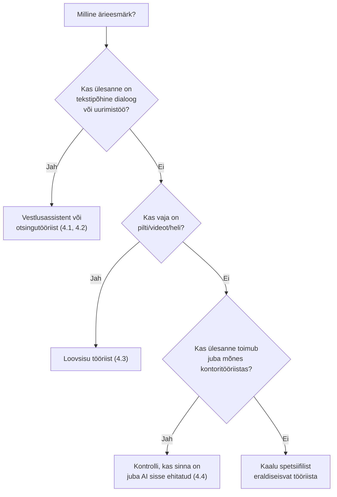

# 4.5 Kuidas valida õige tööriist

::: tip Selle tunni järel...
- oskad valida AI-tööriistade kategooriate vahel lähtuvalt konkreetsest ärivajadusest;
- tead nelja peamist kriteeriumit, mida tööriista valikul arvestada;
- oskad kasutada lihtsat otsustusraamistikku, mis seob kokku kogu mooduli.
:::

## Kõigepealt: milline ärieesmärk?

[Tunnis 1.3](/tehisintellekt/moodul-01-mis-on-ai/tund-03-kus-kasutatakse) tutvustatud ärieesmärkide raamistik on hea lähtepunkt ka tööriista valikul — tööriista ei valita sellepärast, et see on populaarne, vaid sellepärast, et see aitab konkreetset eesmärki saavutada:

| Ärieesmärk | Tööriistakategooria, mis tavaliselt sobib |
|---|---|
| Tootlikkus ja tõhusus | Vestlusassistendid ([4.1](./tund-01-vestlusassistendid)), kontoritöö AI ([4.4](./tund-04-kontoritoo-tooriistad)) |
| Kliendikogemus | Vestlusassistendid, loovsisu tööriistad turundusmaterjalideks ([4.3](./tund-03-loovsisu-tooriistad)) |
| Käibe kasv ja innovatsioon | Loovsisu tööriistad, otsingu-/uurimistööriistad turu-uuringuteks ([4.2](./tund-02-otsing-ja-uurimine)) |
| Riskijuhtimine ja vastavus | Kontoritöösse sisseehitatud AI (auditeeritavus, ettevõtte enda andmekaitse tingimused) |

## Neli valikukriteeriumi

Kui ärieesmärk on selge, aitavad valida konkreetse tööriista need neli küsimust:

1. **Kui tundlikud on andmed, mida tööriistale annad?** Kliendi isikuandmed või ärisaladused nõuavad tööriista, mille andmekasutuse tingimused on selged ja mida ettevõte on kontrollinud (süvitsi moodulis 7).
2. **Kui palju see maksab ja kuidas hinnastatakse?** Kasutaja kohta kuus, kasutusmahu järgi, või osana juba olemasolevast litsentsist (nt Microsoft 365 Copilot lisandub olemasolevale Office'i litsentsile).
3. **Kas see integreerub olemasolevate tööriistadega?** Tööriist, mis töötab otse dokumendis/tabelis, mida niigi kasutatakse, säästab rohkem aega kui eraldiseisev rakendus, kuhu peab pidevalt sisu kopeerima.
4. **Kui mugav on meeskonnal seda kasutada?** Kõige võimekam tööriist ei aita, kui keegi seda ei kasuta — [tunnis 3.5](/tehisintellekt/moodul-03-promptimine/tund-05-promptimine-ariprotsessides) nägime, et AI-abi tõi kõige suurema kasu just vähem kogenud kasutajatele, mitte eksperdile, mis tähendab, et lihtne, madala õppimiskünnisega tööriist toob sageli suurema reaalse kasu kui tehniliselt "parim" valik.

## Kokkuvõttev otsustusraamistik

::: info Mida see moodul teadlikult ei kata
Koodi- ja arendustööriistad (GitHub Copilot, Claude Code jt) on oma valikukriteeriumite ja töövoogudega piisavalt eripärased, et need käsitleme eraldi moodulis 6. Andmeturbe ja eetika sügavama analüüsi leiad moodulist 7.
:::

## Kokkuvõte

Õige tööriista valimine ei alga küsimusest "milline AI on parim?", vaid küsimusest "mida ma täpselt saavutada tahan?" — täpselt sama põhimõte, mida nägime [tunnis 3.2](/tehisintellekt/moodul-03-promptimine/tund-02-prompti-anatoomia) hea prompti struktuuri juures: selge eesmärk ja kontekst viivad parema tulemuseni kui üldine, läbimõtlemata valik.
