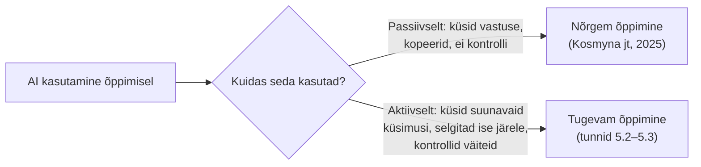

# 5.1 Miks AI õppimises üldse toimib (ja millal mitte)

::: tip Selle tunni järel...
- tead, mis on Bloomi "kahe sigma probleem" ja miks see selgitab, miks AI-tutorlus üldse tähelepanu pälvib;
- tead reaalset teaduslikku uuringut, mis näitab, et AI kasutamine võib õppimist ka nõrgendada;
- mõistad selle mooduli läbivat põhimõtet: AI väärtus õppimisel sõltub sellest, kuidas seda kasutatakse, mitte sellest, et seda üldse kasutatakse.
:::

## Bloomi "kahe sigma probleem"

1984. aastal avaldas haridusteadlane Benjamin Bloom uurimuse, mis on siiani üks enim viidatud töid hariduspsühholoogias. Ta võrdles kolme õpetamisviisi: tavaline klassiõpe (umbes 30 õpilast ühe õpetaja kohta), täiustatud klassiõpe (koos tagasiside ja korrigeeriva õppega) ning **individuaalne 1:1 juhendamine**. Tulemus oli järsk: keskmine 1:1 juhendamist saanud õpilane sooritas testid umbes **kaks standardhälvet** paremini kui tavalises klassis õppinud õpilane — tulemus, mis vastaks tavalise klassi 98. protsentiilile ([Bloom, 1984, *Educational Researcher*](https://journals.sagepub.com/doi/10.3102/0013189X013006004); lihtsam kokkuvõte: [Wikipedia](https://en.wikipedia.org/wiki/Bloom%27s_2_sigma_problem)).

Probleem: 1:1 juhendamine ei skaleeru. Ühele õpetajale ühte õpilast ei jätku kunagi piisavalt õpetajaid ega raha. Bloom nimetaski selle "kahe sigma probleemiks" — teame, mis töötab, aga ei suuda seda kõigile pakkuda.

::: info Miks see AI-teemasse puutub
Suur osa tänapäeva AI-tutorluse teadusuuringutest ja -toodetest (nt [tund 5.2](./tund-02-ulikoolide-naited) näited) positsioneerib end otseselt katsena Bloomi probleemile läheneda: pakkuda midagi 1:1 juhendamise lähedast, aga miljonitele õpilastele korraga. See on aus ja kontrollitav ambitsioon — aga nagu järgmine uuring näitab, ei tähenda "AI on saadaval" automaatselt "õppimine paraneb".
:::

## Aga: passiivne AI-kasutus võib õppimist nõrgendada

2025. aastal avaldasid MIT Media Labi teadlased (Nataliya Kosmyna, Pattie Maes jt) uuringu, kus 54 osalejat kirjutasid esseid kolmes tingimuses: ainult oma pea abil, otsingumootoriga, või suure keelemudeliga (LLM). Uuriti nii aju elektrilist aktiivsust (EEG) kui ka kirjutatud teksti.

Tulemused olid selged:

- LLM-i kasutanud rühmal oli **nõrgim ajusisene ühenduvus** kolmest rühmast.
- LLM-i kasutanud osalejad ei suutnud pärast kirjutamist sageli **oma essee sisu tsiteerida** — tekst "ei tundunud nende oma".
- Kui LLM-i kasutanud osalejad pidid järgmises katses kirjutama **ilma AI-ta**, jäid nad alla isegi rühmale, kes polnud kordagi AI-d kasutanud.

Allikas: [Kosmyna jt, 2025, arXiv:2506.08872](https://arxiv.org/abs/2506.08872) — esmane allikas (preprint, MIT Media Lab).

::: warning Mida see ei tähenda
See uuring ei ütle, et AI on õppimisele kahjulik. Kõik käesolevas moodulis järgnevad tunnid (5.2–5.3) näitavad reaalseid näiteid, kus AI kasutamine **parandas** õpitulemusi. Vahe on kasutusviisis: kas AI asendab sinu enda mõtlemise (passiivne kasutus) või toetab seda (aktiivne kasutus). See vahe on kogu ülejäänud mooduli läbiv teema.
:::

## Selle mooduli tees

Järgmises tunnis vaatame, kuidas suured ülikoolid on seda vahet oma AI-tööriistade **disainis** juba arvesse võtnud.

## Viited ja lisalugemine

- [Bloom, B. S. (1984). The 2 Sigma Problem. *Educational Researcher*, 13(6)](https://journals.sagepub.com/doi/10.3102/0013189X013006004)
- [Wikipedia — Bloom's 2 sigma problem](https://en.wikipedia.org/wiki/Bloom%27s_2_sigma_problem)
- [Kosmyna, N. jt (2025). Your Brain on ChatGPT. arXiv:2506.08872](https://arxiv.org/abs/2506.08872)
