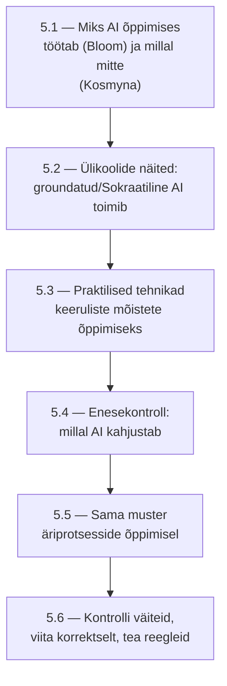

# 5.6 Allikakontroll, viitamine ja akadeemiline ausus AI ajastul

::: tip Selle tunni järel...
- tead, milliseid AI väiteid tuleb alati kontrollida ja miks;
- oskad AI kasutamisele ametlikult viidata (APA vorming);
- tead teaduslikku tõendust selle kohta, miks AI-tuvastustööriistad (nt Turnitin) ei ole usaldusväärsed;
- tead reaalset raamistikku, mida koolid kasutavad AI-kasutuse reeglite selgitamiseks.
:::

## Miks AI väiteid tuleb kontrollida

[Tunnis 2.5](/tehisintellekt/moodul-02-kuidas-ai-tootab/tund-05-miks-eksib) nägime, miks AI mudelid "eksivad" ehk hallutsineerivad — need genereerivad statistiliselt tõenäolist, mitte tingimata faktiliselt kontrollitud teksti. Kõige levinumad mustrid, millele mitme ülikooli raamatukogu juhendid (nt Purdue Northwest, Penn Libraries) tähelepanu juhivad:

- väljamõeldud tsitaadid ja viited, mis kõlavad usutavalt, aga ei eksisteeri;
- valed kuupäevad, nimed või statistikad;
- reaalsete allikate valesti esitatud sisu.

**Kuldreegel:** täpsed arvud, tsitaadid, kuupäevad ja viited kontrolli alati algallikast — ja ära kasuta sama AI-mudelit enda väljundi kontrollimiseks, sest see kordab kergesti sama viga.

::: info See kursus järgib sama reeglit
See pole abstraktne nõuanne — täpselt selline protsess on kasutusel ka käesoleva õppematerjali koostamisel: iga selles moodulis toodud arv, tsitaat ja kuupäev on kontrollitud algallikast enne avaldamist.
:::

## Kuidas AI-le viidata

Kui kasutad AI-tööriista töö või ülesande osana ja pead sellele viitama, on ametlik APA vorming ([apastyle.apa.org](https://apastyle.apa.org/blog/how-to-cite-chatgpt), uuendatud 2025):

```
OpenAI. (2023). ChatGPT (Feb 13 version) [Large language model]. https://chat.openai.com
```

Lisaks viitele soovitab APA esitada teksti sees ka kasutatud prompt ja vastuse asjakohane osa — sest AI vastus pole korratav samamoodi nagu tavaline allikas (sama prompt ei anna alati sama vastust). Oluline põhimõte: **autor, mitte AI, vastutab väljundi täpsuse eest** — viitamine ei vabasta sind kohustusest väidet ise kontrollida.

## Miks AI-tuvastustööriistad ei ole usaldusväärsed

Levinud eeldus on, et kui inimene ei suuda AI kasutamist ise tuvastada, teeb seda "AI-tuvastaja" tööriist (nt Turnitin, GPTZero). Teadus ütleb teist juttu.

::: warning Liang jt (2023) — kallutatus mitte-emakeelekõnelejate vastu
Stanfordi teadlaste uuring testis 7 populaarset GPT-detektorit tegelikel TOEFL-esseedel (inglise keele testieksam mitte-emakeelekõnelejatele). Tulemus: detektorid märkisid **61,3%** neist mitte-emakeelekõnelejate kirjutatud, tegelikult inimese kirjutatud esseedest ekslikult AI-genereerituks. Emakeelekõnelejate esseedel oli täpsus palju parem. Allikas: [arXiv:2304.02819](https://arxiv.org/abs/2304.02819) — retsenseeritud/eelprint, esmane allikas.
:::

See pole ainult teoreetiline probleem. **Vanderbilti Ülikool** lülitas 2023. aasta augustis Turnitini AI-tuvastuse oma süsteemides täielikult välja. Nende endi avaldatud põhjendus:

- Turnitini väidetud 1% valepositiivsete määr oleks 2022. aasta ~75 000 esitatud töö juures tähendanud kuni **750 valesti AI-kasutuses süüdistatud üliõpilast**.
- Tööriist oli kallutatud mitte-emakeelekõnelejate vastu (samas mustris, mis Liang jt uuringus).
- Turnitin ei avaldanud läbipaistvalt, mida "AI-muster" täpselt tähendab.

Allikas: [Vanderbilt University — Guidance on AI Detection](https://www.vanderbilt.edu/brightspace/2023/08/16/guidance-on-ai-detection-and-why-were-disabling-turnitins-ai-detector/) — esmane allikas, ülikooli enda ametlik teade.

## Reaalne raamistik: "foorituli" mudel

Mitu ülikooli (nt UMBC, CUNY, UCD Dublin) kasutab AI-kasutuse reeglite selgitamiseks lihtsat kolmevärvilist mudelit, mida saab rakendada ülesande kaupa:

| Värv | Tähendus |
|---|---|
| Punane | AI kasutamine keelatud — ülesanne hindab just seda oskust, mida AI ei tohiks asendada |
| Kollane | AI kasutamine piiratud — võib abistada protsessi (nt suunavad küsimused, tund 5.3 tehnikad), aga ei tohi asendada sinu enda tööd, ja kasutamine tuleb ära märkida |
| Roheline | AI kasutamine lubatud või nõutav — vastutus väljundi eest jääb siiski sinule, ja viitamine (APA vorming ülal) kehtib ikkagi |

Allikas: [UWGB Cowbell — Traffic Light Model](https://blog.uwgb.edu/catl/indicating-generative-ai-assignment-permissions-with-the-traffic-light-model-red-light-yellow-light-green-light/); [UMBC provosti ametlik teade](https://my3.my.umbc.edu/groups/provost/posts/155412). Harvardi CS50 järgib sarnast loogikat oma [akadeemilise aususe lehel](https://cs50.harvard.edu/x/notes/ai/): kursuse enda AI-tööriist ([tund 5.2](./tund-02-ulikoolide-naited)) on lubatud, aga üldine vestlusassistent ülesannete lahendamiseks mitte.

::: info Praktiline nõuanne
Konkreetne punane/kollane/roheline reegel on iga õppejõu, kooli või töökoha otsustada — see kursus ise ei määra ühte universaalset reeglit kõigile ülesannetele. Kui pole selge, milline ülesanne millisesse tsooni kuulub, on kõige lihtsam lahendus küsida otse.
:::

## Mooduli kokkuvõte



Läbiv joon kogu moodulis: AI võib õppimist märkimisväärselt toetada (Bloomi probleemi mõttes), aga ainult siis, kui kasutad seda aktiivselt — suunavaid küsimusi küsides, ise proovides, ja väiteid kontrollides — mitte passiivselt vastuseid kopeerides.

## Viited ja lisalugemine

- [Purdue Northwest Library — AI ja allikakontroll](https://guides.pnw.edu/c.php?g=1549726&p=11622893)
- [Penn Libraries — Misinformation and AI](https://guides.library.upenn.edu/chatting-up-chat-gpt/misinformation)
- [APA Style — How to Cite ChatGPT](https://apastyle.apa.org/blog/how-to-cite-chatgpt)
- [Liang, W. jt (2023). GPT detectors are biased against non-native English writers. arXiv:2304.02819](https://arxiv.org/abs/2304.02819)
- [Vanderbilt University — Guidance on AI Detection (2023)](https://www.vanderbilt.edu/brightspace/2023/08/16/guidance-on-ai-detection-and-why-were-disabling-turnitins-ai-detector/)
- [UWGB — Traffic Light Model](https://blog.uwgb.edu/catl/indicating-generative-ai-assignment-permissions-with-the-traffic-light-model-red-light-yellow-light-green-light/)
- [Tund 2.5 — Miks AI eksib?](/tehisintellekt/moodul-02-kuidas-ai-tootab/tund-05-miks-eksib)
