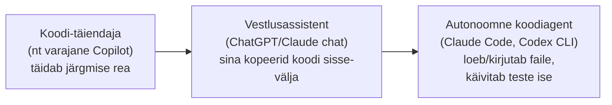

# 6.1 AI-abilised tarkvaraarenduses — ülevaade

::: tip Selle tunni järel...
- oskad eristada koodi-täiendajaid (autocomplete), vestlusassistente ja autonoomseid koodiagente;
- tead peamisi nimega tööriistu selles kategoorias ja mille poolest need erinevad;
- mõistad, miks "agent, mis loeb ja kirjutab faile ise" on põhimõtteliselt teine asi kui "chatbot, kellele kleebid koodi".
:::

## Kolm põlvkonda

AI-abilised tarkvaraarenduses on arenenud kolmes suures etapis:

1. **Koodi-täiendajad (autocomplete)** — pakuvad rea või mõne rea pikkuseid vihjeid, kui sa juba kirjutad. Esimene laialt levinud näide oli GitHub Copilot (2021).
2. **Vestlusassistendid** — [moodulis 4](/tehisintellekt/moodul-04-ai-tooriistad/tund-01-vestlusassistendid) nähtud ChatGPT/Claude/Gemini-laadsed tööriistad, kellele kopeerid koodi sisse ja küsid seletust või parandust. Sina liigutad infot käsitsi tööriista ja koodi vahel.
3. **Autonoomsed koodiagendid** — nt Claude Code, OpenAI Codex CLI, Cursori agendirežiim. Need loevad ise projekti faile, käivitavad teste, kirjutavad koodi otse failisüsteemi ja võivad isegi committida — sina annad ülesande, agent teeb tööetapid ise, nagu [tund 3.6](/tehisintellekt/moodul-03-promptimine/tund-06-prd-naide) juba näitas ühe tervikliku spetsifikatsiooni (PRD) näitel.

::: info Miks see vahe on oluline
Kolmandas etapis muutub oluliseks täpselt see, mida [tund 3.6](/tehisintellekt/moodul-03-promptimine/tund-06-prd-naide) õpetas: kuna agent tegutseb iseseisvalt paljude sammude vältel, sõltub tulemuse kvaliteet suuresti sellest, kui hea on talle antud kontekst ja spetsifikatsioon alguses — mitte ainult üksiku prompti sõnastusest.
:::

## Peamised tööriistad

| Tööriist | Tegija | Kategooria |
|---|---|---|
| GitHub Copilot | GitHub/Microsoft | Koodi-täiendaja + agendirežiim |
| Claude Code | Anthropic | Autonoomne koodiagent (terminal/CLI) |
| Codex CLI | OpenAI | Autonoomne koodiagent (terminal/CLI) |
| Cursor | Cursor (Anysphere) | Redaktor koos sisseehitatud agendirežiimiga |

::: warning Miks siin pole täpseid versiooninumbreid
Samal põhjusel, mis [tunnis 4.1](/tehisintellekt/moodul-04-ai-tooriistad/tund-01-vestlusassistendid) — see maastik muutub kuudega. Järgmistes tundides keskendume mustritele ja dokumenteeritud töövoogudele, mis püsivad, mitte konkreetsetele versioonidele.
:::

Järgmises tunnis vaatame, kuidas suured tarkvaraettevõtted neid tööriistu reaalselt kasutavad — koos konkreetsete, kontrollitud arvudega.

## Viited ja lisalugemine

- [Tund 3.6 — Praktikas: PRD kui kontekstifail](/tehisintellekt/moodul-03-promptimine/tund-06-prd-naide)
- [Tund 4.1 — Vestlusassistendid](/tehisintellekt/moodul-04-ai-tooriistad/tund-01-vestlusassistendid)
