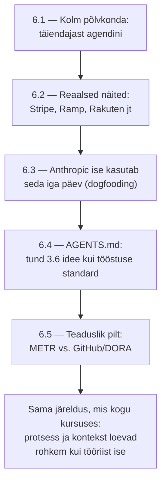

# 6.6 Kokkuvõte — AI tarkvaraarenduses

::: tip Selle tunni järel...
- oskad kirjeldada mooduli 6 läbivat joont ühe lühikese raamistikuna.
:::

## Mooduli kokkuvõte

Läbiv joon: parimad tulemused (Stripe, Ramp, Anthropic ise) tekivad koos läbimõeldud protsessiga — spetsifikatsioonid ([tund 3.6](/tehisintellekt/moodul-03-promptimine/tund-06-prd-naide)), struktureeritud kontekstifailid ([tund 6.4](./tund-04-agents-md)), selge plaanimine ([tund 6.3](./tund-03-anthropic-dogfooding)). Ilma selleta näitab METR-i uuring ([tund 6.5](./tund-05-teaduslik-pilt)), et AI võib isegi kogenud arendajat aeglustada, mitte kiirendada.

Terve kursuse tervikpilti ja kokkuvõtet vaata [tunnist 8.5](/tehisintellekt/moodul-08-rakendamine-ja-moju/tund-05-kokkuvote).

## Viited ja lisalugemine

- [Tehisintellekt — teema ülevaade ja kõik moodulid](/tehisintellekt/)
- [Tund 8.5 — Kokkuvõte: AI kasutuselevõtu tervikpilt](/tehisintellekt/moodul-08-rakendamine-ja-moju/tund-05-kokkuvote)
