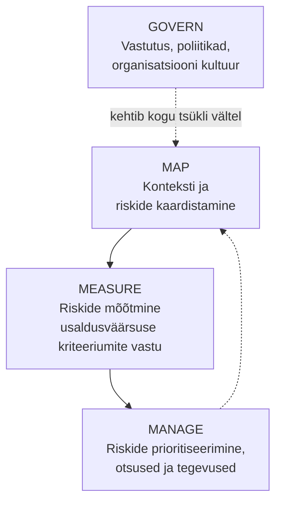

# 7.4 Riskijuhtimise raamistikud

::: tip Selle tunni järel...
- tead NIST AI riskijuhtimise raamistiku nelja funktsiooni;
- tead OWASP-i AI-rakenduste riskide TOP 10 nimekirja kahte kõrgeimat riski;
- oskad siduda varasemates tundides nähtud reaalsed juhtumid nende raamistike konkreetsete kategooriatega.
:::

Eelmised kolm tundi näitasid konkreetseid juhtumeid — Hollandi toetuste skandaal, Itaalia ChatGPT trahv, Samsungi andmeleke, Hongkongi deepfake-pettus. Need ei ole juhuslikud üksikjuhtumid: need kõik langevad ühte või mitmesse **tuntud, dokumenteeritud riskikategooriasse**, mida organisatsioonid juba täna süstemaatiliselt juhivad. Kaks kõige laiemalt kasutatavat raamistikku on NIST AI RMF ja OWASP Top 10 for LLM Applications.

## NIST AI Risk Management Framework (AI RMF)

USA riiklik standardiasutus NIST avaldas 2023. aastal vabatahtliku, valdkonnaülese raamistiku AI-riskide juhtimiseks. See koosneb neljast funktsioonist:

| Funktsioon | Mida see tähendab praktikas |
|---|---|
| **Govern** | Kes vastutab AI-süsteemi eest? Millised on ettevõtte sisereeglid ja järelevalve? See on läbiv alus, mis toetab teisi kolme funktsiooni. |
| **Map** | Millises kontekstis süsteemi kasutatakse ja mis riskid sellega konkreetselt kaasnevad? |
| **Measure** | Mõõda süsteemi usaldusväärsuse näitajaid (täpsus, õiglus, turvalisus) enne ja pärast kasutuselevõttu. |
| **Manage** | Mõõtmistulemuste põhjal otsusta: kas risk on aktsepteeritav, milliseid leevendusi rakendada, millal süsteem peatada. |

Kui vaatame tagasi [tunni 7.1](./tund-01-kallutatus-ja-oiglus) Hollandi juhtumit läbi selle raamistiku: puudus oli täpselt **Govern**-funktsioonis — otsuste eest polnud selget inimlikku vastutajat — ja **Measure**-funktsioonis, kuna süsteemi õiglust ei mõõdetud enne laialdast kasutuselevõttu ([NIST — AI Risk Management Framework](https://www.nist.gov/itl/ai-risk-management-framework)).

## OWASP Top 10 for LLM Applications (2025)

Turveorganisatsioon OWASP, tuntud oma veebirakenduste turvariskide nimekirja poolest, avaldab ka spetsiifilise TOP 10 nimekirja suurte keelemudelite (LLM) rakenduste jaoks. 2025. aasta versiooni kaks kõrgeimat riski:

1. **Prompt Injection (LLM01)** — ründaja peidab mudelile mõeldud "juhise" sisendi sisse (nt dokumenti, veebilehele), mille mudel eksikombel täidab tegeliku kasutaja juhisena.
2. **Sensitive Information Disclosure (LLM02)** — mudel avaldab tundlikku infot, mida see on treeningandmetest "meelde jätnud" või mida keegi on hooletult vestlusesse sisestanud. See tõusis 2025. aasta nimekirjas kuuendalt kohalt teisele — täpselt see risk, mida nägime [tunnis 7.2](./tund-02-privaatsus-ja-andmeturve) Samsungi juhtumi näitel.

Ülejäänud nimekiri hõlmab muuhulgas tarneahela riske (**Supply Chain**), treeningandmete mürgitamist (**Data and Model Poisoning**) ja liigseid õigusi AI-agentidele (**Excessive Agency**) ([OWASP — Top 10 for LLM Applications 2025](https://genai.owasp.org/resource/owasp-top-10-for-llm-applications-2025/)).

::: info Miks kaks raamistikku, mitte üks
NIST AI RMF on **organisatsiooni tasandi** protsessiraamistik — kuidas juhtida AI riske üldiselt, olenemata tehnoloogiast. OWASP LLM Top 10 on **tehniline, spetsiifiline** nimekiri konkreetsetest turvanõrkustest suurtes keelemudelites. Praktikas kasutatakse neid koos: NIST annab protsessi ("kuidas me riske üldse juhime"), OWASP annab konkreetse kontrollnimekirja ("mida täpselt kontrollida LLM-rakenduse juures").
:::

## Kokkuvõte

Riskid, mida nägime eelnevates tundides juhtumipõhiselt, ei ole ettevõtetele üllatuseks — need on juba kaardistatud, kategoriseeritud ja dokumenteeritud kahes laialdaselt tunnustatud raamistikus. Ettevõtte jaoks tähendab see, et AI riskide juhtimist ei pea leiutama nullist, vaid saab lähtuda juba olemasolevast heast praktikast.

## Viited ja lisalugemine

- [NIST — AI Risk Management Framework](https://www.nist.gov/itl/ai-risk-management-framework)
- [NIST — AI RMF Playbook](https://www.nist.gov/itl/ai-risk-management-framework/nist-ai-rmf-playbook)
- [OWASP — Top 10 for LLM Applications 2025](https://genai.owasp.org/resource/owasp-top-10-for-llm-applications-2025/)
