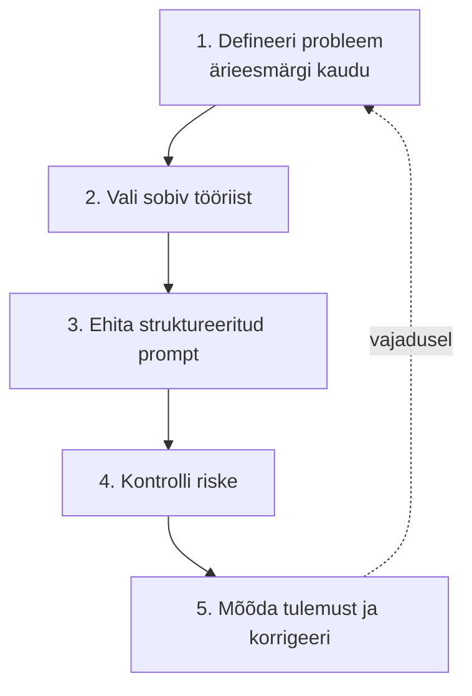

# 8.4 Kuidas rakendada AI-d lihtsama äriprobleemi lahendamisel

::: tip Selle tunni järel...
- oskad rakendada viiesammulist raamistikku, mis ühendab kogu kursuse õpitu;
- oled näinud, kuidas see raamistik toimib ühe konkreetse, realistliku väikeettevõtte probleemi peal;
- tead, mille poolest erineb "AI kasutamine" "AI läbimõeldud rakendamisest".
:::

Selle kursuse eelnevad moodulid on andnud sulle eraldi tükid: ärieesmärgid ([tund 1.3](/tehisintellekt/moodul-01-mis-on-ai/tund-03-kus-kasutatakse)), promptimine ([moodul 3](/tehisintellekt/moodul-03-promptimine/)), tööriista valik ([tund 4.5](/tehisintellekt/moodul-04-ai-tooriistad/tund-05-oige-tooriista-valik)), riskid ([moodul 7](/tehisintellekt/moodul-07-eetika-ja-riskid/)). See tund paneb need tükid kokku üheks viiesammuliseks protsessiks.

## Viis sammu



## Näide: väike raamatupidamisbüroo

Mängime raamistiku läbi ühe realistliku, väikeettevõttele omase probleemi peal: **väike raamatupidamisteenuste büroo saab iga nädal kümneid korduvaid e-kirju klientidelt lihtsate küsimustega** (nt "milliseid dokumente on vaja käibemaksu deklaratsiooniks?"), mis võtab raamatupidajate ajast palju, kuigi vastused on enamasti sarnased.

### 1. Defineeri probleem ärieesmärgi kaudu

[Tunni 1.3](/tehisintellekt/moodul-01-mis-on-ai/tund-03-kus-kasutatakse) raamistiku järgi on siin tegu selgelt **tootlikkuse ja tõhususe** eesmärgiga — sama arv raamatupidajaid peaks jõudma teha rohkem sisulist tööd, mitte kuluma korduvatele lihtküsimustele. See ei ole kliendikogemuse ega käibekasvu probleem, mistõttu lahendus peaks olema odav ja kiiresti käivitatav, mitte suur strateegiline investeering.

### 2. Vali sobiv tööriist

[Tunni 4.5](/tehisintellekt/moodul-04-ai-tooriistad/tund-05-oige-tooriista-valik) otsustuspuu järgi: ülesanne on tekstipõhine dialoog (kliendikirjad), andmed on mõõdukalt tundlikud (kliendi maksuandmed — mitte avalikuks, aga mitte ka eriti kõrge riskiga), integratsiooni suurt vajadust pole. See viitab lihtsale lahendusele: raamatupidaja kasutab olemasolevat vestlusassistenti (nt ettevõtte kontoga Claude või ChatGPT) e-kirja **mustandi** koostamiseks, mille raamatupidaja ise üle vaatab ja saadab — mitte täisautomaatset, ise saatvat süsteemi.

### 3. Ehita struktureeritud prompt

[Tundides 3.2–3.3](/tehisintellekt/moodul-03-promptimine/tund-02-prompti-anatoomia) õpitud struktuuri järgi:

```
Oled raamatupidamisbüroo klienditeenindaja. Klient küsis, milliseid
dokumente on vaja käibemaksu deklaratsiooni esitamiseks.

Kirjuta vastus, mis:
- loetleb vajalikud dokumendid selgelt, punktidena;
- on sõbralik, aga professionaalne;
- lõpeb pakkumisega aidata, kui midagi jääb ebaselgeks;
- on maksimaalselt 100 sõna pikk.

Kliendi kiri: "Tere! Millised dokumendid ma pean teile saatma
käibemaksu deklaratsiooni jaoks?"
```

See on sama põhimõte, mida nägime [tunnis 3.5](/tehisintellekt/moodul-03-promptimine/tund-05-promptimine-ariprotsessides) kliendikirja näite juures — konkreetne kontekst, selge ülesanne ja formaat annavad kasutuskõlbliku mustandi juba esimesel katsel.

### 4. Kontrolli riske

[Moodulist 7](/tehisintellekt/moodul-07-eetika-ja-riskid/) tulenevad kontrollpunktid:
- **Kas vastuses on tundlikku infot?** ([tund 7.2](/tehisintellekt/moodul-07-eetika-ja-riskid/tund-02-privaatsus-ja-andmeturve)) — konkreetse kliendi isikuandmeid (nt tegelikke summasid) ei tohi tavalisse tarbijaversiooni sisestada.
- **Kes vastutab, kui vastus on ekslik?** ([tund 7.5](/tehisintellekt/moodul-07-eetika-ja-riskid/tund-05-regulatsioon-ja-vastutus)) — Air Canada juhtum näitas, et ettevõte vastutab alati, olenemata sellest, kes (inimene või AI) vastuse koostas. Seetõttu jääb raamatupidaja vastuse ülevaataja rolli, mitte ei lase kirja minna automaatselt.

### 5. Mõõda tulemust ja korrigeeri

[Tunnis 8.2](./tund-02-klarna-juhtumiuuring) nähtud Klarna õppetund kehtib ka väikeettevõttele: ära jää esimese tulemuse juurde pikaks ajaks järele mõtlemata. Mõõda konkreetselt: kas vastamise aeg lühenes? Kas kliendid on rahul? Kas mõni vastus oli ebatäpne ja vajab prompti täpsustamist? Kui midagi ei tööta hästi, mine tagasi sammu 1 või 3 juurde — see ongi diagrammil näidatud tagasisideahel.

## Kokkuvõte

Sama raamistik kehtib olenemata ettevõtte suurusest või valdkonnast — ainult konkreetne probleem, tööriist ja prompt muutuvad. See ongi vahe "AI kasutamise" (proovi juhuslikult, vaata, mis juhtub) ja "AI läbimõeldud rakendamise" (selge eesmärk, teadlik valik, kontrollitud risk, mõõdetud tulemus) vahel.

## Viited ja lisalugemine

- [Tund 1.3 — ärieesmärkide raamistik](/tehisintellekt/moodul-01-mis-on-ai/tund-03-kus-kasutatakse)
- [Tund 4.5 — tööriista valiku otsustusraamistik](/tehisintellekt/moodul-04-ai-tooriistad/tund-05-oige-tooriista-valik)
- [Tund 3.5 — promptimine äriprotsessides](/tehisintellekt/moodul-03-promptimine/tund-05-promptimine-ariprotsessides)
