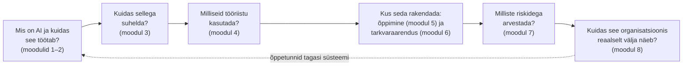

# 8.5 Kokkuvõte — AI kasutuselevõtu tervikpilt

::: tip Selle tunni järel...
- oskad kirjeldada tervikliku "AI kasutuselevõtu tervikpildi" ühe lühikese raamistikuna;
- tead, milliseid küsimusi esitada enne, kui organisatsioon võtab kasutusele mistahes uue AI-lahenduse;
- tead, milliseid teemasid see kursus veel katab ja kus need asuvad.
:::

## Kogu kursuse üks pilt

Alustasime küsimusest "mis on tehisintellekt" ja jõudsime välja reaalsete ettevõtete juhtumiteni. Kokku moodustab see ühe tervikliku mõttekäigu:

## Viis küsimust, mida iga AI-algatuse juures küsida

Selle kursuse põhjal saab kokku panna lühikese kontrollnimekirja, mida rakendada mistahes uue AI-idee puhul, olenemata sellest, kas tegu on üksiku töötaja isikliku prompti või kogu ettevõtte strateegiaga:

1. **Milline ärieesmärk see täidab?** ([tund 1.3](/tehisintellekt/moodul-01-mis-on-ai/tund-03-kus-kasutatakse)) — kui vastust pole, ei ole tegu läbimõeldud algatusega, vaid trendi järgimisega.
2. **Kas valitud tööriist ja prompt on ülesande jaoks õigesti valitud?** ([moodulid 3–4](/tehisintellekt/moodul-03-promptimine/)) — üldine "parim AI" ei ole vastus; konkreetne sobivus on.
3. **Milliseid riske see kaasa toob ja kes nende eest vastutab?** ([moodul 7](/tehisintellekt/moodul-07-eetika-ja-riskid/)) — kallutatus, privaatsus, autentsus, vastutus.
4. **Kuidas me mõõdame, kas see tegelikult töötab?** ([tund 8.2](./tund-02-klarna-juhtumiuuring)) — Klarna näitas, et esialgne edu ei taga püsivat edu ilma pideva mõõtmiseta.
5. **Mida see tähendab inimeste, mitte ainult tehnoloogia jaoks?** ([tund 8.3](./tund-03-tooturg-ja-tookorraldus)) — rollide muutus, ümberõppe vajadus, mitte ainult tehniline juurutus.

## Kogu kursus on nüüd valmis

Kõik kaheksa moodulit — [1. Mis on tehisintellekt?](/tehisintellekt/moodul-01-mis-on-ai/), [2. Kuidas AI töötab?](/tehisintellekt/moodul-02-kuidas-ai-tootab/), [3. Promptimine](/tehisintellekt/moodul-03-promptimine/), [4. AI tööriistad](/tehisintellekt/moodul-04-ai-tooriistad/), [5. AI kasutamine õppimises](/tehisintellekt/moodul-05-ai-oppimises/), [6. AI tarkvaraarenduses](/tehisintellekt/moodul-06-ai-arenduses/), [7. AI eetika ja riskid](/tehisintellekt/moodul-07-eetika-ja-riskid/) ja see, 8. moodul — on nüüd valmis. [Tehisintellekti teema ülevaade](/tehisintellekt/) annab kogu kursusest tervikliku sissejuhatuse.

## Kokkuvõte

Tehisintellekt ei ole üks tehnoloogia, vaid tööriistade kogum, mida saab kasutada hästi või halvasti, läbimõeldult või läbimõtlematult. See kursus andis raamistiku, mille abil vahet teha — ärieesmärgist riskijuhtimiseni, üksikust promptist terve organisatsiooni töökorralduseni.

## Viited ja lisalugemine

- [Tehisintellekt — teema ülevaade ja kõik moodulid](/tehisintellekt/)
