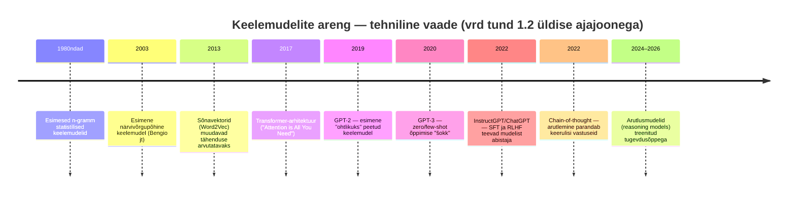

# Keelemudelid

Üheksas moodul on erinev kõigist eelnevatest. Kui moodulid 1–8 hoidsid teadlikult eemale matemaatilistest valemitest ja tehnilisest sügavusest, siis siin teeme sellest teadliku erandi: vaatame samu keelemudeleid, millest juba varem juttu oli ([tund 2.4](/tehisintellekt/moodul-02-kuidas-ai-tootab/tund-04-tokenid)), aga nüüd päris tõenäosuse, valemite ja arvude tasandil — nii nagu ülikoolis seda õpetatakse.

::: tip Seos varasemate moodulitega
See moodul ei alusta nullist. Iga tund viitab tagasi kohale, kus sama teema juba pinnapealsemalt läbi käidi ([moodul 2](/tehisintellekt/moodul-02-kuidas-ai-tootab/): närvivõrgud, tokenid, sõnavektorid; [moodul 3](/tehisintellekt/moodul-03-promptimine/): zero-shot, chain-of-thought; [moodul 7](/tehisintellekt/moodul-07-eetika-ja-riskid/): kallutatus, regulatsioon) — ja süveneb sealt edasi, matemaatika ja päris arvudega.
:::

## Ajalooline kaar: samad verstapostid, tehnilisem vaade

[Tund 1.2](/tehisintellekt/moodul-01-mis-on-ai/tund-02-ai-ajalugu) näitas AI ajalugu laias plaanis — Turingist ChatGPT-ni. Allpool on **sama ajajoon, ainult suumitud sisse just keelemudelite arengule** — igaüks neist verstapostidest saab selles moodulis oma tunni:

## Tunnid

1. [Mis on keelemudel?](./tund-01-mis-on-keelemudel)
2. [N-gramm mudelid — esimene matemaatiline keelemudel](./tund-02-n-gramm-mudelid)
3. [Sõnavektorid ja närvivõrgupõhised mudelid](./tund-03-sonavektorid-ja-narvivorgud)
4. [Transformerid ja suurte mudelite plahvatuslik areng](./tund-04-transformerid-ja-suured-mudelid)
5. [Toorest mudelist abistajaks](./tund-05-toorest-mudelist-abistajaks)
6. [Kitsaskohad ja hind](./tund-06-kitsaskohad-ja-hind)
7. [Kokkuvõte](./tund-07-kokkuvote)

## Allikas

Selle mooduli lähtematerjaliks oli Tallinna Tehnikaülikooli loengukonspekt "Keelemudelid" (Tanel Alumäe) — sisu on siin ümber kirjutatud, faktikontrollitud ja täiendatud iseseisvate allikatega, mitte otse üle kantud.
