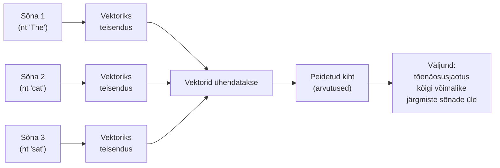

# 9.3 Sõnavektorid ja närvivõrgupõhised mudelid

::: tip Selle tunni järel...
- mõistad, kuidas sõnavektor täpselt tekib — see treenitakse koos mudeli muude osadega, mitte eraldi;
- oskad kirjeldada esimese närvivõrgupõhise keelemudeli üldist arhitektuuri (sisend → vektorid → peidetud kiht → väljund);
- oskad seletada, kuidas sõnavektorid lahendavad [tund 9.2](./tund-02-n-gramm-mudelid) "bought vs. purchased" probleemi.
:::

::: tip Seos tunniga 2.4
[Tund 2.4](/tehisintellekt/moodul-02-kuidas-ai-tootab/tund-04-tokenid) tutvustas sõnavektorit lühidalt: sõnad kui numbrite jadad "tähendusruumis", kus sarnase tähendusega sõnad on üksteisele lähedal. See tund süveneb sellesse — kust need vektorid tulevad ja kuidas nad n-gramm mudeli piiranguid lahendavad.
:::

## Miks n-gramm mudel "bought" ja "purchased" ei seosta

[Eelmine tund](./tund-02-n-gramm-mudelid) jäi pooleli probleemiga: n-gramm mudel arvutab "she bought a car" ja "she purchased a car" kummagi jaoks täiesti eraldi statistikat. Sõnad "bought" ja "purchased" on mudeli jaoks lihtsalt kaks tähemärgirida, millel ei ole omavahel mingit seost — kuni pole eraldi näidatud, et need mõlemad esinevad samas kontekstis, jäävad need lahku.

Lahendus tuli 2003. aastal, kui Yoshua Bengio ja kolleegid avaldasid esimese laialt tuntud **närvivõrgupõhise keelemudeli** ([Bengio jt, 2003](https://www.jmlr.org/papers/v3/bengio03a.html)). Selle mudeli suurim panus ei olnud isegi täpsem ennustus — see oli **sõnavektorite** (*word embeddings*) leiutamine.

## Kuidas sõnavektor tekib

Sõnavektor ei ole käsitsi koostatud sõnastik — see **treenitakse** koos ülejäänud mudeliga, ühe ja sama protsessi käigus:

1. Igale sõnavarasse kuuluvale sõnale määratakse algselt **juhuslik** numbrite jada (vektor).
2. Mudelile näidatakse suurel hulgal reaalset teksti ja palutakse ennustada iga korra järgmine sõna — täpselt nagu n-gramm mudeli puhul, ainult et sisendiks ei ole enam otsesed sõnad, vaid nende vektorid.
3. Kui ennustus on vale, kohandatakse (vt [tund 2.1](/tehisintellekt/moodul-02-kuidas-ai-tootab/tund-01-narvivorgud), tagasilevi) mitte ainult mudeli sisemisi kaale, vaid **ka sõnade vektoreid ennast** — nii et need vektorid muutuvad järjest kasulikumaks just selle konkreetse ennustusülesande jaoks.
4. Selle tulemusel maanduvad **sisult ja grammatiliselt sarnased sõnad** vektorruumis üksteisele lähedale — mitte kellegi käsitsi kirjutatud reegli tõttu, vaid sellepärast, et sarnastes kontekstides esinevad sõnad saavad treeningu käigus sarnaseid vektoreid.

::: info Miks see on suur asi
Kellelgi ei pidanud ütlema mudelile "bought ja purchased on sünonüümid". Mudel jõudis selleni **iseseisvalt**, ainult sellepärast, et need sõnad esinevad sarnastes lausekontekstides. See on täpselt vastupidine [tund 1.4](/tehisintellekt/moodul-01-mis-on-ai/tund-04-ai-tuubid) kirjeldatud sümbolsele (GOFAI) lähenemisele, kus keegi peaks sellise reegli käsitsi kirja panema.
:::

## Sõnavektorite ruumis kehtivad omad "tehted"

2013. aastal näitas Google'i teadlaste Word2Vec-mudel, et sõnavektorite vahel kehtib midagi veel huvitavamat kui lihtne lähedus — nende vahel kehtivad omamoodi **tehted** ([Mikolov jt, 2013](https://arxiv.org/abs/1301.3781)):

- vektor("kuningas") − vektor("mees") + vektor("naine") ≈ vektor("kuninganna")
- sarnane seos kehtib tegusõna ajavormide vahel (nt "kõndima"/"kõndis" ja "ujuma"/"ujus" paiknevad ruumis sarnase "nihkega")
- ja riikide-pealinnade vahel (nt "Eesti"→"Tallinn" nihe on ruumis sarnane kui "Läti"→"Riia" nihe)

See tähendab, et sõnavektorite ruum ei kodeeri ainult "mis on sarnane", vaid ka **suhteid** sõnade vahel — samad mustrid, mis kehtivad ühe sõnapaari vahel, kehtivad ligikaudu ka teiste analoogsete paaride vahel.

## Tagasi n-gramm probleemide juurde

Sõnavektorid lahendavad osaliselt kõik kolm [eelmises tunnis](./tund-02-n-gramm-mudelid) nähtud n-gramm piirangut:

- **Sarnased sõnad**: kuna "bought" ja "purchased" on vektorruumis lähedal, oskab mudel arvutada, et `P("purchased a car")` on kõrge, isegi kui treeningandmetes esines just see täpne fraas harva — piisab, et sarnane fraas "bought a car" esines sageli.
- **Sõnade vahelejätmine**: kuna mudel opereerib vektoritega, mitte täpsete sõnajadadega, üldistab ta paremini ka veidi erineva sõnastuse peale.
- **Piiratud kontekst**: see piirang jääb veel osaliselt kehtima — esimesed närvivõrgupõhised mudelid (nagu Bengio'l) vaatasid ikka vaid mõnda eelnevat sõna. Selle probleemi lahendab lõplikult alles [järgmises tunnis](./tund-04-transformerid-ja-suured-mudelid) käsitletav Transformer-arhitektuur.

## Viited ja lisalugemine

- Bengio, Y., Ducharme, R., Vincent, P., Jauvin, C. (2003). ["A Neural Probabilistic Language Model"](https://www.jmlr.org/papers/v3/bengio03a.html), Journal of Machine Learning Research
- Mikolov, T. jt (2013). ["Efficient Estimation of Word Representations in Vector Space"](https://arxiv.org/abs/1301.3781) (Word2Vec)
- [Tund 2.1 — Tehisnärvivõrk (tagasilevi)](/tehisintellekt/moodul-02-kuidas-ai-tootab/tund-01-narvivorgud)
- [Tund 2.4 — Tokenid ja LLM-id (sõnavektorid)](/tehisintellekt/moodul-02-kuidas-ai-tootab/tund-04-tokenid)
