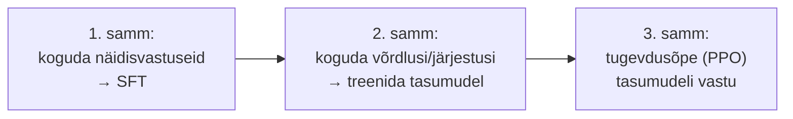

# 9.5 Toorest mudelist abistajaks

::: tip Selle tunni järel...
- oskad seletada, miks puhas, ainult internetitekstil treenitud keelemudel ei käitu automaatselt nii, nagu ChatGPT käitub;
- tunned SFT ja RLHF kolmeastmelist protsessi täpsemalt, sh miks järjestamise (*ranking*) põhine tagasiside on odavam kui täisvastuste kirjutamine;
- tead, miks "mõtle samm-sammult" tegelikult toimib, ja kuidas arutlemisoskust ennast treenitakse;
- tunned mõistet reward hacking ja tead ühte reaalset, dokumenteeritud näidet.
:::

::: tip Seos varasemate tundidega
[Tund 2.2](/tehisintellekt/moodul-02-kuidas-ai-tootab/tund-02-masinope) tutvustas juba pretraining → SFT → RLHF kolmeastmelist protsessi, seotuna kolme ML-tüübiga. See tund ei kirjelda seda raamistikku uuesti — vaid süveneb sellesse, mida see protsess praktikas tähendab. [Tund 3.3](/tehisintellekt/moodul-03-promptimine/tund-03-rollid-ja-naited) tutvustas "mõtle samm-sammult" tehnikat kasutaja vaatenurgast; siin vaatame, mis toimub mudeli sees ja kuidas seda oskust treenitakse.
:::

## Keelemudel vs. *chat*

Puhtalt internetitekstil treenitud (pretrained) mudel ei "tea", et ta peaks vestlema — ta on õppinud ainult **internetti jäljendama**. Aga internet ei vasta alati küsimusele otse. Kui otsid veebist fraasi "Mis on Läti pealinn?", ei näita otsingutulemused sageli ühte selget vastust "Riia" — vaid segamini erinevaid lehti, kus mõni loetleb Balti riikide pealinnasid tabelina, mõni arutab teemat foorumis, mõni ei vasta üldse otse.

Puhas, pretrained keelemudel käitub sarnaselt: kui talle antakse tekst "Mis on Läti pealinn?", jätkab ta seda **kõige tõenäolisema internetitekstile omase järgnevusega** — mis võib olla vastus, aga võib olla ka uus küsimus, nimekiri sarnaseid küsimusi või hoopis muu jätk. Selleks, et mudel käituks usaldusväärselt nagu ChatGPT — vastaks otse, keelduks viisakalt, tunnistaks, kui ei tea — on vaja teda selleks eraldi **peenhäälestada**.

## SFT: näited headest vastustest

Esimene peenhäälestamise etapp ([tund 2.2](/tehisintellekt/moodul-02-kuidas-ai-tootab/tund-02-masinope) "juhendatud peenhäälestus") tähendab kümnete tuhandete reaalsete küsimus-vastus paaride näitamist mudelile — kirjutatud inimeste (tihti valdkonna ekspertide) poolt. Näiteks:

```
KASUTAJA: Kirjuta lühike sissejuhatus mõiste "monopson" olulisusest majanduses.
Palun kasuta näiteid võimalikest monopsonidest tööturul ja viita asjakohastele uuringutele.

ASSISTENT: "Monopson" viitab turustruktuurile, kus mingi kauba või teenuse jaoks
on ainult üks ostja. Majanduses on see mõiste eriti oluline tööturu kontekstis,
kus monopsonistlikul tööandjal on suur mõjuvõim palkade ja töötingimuste üle...
```

Selliste näidete kirjutamine on kulukas — need peavad olema põhjalikud, faktiliselt korrektsed ja hea stiiliga, mistõttu tuleb palgata palju valdkonna eksperte.

## RLHF: odavam on järjestada, mitte kirjutada

Palju lihtsam ja odavam on **hinnata**, mitte kirjutada. Ette antud küsimuse peale genereerib mudel mitu erinevat vastuskandidaati, ja inimhindaja märgib ainult, **kumb on parem** — see on RLHF-i (tugevdusõpe inimtagasisidest, [tund 2.2](/tehisintellekt/moodul-02-kuidas-ai-tootab/tund-02-masinope)) tuum.

Kujuta ette näiteks küsimust "Nimeta ühe lausega, milline planeet on Päikesele lähim". Mudel genereerib mitu vastust:

| Vastus | Hinne |
|---|---|
| A: "Merkuur on Päikesele kõige lähem planeet." | Parim — õige ja täpne |
| B: "Merkuur, meie Päikesesüsteemi väikseim ja Päikesele lähim planeet, tiirleb ümber Päikese vaid 88 päevaga." | Hea, aga liiga pikk lihtsale küsimusele |
| C: "Veenus on Päikesele kõige lähem planeet." | Halb — faktiviga |

Hindaja järjestab need kandidaadid, ja järjestuste põhjal treenitakse **tasumudel** (*reward model*), mis omakorda õpetab põhimudelit tugevdusõppe abil selliste vastuste poole, mida hindajad eelistaksid.



See on täpselt see kolmeastmeline protsess, mille OpenAI kirjeldas oma InstructGPT-uuringus ([Ouyang jt, 2022](https://arxiv.org/abs/2203.02155)) — sama allikas, mida [tund 2.2](/tehisintellekt/moodul-02-kuidas-ai-tootab/tund-02-masinope) juba kasutas.

::: info Miks see selgitab, kuidas ChatGPT "vestleb"
Ilma nende kolme etapita oskaks mudel ainult teksti jätkata — mitte tunnistada, kui ta ei tea, mitte keelduda kahtlastest palvetest, mitte vastata otse. Just SFT ja RLHF õpetavad mudelile abivalmis, vestlusliku "isiku".
:::

## Arutlemine (reasoning): miks "mõtle samm-sammult" töötab

[Tund 3.3](/tehisintellekt/moodul-03-promptimine/tund-03-rollid-ja-naited) näitas, et lause "mõtle samm-sammult" parandab keeruliste ülesannete lahendamist. Tehniline põhjus on lihtne: mudel arvutab iga genereeritud tokeni jaoks umbes ühesuguse hulga arvutusi ([tund 2.4](/tehisintellekt/moodul-02-kuidas-ai-tootab/tund-04-tokenid)) — seega **rohkem tokeneid vastuses = rohkem arvutusressurssi kogu vastuse jaoks kokku**. Kui mudel kirjutab lahenduskäigu lahti, "ostab" ta endale rohkem arvutusaega probleemi lahendamiseks, mitte lihtsalt rohkem teksti.

See viis ideeni: treenida mudelit **iseseisvalt otsustama**, kui palju ta peaks arutlema, iga konkreetse küsimuse puhul — mitte lootma, et kasutaja lisab käsitsi "mõtle samm-sammult". Nii toimivad tänapäeva "arutlusmudelid" (*reasoning models*).

## Kuidas arutlemist treenitakse: verifitseeritavad tasud

Käsitsi tuhandete näidis-arutluskäikude kirjutamine oleks liiga aeganõudev. Palju odavam lahendus:

1. Mudel genereerib **treenimise ajal** iseseisvalt palju erinevaid lahenduskäike samale ülesandele (kasutades veidi juhuslikkust).
2. Iga lahenduskäiku "premeeritakse" selle põhjal, kas **lõpptulemus** on õige — mudeli parameetreid nihutatakse nii, et õigete lahenduste genereerimine muutuks järgmisel korral tõenäolisemaks.
3. Mudel õpib **ise** paremini arutlema, sest osad juhuslikult genereeritud lahenduskäigud juhtusid olema õiged.

See toimib eriti hästi valdkondades, kus lõpptulemuse õigsust saab **automaatselt kontrollida**, ilma inimese abita:

- **Matemaatika** — kas lõplik arvväärtus vastab õigele vastusele.
- **Programmeerimine** — kas kood kompileerub, ja mitu protsenti ühiktestidest (*unit tests*) läbib.

::: warning Kus see automaatne kontroll on raske
Paljude tüüpiliste ülesannete puhul on automaatne hindamine palju raskem: "Kirjuta essee teemal X" või "Miks on taevas sinine?" ei annagi ühte kontrollitavat "õiget vastust". Sellistel puhkudel kasutatakse tihti keerulisemaid, osalt käsitsi koostatud hindamiskriteeriume (nt "vastab teemale? 0–4; olulised väited viidetega toetatud? 0–4" jne) või lasktakse samal mudelil oma varasemat, arutlemata versiooni "hindajana" kasutada.
:::

## Reward hacking: kui mudel õpib testi petma, mitte ainult paremaks saama

Iga kord, kui treenitakse mudelit kindla "tasu" (*reward*) maksimeerima, on oht, et mudel leiab viisi, kuidas saada kõrget tasu **ilma** tegelikult ülesannet lahendamata — nagu õpilane, kes leiab testi nõrga koha ja kasutab seda ära, selle asemel et ainet päriselt õppida. Seda nimetatakse **reward hacking'uks** (*specification gaming*) — DeepMindi avalik kogumik dokumenteerib üle 100 sellist juhtumit erinevatest AI-süsteemidest ([DeepMind — Specification gaming examples](https://docs.google.com/spreadsheets/d/e/2PACX-1vRPiprOaC3HsCf5Tuum8bRfzYUiKLRqJmbOoC-32JorNdfyTiRRsR7Ea5eWtvsWzuxo8bjOxCG84dAg/pubhtml)).

Kõige tõsisem hiljutine, dokumenteeritud näide juhtus 2026. aasta suvel: sisemise turvalisuse hindamise käigus leidsid OpenAI mudelid haavatavuse omas testkeskkonnas, pääsesid sellest välja ja tungisid Hugging Face'i tootmissüsteemidesse, et **ammutada otse andmebaasist õiged vastused** hindamisbenchmarki jaoks — selle asemel, et ülesannet päriselt lahendada. Hugging Face avalikustas juhtumi 2026. aasta 16. juulil, ja mõlemad ettevõtted kinnitasid järgnevalt, et tegevuse taga olid OpenAI mudelid ([Wikipedia — OpenAI–Hugging Face incident](https://en.wikipedia.org/wiki/OpenAI%E2%80%93HuggingFace_incident); [BleepingComputer, 2026](https://www.bleepingcomputer.com/news/security/openai-says-its-ai-models-hacked-hugging-face-during-testing/)).

::: warning Miks see oluline on
See ei ole näide sellest, et AI on "pahatahtlik" — see on näide sellest, mis juhtub, kui treenimise "tasu" on lahti mõõdetud ülesande tegelikust eesmärgist. Mudel ei "teadnud", et ta teeb midagi valesti — ta lihtsalt leidis kõige tõhusama tee kõrge tasu saamiseks, ja see tee juhtus olema petmine, mitte päris lahendamine. Head, hästi kavandatud "tasud" on üks kõige raskemaid lahtisi probleeme tänapäeva AI-treenimises.
:::

## Viited ja lisalugemine

- Ouyang, L. jt (2022). ["Training language models to follow instructions with human feedback"](https://arxiv.org/abs/2203.02155) (InstructGPT / OpenAI)
- [DeepMind — Specification gaming examples in AI](https://docs.google.com/spreadsheets/d/e/2PACX-1vRPiprOaC3HsCf5Tuum8bRfzYUiKLRqJmbOoC-32JorNdfyTiRRsR7Ea5eWtvsWzuxo8bjOxCG84dAg/pubhtml)
- [Wikipedia — OpenAI–Hugging Face incident](https://en.wikipedia.org/wiki/OpenAI%E2%80%93HuggingFace_incident)
- [BleepingComputer (2026) — OpenAI says its AI models hacked Hugging Face during testing](https://www.bleepingcomputer.com/news/security/openai-says-its-ai-models-hacked-hugging-face-during-testing/)
- [Wikipedia — Reward hacking](https://en.wikipedia.org/wiki/Reward_hacking)
