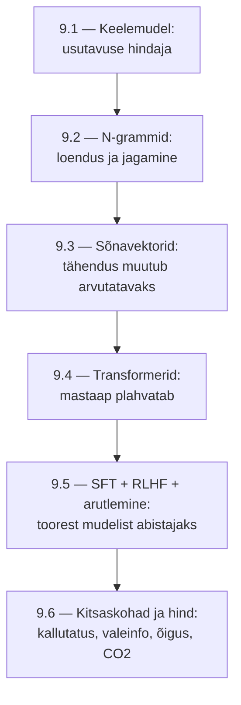

# 9.7 Kokkuvõte

::: tip Selle tunni järel...
- oskad kirjeldada mooduli 9 läbivat joont ühe lühikese raamistikuna.
:::

## Mooduli kokkuvõte

Läbiv joon: iga järgmine sammuke lahendas eelmise piirangu, aga tekitas uue. N-grammid lahendasid "kuidas arvutada usutavust", aga ei oskasid sarnaseid sõnu seostada — sõnavektorid lahendasid selle. Sõnavektoritel põhinevad mudelid olid piiratud kontekstiga — Transformerid lahendasid selle mastaabiga. Suur mastaap tõi zero/few-shot võimekuse, aga toores mudel ei "vestle" — SFT ja RLHF lahendasid selle. Ja isegi kõige võimekam, hästi peenhäälestatud mudel jääb ikka kallutatud, kuluka ja mõnikord valeinfot genereeriva tööriistaga, mille treenimine maksab reaalset raha ja reaalset CO2 heidet.

See on sama muster, mis kogu kursuses korduvalt esineb ([tund 8.5](/tehisintellekt/moodul-08-rakendamine-ja-moju/tund-05-kokkuvote)): tehnoloogia areng ei kõrvalda riske, vaid nihutab neid — iga lahendus vajab omakorda teadlikku kasutamist ja järelevalvet.

Terve kursuse tervikpilti vaata [tunnist 8.5](/tehisintellekt/moodul-08-rakendamine-ja-moju/tund-05-kokkuvote).

## Viited ja lisalugemine

- [Tehisintellekt — teema ülevaade ja kõik moodulid](/tehisintellekt/)
- [Tund 8.5 — Kokkuvõte: AI kasutuselevõtu tervikpilt](/tehisintellekt/moodul-08-rakendamine-ja-moju/tund-05-kokkuvote)
