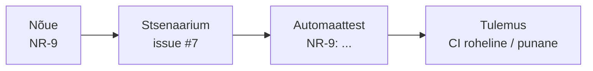

# 1. Nõuetest testiplaanini

::: info Õpiväljund
Pärast tundi oskad muuta nõuded testitavaks, koostada lühikese testiplaani, kirjutada Given/When/Then stsenaariumid ja siduda need nõuetega jälgitavuse maatriksis (HK 3.1).
:::

Esmaspäeva hommikul saabub Anult e-kiri:

> Tere! Meil on töötubadele vaja registreerimist. Lapsed saavad soodustust ja eakatele ka, suurematele gruppidele samuti. Kui inimene tühistab, siis ta saab raha tagasi, aga mitte alati. Kui töötuba on täis, siis rohkem ei registreeru. Loodame, et see on valmis kahe nädala pärast.

Reet loeb kirja ja ütleb: "Selge, hakkan peale." Tiit küsib Kaarelilt: "Kuidas me teame, et see on valmis?"

Kaarel loeb kirja uuesti. Ta mõistab, et **ei oska seda veel testida**. Mis on "lapsed"? Kui palju soodustust? Mida tähendab "mitte alati"? Test ei saa kontrollida lauset, mille tähendust keegi ei tea.

## Nõue peab olema testitav

Kaarel teeb Anule ja Reedale kolm küsimust ja kirjutab vastused üles. Näiteks lause "lapsed saavad soodustust" muutub nii:

| E-kirjas | Küsimus | Nõue |
| --- | --- | --- |
| "Lapsed saavad soodustust" | Mis vanusest ja kui palju? | **NR-2.** Vanuses 7-17 maksab osaleja 50% põhihinnast, 65-aastane ja vanem 80%, ülejäänud 100% |
| "Suurematele gruppidele samuti" | Mitu inimest on "suur"? | **NR-4.** 5-9 osalejat 10%, 10-20 osalejat 15% |
| "Mitte alati" raha tagasi | Millal ei saa? | **NR-12.** 7 või rohkem päeva enne 100%, 2-6 päeva enne 50%, vähem kui 2 päeva enne 0. Maksmata registreeringule 0, korraldaja tühistusel 100% |

**Testitav nõue** on:

| Omadus | Halb | Hea |
| --- | --- | --- |
| **Ühene** | "Lapsed saavad soodustust" | "Vanuses 7-17 on hind 50%" |
| **Mõõdetav** | "Süsteem on kiire" | "Vastus on alla 500 ms" |
| **Täielik** | Ei ütle, mis juhtub piiril | Ütleb, mis juhtub täpselt 7-aastasega ja 6-aastasega |
| **Üks asi** | "Hind ja kinnitus on õiged" | Kaks eraldi nõuet |

Kõik nõuded on kirjas praktikumirepo failis `spetsifikatsioon/nouded.md` (NR-1 kuni NR-14). **Selle faili põhjal tehakse kõik testid.** Kui nõue ja kood on erinevad, ei ole automaatselt kood õige: see on avastatud küsimus, mida Kaarel Reedale esitab.

## Testiplaan

Tiit tahab teada, **mida Kaarel teeb ja millal on valmis**. See on testiplaani ülesanne. **Testiplaan** (*test plan*) on lühike dokument, mis kirjeldab testimise eesmärki, skoopi, lähenemist, ressursse ja ajakava. ISTQB õppekava (peatükk 5) ja [standard ISO/IEC/IEEE 29119-3](/testimise-alused/kohtumine-09-standardid) kirjeldavad selle sisu.

Rannamõisa testiplaan mahub ühele lehele:

| Osa | Küsimus | Rannamõisa näide |
| --- | --- | --- |
| **Skoop** | Mida testime ja mida mitte? | Sees: hind, registreerimine, tühistamine, töötoa olekud. Väljas: e-kirja välimus, makseteenus |
| **Riskid** | Mis läheb kõige valjemini valesti? | Vale hind, topeltregistreerimine, täis töötuppa registreerimine |
| **Lähenemine** | Mis tasemel, millise meetodi ja vahendiga? | Ühiktestid hinnale, integratsioonitestid HTTP-le, käsitsi uurimine |
| **Kriteeriumid** | Millal alustame ja millal oleme valmis? | Valmis, kui kõik P1 stsenaariumid läbivad ja avatud kriitilisi vigu pole |
| **Keskkond ja andmed** | Mida on vaja? | Rakendus mälus, väljamõeldud töötoad |
| **Ajakava ja vastutajad** | Kes mida millal? | Kaarel testib, Reet parandab, Tiit võtab vastu |

Plaan ei ole kohustus testida kõike. See on **põhjendatud otsus, mida testida ja mida mitte**. [Põhimõte 2 (täielik testimine on võimatu)](/testimise-alused/kohtumine-04-pohimotted) on siin: kõike ei saa testida, seega vali risk järgi.

### Risk: kuhu aega panna

Kaarel hindab iga riski kahe skaalaga. **Risk = tõenäosus x mõju.**

| Risk | Tõenäosus | Mõju | Prioriteet |
| --- | --- | --- | --- |
| Hind on vale (piiridel) | Kõrge | Kõrge (raha ja usaldus) | Kõrge |
| Täis töötuppa registreerub liiga palju inimesi | Keskmine | Kõrge | Kõrge |
| Tagasimakse arvutus vale | Keskmine | Kõrge | Kõrge |
| Vigane e-posti aadress | Kõrge | Madal | Keskmine |
| Töötoa pealkirjas on kirjaviga | Madal | Madal | Madal |

Esimesed kolm saavad kõige rohkem teste. Viimase puhul piisab pilguheitmisest.

## Teststsenaarium

Plaan ütleb, **mida** testida. **Teststsenaarium** ütleb, **kuidas** ühte asja kontrollida. Kaarel kasutab kolme sammu: **Given** (algseis), **When** (tegevus), **Then** (oodatud tulemus). See vorm tuleb käitumispõhisest arendusest (BDD) ja on loetav ka Anule.

| Väli | Näide |
| --- | --- |
| **Issue** | #1, pealkiri `[TS] Registreerimine kahe osalejaga` |
| **Nõue** | NR-8 |
| **Given** | Töötuba on avatud ja vabu kohti on 8 |
| **When** | Kati registreerub kahe osalejaga (34-aastane ja 9-aastane) |
| **Then** | Registreering õnnestub, hind on 37,50 ja vabu kohti jääb 6 |
| **Prioriteet** | P1 |

Hind 37,50 ei ole tulnud koodist, vaid **nõuetest**: täiskasvanu 25 € ja laps 50%, kokku 25 + 12,50.

Hea stsenaarium:

- viitab **nõudele** (ei ole tühja `NR-` välja);
- on **konkreetne**: täpsed arvud, mitte "mingi hind";
- kontrollib **ühte asja** (kui see kukub, on selge, miks);
- kasutab **oodatud tulemust nõudest**, mitte seda, mida kood praegu teeb.

Üks nõue annab tavaliselt **mitu** stsenaariumi:

| Liik | NR-9 (täis töötuba) näide |
| --- | --- |
| Õnnestumine | Registreerumine, kui kohti on piisavalt |
| Viga | Registreerumine, kui kohti on liiga vähe |
| Piir | Täpselt viimased kohad mahuvad ära |

Kolm liiki katavad kõige rohkem vigu. Üks stsenaarium nõude kohta on peaaegu alati liiga vähe.

## Jälgitavus

Kuidas Kaarel teab, et ükski nõue ei jäänud testimata? Ta peab saama alati vastata kahele küsimusele: **milliseid teste see nõue on kaetud?** ja **mis nõuet see test kontrollib?** Seda nimetatakse **jälgitavuseks** (*traceability*).



Päris töös ei hoita seda tabelit käsitsi (see vananeb kiiresti). Jälgitavus tekib **töövoost**:

| Seos | Kuidas see tekib |
| --- | --- |
| Nõue ⇄ stsenaarium | Stsenaarium on GitHubi **issue**, mille vormis on väli "Nõue" (nt NR-9). Otsing `NR-9` issue'de seast annab kõik stsenaariumid |
| Stsenaarium ⇄ test | **Testi nimi algab nõude numbriga** (`NR-9: täis töötuba`) ja võib lõppeda issue numbriga (`(#7)`) |
| Test ⇄ tulemus | **CI** (GitHub Actions) käivitab testid iga muudatusega |

Tühi tulemus otsingul ("NR-11 ei leia ühtegi testi") ütleb: **seda nõuet ei ole testitud**. Nõude katvust saad kohtumisel 8 arvutada ühe käsuga: `grep -rn "NR-11" harjutused`.

## Töö GitHubis

Kaarel ei kirjuta stsenaariume ega vigu Wordi dokumenti, vaid **GitHubi issue'dena**. Praktikumirepos on kolm **issue vormi**. Kui vajutad **Issues → New issue**, saad valida:

| Vorm | Milleks | Mida see automaatselt lisab |
| --- | --- | --- |
| **Testistsenaarium** | Üks Given/When/Then stsenaarium | Pealkirja eesliide `[TS]`, rippmenüüd nõude, liigi ja prioriteedi jaoks |
| **Veaaruanne** | Leitud viga (kohtumine 10) | Pealkirja eesliide `[VIGA]`, silt `bug`, väljad sammude, oodatu, tegeliku, tõsiduse ja prioriteedi jaoks |
| **Küsimus nõude kohta** | Ebaselge nõue | Pealkirja eesliide `[KÜSIMUS]`, silt `question` |

Issue'l on **staatus**: avatud või suletud. Suletud võib olla põhjusega "completed" või "not planned" ja vaikesildid `duplicate`, `invalid` ja `wontfix` aitavad märkida, miks.

## Praktikum

Sul on 55-60 minutit. Testiplaani ja märkused kirjuta oma **päevikusse**, stsenaariumid ja küsimused GitHubi Issues alla.

### 1. Loo oma repo

1. Ava õpetaja antud praktikumirepo GitHubis ja vajuta **Use this template → Create a new repository**.
2. Vali nähtavuseks **Private**.
3. Lisa õpetaja kaastöötajaks (**Settings → Collaborators**).
4. Klooni oma repo ja käivita `npm install`.
5. Ava **Issues → New issue → Päevik**, loo issue ja kinnita see (**Pin issue**). See on sinu päevik kogu mooduli jooksul (vt [sissejuhatus](./sissejuhatus#paevik)).

### 2. Loe nõuded läbi

Ava `spetsifikatsioon/nouded.md`. Leia kolm kohta, mis ei ole sinu arvates veel ühesed, ja ava iga kohta kohta issue vormiga **Küsimus nõude kohta**. Näiteks: mis juhtub, kui registreeringus on 6-aastane laps?

### 3. Proovi rakendust käsitsi

Käivita rakendus ja proovi API-d käsitsi (Postmani kasutame kohtumisel 2).

```bash
npm start
```

Teises terminalis:

```bash
curl -s localhost:3000/health

curl -s -X POST localhost:3000/workshops \
  -H "Content-Type: application/json" \
  -d '{"title":"Keraamika","capacity":8,"basePrice":25,"startsAt":"2030-06-20T10:00:00Z"}'

curl -s -X POST localhost:3000/workshops/1/publish

curl -s -X POST localhost:3000/workshops/1/registrations \
  -H "Content-Type: application/json" \
  -d '{"email":"kati@example.ee","ages":[34,9],"member":false}'
```

Mida vastus ütleb? Kas hind on 37,5? Kas `GET localhost:3000/workshops/1` näitab kuus vaba kohta?

### 4. Kirjuta testiplaan

Lisa päevikusse kommentaar **Testiplaan** ja kasuta ülaltoodud kuut osa pealkirjadena (skoop, riskid, lähenemine, kriteeriumid, keskkond ja andmed, ajakava ja vastutajad). Plaan on ühe lehe mahus. Nõuded:

- skoopis on vähemalt kolm asja **sees** ja kaks **väljas**, igaühel põhjus;
- riskides on vähemalt viis riski tõenäosuse ja mõjuga;
- lähenemises on igal tasemel meetod (vahendite kohad võid jätta kohtumiseni 2);
- valmisoleku kriteerium on mõõdetav (mitte "kui tundub korras").

### 5. Kirjuta stsenaariumid issue'dena

Ava issue vormiga **Testistsenaarium** vähemalt **14** korda. Nõuded:

- iga nõuet NR-1 kuni NR-14 katab vähemalt üks stsenaarium (rippmenüüst vali nõue);
- vähemalt kolm on **piirid** (kõige rohkem vigu tekib piiril) ja vähemalt viis **veaolukorda**;
- iga stsenaariumil on prioriteet (P1, P2 või P3);
- oodatud tulemused on arvutatud **nõuetest**, mitte rakenduse vastusest.

Kirjuta lühidalt: üks stsenaarium on kolm rida. Issue on selle stsenaariumi **elutsükkel**: hiljem lisad siia käsitsi läbimise tulemuse, automaattesti nime (`NR-x: ...`) ja suled issue, kui stsenaarium on läbitud.

### 6. Käivita viis stsenaariumi käsitsi

Vali viis P1 stsenaariumi, käivita need rakenduse vastu ja kirjuta tulemus (läbib / kukub / ootamatu) issue'le **kommentaarina**. Läbinud stsenaarium sulge (see on tema elutsükli lõpp, kui automaattesti ei tule; kui tuleb, sulged kohtumistel 3-7). Kui mõni stsenaarium annab teise tulemuse kui nõue ütleb, ava issue vormiga **Veaaruanne** (vt [Testimise alused, kohtumine 3](/testimise-alused/kohtumine-03-vigade-tekkimine)) ja kirjuta üles, mida täpselt tegid ja mida said.

### 7. Kontrolli jälgitavust

Otsi issue'de seast iga nõude number (nt `NR-9`). Kas mõni nõue jäi ilma stsenaariumita? Täienda.

## Tõendid päevikusse

Lisa oma [päevikusse](./sissejuhatus#paevik) kommentaar **Kohtumine 1** ja kirjuta sinna:

- [ ] Oma privaatne repo, õpetaja on kaastöötaja
- [ ] Kommentaar **Testiplaan**: ühe lehe mahus, kõik osad täidetud, riskid põhjendatud
- [ ] Vähemalt 14 `[TS]` issue'd, iga nõue NR-1...NR-14 on kaetud
- [ ] Vähemalt viis stsenaariumi on käsitsi käivitatud ja tulemus on issue kommentaaris
- [ ] Kolm `[KÜSIMUS]` issue'd nõuete kohta

## Refleksioon

1. Millist stsenaariumi oli kõige raskem kirjutada ja miks?
2. Kas leidsid nõuetest koha, mida ei saanud testida? Mida sa Anult küsiksid?
3. Miks me panime stsenaariumi oodatud hinna **nõuetest**, mitte rakenduse vastusest?

## Allikad

- [ISTQB Certified Tester Foundation Level Syllabus v4.0](https://istqb.org/certifications/certified-tester-foundation-level-ctfl-v4-0/), peatükk 5: testitegevuste juhtimine (testiplaan, riskid, valmisoleku kriteeriumid).
- ISO/IEC/IEEE 29119-3:2021, testidokumentatsioon (testiplaani sisu). Vt [Testimise alused, kohtumine 9](/testimise-alused/kohtumine-09-standardid).
- Dan North, [Introducing BDD](https://dannorth.net/blog/introducing-bdd/): Given/When/Then vormi päritolu.
- Rannamõisa Käsitöökeskus, Anu e-kiri, nõuded NR-1...NR-14 ja kõik hinnad on väljamõeldud.
