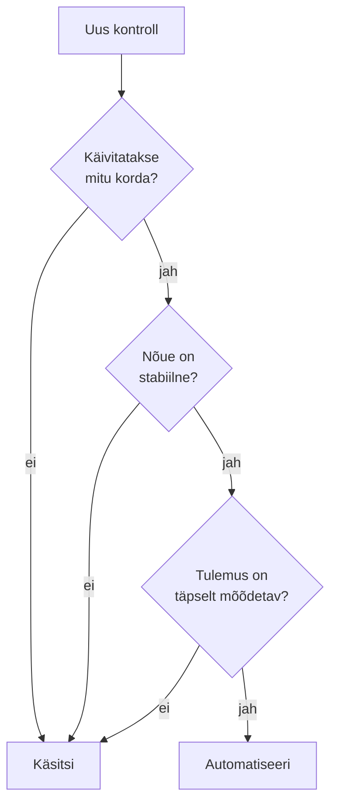

# 2. Automatiseerida või mitte: vahendid ja keskkond

::: info Õpiväljund
Pärast tundi oskad põhjendada, millal tasub testi automatiseerida, valida ülesandele sobiva vahendi, seadistada praktikumikeskkonna ja lugeda testi tulemust (HK 3.3).
:::

Reet saadab uue versiooni. Kaarel käivitab oma stsenaariumid käsitsi: töötuba luua, avada, registreerida, tühistada. Kokku kulub 40 minutit. Kaks päeva hiljem saadab Reet uue versiooni, sest parandas ühe vea. Kaarel teeb kõik uuesti. Neljapäeval veel kord.

Tiit küsib: "Kas arvuti ei võiks seda teha?"

Kaarel arvutab paberil:

| | Käsitsi | Automaattest |
| --- | --- | --- |
| Ühe käivituse aeg | 40 min | peaaegu 0 (sekundid) |
| Käivitusi nädalas | 4 | 4 |
| Aeg nädalas | 160 min | 20 min (testide hooldus) |
| Alginvesteering | 0 | 8 tundi = 480 min |

Automaattest säästab nädalas 160 - 20 = 140 minutit. Alginvesteering 480 min tasub end ära **umbes 3,4 nädalaga** (480 / 140). Need arvud on väljamõeldud, aga mõtteviis on päris: **automatiseerimine on investeering, mis tasub end ära siis, kui testi käivitatakse palju kordi.**

## Millal automatiseerida

| Sobib automatiseerida | Ei sobi (veel) |
| --- | --- |
| Test käivitatakse **sageli** (iga muudatuse järel) | Ühekordne kontroll |
| Nõue on **stabiilne** | Nõue muutub iga päev |
| Tulemus on **kindel** (arv, staatus, tekst) | "Kas see näeb hea välja?" (hinnang) |
| Vaja **kiiret tagasisidet** | **Uurimine**: otsid vigu, mida sa veel ei tea |
| Palju **sisendi kombinatsioone** (piirid, soodustused) | Katsetus, kui rakendus ei ole veel valmis |

[Testimise aluste kohtumisel 6](/testimise-alused/kohtumine-06-staatiline-ja-dunaamiline) kohtusid testipüramiidiga: palju kiireid ühikteste, vähem aeglasi kõrgema taseme teste. Sama mõte kehtib automatiseerimisel: **ühikteste on odavaim automatiseerida ja need annavad kiireima tagasiside.**

### Automatiseerimise kasud ja riskid

ISTQB õppekava (peatükk 6, testivahendid) nimetab mõlemad pooled.

| Kasud | Riskid |
| --- | --- |
| Säästab aega korduvatel testidel | **Liiga suured ootused** ("automaat leiab kõik vead") |
| Testid on **järjepidevad** (sama samm iga kord) | **Hoolduse alahindamine**: kui rakendus muutub, muutuvad ka testid |
| Tulemused on objektiivsed, ilma inimliku eksimuseta | Automaat leiab ainult seda, mida talle öeldi otsida |
| Annab tagasisidet kiiresti | Vigane test annab **valesid** rohelisi tulemusi |

Viimane rida on oluline. Test, mis alati läbib, on halvem kui puuduv test, sest see tekitab **valetunde**. Sellest räägime kohtumisel 8.



## Vahendite kaart

Kaarel kasutab selles moodulis kolme põhivahendit. Need vastavad erinevatele küsimustele.

| Vahend | Liik | Mida teeb | Kus kasutame |
| --- | --- | --- | --- |
| **Vitest** | Testiraamistik | Käivitab testid, pakub `describe`, `it`, `expect`, mock-funktsioone (`vi.fn()`) ja katvuse mõõtmist | Kohtumised 3-8, 10 |
| **Supertest** | Teek | Saadab HTTP päringuid rakendusele **testi seest**, ilma et peaks serverit käsitsi käivitama | Kohtumised 6, 7, 10 |
| **Postman** | Graafilise liidesega API tööriist | Saadab päringuid, kontrollib vastuseid, salvestab kollektsioonid. **Newman** käivitab kollektsiooni käsurealt | Kohtumised 2, 9 |
| `curl` | Käsurea tööriist | Üks päring kiire proovimiseks | Kohtumine 1 |

Vitest ja Supertest töötavad koos: Vitest käivitab testi ja Supertest teeb selle sees HTTP päringu. Postman on **eraldi vahend**, mida kasutad ilma koodi kirjutamata ja mis kontrollib rakendust väljastpoolt, nagu päris klient. Sealt tuleb [kriteeriumi HK 3.3](./sissejuhatus) nõue kasutada vähemalt kahte erinevat vahendit: **Vitest** (koodis kirjutatud testid) ja **Postman** (graafiline testimine).

Valik sõltub küsimusest:

| Küsimus | Vahend |
| --- | --- |
| Kas hinnafunktsioon arvutab õigesti? | Vitest (ühiktest) |
| Kas HTTP päring `POST /workshops` annab 201? | Vitest + Supertest |
| Kas API vastab piisavalt kiiresti? | Postman + Newman |
| Mis juhtub, kui ma proovin midagi uudset? | Postman või `curl` (uurimine) |

## Testi anatoomia

Vitest testil on kolm osa: **Arrange** (ettevalmistus), **Act** (tegevus), **Assert** (kontroll).

```js
it("täiskasvanu (30) maksab täishinna", () => {
  const factor = participantFactor(30); // Act: kutsu funktsiooni
  expect(factor).toBe(1);               // Assert: kontrolli tulemust
});
```

Arrange on siin lihtne: sisend (30) on otse kutses. Keerulisemates testides loob Arrange töötoa, kasutaja ja mockid.

Iga test peab olema:

- **sõltumatu**: ei sõltu teisest testist ja töötab ka üksi;
- **korratav**: annab sama tulemuse igal käivitusel;
- **kiire**: ühiktest võtab millisekundeid;
- **selge**: kui kukub, on teada, mis läks valesti.

### Tulemuse lugemine

Praktikumirepos on ülesanded, mis tahtlikult kukuvad:

```js
it("lapse hind", () => {
  expect.fail("Test on kirjutamata");
});
```

Kukkunud test näitab faili, `describe` ja `it` nime ning vea teksti:

```text
FAIL  harjutused/kohtumine-03/calculatePrice.test.js > participantFactor > lapse hind
AssertionError: Test on kirjutamata
```

Vea tekst ütleb, **mida ootasid ja mida said**. Kui test kukub, loe alati kõigepealt seda, mitte ära muuda testi uuesti läbivaks.

## Testija töövoog GitHubis

Testid ei ela tühjuses. Päris tiimis käib iga muudatus läbi töövoo, kus testid on üks osa:

| Samm | Mida tehakse | Kus |
| --- | --- | --- |
| 1. **Ülesanne** | Nõue või viga on kirjeldatud ticketina | GitHub **Issue** |
| 2. **Haru** | Töö tehakse omaette harus, mitte põhiharus | `git switch -c nimi` |
| 3. **Muudatus ja test** | Kood ja test koos | Redaktor ja `npm test` |
| 4. **Pull request** | Kirjeldus ütleb, mida ja miks, ning viitab issue'le (`Closes #12`) | GitHub **Pull request** |
| 5. **CI** | Testid käivituvad automaatselt | **GitHub Actions** |
| 6. **Ülevaatus** | Teine inimene loeb muudatuse läbi | PR kommentaarid |
| 7. **Ühendamine** | CI roheline ja ülevaatus tehtud, siis liidetakse põhiharuga | Merge |

Arendaja töö ei piirdu testide kirjutamisega. Ta võtab ülesandeid, selgitab nõudeid, kirjutab koodi ja dokumentatsiooni, teeb ülevaatusi, uurib vigu ja hindab tööde mahtu. **Testija ja arendaja kasutavad sama töövoogu**: veaaruanne on lihtsalt issue, mille arendaja võtab ja parandab (kirjutab kukkuva testi, parandab, avab PR-i).

**CI** (*continuous integration*) on automaat, mis käivitab testid iga muudatusega. See on päris töös kõige olulisem "testiaruanne": rohelise või punase märgina näed kohe, kas kõik töötab. Praktikumirepos on selleks fail `.github/workflows/test.yml`. See käivitub iga `git push`-iga ja jookseb GitHubi vahekaardil **Actions**.

Alguses on CI **punane**, sest ülesanded kukuvad. See on oodatud algseis. Iga ülesanne, mille sa päris testiks teed, viib selle rohelise poole.

## Praktikum

Sul on 55-60 minutit. Tulemused kirjuta oma päevikusse.

### 1. Seadista keskkond

Oma repo lõid kohtumisel 1. Klooni see (kui sa ei ole veel teinud) ja käivita testid:

```bash
node -v       # peab olema 20 või uuem
git clone <sinu repo aadress>
cd <sinu repo kaust>
npm install
npm test
```

Alguses peaks umbes **13 testi läbima ja 49 kukkuma** (näited läbivad, ülesanded kukuvad). Kirjuta üles täpne tulemus. Kui see on teine, uuri, miks.

Seejärel tee väike muudatus (nt lisa `README.md`-sse üks rida), `git add`, `git commit` ja `git push`. Ava GitHubis oma repo vahekaart **Actions** ja vaata, kuidas testid seal käivituvad. Kas tulemus on sama mis sinu arvutis?

### 2. Käivita testid eri viisidel

```bash
npm test -- harjutused/kohtumine-06                 # üks kaust
npm test -- harjutused/kohtumine-06/health.test.js  # üks fail
npm test -- harjutused/kohtumine-03 -t "täiskasvanu" # üks test nime järgi
npm run test:watch                                    # käivitub uuesti pärast muudatust (Ctrl+C lõpetab)
```

Mida näed iga käsu järel? Miks on üks neist kasulik, kui testid on tuhat?

### 3. Lase testil tahtlikult kukkuda

Ava `harjutused/kohtumine-06/health.test.js` ja muuda oodatud vastus `{ status: "ok" }` millekski muuks. Käivita. Loe vea teksti ja kirjuta üles, mida see ütleb. **Pane vastus tagasi.**

### 4. Postman

1. Installi [Postman](https://www.postman.com/downloads/) (või kasuta veebiversiooni).
2. Impordi `postman/rannamoisa.postman_collection.json` ja `postman/local.postman_environment.json`.
3. Vali keskkond **Rannamõisa (local)** (muutuja `baseUrl` on `http://localhost:3000`).
4. Käivita rakendus (`npm start`) ja saada päring **Health**.
5. Käivita kogu kollektsioon Collection Runneriga ja vaata, millised kontrollid läbisid.

Kollektsioonis on päringud, mis loovad töötoa, avavad selle ja registreerivad osalejad. Iga päringu juures on **Tests** sakk, kus on lühike JavaScripti kontroll. Kirjuta üles, mida kollektsioon kontrollib ja mida mitte.

### 5. Võrdle vahendeid

Lisa päevikusse kommentaar **Vahendid** ja täida tabel oma sõnadega:

| Vahend | Mida kontrollib | Mida tema abil **ei** saa kontrollida | Millal valin selle |
| --- | --- | --- | --- |
| Vitest | | | |
| Supertest | | | |
| Postman | | | |

### 6. Otsusta, mida automatiseerida

Võta oma stsenaariumi-issue'd kohtumisest 1. Lisa igale **kommentaar** märkega **A** (automatiseerin) või **K** (jääb käsitsi) ja **põhjendusega ühe lausega**. Kui hiljem (kohtumistel 3-7) stsenaariumi automatiseerid, lisa **sama issue'sse** kommentaar testi nimega (`NR-x: ...`) ja sulge issue. Kasuta ülaltoodud otsustuspuud.

Lõpuks arvuta oma **tasuvuspunkt**: mõtle välja realistlikud arvud (mitu minutit käsitsi, mitu korda nädalas, kui kaua teste kirjutad) ja arvuta, mitme nädalaga see tasub end ära.

## Tõendid päevikusse

Lisa oma [päevikusse](./sissejuhatus#paevik) kommentaar **Kohtumine 2** ja kirjuta sinna:

- [ ] Esimese `npm test` käivituse tulemus (läbis ja kukkus)
- [ ] Märkused testi tahtliku kukutamise kohta (mida vea tekst ütles)
- [ ] Postmani kollektsiooni käivituse tulemus (ekraanitõmmis või kirjeldus)
- [ ] Vahendite võrdlus (Vitest, Supertest, Postman)
- [ ] Stsenaariumide A/K kommentaarid põhjendustega (issue'des) ja tasuvuspunkti arvutus
- [ ] GitHub Actions vahekaardi märge (kas CI tulemus on sama mis kohalik)

## Refleksioon

1. Millal sa **ei** automatiseeriks, kuigi saaksid?
2. Miks ei asenda Postman Vitesti ega Vitest Postmani? Mida kumbki annab, mida teine ei anna?
3. Mida tähendab "vigane test annab valeid rohelisi tulemusi" ja kuidas seda vältida?

## Allikad

- [ISTQB Certified Tester Foundation Level Syllabus v4.0](https://istqb.org/certifications/certified-tester-foundation-level-ctfl-v4-0/), peatükk 6: testivahendid (automatiseerimise kasud ja riskid).
- [Vitest dokumentatsioon](https://vitest.dev/guide/): käsurea valikud ja `describe`/`it`/`expect`.
- [Supertest](https://github.com/ladjs/supertest): HTTP testimise teek Node.js rakendustele.
- [Postman dokumentatsioon](https://learning.postman.com/docs/): kollektsioonid ja testid.
- Tasuvuspunkti arvud ja Rannamõisa on väljamõeldud.
