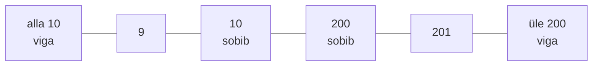

# 3. Ühiktestid ja testiandmete valik

::: info Õpiväljund
Pärast tundi oskad kirjutada Vitestiga ühikteste ning valida testiandmed ekvivalentsiklasside ja piirväärtuste meetodiga (HK 3.4, HK 3.2).
:::

Reet saadab hinnakalkulaatori ja ütleb: "Testisin ise. 30-aastane maksab 25 €, kaks 30-aastast 50 €. Kõik õige."

Kolme päeva pärast helistab Anu: "Üks ema registreeris oma 17-aastase tütre ja tütar maksis täishinda. Meie nõue ütleb, et lapsele on soodustus!"

Kaarel vaatab Reeda teste. Need kontrollivad **ainult 30-aastaseid**. Reet testis seda, mis oli lihtne, mitte seda, kus viga tekib: vanuse piir oli koodis ühe võrra nihkes.

See kohtumine õpetab, **mida testida ja miks just seda** (valik) ning **kuidas seda Vitestiga teha** (tehnika).

## Mis on ühiktest

**Ühiktest** (*unit test*) kontrollib **ühte väikest koodiosa** (tavaliselt funktsiooni) eraldi ülejäänud süsteemist. Ta ei kasuta võrku, andmebaasi ega kella. See teebki ta kiireks (millisekundid) ja täpseks: kui ühiktest kukub, on viga selles funktsioonis.

Praktikumirepo hinnafunktsioonid `participantFactor` ja `calculatePrice` on **puhtad**: sama sisend annab alati sama väljundi ja nad ei muuda midagi väljaspool. Neid on kõige lihtsam testida. Kohtumisel 4 õpid testima koodi, mis kasutab andmebaasi ja e-posti.

## Ühiktest Vitestiga

Vitest kasutab kolme põhisõna:

| Sõna | Mida teeb |
| --- | --- |
| `describe("nimi", () => {...})` | Rühmitab seotud testid |
| `it("nimi", () => {...})` | Üks test |
| `expect(väärtus).toBe(oodatud)` | Kontroll |

Näide, mis ei ole praktikumirepos: Rannamõisa kinkekaardi summa peab olema täisarv 10 kuni 200 eurot.

```js
export function validateGiftCardAmount(amount) {
  if (!Number.isInteger(amount) || amount < 10 || amount > 200) {
    throw new AppError("INVALID_AMOUNT", "Summa peab olema 10 kuni 200");
  }
  return amount;
}
```

Test:

```js
import { describe, expect, it } from "vitest";

describe("validateGiftCardAmount", () => {
  it("sobiv summa tagastatakse", () => {
    expect(validateGiftCardAmount(50)).toBe(50);
  });

  it("liiga väike summa annab INVALID_AMOUNT", () => {
    expect(() => validateGiftCardAmount(9)).toThrow(
      expect.objectContaining({ code: "INVALID_AMOUNT" }),
    );
  });
});
```

Kolm asja, mida märgata:

- **Viga kontrollitakse funktsiooni mähkimisega** (`() => ...`). Kui kirjutad `expect(validateGiftCardAmount(9))`, viskab funktsioon vea enne `expect`-i ja test kukub vales kohas.
- **`toThrow` koos `code`-iga** kontrollib, et viga on **õige**. Ainult `.toThrow()` läbiks ka siis, kui funktsioon viskaks vale vea. Vea **tekst** ei ole stabiilne (seda võib parandada), **kood** on.
- **`toBe`** sobib arvudele ja tekstidele. Objektide ja massiivide jaoks kasutatakse `toEqual`.

Mitu sarnast testi on mugav kirjutada `it.each`-iga. Iga väärtus on aruandes eraldi rida:

```js
it.each([9, 0, -5, 201])("summa %j on vigane", (amount) => {
  expect(() => validateGiftCardAmount(amount)).toThrow(
    expect.objectContaining({ code: "INVALID_AMOUNT" }),
  );
});
```

## Kust vead tekivad: ekvivalentsiklassid ja piirid

Kaarel ei saa kontrollida kõiki summasid 0-st lõpmatuseni. Tal on vaja **vähe teste, mis leiavad palju vigu**. Selleks on kaks tehnikat. [Testimise alused, kohtumine 5](/testimise-alused/kohtumine-05-meetodid) selgitas teooriat. Siin kasutad neid esimest korda ise.

### 1. Ekvivalentsiklassid

Jaga sisendid **rühmadesse, mis käituvad samamoodi**, ja võta igast rühmast **üks esindaja**. Kinkekaardi summa:

| Klass | Näide | Ootus |
| --- | --- | --- |
| Liiga väike | alla 10 (nt 3) | Viga |
| **Sobiv** | 10 kuni 200 (nt 50) | Tagastatakse |
| Liiga suur | üle 200 (nt 500) | Viga |
| Ei ole täisarv | 7,5 | Viga |
| Ei ole arv | `"50"`, `null`, `NaN` | Viga |

Viis klassi tähendab viit esindajat. See on palju vähem kui lõpmatu arv sisendeid.

### 2. Piirväärtused

Kõige rohkem vigu tekib **klassi servas**, sest seal tehakse kõige rohkem valikuid: `<` või `<=`, `>` või `>=`. Reeda viga oligi täpselt piiril.

Iga piiri kohta võta **kaks väärtust**: viimane sobiv ja esimene mittesobiv.

| Piir | Mittesobiv | Sobiv |
| --- | --- | --- |
| Alumine (10) | **9** | **10** |
| Ülemine (200) | **201** | **200** |

Lisaks tavaliselt üks väärtus vahemiku sees (nt 11 ja 199), kuid kaks piiri x kaks väärtust on põhiline.

### Miks esindaja ei piisa

Oletame, et Reet kirjutas valesti: `amount <= 10` (viimane sobiv väärtus on seetõttu 11, mitte 10). Mida kontrollid?

| Test | Tulemus vigase koodiga | Leiab vea? |
| --- | --- | --- |
| 50 (sobiv esindaja) | Tagastab 50 | **Ei** |
| 3 (vigane esindaja) | Viskab vea | **Ei** |
| 9 (piir) | Viskab vea | **Ei** |
| **10 (piir)** | Viskab vea, kuigi peaks tagastama | **Jah** |

Ainult piiriväärtus 10 avastab vea. Esindajad on vajalikud, aga **piirid on need, mis tabavad**. Seetõttu ei piisa "tavalisest" sisendist.



## Mida testi oodatav väärtus peab olema

Kui Reet kirjutab testi, kopeerib ta oodatava väärtuse sageli sellest, mida funktsioon praegu tagastab. See tähendab, et **test kinnitab koodi, mitte nõuet**. Kui kood on vale, siis test on ka vale ja ikka roheline.

**Oodatav väärtus tuleb nõudest.** Kui nõue ütleb "10 osalejat saab 15% soodustust", arvuta ise: 10 x põhihind x 0,85. Seejärel kontrolli, kas funktsioon annab sama.

## Ujukoma ja ümardamine

JavaScriptis ei ole kõik kümnendarvud täpsed:

```js
0.1 + 0.2   // 0.30000000000000004
```

Seetõttu on hinnaarvutuses oluline **ümardamine**. Rannamõisa nõue NR-7 ütleb, et hind ümardatakse sentideni, ja rakendus teebki seda. Testis võid seega võrrelda `toBe(27.03)`-ga (juba ümardatud väärtus). Kui funktsioon ei ümardaks, kasutaksid `toBeCloseTo(27.03, 2)`. Nõuded ja kood otsustavad.

## Praktikum

Sul on 55-60 minutit. Fail: `harjutused/kohtumine-03/calculatePrice.test.js`. Nõuded: NR-1 kuni NR-7 failis `spetsifikatsioon/nouded.md`.

### 1. Enne koodi: klassid ja piirid

Kirjuta päevikusse kommentaar **Klassid ja piirid** ja lisa kahe sisendi kohta lühikesed loetelud: **vanus** (NR-1, NR-2) ja **osalejate arv** (NR-3, NR-4). Igaühe kohta:

- millised **klassid** on olemas ja üks esindaja igast klassist;
- millised on **piirid** (kirjuta mõlemad väärtused iga piiri kohta);
- mis on **oodatav tulemus** igal juhul.

Piirid leia **nõuetest** (mitte koodist). Alles seejärel kirjuta testid.

### Testi nimi viitab nõudele

Iga testi nimi algab nõude numbriga (`NR-4: grupisoodus`). Nii leiad hiljem, milline test kontrollib millist nõuet (otsing `NR-4`), ja jälgitavus tekib ise. Praktikumirepo testide nimed algavad juba nõude numbriga. Kui lisad uusi teste, järgi sama.

### 2. Ülesanded failis

Fail sisaldab ühte näidet kummaski `describe`-is. Täida ülejäänud kaheksa ülesannet ühe kaupa (`npm test -- harjutused/kohtumine-03 -t "nimi"`):

| Ülesanne | Mida katta |
| --- | --- |
| lapse hind | Vanuse alumine piir (NR-1) ja piir lapse ja täiskasvanu vahel (NR-2) |
| eaka hind | Piir täiskasvanu ja eaka vahel ning vanuse ülemine piir |
| vigane vanus | Vigaste sisendite klassid (liiga väike, murdarv, tekst, `null`, `NaN`) |
| osalejate arv | Osalejate arvu piirid (NR-3) ja sisend, mis ei ole massiiv |
| grupisoodus | Kõik soodustusklassid (NR-4) ja nende piirid |
| liikmesoodus ja soodustuste koosmõju | Kolm olukorda, kus liikmesoodus ja grupisoodus annavad **erineva** tulemuse, kui neid liita (NR-5, NR-6) |
| ümardamine | Väärtus, mis annab pärast soodustust tulemuse, mis ei ole täissent (NR-7) |
| vigane põhihind | Vigase põhihinna klassid |

Kasuta `it.each` seal, kus on mitu sarnast väärtust. Kasuta lihtsaks arvutamiseks põhihinda 10 ja täiskasvanuid (vanus 30).

### 3. Kontrolli oma teste

Kui testid läbivad, tee **ühe väikese katse**: ava `src/pricing/calculatePrice.js` ja muuda **ühes kohas** võrdlusoperaatorit (`<=` kui `<`, `>=` kui `>` või vastupidi). Käivita testid. Kas mõni test kukub? Kui ei, siis on see piir testimata. **Pane muudatus tagasi** (`git checkout src`). Kohtumisel 8 teed seda süstemaatiliselt.

## Tõendid päevikusse

Lisa oma [päevikusse](./sissejuhatus#paevik) kommentaar **Kohtumine 3** ja kirjuta sinna:

- [ ] Klassid ja piirid kahe sisendi kohta (vanus, osalejate arv)
- [ ] `harjutused/kohtumine-03/calculatePrice.test.js`: kõik kaheksa ülesannet on päris testid ja läbivad
- [ ] Märge, mida võrdlusoperaatori muutmise katse näitas

## Refleksioon

1. Millise piiri peaaegu unustasid?
2. Miks me ei kirjutanud oodatavat väärtust funktsiooni väljundist?
3. Kui palju teste on "piisav"? Mille järgi sa seda otsustad?

## Allikad

- [Vitest dokumentatsioon](https://vitest.dev/guide/): `describe`, `it`, `expect`, `it.each`, `toThrow`.
- [Vitest API: `expect`](https://vitest.dev/api/expect.html): `toBe`, `toEqual`, `toBeCloseTo`.
- ISTQB Certified Tester Foundation Level Syllabus v4.0, peatükk 4: ekvivalentsiklassid ja piirväärtuste analüüs. Vt [Testimise alused, kohtumine 5](/testimise-alused/kohtumine-05-meetodid).
- Kinkekaardi näide ja Rannamõisa on väljamõeldud.
