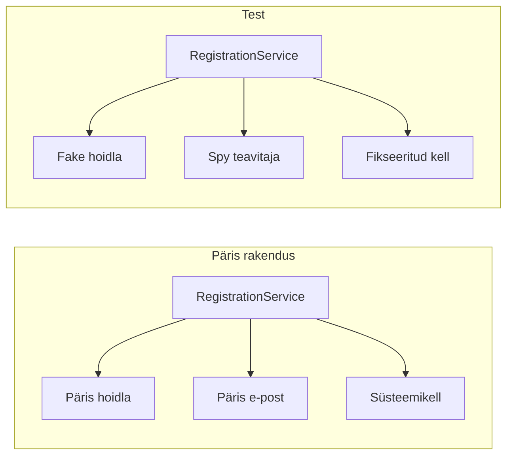

# 4. Mockid ja ise kirjutatud mock-klassid

::: info Õpiväljund
Pärast tundi oskad selgitada, miks ja millal sõltuvusi asendatakse, kirjutada ise mock-klasse ja kasutada neid ühiktestis skoobist väljapoole jäävate osade asendamiseks (HK 3.5, HK 3.4).
:::

Kaarel tahab testida registreerimist: inimene registreerub töötuppa ja saab kinnituskirja. Ta paneb testi käima ja kuulab imestusega, kuidas Mihkel ukse peal ütleb: "Meie postiserver saatis äsja neli kirja aadressidele, mida ma ei tunne."

Test kasutas **päris** e-posti teenust. Kui rakendus kasutaks päris andmebaasi, oleks test lisaks täitnud Rannamõisa tegelikud andmed testkirjetega. Testi tohib ainult see, mis on testi **skoobis**: üks funktsioon või klass. Kõik, mis on skoobist väljas (andmebaas, e-post, kell, teine teenus), tuleb asendada.

## Miks asendada

| Sõltuvus | Probleem testis | Lahendus |
| --- | --- | --- |
| E-posti teenus | Saadab päris kirju, aeglane | Asenda: kirju ei saadeta, aga kutsed jäävad meelde |
| Andmebaas | Aeglane, vajab seadistust, testid mõjutavad üksteist | Asenda: andmed massiivis |
| Kell (`new Date()`) | Tulemus sõltub sellest, millal test jookseb | Asenda: kell, mis näitab alati sama hetke |
| Teine teenus (makse, API) | Ei ole kontrolli all, võib olla maas | Asenda: etteantud vastus |

Asendamine annab kolm asja: testid on **kiired** (millisekundid), **korratavad** (sama tulemus iga kord) ja **sõltumatud** (ükski ei mõjuta teist). Ja saad testida olukordi, mida päris süsteemiga on raske tekitada, näiteks "e-posti server on maas".

## Sõltuvuste süstimine

Asendamine töötab ainult siis, kui klass **saab oma sõltuvused väljastpoolt**, mitte ei loo neid ise. Seda nimetatakse **sõltuvuste süstimiseks** (*dependency injection*).

Praktikumirepo `RegistrationService` võtab konstruktoris neli sõltuvust:

```js
const service = new RegistrationService({ workshops, registrations, notifier, clock });
```

Päris rakenduses on need mälupõhised hoidlad ja kell. Testis annad asemele **oma** objektid. Klass ise ei tea ega hooli, kas tema taga on päris või asendus, kui meetodid on samad.



## Test double'ite liigid

**Test double** on kõik, mis asendab testis päris sõltuvust (nagu kaskadööri dublant filmis). Neid on mitu liiki ja tavaelus aetakse need sageli segi.

| Liik | Mida teeb | Näide siin |
| --- | --- | --- |
| **Stub** | Tagastab ette antud vastuse | `vi.fn().mockResolvedValue(openWorkshop)` |
| **Fake** | Töötav, kuid lihtsustatud teostus | Hoidla, mis hoiab andmeid massiivis |
| **Spy** | Jätab kutsed meelde, et neid hiljem kontrollida | Teavitaja, mis salvestab "kiri saadetud" |
| **Mock** | Eeldab kutseid ja kontrollib neid | `expect(fn).toHaveBeenCalledWith(...)` |
| **Dummy** | Täidab koha, aga seda ei kasutata | `clock: {}` testis, kus kella ei vaja |

Sõna **"mock-klass"** tähendab selles moodulis **ise kirjutatud klassi, mis asendab sõltuvust**. See on HK 3.5 sisu: sa ei kasuta ainult teegi `vi.fn()`-i, vaid **kirjutad ise** asendusklassid.

### vi.fn() mock

Vitest annab mock-funktsiooni `vi.fn()`. See on kiire ja lühike:

```js
const notifier = { sendConfirmation: vi.fn().mockResolvedValue(undefined) };
// ...
expect(notifier.sendConfirmation).toHaveBeenCalledTimes(1);
```

`mockResolvedValue` määrab, mida funktsioon tagastab (siin lubadus). `toHaveBeenCalledTimes` ja `toHaveBeenCalledWith` kontrollivad, kui mitu korda ja milliste argumentidega teda kutsuti.

### Ise kirjutatud mock-klass

```js
class SpyNotifier {
  confirmations = [];
  async sendConfirmation(data) {
    this.confirmations.push(data);
  }
}
```

See on sama asi, aga **klassina**: saad seda taaskasutada paljudes testides ja lugeda tema olekut (`notifier.confirmations`) lihtsa massiivina.

| | `vi.fn()` | Ise kirjutatud klass |
| --- | --- | --- |
| Kirjutamise aeg | Lühike | Pikem |
| Taaskasutus | Iga testi sees uuesti | Üks klass, paljud testid |
| Loetavus | Seotud kutsete detailidega | Olek on tavaline andmestruktuur |
| Risk | Test läheb katki refaktoreerimisel, kuigi käitumine ei muutu | Fake võib ise vigu sisaldada |

Viimane rida on tähtis: fake on **kood** ja võib vigane olla. Kui fake `findById` tagastab alati sama objekti, võib teenus muuta salvestatud andmeid ilma `save`-ita ja test läbib ekslikult. Tagasta hoidlast **koopia**, mitte originaal.

## Mida mockitud test ei tõenda

Fake hoidla ei tõesta, et päris andmebaas töötab. Mockitud e-post ei tõesta, et kiri jõuab postkasti. Ühiktest kontrollib **äriloogikat** (kas teenus teeb õige otsuse), mitte seda, kas kõik osad töötavad koos. Seda kontrollivad integratsioonitestid (kohtumised 6 ja 7).

Hea tava: **mocki ainult seda, mis on skoobist väljas.** Hinnafunktsiooni `calculatePrice` ei mockita, sest see on osa sellest, mida `RegistrationService` päriselt kasutab. Kui mockiksid ka selle, testiksid ainult mocke.

## Praktikum

Sul on 55-60 minutit. Failid: `harjutused/kohtumine-04/fakes.js` ja `harjutused/kohtumine-04/RegistrationService.test.js`.

### 1. Loe `RegistrationService`

Ava `src/registration/RegistrationService.js`. Koodi kohal on kirjeldus, millised meetodid on igal neljal sõltuvusel. Kirjuta oma sõnadega üles, mida iga sõltuvus teeb ja **millise meetodi kaudu `register` seda kasutab**.

### 2. Käivita valmis näide

Fail `RegistrationService.test.js` sisaldab juba ühte testi `vi.fn()` mockidega. Käivita see (`npm test -- harjutused/kohtumine-04 -t "vi.fn"`) ja loe seda. Mis on Arrange, Act ja Assert?

### 3. Kirjuta kolm puuduvat mock-klassi

Failis `fakes.js` on `FixedClock` ja `SpyNotifier` juba valmis. Teosta ülejäänud kolm, nii et nende meetodid teevad järgmist:

| Klass | Meetod | Peab tegema |
| --- | --- | --- |
| `FailingNotifier` | `sendConfirmation`, `sendCancellation` | Viskavad alati vea (simuleerib, et e-posti server on maas) |
| `FakeWorkshopRepository` | `findById(id)` | Tagastab töötoa koopia või `null`, kui seda pole |
| | `save(workshop)` | Asendab sama `id`-ga töötoa **ja** jätab salvestatud töötoa meelde massiivi `saved` |
| `FakeRegistrationRepository` | `findById(id)` | Tagastab registreeringu koopia või `null` |
| | `findByWorkshop(workshopId)` | Tagastab selle töötoa registreeringute massiivi |
| | `add(data)` | Annab uue `id`, lisab massiivi (`registrations`) ja tagastab registreeringu |
| | `update(registration)` | Asendab sama `id`-ga kirje |
| | `remove(id)` | Eemaldab kirje |

Kõik meetodid on `async`, sest päris hoidlad on seda ka.

### 4. Kirjuta seitse testi

Fail kasutab `beforeEach`-is värsket komplekti (töötuba mahutavusega 4, tühi hoidla, spy-teavitaja, fikseeritud kell 2030-06-10), nii et testid ei mõjuta üksteist. Kirjuta järgmised ülesanded:

| Ülesanne | Nõue | Mida kontrollida |
| --- | --- | --- |
| edukas registreerimine | NR-8, NR-10, NR-11 | Registreering on hoidlas (e-post normaliseeritud, hind õige) ja kinnitus saadeti **täpselt üks kord** |
| töötuba ei ole registreerimiseks sobiv | NR-8 | Olematu ja mitteavatud töötuba annavad õiged veakoodid. Kontrolli ka, et **midagi ei juhtunud**: registreeringut ei lisatud ja kinnitust ei saadetud |
| vabade kohtade puudus | NR-9 | Liiga palju osalejaid vabade kohtade kohta annab vea. Kontrolli ka, et täpselt viimased kohad **mahuvad** ära |
| korduv registreerimine | NR-10 | Sama e-post teist korda annab vea |
| töötuba täitub | NR-13 | Viimase koha täitumisel salvestatakse töötuba uue olekuga. Mõtle, kuidas tõestad, et enne täitumist **ei** salvestatud |
| kinnituse saatmine ebaõnnestub | NR-11 | Kasuta `FailingNotifier`-it: registreering jääb alles ja vastuses ei ole kinnitus saadetud |
| tühistamine | NR-12, NR-13 | Kasuta `FixedClock`-it: tühistamine sobival ajal annab õige tagasimakse, töötuba muutub vajadusel taas avatuks ja teavitaja saab teate |

Kasuta Arrange-Act-Assert struktuuri. Kirjuta lisamärkus iga testi kohta, mille mock-klass oli vajalik.

### 5. Kontrolli oma fake'e

Kui ühe testi tulemus on imelik, uuri, kas viga on testis, teenuses või **fake'is**. Kirjuta üles üks koht, kus oma fake'is eksisid.

## Tõendid päevikusse

Lisa oma [päevikusse](./sissejuhatus#paevik) kommentaar **Kohtumine 4** ja kirjuta sinna:

- [ ] `fakes.js`: kolm teostatud mock-klassi
- [ ] `RegistrationService.test.js`: seitse ülesannet on päris testid ja läbivad
- [ ] Märkus: millised neist kasutavad fake'i, millised spy-d ja millised ebaõnnestuvat teavitajat
- [ ] Üks koht, kus fake'i viga viis testi eksiteele

## Refleksioon

1. Miks ei tohi test saata päris e-kirju, ka siis, kui see "ainult kord"?
2. Millal valid `vi.fn()` ja millal oma klassi?
3. Mida teeb integratsioonitest, mida see ühiktest ei tee?

## Allikad

- [Vitest: mocking](https://vitest.dev/guide/mocking.html) ja [`vi.fn`](https://vitest.dev/api/vi.html#vi-fn): mock-funktsioonid.
- Gerard Meszaros, *xUnit Test Patterns* (2007): test double'ite liigid (dummy, stub, spy, mock, fake).
- Martin Fowler, [Mocks Aren't Stubs](https://martinfowler.com/articles/mocksArentStubs.html): erinevus stub'i, mocki ja fake'i vahel.
- Rannamõisa ja Mihkli lugu on väljamõeldud.
