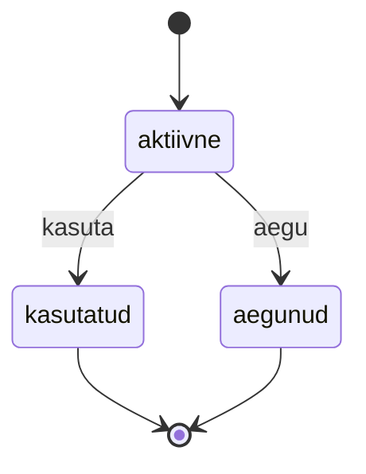

# 5. Otsustustabel ja olekud

::: info Õpiväljund
Pärast tundi oskad koostada otsustustabeli ja olekudiagrammi, tuletada neist testid ja põhjendada, millal sobib piirväärtuste meetod ning millal otsustustabel või olekud (HK 3.2).
:::

Anu helistab: "Mul läheb homme töötoa juhendaja haigeks ja ma pean töötoa tühistama. Kas inimesed saavad raha tagasi? Eile ütlesite, et sõltub päevadest."

Kaarel avab nõude NR-12 ja loeb. Reegel ei ole üks arv ega üks piir. Tagasimakse sõltub **mitmest asjast korraga**: kas inimene maksis, kes tühistas ja mitu päeva on algusest. [Kohtumisel 3](./kohtumine-03-uhiktestid) õppisid piire valima **ühe sisendi** jaoks. Siin on sisendeid **mitu** ja nende **kombinatsioon** määrab tulemuse. Selleks sobib teine meetod: **otsustustabel**.

## Otsustustabel

**Otsustustabel** (*decision table*) kirjeldab, milline tegevus või tulemus kehtib **tingimuste kombinatsioonide** korral. Iga veerg on üks **reegel** ja iga reegli kohta tuleb vähemalt üks test.

Näide, mis ei ole praktikumirepos: Rannamõisa müüb töötoa materjalikomplekti, mille saab kohapealt kätte või koju tellida. Saatmiskulu reeglid:

- kohapealt kättesaamisel on saatmiskulu 0;
- koju tellides on kulu 0, kui tellimus on vähemalt 50 €;
- alla 50 € tellimuse korral on liikmel kulu 2 € ja mitteliikmel 5 €.

| Tingimus | R1 | R2 | R3 | R4 |
| --- | --- | --- | --- | --- |
| Tarne koju? | ei | jah | jah | jah |
| Tellimus vähemalt 50 €? | - | jah | ei | ei |
| Liige? | - | - | jah | ei |
| **Saatmiskulu** | 0 | 0 | 2 | 5 |

Kuidas tabelit lugeda:

- **"-" tähendab "pole oluline"**. Kui tarne on kohapealt, ei mõjuta ei summa ega liikmelisus tulemust.
- **Üks veerg on üks reegel.** Neljast reeglist saab neli testi: üks iga veeru jaoks.
- Tabel peab olema **täielik**: iga võimalik olukord kuulub täpselt ühe reegli alla.

### Täielikkuse kontroll

Kolm tingimust, igaüks kahe väärtusega, annavad 2 x 2 x 2 = 8 kombinatsiooni. Neli reeglit katavad need kõik, sest "-" liidab mitu kombinatsiooni üheks: R1 katab nelja kombinatsiooni (kohapealt, mis tahes summa ja liige), R2 kaks (koju, suur summa, mis tahes liige). Kokku 4 + 2 + 1 + 1 = 8.

| Küsimus tabeli kohta | Miks oluline |
| --- | --- |
| Kas kõik kombinatsioonid on kaetud? | Puuduv reegel on puuduv nõue ("mida teha, kui..."). See on **nõudes** leitud viga |
| Kas mõni kombinatsioon kuulub kahe reegli alla? | Vastuolu nõudes: kaks erinevat tulemust samale olukorrale |
| Kas mõni kombinatsioon on võimatu? | Selle võib tabelist välja jätta, aga põhjendus tuleb kirja panna |

Otsustustabeli koostamine **leiab vigu juba enne koodi kirjutamist**, sest tabel sunnib iga olukorra üle mõtlema.

### Millal sobib

| Sobib | Ei sobi |
| --- | --- |
| Mitu tingimust annavad koos tulemuse | Üks arvuline sisend (kasuta piirväärtusi) |
| Reeglid on äriloogika (hind, tagasimakse, õigused) | Tulemus sõltub järjekorrast või ajaloost (kasuta olekuid) |

Meetodid täiendavad teineteist: **piirväärtused** ütlevad, mis arvud valida (7 ja 6 päeva), **otsustustabel** ütleb, millised kombinatsioonid on olemas. NR-12 tagasimakse vajab mõlemat.

## Olekupõhine testimine

Teine nõue annab teistsuguse probleemi. Töötoal on olek (NR-13) ja see muutub tegevuste mõjul. Midagi võib juhtuda **ainult siis, kui töötuba on õiges olekus**: täis töötuppa ei saa registreerida ja suletud töötuba ei saa uuesti avada.

**Olekupõhine testimine** (*state transition testing*) kirjeldab, millised on **olekud**, millised **sündmused** neid muudavad ja millised üleminekud on **lubatud**.

Näide, mis ei ole praktikumirepos: Rannamõisa kinkekaart.



| Olek | kasuta | aegu |
| --- | --- | --- |
| aktiivne | kasutatud | aegunud |
| kasutatud | viga | viga |
| aegunud | viga | viga |

Tabelis on 3 olekut x 2 sündmust = 6 kombinatsiooni. **Lubatud** on 2, **keelatud** on 4. Õpilased unustavad sageli, et **keelatud üleminekud on samuti testitavad**. Kui kasutatud kinkekaardi saab uuesti kasutada, on see tõsine viga, aga seda leiab ainult test, mis seda proovib.

Olekutestide kolm tasemet:

1. **Kõik lubatud üleminekud** (iga nool diagrammil on üks test).
2. **Keelatud üleminekud** (vähemalt iga oleku jaoks üks).
3. **Lõppolekud** (kas sealt on tõesti väljapääsu pole).

## Sama nõue, mitu taset

NR-13 sisaldab ka reeglit "kui viimane koht täitub, muutub töötuba automaatselt täis". See ei ole puhta funktsiooni `nextState` ülesanne, vaid `RegistrationService`-i oma. Sama nõuet kontrollitakse tegelikult **mitmel tasemel**:

| Tase | Mida kontrollib | Kohtumine |
| --- | --- | --- |
| Ühik (`nextState`) | Üleminekute tabel | 5 |
| Ühik (`RegistrationService`, fake'idega) | Täitumisel salvestatakse uus olek | 4 |
| Integratsioon (HTTP) | `GET /workshops/:id` näitab täis olekut | 7 |

See on testipüramiid praktikas: iga tase kontrollib sama nõuet **teise nurga alt**.

## Praktikum

Sul on 55-60 minutit. Failid: `harjutused/kohtumine-05/calculateRefund.test.js` ja `harjutused/kohtumine-05/workshopState.test.js`. Nõuded: NR-12 ja NR-13.

### 1. Enne koodi: otsustustabel

Lisa päevikusse kommentaar **Otsustustabel** ja koosta selles tagasimakse (NR-12) otsustustabel (Markdowni tabel, kasuta **Preview** vahekaarti). Tingimused leia nõudest ise. Kontrolli:

- Mitu tingimust on ja mitu kombinatsiooni tekiks, kui "-" ei kasutaks?
- Kas iga kombinatsioon kuulub **täpselt ühe** reegli alla?
- Kas mõni kombinatsioon on võimatu või üleliigne? Põhjenda.

### 2. Olekudiagramm

Joonista samas kommentaaris Mermaidi `stateDiagram-v2` abil (GitHub joonistab Mermaidi ise, kirjuta see koodiplokina ```` ```mermaid ````) töötoa olekud ja üleminekud (NR-13). Loe diagrammilt kokku **lubatud** üleminekute arv ning arvuta, kui palju neid on **kokku** (olekuid x sündmusi) ja kui palju on keelatud.

### 3. Tagasimakse testid

Fail `calculateRefund.test.js` sisaldab ühte näidet (maksmata registreering). Kirjuta ülejäänud kuus ülesannet:

| Ülesanne | Mida katta |
| --- | --- |
| korraldaja tühistas | Reegel, kus korraldaja tühistab |
| vähemalt 7 päeva enne | Täielik tagasimakse tavaosalejale |
| 2 kuni 6 päeva enne | Osaline tagasimakse |
| vähem kui 2 päeva enne | Tagasimakset ei ole |
| piirväärtused | Mõlemad päevade piirid **mõlemalt poolt**. Seos kohtumisega 3 |
| vigased sisendid | Vigased päevade arvu ja hinna väärtused |

Iga oma tabeli reegli kohta peab olema vähemalt üks test. Lisa testi nime juurde reegli number (R1, R2...).

### 4. Olekutestid

Fail `workshopState.test.js` sisaldab ühte näidet (`draft` + `publish`). Kirjuta kolm ülesannet:

| Ülesanne | Mida katta |
| --- | --- |
| lubatud üleminekud | Iga lubatud üleminek diagrammilt |
| keelatud üleminekud | Vähemalt kuus keelatud üleminekut, igast olekust (v.a `closed`) vähemalt üks |
| closed olek | Ükski sündmus ei vii `closed` olekust välja |

Kasuta `it.each` ja kirjuta tabel testi sisse (`[olek, sündmus, oodatud]`).

### 5. Võrdle kahte meetodit

Lisa samasse kommentaari lõppu meetodite võrdlus: millal sobib piirväärtuste meetod, millal otsustustabel ja olekud ja **mida kumbki ei leia**. Too näide mõlemast oma testidest.

## Tõendid päevikusse

Lisa oma [päevikusse](./sissejuhatus#paevik) kommentaar **Kohtumine 5** ja kirjuta sinna:

- [ ] Täielik tagasimakse otsustustabel, kontrollitud (kombinatsioonid, võimatud)
- [ ] Olekudiagramm ja lubatud/keelatud üleminekute arvud
- [ ] `calculateRefund.test.js`: seitse testi läbivad, iga reegli kohta on test
- [ ] `workshopState.test.js`: neli testi läbivad
- [ ] Meetodite võrdlus näidetega

## Refleksioon

1. Kas mõni reegel tabelis oli sinu arvates nõudes ebaselge? Mida Anult küsiksid?
2. Miks on keelatud üleminekud sama olulised kui lubatud?
3. Mis tüüpi viga leiab piirväärtuste meetod, mida otsustustabel ei leia, ja vastupidi?

## Allikad

- ISTQB Certified Tester Foundation Level Syllabus v4.0, peatükk 4: testide analüüs ja kavandamine (otsustustabelid, olekuüleminekud). Vt [Testimise alused, kohtumine 5](/testimise-alused/kohtumine-05-meetodid).
- [Mermaid: olekudiagrammid](https://mermaid.js.org/syntax/stateDiagram.html).
- Materjalikomplekt, kinkekaart ja Rannamõisa on väljamõeldud.
