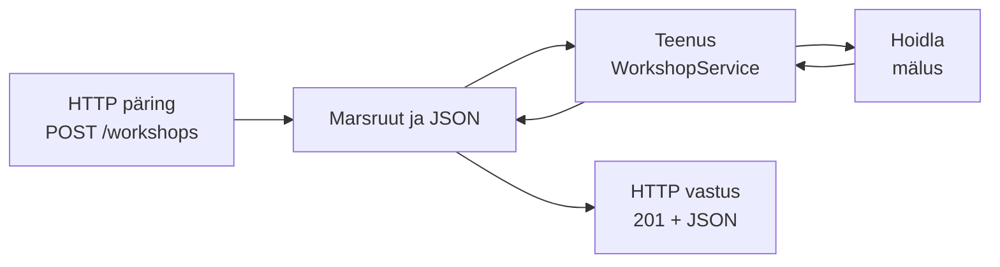

# 6. Integratsioonitestid I: Supertest

::: info Õpiväljund
Pärast tundi oskad kirjutada Supertestiga integratsioonitesti HTTP API jaoks, kontrollida staatust ja veakoodi ning luua igale testile oma andmed (HK 3.3, HK 3.4).
:::

Reet ütleb ühel hommikul rahulolevalt: "Kõik ühiktestid on rohelised." Anu helistab kakskümmend minutit hiljem: "Ma ei saa töötuba luua. Rakendus ütleb lihtsalt viga."

Kaarel proovib ise. Päring `POST /workshops` vastab **400: pealkiri puudub**, kuigi pealkiri on päringus olemas. Selgub, et Reet unustas käivitada JSON-i lugeja, nii et päringu keha jõudis teenuseni tühjana. Hinnafunktsioon, olekumasin ja `RegistrationService` olid kõik õiged. **Viga oli nende vahel.**

Ühiktestid vaatavad ühte osa korraga. **Integratsioonitest** (*integration test*) kontrollib, kas osad töötavad **koos**.

## Mida integratsioonitest kontrollib

Praktikumirepos läheb päring läbi nelja kihi:



| Mida ühiktest ei näe | Mida integratsioonitest näeb |
| --- | --- |
| Kas marsruut on õige URL ja meetod? | Jah |
| Kas JSON loetakse õigesti? | Jah |
| Kas veakood muutub õigeks HTTP staatuseks? (`INVALID_CAPACITY` => 400) | Jah |
| Kas id URL-ist on arv, mitte "abc"? | Jah |
| Kas teenus ja hoidla töötavad koos? | Jah |

Integratsioonitestid on **aeglasemad** kui ühiktestid ja **leiavad vea vähem täpselt**: kui test kukub, pead leidma, mis kihis. Seetõttu on neid [testipüramiidis](/testimise-alused/kohtumine-06-staatiline-ja-dunaamiline) vähem, aga need on **hädavajalikud**, sest ainult nemad näevad kihtide vahelisi vigu.

## Supertest

**Supertest** on teek, mis saadab HTTP päringuid Express rakendusele **testi seest**. Sa ei pea serverit käsitsi käivitama ega porti valima: Supertest käivitab rakenduse ise ja sulgeb selle pärast.

```js
import request from "supertest";
import { createApp } from "../../src/api/createApp.js";

const res = await request(createApp()).post("/workshops").send({ title: "Keraamika", capacity: 8, basePrice: 25, startsAt: "2030-06-20T10:00:00Z" });

expect(res.status).toBe(201);
expect(res.body.status).toBe("draft");
```

Koostisosad:

| Osa | Mida teeb |
| --- | --- |
| `request(app)` | Võtab Expressi rakenduse |
| `.get("/path")`, `.post("/path")`, `.delete("/path")` | Valib meetodi ja URL-i |
| `.send({...})` | Lisab JSON-keha |
| `await` | Päring on asünkroonne. **`await` unustamine on tüüpiliseim viga** |
| `res.status` | HTTP staatus (201, 400, 404...) |
| `res.body` | Vastuse JSON, juba objektina |

Praktikumirepos on abifunktsioon `client()` (kaustas `harjutused/tugi/`), mis annab sama klienti. Ilma seadistuseta loob see **värske, tühja rakenduse**. Kui anda keskkonnamuutuja `TARGET_URL`, saadab klient päringud hoopis **käimasolevale serverile** (nt `npm start`), nii et sama testi saab kasutada ka testkeskkonna kontrollimiseks.

### Mis on rakendus testi ajal

`createApp()` ehitab rakenduse, mille andmed on **mälus**. Iga `createApp()` kutse annab uue ja tühja rakenduse. Kui test lõpeb, kaovad ka andmed. See teeb testimise lihtsaks, kuid **ära toetu sellele**: päris keskkonnas on andmeid juba olemas ja test, mis eeldab tühja algseisu, läheb katki.

## Iga test loob oma andmed

Kui kaks testi kasutavad samu andmeid, hakkavad nad üksteist mõjutama: üks test lisab töötoa ja teine eeldab, et neid on täpselt null. Test, mis läbib ainult teatud järjekorras, on **habras**.

Kaarel järgib reeglit: **iga test loob ise kõik, mida ta vajab, ja kasutab unikaalseid väärtusi.** Praktikumirepos aitavad selles abifunktsioonid:

| Funktsioon | Mida teeb |
| --- | --- |
| `uniqueTitle("Keraamika")` | Annab unikaalse pealkirja (`Keraamika 1743...-1`) |
| `isoDaysFromNow(10)` | Annab kuupäeva "praegu + 10 päeva" |
| `uniqueEmail()` | Annab unikaalse e-posti |
| `createOpenWorkshop(api, {...})` | Loob töötoa ja avab selle |

Seega **ära kontrolli** `list.length === 1`, vaid **otsi oma töötuba pealkirja järgi**. Selline test töötab ka siis, kui server sisaldab juba sadu töötubasid.

## Mida kontrollida vastusest

Kaarel kontrollib alati kahte asja koos: **staatust ja veakoodi**.

```js
expect(res.status).toBe(400);
expect(res.body.error.code).toBe("INVALID_CAPACITY");
```

Pelk 400 ei ütle midagi: sama staatus võib tulla mitmest erinevast veast. Täpne `code` ütleb, **milline** viga tuli. Vea **teksti** (`message`) ei kontrolli: see on inimesele ja võib muutuda.

Kolm veatüüpi, mida sageli aetakse segi:

| Staatus | Tähendab | Näide |
| --- | --- | --- |
| **400** | Päring on vigane | Mahutavus on negatiivne, id on "abc" |
| **404** | Päring on korrektne, aga seda ei ole olemas | Id 999999 töötuba |
| **409** | Päring on korrektne, aga **praegune seis ei luba** | Töötuba on juba avatud |

## Praktikum

Sul on 55-60 minutit. Failid: `harjutused/kohtumine-06/health.test.js` (valmis näide) ja `harjutused/kohtumine-06/workshops.test.js`. Nõuded: NR-8, NR-13 ja NR-14, API kirjeldus failis `spetsifikatsioon/nouded.md`.

### 1. Loe näited

Käivita `npm test -- harjutused/kohtumine-06`. Loe `health.test.js` ja esimene test `workshops.test.js`-is. Kirjuta üles, mis ühik- ja integratsioonitesti erinevus on nende põhjal.

### 2. Kirjuta viis ülesannet

| Ülesanne | Nõue | Mida katta |
| --- | --- | --- |
| vigane mahutavus | NR-14 | Iga vigase mahutavuse klass: kontrolli staatust ja `error.code` |
| vigased pealkiri, hind ja kuupäev | NR-14 | Iga väli eraldi vigaseks (ülejäänud on korrektsed) |
| loodud töötuba on nimekirjas ja päritav id järgi | | Otsi oma töötuba pealkirja järgi, ära kontrolli nimekirja pikkust |
| puuduv töötuba ja vigased id-d | | Olematu, kuid korrektne id ja vigased id-d. Mõtle, millised väärtused on **erinevad klassid** |
| töötoa avamine | NR-13 | Avamine, korduv avamine ja olematu töötuba |

Iga test loob **oma** töötoa. Kasuta `validBody()` abifunktsiooni, mis on failis juba olemas.

### 3. Leia, mida ühiktestid ei leia

Kirjuta märge: millised sinu testid oleksid jäänud tabamata, kui meil oleks ainult ühiktestid? Näiteks mis juhtuks, kui keegi eemaldaks rakendusest JSON-i lugemise?

### 4. Käivita testid eraldi

Käivita iga ülesanne üksi (`-t "nimi"`), seejärel kõik koos. Kui mõni test läbib ainult koos teistega, siis on see sõltuv. Paranda.

## Tõendid päevikusse

Lisa oma [päevikusse](./sissejuhatus#paevik) kommentaar **Kohtumine 6** ja kirjuta sinna:

- [ ] `workshops.test.js`: viis ülesannet on päris testid ja läbivad
- [ ] Iga test loob oma andmed (ei sõltu teistest ega serveri algseisust)
- [ ] Märkus: millised testid leiavad vea, mida ühiktestid ei leia
- [ ] Märkus: kus kontrollid ainult staatust ja kus staatust koos `error.code`-iga ning miks

## Refleksioon

1. Miks ei kontrolli me `error.message` teksti?
2. Mis juhtuks, kui kaks testi kasutaksid sama töötoa pealkirja?
3. Mis vahe on 400, 404 ja 409 vigadel ja kus sa seda erinevust testis kasutasid?

## Allikad

- [Supertest](https://github.com/ladjs/supertest): HTTP testimine Node.js rakendustele.
- [Express: veakäsitlus](https://expressjs.com/en/guide/error-handling.html) ja [MDN: HTTP staatusekoodid](https://developer.mozilla.org/en-US/docs/Web/HTTP/Status).
- ISTQB Certified Tester Foundation Level Syllabus v4.0, peatükk 2: testitasemed (integratsioonitestimine).
- Rannamõisa on väljamõeldud.
