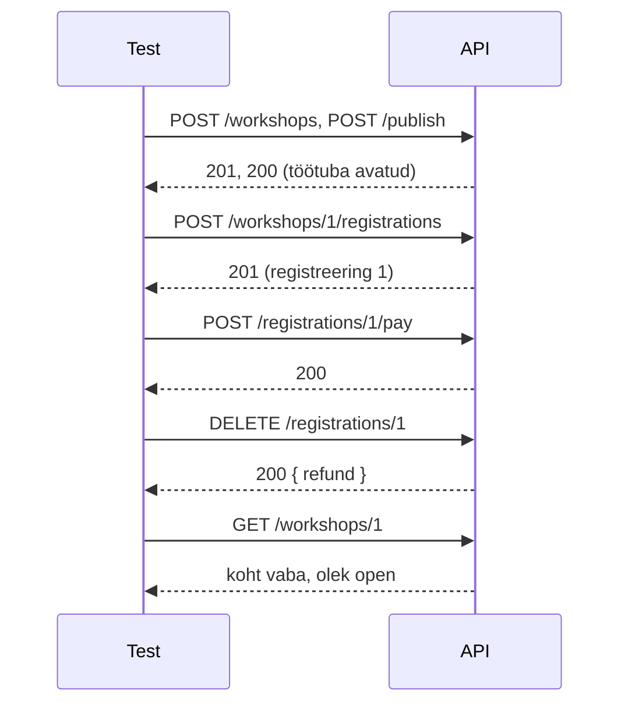

# 7. Integratsioonitestid II: registreerimine ja tühistamine

::: info Õpiväljund
Pärast tundi oskad kirjutada mitmesammulise integratsioonitesti, kontrollida testi eeldusi, vältida teste, mis läbivad valel põhjusel, ja arutada samaaegsuse riske (HK 3.3, HK 3.4).
:::

Anu helistab uuesti: "Mu sõber registreerus kogemata kaks korda sama e-posti aadressiga ja maksis kaks korda. Süsteem ei hoiatanud."

Kaarel vaatab oma teste. Seal **on** test duplikaadi kohta: "sama e-post teist korda annab 409". See on roheline. Miks see viga ei paistnud?

Kaarel vaatab testi lähemalt. **Esimene registreering oli ebaõnnestunud** (töötuba oli veel mustandi olekus), seega teine päring andis 409, aga hoopis **teise põhjuse** tõttu: töötuba ei olnud avatud. Test läbis, kuigi duplikaadi kontrolli ta polnud kordagi proovinud.

See on **test, mis läbib valel põhjusel**. Selle kohtumise põhiõppetund on, kuidas seda vältida.

## Mitmesammuline stsenaarium

Seni kontrollisid ühte päringut. Päris nõuded on **lood**: "registreeri, maksa, tühista ja vaata, kas koht vabaneb". Test koosneb sammudest:

1. **Arrange**: loo töötuba ja ava see.
2. **Act (1)**: registreeri.
3. **Act (2)**: maksa.
4. **Act (3)**: tühista.
5. **Assert**: kontrolli tagasimakset, vaba kohta, töötoa olekut ja seda, et registreeringut enam pole.



Üks nõue (NR-12 ja NR-13) tähendab siin **mitut kontrolli**: tagasimakse summa, vabanenud koht, töötoa olek ja registreeringu kadumine. Kui üks kukub, on selge, milline.

## Test eeldused

**Eeldus** on kõik, mis peab olema tõsi, **enne** kui testi põhiküsimus on mõttekas. Duplikaadi testis on eeldus: esimene registreering **õnnestus**.

```js
const first = await register(api, workshop.id, { email, ages: [30] });
expect(first.status).toBe(201);   // eeldus: esimene õnnestus

const second = await register(api, workshop.id, { email, ages: [30] });
expect(second.status).toBe(409);  // põhikontroll
expect(second.body.error.code).toBe("ALREADY_REGISTERED");
```

Kolm reeglit, mis hoiavad teste ausad:

| Reegel | Miks |
| --- | --- |
| **Kontrolli ettevalmistuse vastuseid** (201, 200) | Kui ettevalmistus ebaõnnestub, saad teada kohe õige koha, mitte vale |
| **Kontrolli täpset `error.code`-i** | Sama 409 võib olla kolmest erinevast põhjusest |
| **Küsi: kas see test peaks kukkuma, kui rakenduses on viga?** | Kui ei, siis ei kaitse see midagi |

Viimast küsimust nimetatakse **testi tapmisvõimeks**. Kohtumisel 8 mõõdad seda süstemaatiliselt.

## Aeg testides

Tühistamise tagasimakse sõltub päevadest töötoa alguseni (NR-12). Ühiktestis kasutasid fikseeritud kella. HTTP testis **ei saa** kella muuta, kui testid käimasoleva serveri vastu (`TARGET_URL`). Seega:

- Arvuta töötoa algus testis: `isoDaysFromNow(10)` annab "praegu + 10 päeva".
- Vali päevade arv piirist **kaugele**: 10 päeva on selgelt "vähemalt 7" ja 3 päeva selgelt "2 kuni 6".
- **Täpset piiri (7 või 2 päeva) HTTP testis ei kontrollita**, sest "praegu" nihkub testi jooksul. Seda kontrollib ühiktest (kohtumine 5), kus kell on fikseeritud.

See on [testipüramiidi](/testimise-alused/kohtumine-06-staatiline-ja-dunaamiline) heaks näiteks: iga asja kontrollib see tase, kus see on kõige usaldusväärsem.

## Samaaegsus

Mis juhtub, kui kaks inimest registreerivad **täpselt samal hetkel** viimase vaba koha peale?

Päris süsteemis, kus andmed on andmebaasis, võib juhtuda nii: mõlemad päringud loevad "vaba kohti on 1", mõlemad otsustavad "saab registreerida" ja mõlemad salvestavad. Tulemus: **kaks registreeringut ühe koha peale**. Seda viga nimetatakse **võidujooksuks** (*race condition*) ja see on klassikaline raskesti leitav viga.

Praktikumirepos on hoidla **mälus** ja Node.js käsitleb päringuid ühe lõimena, nii et siin seda viga ei teki. Test, mis saadab kaks päringut korraga (`Promise.all`), läbib alati. See annab kaks õppetundi:

- test **ei tõesta** samaaegsuse turvalisust päris andmebaasis;
- samaaegsuse testid on **laiendus**: need aitavad seda mõelda, ka kui nad siin ei kuku.

Päris süsteemis lahendatakse see andmebaasi transaktsiooni ja lukuga. Tulemusi võrreldes sorteeri staatused enne: päringute **järjekord ei ole määratud**.

## Praktikum

Sul on 55-60 minutit. Fail: `harjutused/kohtumine-07/registrations.test.js`. Nõuded: NR-8 kuni NR-13.

### 1. Loe näide

Käivita `npm test -- harjutused/kohtumine-07` ja loe esimest testi. Märgi üles: milline osa on Arrange, milline Act ja milline Assert? Mida teeb `createOpenWorkshop`?

### 2. Kirjuta kaheksa ülesannet

| Ülesanne | Nõue | Mida katta |
| --- | --- | --- |
| e-posti kontroll | NR-8, NR-10 | E-post salvestatakse normaliseeritult ja vigased e-postid (mitu klassi) annavad õige veakoodi |
| mitteavatud ja olematu töötuba | NR-8 | Töötuba, mida ei ole avatud, ja töötuba, mida pole olemas: mõlemad õige staatuse ja koodiga |
| täis töötuba | NR-9 | Täpselt viimased kohad mahuvad ära, töötuba muutub täis olekusse ja järgmine registreerimine ebaõnnestub. Loe nõudeid hoolikalt: milline veakood tuleb ja miks? |
| korduv e-post | NR-10 | Kontrolli **eeldust**: esimene õnnestub. Teine kasutab teist tähesuurust |
| hinnad | NR-2, NR-4, NR-5, NR-6 | Hinnad HTTP kaudu: grupisoodus, liikmesoodus, mõlemad korraga ja laps. Vali arvud nii, et vale teostus annaks teistsuguse hinna |
| makstud registreeringu tühistamine | NR-12, NR-13 | Registreeri, maksa, tühista (kauge tulevik): tagasimakse, vabanenud koht, töötoa olek ja registreeringu kadumine |
| vigased ja olematud id-d | | Vigased id-d (mitu klassi) ja olematu registreering |
| kaks registreerimist ühe koha peale | NR-9 | `Promise.all` laiendus. Sorteeri staatused enne võrdlust |

Iga test loob **oma töötoa** (`createOpenWorkshop`) ja kasutab unikaalseid e-posteid (`uniqueEmail()`).

### 3. Kontrolli valel põhjusel läbivust

Võta oma kaks testi (nt täis töötuba ja korduv e-post) ja **tee ettevalmistav samm tahtlikult vigaseks** (nt jäta töötuba avamata). Kas test kukub? Kui test **läbib**, siis ei kontrolli ta seda, mida arvasid. Paranda eeldustega.

### 4. Mõtle samaaegsusele

Kirjuta 3-5 lauset: mida sinu samaaegsuse test tõestab ja mida mitte? Mis muutuks, kui hoidla oleks andmebaas? Mis oleks vaja teha, et viga ära hoida?

## Tõendid päevikusse

Lisa oma [päevikusse](./sissejuhatus#paevik) kommentaar **Kohtumine 7** ja kirjuta sinna:

- [ ] `registrations.test.js`: kaheksa ülesannet on päris testid ja läbivad
- [ ] Kõik testid kontrollivad ettevalmistuse vastuseid (201, 200)
- [ ] Märkus tahtliku katse kohta (test, mis läbis valel põhjusel, ja kuidas parandasid)
- [ ] Märkus samaaegsuse kohta (3-5 lauset)

## Refleksioon

1. Millise testi puhul sa kahtled, et see leiaks vea? Miks?
2. Miks on oluline kontrollida ettevalmistuse vastuseid, mitte ainult põhikontrolli?
3. Miks me ei kontrolli täpset 7 päeva piiri HTTP testis?

## Allikad

- [Supertest](https://github.com/ladjs/supertest) ja [Vitest: `expect`](https://vitest.dev/api/expect.html).
- [MDN: `Promise.all`](https://developer.mozilla.org/en-US/docs/Web/JavaScript/Reference/Global_Objects/Promise/all) ja [võidujooks (race condition)](https://en.wikipedia.org/wiki/Race_condition).
- ISTQB Certified Tester Foundation Level Syllabus v4.0, peatükk 2: testitasemed.
- Rannamõisa on väljamõeldud.
