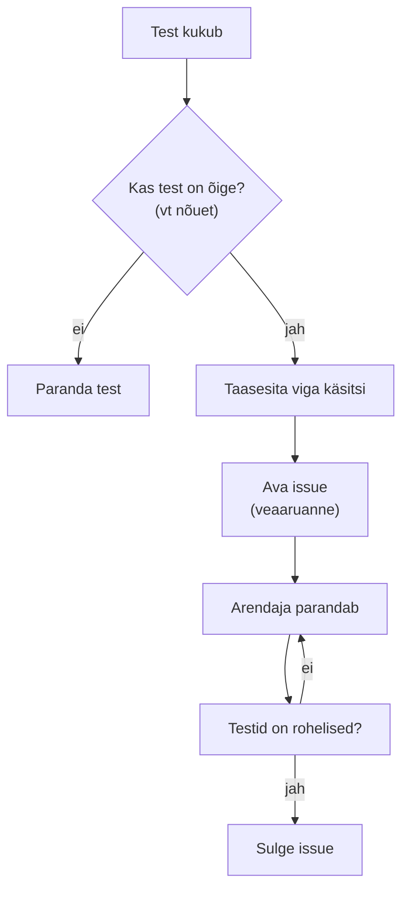

# 10. Vea elutsükkel ja testiaruanne

::: info Õpiväljund
Pärast tundi oskad kirjutada veaaruande GitHubi issue'na, läbida vea elutsükli (aruanne, taasesitus, kukkuv test, parandus, pull request) ja koostada testiaruande, mis aitab teha otsuse (HK 3.1, HK 3.6).
:::

Reet kirjutab hommikul: "Puhastasin koodi natuke ära, saatsin uue versiooni. Tiit tahab seda täna Anule näidata."

Kaarel käivitab testid. **Kolm testi kukub.** Reet ütleb: "See on võimatu, ma ei muutnud mitte midagi, mis oleks pidanud muutuma." Kaarel teab, et "ma ei muutnud midagi" ja "midagi läks katki" võivad olla mõlemad tõsi.

Kaarli järgmine töö ei ole enam testide kirjutamine. See on **selgitada välja, mis katki läks, kirjeldada seda nii, et Reet saab parandada, ja kontrollida, et parandus aitas.** See on suur osa testija tööst ning seda õpid selles kohtumises.

## Mida testija teeb, kui test kukub

Kukkunud test ei ole veel viga. Kõigepealt tuleb teada, **kus** viga on.



| Samm | Küsimus |
| --- | --- |
| **Kas test on õige?** | Mida nõue ütleb? Kas test kontrollib seda? (Kui ei, parandad **testi**, mitte rakendust) |
| **Taasesita** | Kas saad vea teist korda tekitada? Mis on **minimaalsed sammud**? |
| **Raporteeri** | Issue, mille põhjal teine inimene saab vea parandada |
| **Parandus** | Arendaja (või sina) parandab. Parandusega kaasas käib **test**, mis oleks vea tabanud |
| **Kontroll** | Testid on rohelised, issue suletakse |

## Veaaruanne issue'na

[Testimise alused, kohtumine 3](/testimise-alused/kohtumine-03-vigade-tekkimine) õpetas veaaruande ülesehitust. Päris töös on veaaruanne **issue** (ticket). Sinu repos ava **Issues → New issue → Veaaruanne**. Vorm küsib:

| Väli | Mida kirjutada |
| --- | --- |
| Pealkiri | Üks lause: mis on valesti (`[VIGA]` lisatakse ise) |
| Versioon või haru | Kus viga ilmnes (nt `uus-versioon`) |
| Nõue | Rippmenüü: milline nõue ei ole täidetud |
| Sammud | Täpsed sammud (soovitavalt `curl` või Postmani päring) |
| Oodatud tulemus | Mis nõue ütleb |
| Tegelik tulemus | Mida rakendus tegi |
| Tõendus | Kukkunud testi nimi ja väljund |
| Tõsidus | Kui tõsine on mõju kasutajale (kriitiline, suur, väike) |
| Prioriteet | Kui kiiresti tuleks parandada (P1, P2, P3) |

Vorm lisab issue'le automaatselt sildi `bug`. Tõsidus ja prioriteet on eraldi väljad, sest **tõsidus ja prioriteet ei ole sama asi** (vt Testimise alused, kohtumine 3).

### Näide

Fiktiivne veaaruanne Rannamõisa kinkekaardi funktsioonist (mitte sellest rakendusest):

> **[VIGA] Kinkekaart: summa 10 € lükatakse tagasi, kuigi nõue lubab 10 kuni 200**
> **Nõue:** kinkekaardi summa 10 kuni 200 € | **Tõsidus:** Suur | **Prioriteet:** P1
> **Sammud:** 1. `POST /giftcards` summaga 10. 2. Vaata vastust.
> **Oodatud:** 201, kaart on loodud. **Tegelik:** 400 `INVALID_AMOUNT`.
> **Tõendus:** `FAIL NR-1: summa 10 on sobiv: expected 400 to be 201`

Hea aruanne ütleb, **mis** on valesti, **kuidas** seda korrata ja **mis** nõue seda rikub. Halb aruanne on "kinkekaart ei tööta, parandage".

**Üks viga võib kukutada mitu testi.** Näiteks hinnaarvutuse viga võib kukutada nii üksiku registreerimise testi kui ka grupisoodusega testi. Ava **üks issue** ja nimeta selles kõik kukkunud testid. Kukkunud testide arv ei ole vigade arv.

Aruanne kirjeldab **viga**, mitte inimest: "rakendus annab 400", mitte "Reet eksis".

### Issue on vea elutsükkel

Veaaruande issue ei ole ainult algpostitus. **Kogu elutsükkel on selles ühes issue's:**

1. **Loomine**: vorm *Veaaruanne* (sammud, oodatud, tegelik, tõsidus, prioriteet).
2. **Taasesitus**: kommentaar, kas viga tekib sinu arvutis ka teisel korral.
3. **Test**: kommentaar kukkuva testi nimega (`NR-9: ...`). Kui testi ei ole, kirjuta see.
4. **Parandus**: commit ja pull request (`Closes #12`).
5. **Lõpetamine**: issue suletakse, kui PR liidetakse ja testid on rohelised.

Seega leiad loomisest lõpetamiseni kõik **ühest kohast**.

### Staatus

Issue'l on **staatus**: avatud või suletud.

- Kui kontrollisid ja see ei ole viga (nt test oli vale), sulge issue põhjusega **not planned** ja lisa silt `invalid`.
- Kui sama viga on juba teises issue's, sulge ja lisa silt `duplicate` ning kommentaar "Sama mis #12".
- Muu jääb avatuks, kuni viga on parandatud ja test roheline.

## Kukkuv test enne parandust

Kaarel tahab, et viga **ei tuleks tagasi**. Selleks tuleb iga vea kohta olla **test, mis selle tabab**.

Kui viga leiti testi kukkumisest, on test juba olemas. Aga mõnikord leiad vea **käsitsi** või kellegi sõnumist, ja ükski test ei kukkunud. See tähendab, et **testides on auk**. Õige järjekord on:

1. kirjuta test, mis kontrollib nõuet ja **kukub** (punane);
2. paranda kood, test läbib (roheline);
3. lisa mõlemad sama pull requesti.

Seda nimetatakse **regressioonitestiks**: see tagab, et viga ei tule vaikselt tagasi.

## Pull request ja issue'de sulgemine

Päris tiimis ei muudeta põhiharu otse. Muudatus tehakse **harus** ja avatakse **pull request** (PR). PR-is jookseb **CI** (GitHub Actions) ja teine inimene vaatab muudatuse üle. Kui PR kirjelduses on `Closes #12`, **suletakse issue #12 automaatselt, kui PR liidetakse põhiharuga**. Nii on iga vea parandus seotud selle aruandega, mille põhjal see tehti.

## Testiaruanne

Tiit ei taha lugeda kukkunud testide nimekirja. Ta tahab **otsust**. **Testiaruanne** (*test report*) on lühike dokument, mis aitab otsustada. Kirjuta see päevikusse kommentaarina **Testiaruanne**:

| Osa | Sisu |
| --- | --- |
| Kokkuvõte | Üks lause: soovitus |
| Mida testisime | Versioon, vahendid, meetodid |
| Tulemused | Testide arv, läbis, kukkus (enne ja pärast parandust) |
| Mõõdikud | Katvus, nõuete katvus, p95 |
| Leitud vead | Tõsiduse järgi, viidetega issue'dele (#12, #13...) |
| Riskid ja testimata jäänu | Mida jätsime testimata ja miks |
| Soovitus | Põhjendatud otsus |

Hea aruanne on lühike, põhineb **arvudel ja tõenditel** ja ütleb ka seda, mida **ei testitud**.

## Praktikum

Sul on 55-60 minutit. Vajalik on, et sinu testid kohtumistest 3-8 oleksid valmis. Kui mõni ülesanne on veel tegemata, kukub ta ka CI-s, aga see ei sega, sest eristad neid Reeda muudatuste kukkunud testidest.

### 1. Reeda uus versioon

Loo haru ja tee **kolm muudatust** (nii nagu Reet "puhastas koodi"):

```bash
git switch -c uus-versioon
```

| # | Fail | Muudatus |
| --- | --- | --- |
| 1 | `src/errors.js` | `WORKSHOP_FULL: 409` asemel `WORKSHOP_FULL: 400` |
| 2 | `src/workshop/WorkshopService.js` | Real `const taken = regs.reduce(...)` asemel `const taken = regs.length;` |
| 3 | `src/registration/RegistrationService.js` | Eemalda `cancel`-meetodist plokk `if (workshop.status === "full") { ... }` |

Tee igast muudatusest **eraldi commit** (`git commit -am "Reet: ..."`), siis `git push -u origin uus-versioon` ja ava GitHubis **pull request** `uus-versioon` => `main`. Vaata, mis juhtub Actions vahekaardil.

### 2. Uuri, mis kukub

Käivita `npm test` ja kirjuta üles **kukkunud testide nimed** (lisaks need, mis olid kirjutamata ülesanded juba enne). Millised testid kukuvad **iga muudatuse** tõttu? Grupeeri: mitu testi on sama põhjuse tagajärg? Kas mõne muudatuse korral ei kukkunud **ükski** test?

### 3. Ava issue'd

Iga **eristatud vea** kohta ava issue vormiga **Veaaruanne**. Täida kõik väljad, märgi tõsidus ja prioriteet ning põhjenda, miks sa nii otsustasid. Kasuta versiooni väljal `uus-versioon`. Kolm muudatust, kolm issue'd.

### 4. Kui test ei kukkunud, kirjuta see

Kui mõne muudatuse korral ükski test ei kukkunud, on see **auk sinu testides**. Kirjuta test, mis kontrollib nõuet ja **kukub** Reeda koodiga (nt `NR-9: täis töötuba annab staatuse 409`). Pane see eraldi commiti ("Test #1: ...").

### 5. Paranda

Iga muudatuse jaoks tee **eraldi commit**, mis selle tagasi võtab (`git revert <commit>` või käsitsi). Käivita `npm test` ja veendu, et Reeda kolme muudatuse testid on taas rohelised. Pushi.

### 6. Sulge issue'd pull requestiga

Muuda PR kirjeldust: lisa, mis oli viga, ja `Closes #1`, `Closes #2`, `Closes #3` (asenda oma issue numbritega). Veendu, et Actions on roheline (kui sul on ülesandeid tegemata, siis nende tõttu punane, kuid Reeda muudatuste testid peavad olema rohelised). Liida PR põhiharuga ja kontrolli, et issue'd sulgusid automaatselt.

### 7. Testiaruanne

Lisa päevikusse kommentaar **Testiaruanne**. Lõpeta **soovitusega Tiidule**: kas Reeda uue versiooni (enne parandust) võiks Anule anda, mida tuli enne parandada ja mis on riskid. Lisa mõõdikud: katvus (kohtumisest 8), nõuete katvus ja p95 (kohtumisest 9), testide tulemused enne ja pärast.

::: tip Valikuline
Kõik HTTP testid (kohtumine 6 ja 7) töötavad ka **käimasoleva serveri** vastu. Käivita `npm start` ühes terminalis ja teises `TARGET_URL=http://localhost:3000 npm test -- harjutused/kohtumine-07` (PowerShellis `$env:TARGET_URL="http://localhost:3000"; npm test -- harjutused/kohtumine-07`). Nii saab sama testi kasutada ka kellegi teise rakenduse või testkeskkonna kontrollimiseks.
:::

## Tõendid päevikusse

Lisa oma [päevikusse](./sissejuhatus#paevik) kommentaar **Kohtumine 10** ja kirjuta sinna:

- [ ] Kolm GitHubi issue'd (vorm *Veaaruanne*), igaühes kõik väljad, tõsidus ja prioriteet põhjendatud
- [ ] Märkus: millised testid kukkusid iga muudatuse tõttu ja mitu eri viga neist tekkis
- [ ] Kui mõne muudatuse korral test ei kukkunud: uus test, mis kukub Reeda koodiga ja läbib parandusega
- [ ] Pull request `Closes #...` viidetega, issue'd on suletud
- [ ] Kommentaar **Testiaruanne** koos soovitusega ja viidetega issue'dele

## Refleksioon

1. Kuidas teadsid, et kukkunud test on **rakenduse**, mitte **testi** viga?
2. Kas mõni Reeda muudatus jäi sinu testidel märkamata? Mida see ütleb sinu testide kohta?
3. Mida muudaksid oma testides, et need tabaksid rohkem vigu?

## Mooduli kokkuvõte

| Hindamiskriteerium | Kus tegid |
| --- | --- |
| **3.1** Testimisplaan ja stsenaariumid | Kohtumised 1, 8, 10: plaan, stsenaarium-issue'd, nõuete katvus, testiaruanne |
| **3.2** Vähemalt kaks testimismeetodit | Kohtumised 3 (ekvivalentsiklassid ja piirid) ja 5 (otsustustabel ja olekud) |
| **3.3** Vähemalt kaks testivahendit | Vitest (koos Supertestiga) ja Postman (koos Newmaniga): kohtumised 2, 6, 7, 9 |
| **3.4** Ühiktestid | Kohtumised 3, 4, 5 |
| **3.5** Mock-klassid | Kohtumine 4: `FailingNotifier`, `FakeWorkshopRepository`, `FakeRegistrationRepository` |
| **3.6** Enda ja teiste rakendused | Kohtumised 8 ja 10: oma rakenduse testid ja vea elutsükkel. Teise inimese rakenduse testimine käib samamoodi (testid HTTP kaudu, `TARGET_URL`), aga seda moodul eraldi ei harjuta |

Mooduli kolm põhimõtet:

- **Testi nõuet, mitte koodi.** Oodatud väärtus tuleb nõudest.
- **Vali testid läbimõeldult.** Piirid, kombinatsioonid ja olekud leiavad vigu, mida "tavaline" sisend ei leia.
- **Dokumenteeri nii, et teine inimene saab aru.** Hea issue, selge testi nimi ja lühike aruanne on testija töö nähtav tulemus.

## Allikad

- [Vitest](https://vitest.dev/guide/) ja [Supertest](https://github.com/ladjs/supertest).
- [GitHub: issue'de sulgemine märksõnadega](https://docs.github.com/en/issues/tracking-your-work-with-issues/using-issues/linking-a-pull-request-to-an-issue): `Closes #12` pull requestis.
- ISTQB Certified Tester Foundation Level Syllabus v4.0, peatükk 5: testiaruandlus ja defektide haldus.
- [Testimise alused, kohtumine 3](/testimise-alused/kohtumine-03-vigade-tekkimine): veaaruande ülesehitus, tõsidus ja prioriteet.
- Reet, Tiit, Anu ja kõik andmed on väljamõeldud.
