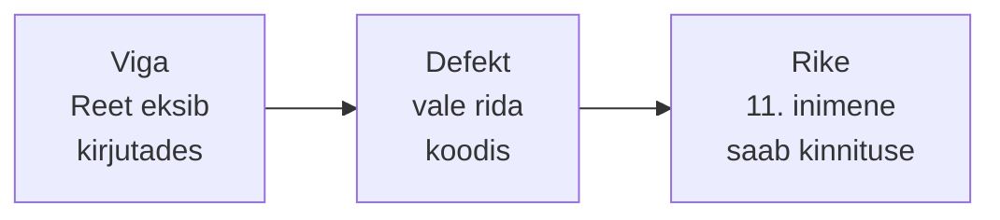

# 1. Testimise terminoloogia

::: info Õpiväljund
Pärast tundi oskad eristada vea, defekti ja rikke, kirjeldada testjuhtumit ning selgitada, mille poolest erinevad testimine ja silumine ning verifitseerimine ja valideerimine (HK 1.1).
:::

Kaarel alustab esimesel tööpäeval Tammelaan Tarkvaras. Rannamõisa broneerimisrakenduse esimene versioon on testkeskkonnas. Ühe päeva jooksul kuuleb ta ühe ja sama asja kohta viit eri sõna:

- Reet ütleb: "Leidsin **bugi** broneerimise funktsioonist."
- Tiit kirjutab ülesandekirjeldusse: "**Defekt** #12."
- Anu helistab: "Rakendus **ei tööta**, mulle kinnitati täis töötuba."
- Mihkel ütleb: "Serveris **viga** ei ole."
- Kaarel ise kirjutab märkmikku: "**Veateade**?"

Kas nad räägivad samast asjast? Osaliselt jah, aga täpselt mitte. Selle kohtumise lõpuks oskad iga lause jaoks öelda, millest täpselt räägitakse.

## Ühe vea lugu

Reet kirjutas broneerimise kontrolli:

```js
if (broneeringuid <= kohti) {
  salvestaBroneering();
}
```

Töötoas on **10 kohta** ja 10 broneeringut on juba tehtud. Üheteistkümnes inimene proovib broneerida. Tingimus `10 <= 10` on tõene ja süsteem kinnitab broneeringu. Töötoas on nüüd 11 inimest 10 koha peal.

Siin on kolm erinevat asja:

| Mõiste | Mis see siin on | Kes seda näeb |
| --- | --- | --- |
| **Viga** (*error*, *mistake*) | Reeda **eksimus**: kirjutas `<=` asemel `<` | Keegi ei näe, see on inimese peas |
| **Defekt** (*defect*, *fault*, *bug*) | Rida `<=` **koodis**, mis ei vasta nõudele | Arendaja koodi lugedes |
| **Rike** (*failure*) | Kasutaja näeb **vale tulemust**: täis töötuba kinnitati | Kasutaja ja testija |



Oluline mõte: **defekt ei pruugi rikkeks muutuda**. Kui keegi ei broneeri kunagi täis töötuba, jääb rida `<=` koodi, aga rikke ei teki. Rike tekib alles siis, kui kood **jookseb** olukorras, kus defekt on mõjus.

Nüüd saab Kaarel tagasi päeva viie lause juurde:

| Kes ütles | Mida see tähendab |
| --- | --- |
| Reet: "Leidsin bugi" | Defekt koodis |
| Tiit: "Defekt #12" | Sama defekt, kirja pandud |
| Anu: "Ei tööta" | Rike, mille kasutaja nägi |
| Mihkel: "Serveris viga ei ole" | Ta kontrollis keskkonda: serveri tase on korras, defekt on koodis |
| Kaarel: "Veateade?" | Peab täpsustama, kas ta pidas silmas rikke kirjeldust (veaaruanne) või defekti |

## Testimine ja silumine

Kaarel leiab rikke ja annab selle Reedale. Reet otsib koodist üles rea ja parandab. Kas mõlemad tegid testimist?

| Tegevus | Kes | Eesmärk |
| --- | --- | --- |
| **Testimine** (*testing*) | Testija (või arendaja) | **Leida rikkeid** ja anda infot kvaliteedist |
| **Silumine** (*debugging*) | Arendaja | **Leida defekt koodist** ja see parandada |

Testimine näitab, **et midagi on valesti**. Silumine otsib, **kus** see on ja parandab. Parandust kontrollib omakorda taas testimine (vt [kohtumine 7](./kohtumine-07-testituubid)).

## Testjuhtum

**Testjuhtum** (*test case*) on konkreetne kontroll: mis olukorras mida tehakse ja mida oodatakse.

Kaareli esimene testjuhtum:

| Väli | Väärtus |
| --- | --- |
| Nimi | Täis töötuba ei võta enam broneeringuid |
| Eeltingimus | Töötoas on 10 kohta, 10 on broneeritud |
| Sisend | Kasutaja üritab teha 11. broneeringu |
| **Ootustulemus** | Süsteem keeldub ja näitab teadet "Töötuba on täis" |
| Tegelik tulemus | Süsteem kinnitas broneeringu |
| Tulemus | **Ebaõnnestus** (*failed*) |

Ootustulemus tuleb **enne** testi tegemist teada. Ilma selleta ei ole võimalik kokku leppida, kas tulemus on õige. Seda allikat, mille järgi ootustulemus otsustatakse (nõuded, spetsifikatsioon, kliendi sõnad), nimetatakse **testioraakliks** (*test oracle*).

## Terminite kaart

| Termin | Eesti keeles | Tähendus | Näide Rannamõisalt |
| --- | --- | --- | --- |
| Test object | Testobjekt | Mida testime | Broneerimise funktsioon |
| Test basis | Testi alus | Millest testid tuletatakse | Kliendi nõue "täis töötuba ei võta broneeringuid" |
| Test condition | Testitingimus | Mida kontrollida | Töötuba täis |
| Test case | Testjuhtum | Konkreetne kontroll | Tabel eespool |
| Test suite | Testikomplekt | Seotud testjuhtumite rühm | Kõik broneerimise testid |
| Test data | Testandmed | Andmed, mida test kasutab | Töötuba 10 kohaga, 10 broneeringut |
| Test environment | Testkeskkond | Kus testi tehakse | Rannamõisa test-server, mitte päris |
| Test oracle | Testioraakel | Allikas, mis ütleb, mis on õige | Nõue, spetsifikatsioon |
| Test run | Testimise käitamine | Testide ühekordne läbiviimine | Reedene käitamine |
| Passed / Failed | Läbis / ebaõnnestus | Tegelik tulemus = ootustulemus või mitte | Ebaõnnestus |

## Verifitseerimine ja valideerimine

Kaarel loeb Rannamõisa nõudeid. Üks lause ütleb: "Broneerija saab kinnituse e-postiga". Rakendus saadab kinnituse ja see töötab täpselt nii, nagu nõue ütleb. Anu vaatab seda ja ütleb: "Aga mu kliendid on vanemad inimesed, paljudel pole e-posti, nad helistavad."

| Küsimus | Nimi | Vastus siin |
| --- | --- | --- |
| Kas me ehitasime asja **õigesti** (nõude järgi)? | **Verifitseerimine** (*verification*) | Jah, e-kiri töötab |
| Kas me ehitasime **õige asja** (kliendi vajaduse järgi)? | **Valideerimine** (*validation*) | Ei, vajadus oli laiem |

Testimine peab kontrollima mõlemat. Ainult nõuete täitmisest ei piisa, kui nõue ise oli vale või puudulik. See on ka ISTQB seitsmes põhimõte (vt [kohtumine 4](./kohtumine-04-pohimotted)).

## Staatiline ja dünaamiline

Kaarel saab ka nõuete dokumendi ja loeb seda enne, kui koodi on kirjutatud. Ta leiab, et üks lause on vastuoluline. Kas see on testimine?

- **Staatiline testimine**: tööprodukti kontrollitakse **ilma seda käivitamata** (nõuete lugemine, koodi ülevaatus).
- **Dünaamiline testimine**: tarkvara **käivitatakse** ja vaadatakse, mida see teeb.

Mõlemad on testimine. Täpsemalt vaatame neid [kohtumisel 6](./kohtumine-06-staatiline-ja-dunaamiline).

## Kokkuvõte

| Mõiste | Tähendus |
| --- | --- |
| Viga | Inimese eksimus |
| Defekt | Viga koodis või dokumendis |
| Rike | Defekti nähtav tagajärg töötava süsteemi juures |
| Testimine | Rikete leidmine ja kvaliteedi hindamine |
| Silumine | Defekti leidmine ja parandamine |
| Testjuhtum | Eeltingimus, sisend ja ootustulemus |
| Verifitseerimine | Kas ehitasime õigesti |
| Valideerimine | Kas ehitasime õige asja |

Kolm mõtet:

- **Ära ütle kõigele "bugi".** Eralda, kas räägid inimese eksimusest, vigasest reast või kasutaja nähtavast probleemist.
- **Ootustulemus tuleb enne testi.** Muidu ei ole testil mõtet.
- **Testimine ja silumine on eri tööd.**

## Lisa oma testiplaanile

Koosta **sõnastik** Rannamõisa rakenduse jaoks. Võta viis terminit tabelist "Terminite kaart" ja kirjuta igaühe jaoks **oma näide** broneerimisrakendusest (mitte kopeeri minu omasid). Lisa üks täielik testjuhtum.

## Allikad

- [ISTQB Certified Tester Foundation Level Syllabus v4.0.1](https://istqb.org/certifications/certified-tester-foundation-level-ctfl-v4-0/): viga, defekt ja rike; testimine ja silumine; testjuhtum; testioraakel.
- [ISTQB sõnastik](https://glossary.istqb.org/): terminite täpsed määratlused.
- [Vikipeedia: Tarkvara testimine](https://et.wikipedia.org/wiki/Tarkvara_testimine): verifitseerimine ja valideerimine, staatiline ja dünaamiline testimine.
- Rannamõisa Käsitöökeskus, Tammelaan Tarkvara, koodinäide ja nimed on väljamõeldud.
