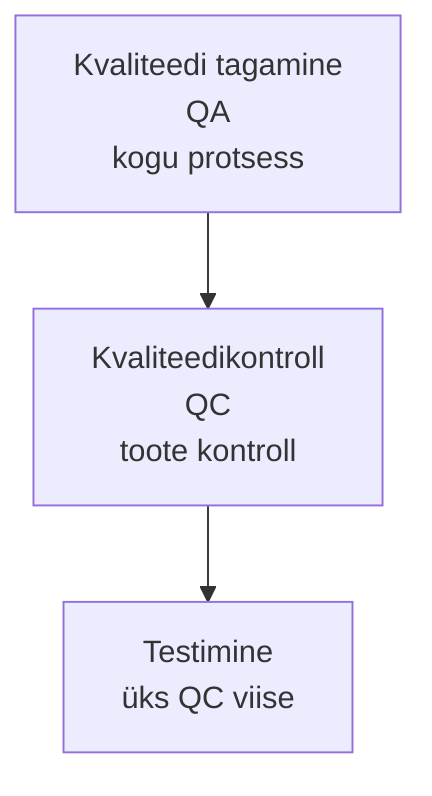

# 2. Testimine kvaliteedi kindlustamiseks

::: info Õpiväljund
Pärast tundi oskad selgitada, miks tarkvara testitakse, eristada QA-d, QC-d ja testimist ning nimetada tarkvara kvaliteediomadusi (HK 1.1).
:::

Teisipäeva hommikul helistab Anu Tiidule. Käsitöökeskuses oli eelmisel õhtul keraamikatöötuba, kuhu mahub 10 inimest. Kohale tuli 11. Tiit ütleb Kaarelile: "Ära loe seda enam veaks. See on ettevõtte probleem. Anu kaotas töötoa jaoks kõik materjalid ja kaks kliendi arvustust."

Kaarel küsib: "Kuidas me oleksime pidanud seda teadma?" Tiit vastab: "Testima. Aga ütle, mida see tegelikult tähendab?"

## Mis on kvaliteet?

Anu ei küsi, kas kood on ilus. Ta küsib: "Kas rakendus teeb seda, mida ma temalt vajan?" Tarkvara kvaliteedil on seetõttu kaks poolt:

| Pool | Küsimus | Näide |
| --- | --- | --- |
| **Nõuetele vastavus** | Kas tehtud on see, mis kokku lepiti? | Broneering salvestub, kinnitus läheb e-postile |
| **Sobivus kasutuseks** | Kas see aitab kasutajat tema töös? | Vanem inimene saab ka ilma e-postita broneerida |

Kui kumbki pool puudub, ei ole tarkvara hea, ükskõik kui puhas kood on.

## Kvaliteedi tagamine, kvaliteedikontroll ja testimine

Need kolm sõna lähevad sageli segamini. Kaarel teeb endale joonise:

| Mõiste | Fookus | Küsimus | Rannamõisa näide |
| --- | --- | --- | --- |
| **Kvaliteedi tagamine** (*quality assurance*, QA) | **Protsess**: kuidas me töötame | Kas töötame viisil, mis väldib vigu? | Kõik nõuded kirjutatakse üles. Kood läheb ülevaatusele. Iga muudatus saab testi |
| **Kvaliteedikontroll** (*quality control*, QC) | **Toode**: mida oleme teinud | Kas valminud asi vastab nõuetele? | Valmis versioon kontrollitakse enne Anule andmist |
| **Testimine** | Tarkvara **käivitamine või lugemine** vigade leidmiseks | Kas see käitub õigesti? | Kaareli testjuhtum täis töötoa kohta |

Lühidalt: **QA hoiab vigu ära, QC leiab need üles, testimine on peamine QC töövahend.** Seda sõnastust kasutab ka ISTQB: testimine on osa laiemast kvaliteedihaldusest.

## Miks testida?

ISTQB toob välja, mille jaoks testimine on:

| Eesmärk | Rannamõisa näide |
| --- | --- |
| Leida defekte | Täis töötuba võtab veel broneeringuid |
| Hinnata kvaliteeti | Mitu probleemi on järel enne väljalaset? |
| Vähendada riski | Anu ei kaota raha ega klientide usaldust |
| Kontrollida nõuete täitmist | Kas kinnitus tuleb e-postile? |
| Anda infot otsustajatele | Tiit saab otsustada, kas anda versioon Anule |
| Tekitada usaldust | Anu julgeb reklaamida veebibroneeringut |

Testimine ei tee tarkvara paremaks. Testimine **annab infot**, mille põhjal arendajad parandavad ja juhid otsustavad.

## Kvaliteediomadused: ISO/IEC 25010

"Kvaliteet" on liiga lai sõna. Selle täpsustamiseks on standard **ISO/IEC 25010**, mis jagab tarkvaratoote kvaliteedi **omadusteks**. 2023. aasta väljaandes on neid üheksa:

| Omadus | Küsimus | Rannamõisa näide |
| --- | --- | --- |
| Funktsionaalne sobivus | Kas funktsioonid teevad õiget asja? | Broneering kontrollib vabu kohti |
| Jõudlus | Kas on piisavalt kiire ja ressursisäästlik? | Leht avaneb ka 200 külastaja korral |
| Ühilduvus | Kas töötab teiste süsteemidega koos? | Töötab Chrome'is, Safaris ja telefonis |
| Suhtlemisvõime (*interaction capability*) | Kas kasutajal on lihtne ja kasutaja vigade eest kaitstud? | Vanem kasutaja saab broneeringu ilma abita |
| Töökindlus | Kas töötab pidevalt ja taastub rikkest? | Server taaskäivitub ja broneeringud säilivad |
| Turvalisus | Kas andmed on kaitstud? | Teise kasutaja broneeringut ei saa vaadata |
| Hooldatavus | Kas koodi on lihtne muuta? | Uue töötoa tüüp lisatakse ühes kohas |
| Paindlikkus | Kas saab kohandada uute keskkondadega? | Rakenduse saab viia teise serverisse |
| Ohutus (*safety*) | Kas see väldib kahju inimestele ja keskkonnale? | Rannamõisa jaoks pole kriitiline, haigla seadmetele oluline |

Ohutus on uus omadus võrreldes 2011. aasta väljaandega. Samuti muutusid nimed (varasem "kasutatavus" on nüüd "suhtlemisvõime", "teisaldatavus" on "paindlikkus"). Täpsemalt arutame [kohtumisel 7](./kohtumine-07-testituubid) ja [9](./kohtumine-09-standardid).

**Kõiki omadusi ei ole võimalik ühtemoodi maksimeerida.** Anu soov on, et rakendus oleks odav ja kiire. Kaarel küsib: "Mis on olulisem: kiirus, turvalisus või hind?" Seda otsust ei tee testija ise, vaid koos kliendiga. Valik sõltub riskist.

## Päris juhtumid: mis juhtub, kui ei testita

### Ariane 5, 1996

4. juunil 1996 lendas Euroopa kosmoseagentuuri uus raketilaev Ariane 5 esimesel katselennul. Umbes **37 sekundit** pärast käivitust kaotas raketi juhtimissüsteem asukoha- ja suunainfo ja rakett lagunes. Uurimiskomisjoni järgi põhjustas selle **spetsifikatsiooni- ja disainiviga** tarkvaras: kood oli üle võetud vanemast Ariane 4 raketist, kus kiirused olid väiksemad. Uue raketi suurem kiirus ületas arvuvahemiku, tekkis erand ja süsteem lülitus välja. Varusüsteem jooksis samal koodil ja kukkus samamoodi.

Õppetund testija jaoks: **vana koodi uues keskkonnas tuleb uuesti testida**. See, et kood töötas vanas süsteemis, ei tõesta midagi uue kohta.

### Knight Capital, 2012

1. augustil 2012 paigaldas USA börsifirma Knight Capital uue tarkvara. Seitsmele serverile kaheksast uuendus jõudis, ühele mitte. Kaheksandal serveril aktiveerus vana, kasutamata funktsioon ja see hakkas tuhandeid soovimatuid tehinguid tegema. Umbes **45 minuti** jooksul kaotas ettevõte ligikaudu **440 miljonit USA dollarit** (hilisemad hinnangud ulatuvad üle 460 miljoni) ja pidi otsima päästerahastust.

Õppetund: **paigaldust tuleb samuti kontrollida**. Test ei lõpe koodi valmimisega.

## Kui palju maksab viga?

Üldlevinud väide on, et mida hiljem viga leitakse, seda kallim selle parandamine on. See on loogiline: viga nõuetes, mis avastatakse enne kirjutamist, maksab ühe lause muutmise. Sama viga, mis avastatakse pärast väljalaset, maksab koodi, testide, paigalduse ja klientide usalduse.

Täpseid kordajaid (nt "100 korda kallim") tuleb kasutada ettevaatlikult. Need pärinevad vanadest uuringutest ja tänapäevases pideva tarnimise keskkonnas varieeruvad. Seetõttu ei kasuta me siin numbrit. Olulisem on mõte: **mida varem viga leitakse, seda odavam on seda parandada**. USA standardite ja tehnoloogia instituut NIST hindas 2002. aastal, et ebapiisav testimine maksis USA majandusele aastas ligikaudu 59,5 miljardit dollarit. See on vana hinnang, aga näitab suurusjärku.

## Kokkuvõte

| Mõiste | Tähendus |
| --- | --- |
| Kvaliteet | Nõuetele vastavus ja sobivus kasutuseks |
| QA | Protsess, mis hoiab vigu ära |
| QC | Toote kontroll |
| Testimine | Peamine QC töövahend, annab infot |
| ISO/IEC 25010 | Standard, mis jagab kvaliteedi üheksaks omaduseks |

Kolm mõtet:

- **Testimine annab infot, mitte kvaliteeti.** Kvaliteet tekib kogu protsessist.
- **Kvaliteet on mitu asja korraga** ja tuleb ära valida, mis konkreetses projektis kõige olulisem on.
- **Uus keskkond tähendab uut testi**, isegi kui kood on vana (Ariane 5), ja ka paigaldus vajab kontrolli (Knight Capital).

## Lisa oma testiplaanile

Vali ISO/IEC 25010 üheksast omadusest **kolm, mis on Rannamõisa rakenduse jaoks kõige olulisemad**, ja põhjenda. Lisa iga omaduse juurde üks kontrollitav küsimus (nt "Kas leht avaneb alla 3 sekundiga 100 külastaja korral?").

## Allikad

- [ISO/IEC 25010:2023 (ISO)](https://www.iso.org/standard/78176.html): tarkvaratoote kvaliteedimudel, üheksa omadust.
- [Sonar: ISO/IEC 25010 selgitus](https://www.sonarsource.com/resources/library/iso-iec-25010-explained/): omaduste loend ja muutused eelmise väljaandega võrreldes.
- [ESA: Ariane 501 uurimiskomisjoni aruanne](https://www.esa.int/Newsroom/Press_Releases/Ariane_501_-_Presentation_of_Inquiry_Board_report): põhjus ja ajakava.
- [ESA Bulletin 89: Ariane 5, Learning from Flight 501](https://sma.nasa.gov/LaunchVehicle/assets/esa-bulletin-number-89.pdf) ja [Vikipeedia: Ariane flight V88](https://en.wikipedia.org/wiki/Ariane_flight_V88): üksikasjad.
- [Knight Capital Groupi dokument USA väärtpaberiregulaatorile (SEC)](https://www.sec.gov/Archives/edgar/data/0001060749/000119312512341182/d392788d424b3.htm): 1. augusti 2012 intsident ja kahjum.
- [Vikipeedia: Tarkvara testimine](https://et.wikipedia.org/wiki/Tarkvara_testimine): NIST 2002 hinnang.
- Rannamõisa Käsitöökeskus ja kõik tegelased on väljamõeldud.
