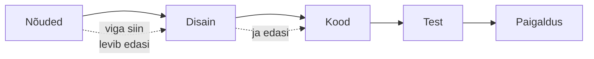
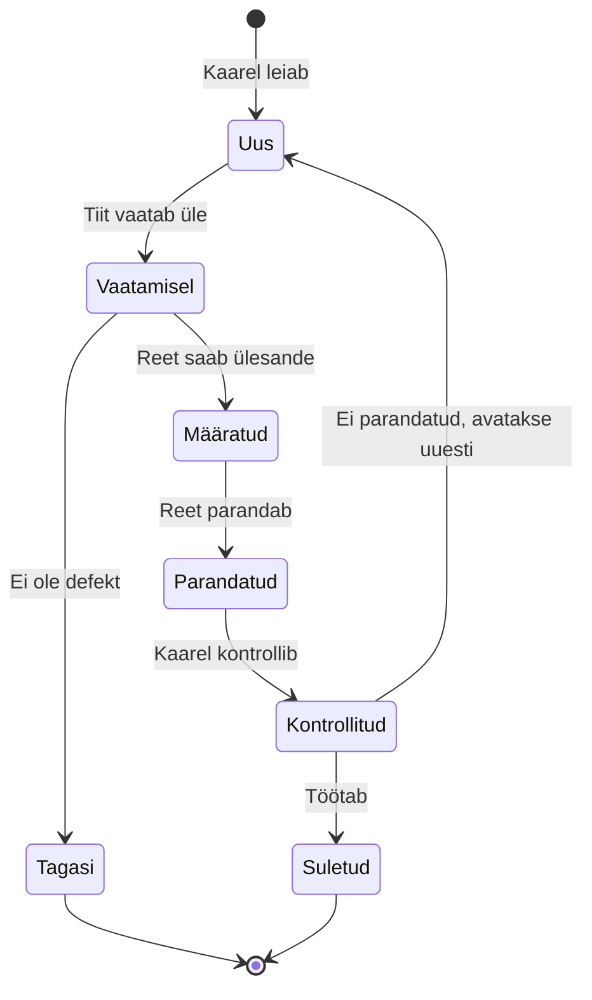

# 3. Vigade tekkimine ja veaaruanne

::: info Õpiväljund
Pärast tundi oskad nimetada vigade tekkimise põhjusi, eristada defekti tõsidust ja prioriteeti ning kirjutada selge veaaruande (HK 1.1).
:::

Eelmise nädala täis töötoa probleemi parandas Reet kiiresti: `<=` asemel `<`. Siis küsib Tiit Kaarelilt: "Kust see viga tekkis? Kui me seda ei tea, teeme sama viga järgmises kohas uuesti."

Kaarel hakkab uurima. Selgub, et asi ei olnud ainult Reeda näpuviga.

## Kust defektid tulevad

Kaarel vaatab läbi Rannamõisa projekti esimesed kümme defekti ja jagab need põhjuse järgi:

| Põhjus | Mida see tähendab | Rannamõisa näide |
| --- | --- | --- |
| **Nõuete viga** | Nõue on puudulik, vastuoluline või vale | Nõue ütleb "10 kohta", aga ei ütle, kas juhendaja loeb ka |
| **Disaini viga** | Lahenduse plaan ei toimi | Kaks inimest broneerivad samal ajal viimast kohta, plaan ei võta seda arvesse |
| **Koodi viga** | Arendaja eksib kirjutades | `<=` asemel `<` |
| **Andmete viga** | Valed või ootamatud andmed | Töötoa nimes on emoji ja kinnituskiri läheb katki |
| **Keskkonna viga** | Seadistus erineb testis ja päris süsteemis | Test-serveris on ajavöönd UTC, päris serveris Eesti aeg |
| **Muudatuse mõju** | Uus kood rikub vana | Tühistamise lisamine rikub kohtade arvutuse |
| **Suhtlusviga** | Meeskond mõistab asja erinevalt | Reet ja Anu mõistavad sõna "broneering" erinevalt |
| **Testimise viga** | Test ise on vale | Testjuhtum ootab 11 kohta, nõue ütleb 10 |

Esimesel pilgul tundub, et koodi vead on kõige tavalisemad. Tegelikult tulevad paljud defektid **enne koodi**: nõuetest ja disainist. Ariane 5 juhtum [kohtumiselt 2](./kohtumine-02-kvaliteet) oli spetsifikatsiooni- ja disainiviga: vana kood sobis vanasse rakettu, aga uue raketi vajadusi ei vaadatud üle.

Vead **levivad**: viga nõudes muutub vigaseks disainiks, vigaseks koodiks ja vigaseks testiks. Seega aitab **nõuete lugemine** (staatiline testimine) leida defekte enne koodi (vt [kohtumine 6](./kohtumine-06-staatiline-ja-dunaamiline)).

## Miks inimesed eksivad?

Reet ei ole halb arendaja. ISTQB toob välja, et defektid tekivad, sest:

- inimesed teevad vigu (väsimus, kiire, tähelepanematus);
- ajasurve (tähtaeg on reedel);
- keerukad süsteemid, kus üks inimene ei näe tervikut;
- uued tehnoloogiad, mida ei ole veel tuntud;
- eelmise muudatuse kõrvalmõjud;
- keskkonnatingimused (kiirgus, elektromagnetilised häired), mis mõjutavad seadmeid.

Veast **ei saa süüdistada inimest**. Süüdistav kultuur viib selleni, et vigu varjatakse. Hea meeskond küsib: "Mis protsessis lasi selle läbi?"

## Defekti elutsükkel

Kaarel leiab uue defekti. Mis sellest edasi saab? Tammelaanes on lihtne elutsükkel:

Teadmiseks: iga ettevõte kasutab natuke teisi olekuid. Aga enamikus on **leidmine, ülevaatus, parandus, kontroll ja sulgemine**. Parandust kontrollib tavaliselt keegi teine kui arendaja, sest see, kes parandas, ei pruugi näha oma eksimust.

## Tõsidus ja prioriteet

Reet küsib: "Missuguse defekti ma esimesena parandan?" Selle jaoks on kaks eri küsimust:

| Mõiste | Küsimus | Kes otsustab |
| --- | --- | --- |
| **Tõsidus** (*severity*) | Kui tõsine on mõju süsteemile? | Testija, tehnilise mõju järgi |
| **Prioriteet** (*priority*) | Kui kiiresti peame parandama? | Äri (Tiit, Anu), olukorra järgi |

Need ei ole sama asi:

| Näide | Tõsidus | Prioriteet | Miks |
| --- | --- | --- | --- |
| Täis töötuba võtab broneeringuid | Kõrge | Kõrge | Kliendid saavad kahju |
| Avalehe pealkirjas on kirjaviga "Keramika" | Madal | Kõrge, kui kampaania algab homme | Äri jaoks oluline, ettevõtte nimi on avalikult nähtav |
| Admin-lehe aruanne jookseb kokku, kui valida aasta 2099 | Kõrge | Madal | Keegi seda ei tee |

Testija pakub tõsiduse. Prioriteedi määrab äri.

## Hea veaaruanne

Reet ei saa defekti parandada, kui ta ei saa seda taasesitada. Kaarel kirjutab kaks aruannet. Esimene:

> Broneerimine ei tööta.

Teine:

| Väli | Sisu |
| --- | --- |
| **Pealkiri** | Täis töötuba (10/10) võtab vastu 11. broneeringu |
| **Keskkond** | Test-server, Chrome 130, Windows 11, versioon 0.3.2 |
| **Eeltingimus** | Töötuba "Keraamika alused" on 10 kohaga, 10 broneeringut tehtud |
| **Sammud** | 1. Ava töötoa leht. 2. Vajuta "Broneeri". 3. Sisesta nimi ja e-post. 4. Vajuta "Kinnita" |
| **Oodatud tulemus** | Teade "Töötuba on täis", broneeringut ei salvestata |
| **Tegelik tulemus** | Kuvatakse "Broneering kinnitatud", andmebaasis on 11 broneeringut |
| **Tõsidus** | Kõrge |
| **Tõendid** | Ekraanipilt, andmebaasi päringu väljund |

Teine aruanne on hea, sest Reet saab selle järgi **kolme minutiga taasesitada**. Hea aruande reeglid:

- ühes aruandes **üks defekt**;
- pealkiri ütleb, **mis on valesti** (mitte "viga");
- sammud on nii täpsed, et sa ise saad neid sooritada teise inimese arvutis;
- **oodatud ja tegelik** on kõrvuti;
- ei sisalda süüdistust ega arvamust ("Reet unustas...").

## Defektide koondumine

Kaarel märkab, et kümnest defektist **kuus** tulevad broneerimise ühest moodulist. Seda nimetatakse **defektide koondumiseks** (*defect clustering*), see on üks ISTQB seitsmest põhimõttest (vt [kohtumine 4](./kohtumine-04-pohimotted)). Kui üks moodul on vigane, on seal ilmselt rohkem vigu. Testija lisab sinna rohkem teste.

## Kokkuvõte

| Mõiste | Tähendus |
| --- | --- |
| Defekti allikas | Nõuded, disain, kood, andmed, keskkond, muudatus, suhtlus, test |
| Defekti elutsükkel | Uus, ülevaatus, määratud, parandatud, kontrollitud, suletud |
| Tõsidus | Mõju süsteemile, testija hinnang |
| Prioriteet | Parandamise kiirus, äri otsus |
| Veaaruanne | Pealkiri, keskkond, sammud, oodatud, tegelik, tõendid |

Kolm mõtet:

- **Defektid tekivad ka enne koodi.** Nõuded ja disain on sama sagedased allikad.
- **Tõsidus ja prioriteet on eri asjad.** Üks on tehniline, teine ärialane.
- **Hea veaaruanne on taasesitatav.** Kui arendaja ei saa defekti näha, ei saa ta seda parandada.

## Lisa oma testiplaanile

1. Koosta **riskikaart**: võta tabel "Kust defektid tulevad" ja iga rea juurde kirjuta üks Rannamõisa rakendusele sobiv defekt.
2. Kirjuta **kaks veaaruannet** (mustandid) kahe oma riskikaardi defekti kohta. Kasuta tabeli kõiki välju.
3. Määra kummalegi tõsidus ja prioriteet ning põhjenda, miks need võivad erineda.

## Allikad

- [ISTQB Certified Tester Foundation Level Syllabus v4.0.1](https://istqb.org/certifications/certified-tester-foundation-level-ctfl-v4-0/): defektide põhjused, defekti elutsükkel ja veaaruande sisu.
- [ISTQB sõnastik: severity, priority, defect report](https://glossary.istqb.org/): määratlused.
- [ESA: Ariane 501 uurimiskomisjoni aruanne](https://www.esa.int/Newsroom/Press_Releases/Ariane_501_-_Presentation_of_Inquiry_Board_report): spetsifikatsiooni- ja disainiviga.
- Rannamõisa projekt, defektid, nimed ja versiooninumbrid on väljamõeldud. Defekti elutsükkel on tüüpiline näide, mitte standard.
