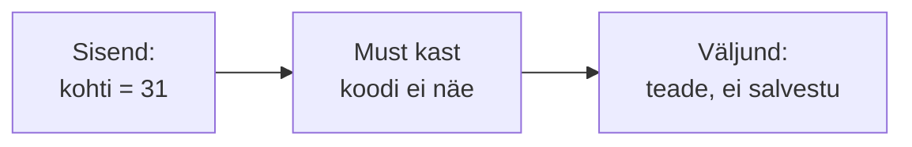
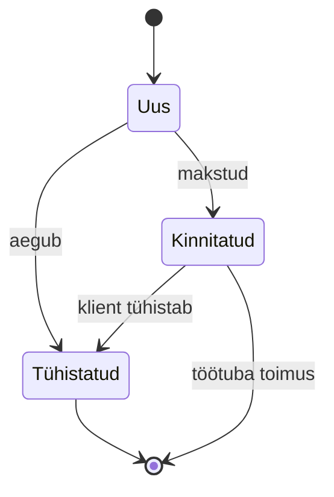

# 5. Testimise meetodid: valge, must ja hall kast

::: info Õpiväljund
Pärast tundi oskad eristada valge, musta ja halli kasti meetodit, koostada testjuhtumeid ekvivalentsiklasside ja piirväärtuste järgi ning selgitada koodikatvuse mõtet (HK 1.1).
:::

Reet kirjutab töötoa loomise funktsiooni. Administraator määrab töötoale kohtade arvu. Nõue ütleb: **kohti peab olema 1 kuni 30**. Reet viskab Kaarelile ülesande: "Testi seda."

Kaarel küsib: "Kas ma võin su koodi vaadata?" Reet vastab: "Võid, aga proovi esmalt ilma." Nii tekib kaks erinevat lähenemist samale funktsioonile.

## Must kast: koodi ei vaadata

Kaarel avab rakenduse ja täidab vormi. Ta ei tea, kuidas kood on kirjutatud. Ta teab ainult **nõuet**: sisend ja ootus.

**Mustkasti testimine** (*black-box testing*) tuletab testid **nõuetest ja spetsifikatsioonist**, mitte koodist. Süsteem on "must kast": sisend läheb sisse, tulemus tuleb välja.



Mustkasti testimise kaks põhitehnikat:

### Ekvivalentsiklassid

Kaarel ei saa proovida kõiki arve 1 kuni 30 ja veel miljoneid teisi. Aga ta märkab, et paljud arvud käituvad **samamoodi**. Kui süsteem tunneb 5 ära kehtiva kohtade arvuna, tunneb ta tõenäoliselt ära ka 6, 7 ja 12. Samamoodi on kõik väiksemad kui 1 "mittesobivad".

Selliseid rühmi nimetatakse **ekvivalentsiklassideks** (*equivalence partitions*):

| Klass | Väärtused | Ootus | Esindaja |
| --- | --- | --- | --- |
| Liiga väike | alla 1 (0, −5) | Viga | 0 |
| **Sobiv** | 1 kuni 30 | Salvestub | 15 |
| Liiga suur | üle 30 (31, 100) | Viga | 31 |
| Ei ole arv | "kümme", tühi väli | Viga | "abc" |

Igast klassist piisab **ühest** testist. Nii asendub tuhandeid võimalikke sisendeid nelja testiga.

### Piirväärtused

Kaarel loeb ISTQB õppekavast, et vead tekivad kõige sagedamini **piiril**. Reeda `<=` viga oli täpselt sellises kohas. Seega valib ta väärtused klasside piiridelt:

| Piir | Testväärtus | Ootus |
| --- | --- | --- |
| Alumine piir | 0 | Viga |
| Alumine piir | **1** | Salvestub |
| Alumine piir | 2 | Salvestub |
| Ülemine piir | 29 | Salvestub |
| Ülemine piir | **30** | Salvestub |
| Ülemine piir | **31** | Viga |

Kuus väärtust katavad kõik, kus programmeerijad kõige sagedamini eksivad (`<` vs `<=`, `>` vs `>=`). Seda nimetatakse **piirväärtusanalüüsiks** (*boundary value analysis*).

### Veel mustkasti tehnikaid

| Tehnika | Millal kasutada | Näide |
| --- | --- | --- |
| **Otsustustabel** | Mitu tingimust annavad erineva tulemuse | Soodustus: õpilane, pensionär, püsiklient |
| **Olekuüleminek** | Objekt liigub olekute vahel | Broneering: uus, kinnitatud, tühistatud |
| **Kasutusjuhtumid** | Kasutaja eesmärk samm-sammult | Kasutaja otsib töötoa ja broneerib |

Rannamõisa broneeringu olekud (olekuüleminek):



Testid kontrollivad nii lubatud üleminekuid (uus → kinnitatud) kui ka **keelatuid** (tühistatud → kinnitatud ei tohi minna).

## Valge kast: kood on nähtav

Nüüd vaatab Kaarel Reeda koodi:

```js
function looTootuba(kohti) {
  if (kohti < 1) {
    return { viga: "Kohti peab olema vähemalt 1" };
  }
  if (kohti > 30) {
    return { viga: "Kohti võib olla kuni 30" };
  }
  return salvesta(kohti);
}
```

**Valgekasti testimine** (*white-box testing*) tuletab testid **koodi ülesehitusest**. Tester näeb sisemust ja küsib: "Kas iga haru on testitud?"

Siin on kolm teed: `kohti < 1`, `kohti > 30` ja salvestamine. Kolm testi (0, 31, 15) läbivad **kõik read**.

### Koodikatvus

**Koodikatvus** (*code coverage*) ütleb, kui suur osa koodist on testidega läbi käidud. Kaks tavalist mõõtu:

| Mõõt | Tähendus | Näide |
| --- | --- | --- |
| **Lausekatvus** (*statement coverage*) | Mitu protsenti **ridu** on käivitatud | Testid 0, 31, 15 käivitavad kõik read, katvus 100% |
| **Harukatvus** (*branch coverage*) | Mitu protsenti **otsustuskohtade tulemusi** (tõene/väär) on proovitud | Iga `if` peab olema nii tõene kui väär |

Kõrge katvus **ei tähenda** häid teste. Reeda esialgse koodi `<=` oleks saanud 100% lausekatvuse ja jäänud siiski avastamata, kui testis ei oleks proovitud täpselt piiri. Katvus ütleb, **mida ei ole testitud**, mitte seda, et testitu on hea. (Siin tuleb tagasi [kohtumise 4](./kohtumine-04-pohimotted) põhimõte 1.)

## Hall kast: natuke teadmist

Kaarel kontrollib API kaudu, kas töötuba tõesti salvestus. Ta ei loe koodi, aga **vaatab andmebaasi** ja teab, et tabelis on kolm veergu. Talle on teada rakenduse ülesehitus ja andmebaasi struktuur, ent mitte iga rida koodi.

**Hallkasti testimine** (*grey-box testing*) kombineerib mõlemat: tester teab **osa sisemusest** (andmebaasi skeem, API struktuur, arhitektuur) ja tuletab selle põhjal paremaid teste, kuid testib väljastpoolt.

## Kolm meetodit kõrvuti

| | Must kast | Valge kast | Hall kast |
| --- | --- | --- | --- |
| Mida testija teab | Ainult nõuded | Kogu kood | Nõuded ja osa ülesehitusest |
| Testide alus | Spetsifikatsioon | Koodi struktuur | Spetsifikatsioon ja arhitektuur |
| Kes tavaliselt teeb | Testija, kasutaja | Arendaja | Testija, integratsioonitestija |
| Tehnikad | Ekvivalentsiklass, piirväärtus, otsustustabel | Lause- ja harukatvus | API testid, andmebaasi kontroll |
| Tugevus | Leiab puuduvad ja valesti mõistetud nõuded | Leiab kasutamata koodi ja haruvead | Leiab integratsiooni vigu |
| Nõrkus | Ei näe, mida kood teeb | Ei leia nõuet, mida pole kirjutatud | Vajab arhitektuuri teadmist |

Ükski meetod ei asenda teist. Kaarel kasutab neid koos: musta kasti testidega leiab ta, et nõue "1 kuni 30" on täidetud, valge kastiga näeb, et ülempiiri 30 kontrollitakse ainult selles ühes funktsioonis, mitte näiteks töötoa muutmise vormis. Selle koha peale teeb ta uue testi.

## Kogemuspõhine testimine

Peale tehnikaid on ka **kogemuspõhine testimine**. Kaarel istub rakenduse taha ja proovib tegevusi, mida skriptis ei ole: tühistab kaks korda, vajutab nuppu topelt, sisestab emoji. Seda nimetatakse **uurivaks testimiseks** (*exploratory testing*). See on vastus põhimõttele 5 (pestitsiidiparadoks): teste tuleb uuendada.

## Kokkuvõte

| Mõiste | Tähendus |
| --- | --- |
| Must kast | Testid nõuete põhjal, kood ei ole nähtav |
| Valge kast | Testid koodi struktuuri põhjal |
| Hall kast | Testid nõuete ja osalise ülesehituse põhjal |
| Ekvivalentsiklass | Sisendite rühm, mis käitub samamoodi, piisab ühest testist |
| Piirväärtus | Klassi piir, kus vead sagedamini tekivad |
| Katvus | Kui suur osa koodist on testitud |

Kolm mõtet:

- **Piirid on kõige riskantsemad.** Testi alati kehtiva vahemiku äärmusi ja nende naabreid.
- **Katvus näitab, mida ei testitud**, mitte seda, et testid on head.
- **Kasuta meetodeid koos.** Iga meetod leiab teist tüüpi defekte.

## Lisa oma testiplaanile

Võta Rannamõisa rakenduse väli "osalejate arv broneeringul" (1 kuni 10). Koosta:

1. ekvivalentsiklasside tabel;
2. piirväärtuste tabel (vähemalt 6 väärtust);
3. üks olekuüleminekute joonis broneeringu kohta ja kaks keelatud üleminekut, mida testid kontrollivad.

## Allikad

- [ISTQB Certified Tester Foundation Level Syllabus v4.0.1](https://istqb.org/certifications/certified-tester-foundation-level-ctfl-v4-0/), peatükk 4: testide analüüs ja kavandamine (must kast, valge kast, kogemuspõhine testimine).
- [Vikipeedia: Tarkvara testimine](https://et.wikipedia.org/wiki/Tarkvara_testimine): valge, musta ja halli kasti meetodid.
- Hallkasti määratlus ei ole ISTQB v4.0 testimistehnikate hulgas eraldi peatükk, vaid üldine mõiste Vikipeedias ja kirjanduses. Siin on selle kirjeldus lihtsustatud.
- Rannamõisa funktsioon `looTootuba` on väljamõeldud näide.
