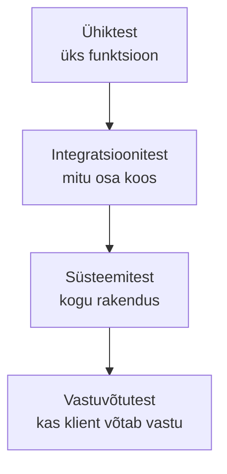
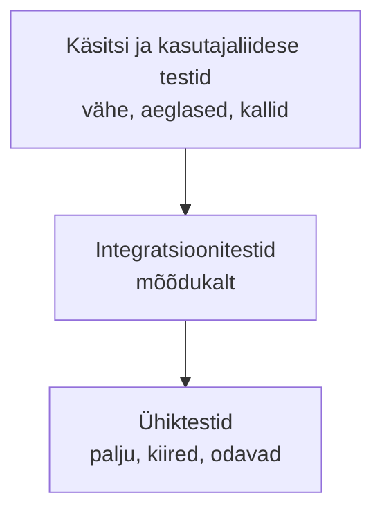

# 6. Staatiline ja dünaamiline testimine, testitasemed

::: info Õpiväljund
Pärast tundi oskad eristada staatilist ja dünaamilist testimist, tuua näiteid mõlemast ning nimetada testitasemed ja selgitada, mida igaüks kontrollib (HK 1.1).
:::

Reet saadab uue funktsiooni (broneeringu tühistamine) meeskonnale ülevaatuseks. Kaarel avab muudatuse, ei käivita midagi ja loeb koodi. Kümne minuti pärast kirjutab ta kommentaari: "Rida 42: tühistamise järel ei suurendata vabade kohtade arvu."

Reet vaatab ja ütleb: "Tõsi. Käivitamata testidega ma ei oleks seda leidnud enne, kui keegi töötoa uuesti proovib broneerida." Kaarel oli leidnud defekti **ilma programmi käivitamata**.

## Kaks põhilist viisi

| | Staatiline testimine | Dünaamiline testimine |
| --- | --- | --- |
| **Mis see on** | Tööprodukti kontrollimine **käivitamata** | Tarkvara **käivitamine** ja tulemuse vaatamine |
| **Mida see leiab** | **Defekte** (viga koodis, nõudes, disainis) | **Rikkeid** (vale käitumine) |
| **Millal** | Varakult, ka enne koodi | Kui kood on olemas |
| **Mida kontrollib** | Nõuded, disain, kood, testid, dokumendid | Funktsioone, andmeid, jõudlust, turvalisust |

Mõlemad on testimine ja nad **täiendavad üksteist**: staatiline leiab asju, mida dünaamiline ei leia (näiteks vastuolu nõuetes), ja vastupidi (näiteks viga, mis ilmneb alles töötamisel).

## Staatiline testimine

### Ülevaatus (*review*)

Inimesed loevad tööprodukti ja otsivad defekte. ISTQB eristab erineva rangusega vorme:

| Vorm | Kirjeldus | Kes osaleb |
| --- | --- | --- |
| **Mitteametlik ülevaatus** | Kolleeg vaatab üle, vaba vorm | Kaks inimest |
| **Läbikäimine** (*walkthrough*) | Autor tutvustab, teised küsivad | Autor ja meeskond |
| **Tehniline ülevaatus** | Ekspertide hinnang, otsused | Eksperdid |
| **Inspektsioon** (*inspection*) | Formaalne, protsess, rollid, mõõdikud | Moderaator, autor, lugejad |

Rannamõisa projektis on **koodi ülevaatus** (*code review*) iga muudatuse reegel: enne kui kood liidetakse põhiharuga (GitHubis *pull request*), peab keegi teine selle läbi vaatama. Reet ei saa oma koodi ise heaks kiita.

Ülevaatusel saab vaadata ka **nõudeid**. Kaarel leidis nii eelmisel kohtumisel vastuolu nõuetes (10 vs 12 osalejat).

### Tööriistapõhine staatiline analüüs

Programm loeb koodi ja otsib tuntud probleeme ilma seda käivitamata:

| Vahend | Mida see leiab | Rannamõisa näide |
| --- | --- | --- |
| **Linter** (nt ESLint) | Kasutamata muutujad, ohtlik muster, stiil | `const x = 5;` ja x ei kasutata kuskil |
| **Tüübikontroll** (nt TypeScript) | Vale tüüp | Funktsioon ootab arvu, antakse tekst |
| **Staatilise analüüsi tööriist** | Turvaaugud, võimalikud vead | Kasutaja sisend läheb otse andmebaasipäringusse |
| **Sõltuvuste kontroll** (nt `npm audit`) | Teadaolevad augud kasutatavates teekides | Teegil on avalik turvanotits |

Eelised: leiab defekte **kiiresti ja odavalt**, enne kui keegi seda käivitab. Piirang: ei näe, kuidas süsteem töötamisel käitub.

## Dünaamiline testimine

Siin käivitub kood. Dünaamilised testid jagunevad **testitasemeteks** vastavalt sellele, kui suurt osa süsteemist korraga kontrollitakse.

## Testitasemed

Reet kirjutas tühistamise. Mida tuleb kontrollida enne, kui see jõuab Anuni?

| Tase | Mida kontrollib | Kes teeb | Rannamõisa näide |
| --- | --- | --- | --- |
| **Ühiktest** (*unit test*, komponenditest) | Üks funktsioon või moodul eraldi | Arendaja | Funktsioon `arvutaVabuKohti(10, 7)` annab 3 |
| **Integratsioonitest** (*integration test*) | Mitu osa töötavad koos | Arendaja, testija | Broneeringu salvestus kirjutab andmebaasi ja funktsioon loeb sealt õigesti |
| **Süsteemitest** (*system test*) | Kogu rakendus nõuete vastu | Testija | Kasutaja otsib töötoa, broneerib ja saab kinnituse |
| **Vastuvõtutest** (*acceptance test*) | Kas klient võtab lahenduse vastu | Klient, kasutajad | Anu proovib ise töötoa broneerida ja tühistada |

Kui üks neist tasemetest puudub, jäävad vead katmata. Ühiktestid ei leia, et kaks hästi töötavat osa ei sobi kokku. Süsteemitest ei leia, et funktsiooni piirväärtus on vale, kui keegi seda ei proovi. Vastuvõtutest ei leia tehnilisi vigu, aga leiab vale lahenduse (vt [kohtumine 4](./kohtumine-04-pohimotted), põhimõte 7).

## Testipüramiid

Kui palju teste igal tasemel? Tuntud heuristika on **testipüramiid**:

Mõte on, et **alumisi (ühiktestid) on kõige rohkem**, sest nad on kiired ja täpsed (lähevad punaseks kohe, kui midagi katki läheb). Ülemisi on vähem, sest nad on aeglased ja haprad. Püramiidi autoriks peetakse Mike Cohni (raamat *Succeeding with Agile*, 2009). Täpsed suhtarvud sõltuvad projektist, püramiid on suunis, mitte seadus.

## Mida sa praktiliselt teed

Selles moodulis õpid, **mida** igal tasemel kontrollida. [Testimise moodulis](/testing/sissejuhatus) kirjutad:

- ühiktestid: [Ühiktestimine](/testing/unit-testing);
- integratsioonitestid: [Integratsioonitestimine](/testing/integration-testing) ja [API testimine](/testing/api-testing).

## Kokkuvõte

| Mõiste | Tähendus |
| --- | --- |
| Staatiline testimine | Kontroll käivitamata: ülevaatus, linter, analüüs |
| Dünaamiline testimine | Kontroll käivitamisega |
| Ühiktest | Üks funktsioon |
| Integratsioonitest | Mitu osa koos |
| Süsteemitest | Kogu rakendus |
| Vastuvõtutest | Kliendi kinnitus |
| Testipüramiid | Palju kiireid madala taseme teste, vähe aeglaseid kõrge taseme teste |

Kolm mõtet:

- **Staatiline leiab defekte, dünaamiline rikkeid.** Mõlemad on vajalikud.
- **Iga tase leiab oma tüüpi vigu.** Üks ei asenda teist.
- **Mida varem ülevaatus, seda odavam parandus.**

## Lisa oma testiplaanile

Koosta tabel, kus on kaks veergu: **enne koodi / koodiga** (staatiline) ja **käivitades** (dünaamiline). Märgi, millised tegevused sul Rannamõisa rakenduses on (ülevaatus, linter, tüübikontroll jne). Seejärel koosta **testitasemete tabel** rakenduse kolme funktsiooni jaoks (nt broneerimine, tühistamine, kinnitus-e-kiri): igal tasemel üks konkreetne test.

## Allikad

- [ISTQB Certified Tester Foundation Level Syllabus v4.0.1](https://istqb.org/certifications/certified-tester-foundation-level-ctfl-v4-0/), peatükid 2 (testitasemed) ja 3 (staatiline testimine, ülevaatuse tüübid).
- [Vikipeedia: Tarkvara testimine](https://et.wikipedia.org/wiki/Tarkvara_testimine): testitasemed.
- Testipüramiidi mõiste: Mike Cohn, *Succeeding with Agile* (2009).
- Rannamõisa projekt, tegelased ja kood on väljamõeldud.
