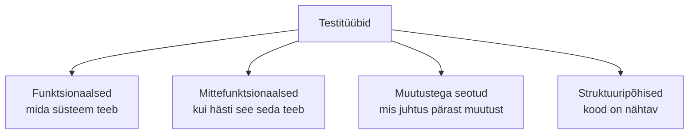
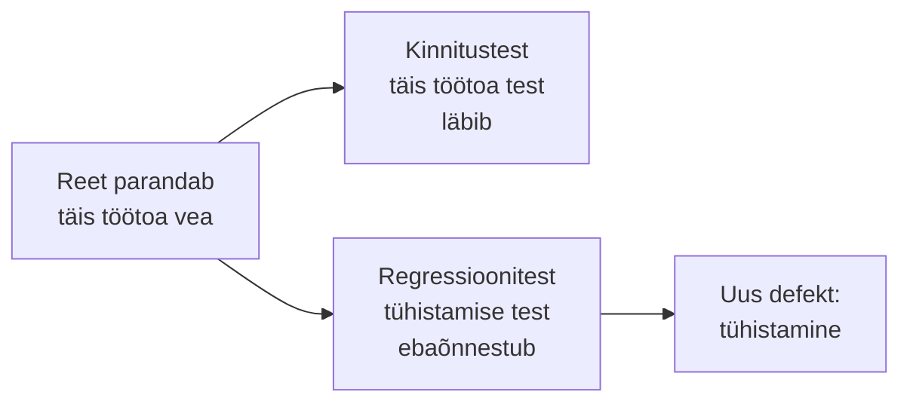

# 7. Funktsionaalsed, mittefunktsionaalsed ja muutustega seotud testid

::: info Õpiväljund
Pärast tundi oskad eristada funktsionaalseid, mittefunktsionaalseid ja muutustega seotud teste, tuua igaühe kohta näite ning valida sobiv testitüüp konkreetses olukorras (HK 1.1).
:::

Reet parandas täis töötoa vea. Kaarel kontrollis: täis töötuba enam ei võta broneeringuid. Suurepärane. Järgmisel päeval helistab Anu: "Tühistamine ei vabasta kohti."

Reet muutis kohtade arvutust ja sellega rikkus tühistamise. Parandus tegi ühe asja korda ja kahjustas teist. Selle olukorra vastu on eraldi testid.

## Testitüüp ja testitase

Kuuendal kohtumisel õppisime **testitasemeid**: *kui suurt* osa süsteemist testime (ühik, integratsioon, süsteem, vastuvõtt). **Testitüüp** vastab küsimusele *mida* me kontrollime: funktsioone, kvaliteediomadust või muutuse mõju. Samal tasemel saab teha mitut tüüpi teste.

Neljas rühm on valge kasti testimine (katvus), mida vaatasime [kohtumisel 5](./kohtumine-05-meetodid).

## Funktsionaalsed testid

**Funktsionaalne test** kontrollib, **mida** süsteem teeb: kas funktsioon annab õige tulemuse. Aluseks on nõuded.

| Funktsioon | Test | Oodatud |
| --- | --- | --- |
| Broneerimine | Üks inimene broneerib vaba töötoa | Broneering salvestub |
| Täis töötuba | Üheteistkümnes broneerija | Keeldumine |
| Tühistamine | Kinnitatud broneering tühistatakse | Kohad vabanevad |
| Kinnituskiri | Pärast broneeringut | E-kiri tuleb |

Funktsionaalsed testid kasutavad musta kasti tehnikaid (ekvivalentsiklassid, piirväärtused) ja saab teha igal tasemel.

## Mittefunktsionaalsed testid

**Mittefunktsionaalne test** kontrollib, **kui hästi** süsteem seda teeb. Aluseks on kvaliteediomadused ([kohtumine 2](./kohtumine-02-kvaliteet), ISO/IEC 25010).

| Kvaliteediomadus | Testi tüüp | Küsimus | Rannamõisa näide |
| --- | --- | --- | --- |
| Jõudlus | Jõudlustest | Kui kiire ja ressursisäästlik? | Leht avaneb alla 2 sekundiga |
| Turvalisus | Turvatest | Kas andmed on kaitstud? | Teise kasutaja broneeringut ei saa vaadata |
| Suhtlemisvõime | Kasutatavuse test | Kas inimene saab ise hakkama? | Anu ema tühistab broneeringu ilma abita |
| Ühilduvus | Ühilduvuse test | Töötab erinevates keskkondades? | Chrome, Safari, telefon |
| Töökindlus | Töökindluse test | Kas taastub rikkest? | Pärast serveri taaskäivitust on broneeringud alles |
| Juurdepääsetavus | Juurdepääsetavuse test | Kas kasutavad ka nägemispuudega kasutajad? | Ekraanilugeja loeb vormi |
| Hooldatavus | Staatiline analüüs, ülevaatus | Kas koodi on lihtne muuta? | Uus töötoa tüüp lisatakse ühes kohas |

Mittefunktsionaalsete testide tulemus on sageli **mõõdetav number** (millisekundid, protsendid), mitte "õige/vale". Seetõttu tuleb eelnevalt kokku leppida **sihtväärtus**: "alla 2 sekundit" on testitav, "kiire" ei ole.

Kaks mittefunktsionaalset tüüpi vaatame põhjalikumalt [kohtumisel 8](./kohtumine-08-joudlus-ja-turvalisus) (jõudlus ja turvalisus).

## Muutustega seotud testid

Muutus on tarkvaras kõige tavalisem sündmus: uus funktsioon, parandus, uus server. Iga muutus võib midagi katki teha. ISTQB eristab kaht muutustega seotud testimise tüüpi:

### Kinnitustest (*confirmation testing*, *re-testing*)

**Kas parandus töötab?** Kui Reet parandas defekti, käivitab Kaarel **sama testi uuesti**, mis varem ebaõnnestus. Kui test läbib, on defekt parandatud ja veaaruande saab sulgeda (vt [kohtumine 3](./kohtumine-03-vigade-tekkimine)).

### Regressioonitest (*regression testing*)

**Kas parandus rikkus midagi muud?** Kaarel käivitab **teisi teste**, mis varem läbisid, et kontrollida, kas muutus ei kahjustanud seni töötavat. Täis töötoa parandus rikkus tühistamise: regressioonitestid oleksid selle leidnud.

| | Kinnitustest | Regressioonitest |
| --- | --- | --- |
| Küsimus | Kas see konkreetne defekt on parandatud? | Kas midagi muud läks katki? |
| Testid | Sama test, mis ebaõnnestus | Kogum varem läbinud teste |
| Millal | Pärast parandust | Pärast iga muutust |
| Käsitsi või automaatselt | Mõlemad | **Tavaliselt automaatselt**, sest neid on palju ja neid korratakse |

Seetõttu kirjutatakse regressioonitestid automaattestideks ja käivitatakse automaatselt iga muudatuse peale (pidev integratsioon). See on praktika, mida õpid [Testimise moodulis](/testing/sissejuhatus).

### Suitsutest (*smoke test*)

Kui Reet saadab uue versiooni testkeskkonda, ei hakka Kaarel kohe 200 testi käivitama. Ta teeb esmalt **mõne kõige olulisema kontrolli**: kas rakendus üldse käivitub, kas avaleht avaneb, kas sisselogimine töötab. Kui need ei läbi, ei ole mõtet edasi testida. Nimi tuleb elektroonikast: kui seade esimest korda sisse lülitada ja suitsu ei tule, võib edasi minna.

Suitsutesti ei ole ISTQB v4.0 õppekavas eraldi testitüübina, aga seda kasutatakse laialdaselt ja on tarkvarapraktikas tavaline sõna.

### Hooldustestimine (*maintenance testing*)

Kui rakendus on juba kasutusel, tulevad ikka muutused: veaparandused, serveri uuendus, uus brauseri versioon. **Hooldustestimine** on testimine pärast selliseid muutusi töötavas süsteemis. Selles on regressioonitestid kesksel kohal.

## Valik: millist testi millal?

| Olukord | Sobiv test |
| --- | --- |
| Reet parandas ühe defekti | Kinnitustest ja regressioonitest |
| Uus versioon läheb testkeskkonda | Suitsutest, siis põhjalikum |
| Anu kavatseb reklaamida suurt töötubade müüki | Jõudlustest |
| Tahame lisada maksed | Turvatest, funktsionaalsed testid maksetele |
| Uus brauseri versioon | Ühilduvuse test |
| Anu ema kasutab rakendust esimest korda | Kasutatavuse test |

## Kokkuvõte

| Tüüp | Küsimus | Näide |
| --- | --- | --- |
| Funktsionaalne | Mida süsteem teeb? | Täis töötuba keeldub |
| Mittefunktsionaalne | Kui hästi? | Leht avaneb 2 s jooksul |
| Kinnitustest | Kas parandus töötab? | Sama test läbib |
| Regressioonitest | Kas midagi muud läks katki? | Tühistamise test |
| Suitsutest | Kas käivitub ja põhifunktsioonid töötavad? | Avaleht avaneb |

Kolm mõtet:

- **Iga parandus võib midagi muud rikkuda.** Regressioonitesti teeme alati.
- **Mittefunktsionaalsele testile on vaja numbrit.** Ilma sihtväärtuseta ei saa öelda, kas läbis.
- **Tase ja tüüp on eri küsimused.** Tase: kui suur osa. Tüüp: mida kontrollime.

## Lisa oma testiplaanile

1. Koosta **testitüüpide tabel**: iga tüübi (funktsionaalne, mittefunktsionaalne, kinnitus, regressioon, suits) kohta üks Rannamõisa test koos oodatud tulemusega.
2. Vali **kümme testi**, mis moodustavad **regressioonikomplekti** (kõige olulisemad, mida peab iga muudatuse järel käivitama). Põhjenda valik.
3. Kirjuta **suitsutesti** kolm kontrolli.

## Allikad

- [ISTQB Certified Tester Foundation Level Syllabus v4.0.1](https://istqb.org/certifications/certified-tester-foundation-level-ctfl-v4-0/), peatükk 2.2 (testitüübid: funktsionaalne, mittefunktsionaalne, must ja valge kast, kinnitus- ja regressioonitest) ja 2.3 (hooldustestimine).
- [ISO/IEC 25010:2023](https://www.iso.org/standard/78176.html): kvaliteediomadused.
- [Vikipeedia: Tarkvara testimine](https://et.wikipedia.org/wiki/Tarkvara_testimine): mittefunktsionaalne testimine.
- Rannamõisa, tegelased ja sihtväärtused on väljamõeldud õppenäited.
