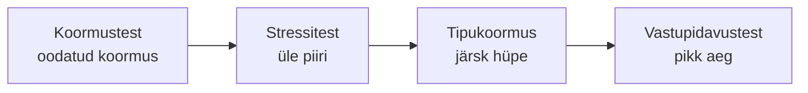

# 8. Jõudluse ja turvalisuse testimine

::: info Õpiväljund
Pärast tundi oskad nimetada jõudlustestide liigid ja mõõdikud, selgitada turvatestimise põhivõtteid ning valida olukorrale sobiva testi (HK 1.1).
:::

Anu helistab Kaarelile: "Reedel kell 10 saadan uudiskirja kõigile 800 tellijale: sügisese töötubade kampaania. Mis juhtub, kui paarsada inimest korraga broneerima hakkab?"

Kaarel ei tea. Keegi ei ole sellist olukorda proovinud. Samal päeval saadab Mihkel talle lingi: `/broneering/17`. Kaarel muudab aadressis 17 arvuks 18 ja näeb **teise inimese** nime ja telefoninumbrit.

Päeva jooksul on Kaarel kohanud kaht mittefunktsionaalset probleemi: **jõudlust** ja **turvalisust**.

## Jõudluse testimine

**Jõudlustest** (*performance testing*) kontrollib, kui kiiresti ja stabiilselt süsteem töötab. Kaarel ei küsi enam "kas funktsioon on õige", vaid "kas see on **piisavalt kiire**, ka siis, kui **palju inimesi** korraga kasutab".

### Jõudluse mõõdikud

| Mõõdik | Tähendus | Rannamõisa näide |
| --- | --- | --- |
| **Reageerimisaeg** (*response time*) | Kui kaua ootab kasutaja vastust | Broneeringu kinnitus 1,2 s |
| **Läbilaskevõime** (*throughput*) | Mitu päringut sekundis süsteem teenindab | 50 päringut/s |
| **Veamäär** (*error rate*) | Mitu protsenti päringutest ebaõnnestub | 0,5% |
| **Ressursikasutus** | Protsessor, mälu, andmebaasi ühendused | Protsessor 70% |
| **Protsentiil** (*percentile*), nt p95 | 95% päringutest on kiiremad kui see aeg | p95 = 1,8 s |

Miks protsentiil? Keskmine peidab halvad kogemused. Kui 95 päringut vastab 0,2 s ja 5 päringut 10 s, on keskmine 0,7 s, aga viiel kasutajal sajast oli kohutav kogemus. **p95** näitab seda.

### Jõudlustestide liigid

| Liik | Küsimus | Rannamõisa näide |
| --- | --- | --- |
| **Koormustest** (*load test*) | Kas süsteem peab vastu **oodatud** koormusele? | 200 kasutajat korraga reedel kell 10 |
| **Stressitest** (*stress test*) | Millal süsteem **laguneb** ja kuidas ta taastub? | Tõstame kasutajad 200-lt 2000-ni |
| **Tipukoormuse test** (*spike test*) | Mis juhtub, kui koormus **hüppab** järsult? | 0 kasutajat, siis äkki 300 |
| **Vastupidavustest** (*soak*, *endurance test*) | Kas süsteem töötab **pikalt** stabiilselt? | 100 kasutajat 8 tundi järjest, kas mälu ei lekki |
| **Mastaapsustest** (*scalability test*) | Kas lisaserver lisab võimsust? | Kas kaks serverit teenindavad kaks korda rohkem kasutajaid |

### Kuidas Kaarel testi ette valmistab

Ilma sihtväärtuseta ei ole jõudlustest mõttekas ([kohtumine 7](./kohtumine-07-testituubid)). Kaarel kirjutab Anuga:

| Sihtväärtus | Väärtus |
| --- | --- |
| Oodatud kasutajate arv tipus | 200 korraga |
| Broneeringu kinnitus (p95) | alla 2 sekundi |
| Veamäär | alla 1% |
| Testkeskkond | Sama võimsusega kui päris server, mitte Kaareli sülearvuti |

Seejärel kasutab ta tööriista, mis **simuleerib kasutajaid**. Levinud vahendeid on **k6**, **Apache JMeter** ja **Postman**. Praktiliselt vaatad seda [Postmaniga jõudluse kontrolli lehel](/testing/performance-testing-postman).

**Hoiatus**: koormustesti ei tehta päris süsteemis, kus on päris kasutajad. See võib tegelikku teenust häirida. Kasuta testkeskkonda.

## Turvalisuse testimine

**Turvatest** (*security testing*) kontrollib, kas süsteem kaitseb andmeid ja tegevusi. Kaarel nägi rikke: aadressis numbri muutmine näitas võõraid andmeid. Mis see on?

Turvalisuse põhimõisted (CIA: konfidentsiaalsus, terviklus, kättesaadavus) tulid esile [küberturvalisuse moodulis](/kuberturvalisus/sissejuhatus). Siin vaatame, kuidas neid **testida**.

### OWASP Top 10

**OWASP** (*Open Worldwide Application Security Project*) on mittetulunduslik organisatsioon, mis avaldab veebirakenduste **kümme tavalisemat turvariski**. Viimane väljaanne on **OWASP Top 10:2025**:

| # | Risk | Mida see tähendab |
| --- | --- | --- |
| A01 | Murtud juurdepääsukontroll (*Broken Access Control*) | Kasutaja pääseb ligi sellele, mis talle ei kuulu |
| A02 | Turvalise seadistuse puudumine | Vaikeparoolid, avatud pordid, tarbetud funktsioonid |
| A03 | Tarkvara tarneahela rikked | Kolmandate osapoolte teegid on ohtlikud |
| A04 | Krüptograafilised rikked | Andmed on krüptimata või nõrgalt krüptitud |
| A05 | Süstimine (*Injection*) | Kasutaja sisend tõlgendatakse käsuna (nt SQL) |
| A06 | Ebaturvaline disain | Turvameetmed puuduvad juba kavandis |
| A07 | Autentimise rikked | Nõrgad paroolid, sisselogimise möödapääs |
| A08 | Tarkvara ja andmete terviklikkuse rikked | Uuendusi ei kontrollita |
| A09 | Turvalogimise ja hoiatamise rikked | Rünnakut ei märgata |
| A10 | Erandolukordade vale käsitlus | Vead paljastavad infot või jätavad süsteemi ohtlikku olekusse |

Kaareli leid (aadressis `/broneering/17` → `/broneering/18`) on klassikaline **A01**: süsteem ei kontrolli, kas sisselogitud kasutajale see broneering **kuulub**. Seda nimetatakse **otsese objektiviite rikkeks** (*IDOR*, *insecure direct object reference*). Parandus: iga päring kontrollib omanikku.

Teine näide, **A05 Süstimine**: kui broneeringu otsingu väljale kirjutada `' OR '1'='1` ja süsteem lisab selle otse andmebaasi päringusse, võib kasutaja saada kõik andmed. Lahendus on **parameetriseeritud päringud**, mis kohtlevad sisendit andmena, mitte käsuna.

### Turvatestimise viisid

| Viis | Kirjeldus | Rannamõisa näide |
| --- | --- | --- |
| **Staatiline turvaanalüüs** (*SAST*) | Kood loetakse läbi ja otsitakse ohtlikke mustreid | Tööriist leiab kohad, kus sisend läheb otse päringusse |
| **Dünaamiline turvaanalüüs** (*DAST*) | Töötavat rakendust "rünnatakse" automaatselt | Skanner proovib tüüpilisi rünnakuid lehel |
| **Sõltuvuste kontroll** (*SCA*) | Kasutatavate teekide teadaolevad augud | `npm audit` |
| **Läbimurdetest** (*penetration test*) | Volitatud ekspert proovib süsteemi murda | Väline spetsialist testib enne väljalaset |
| **Ülevaatus** | Kood ja arhitektuur loetakse turvasilmaga | Reet ja Kaarel kontrollivad iga päringu õiguseid |
| **Käsitsi uurimine** | Testija proovib ise (id muutmine, õigused) | Kaarel muudab aadressis numbrit |

Esimesed kolm on automatiseeritavad ja sobivad pidevasse integratsiooni. Läbimurdetest on aeg- ja kulumahukam, teeb kogenud spetsialist ja tavaliselt üks kord või enne olulist väljalaset.

### Tähtis reegel: ainult volitusega

**Turvatesti võib teha ainult süsteemil, mida sul on lubatud testida.** Võõra süsteemi "proovimine" ilma loata võib olla õigusrikkumine, ka siis, kui tahtsid head. Läbimurdetesti ettevõttes tehakse **kirjaliku kokkuleppe** alusel: mis on lubatud, mis ajal, mida mitte puutuda. Harjuta oma süsteemides või spetsiaalselt harjutamiseks tehtud rakendustes.

## Jõudlus ja turvalisus koos

| | Jõudlus | Turvalisus |
| --- | --- | --- |
| Küsimus | Kas peab vastu? | Kas on kaitstud? |
| Mõõtmine | Number (ms, %) | Leid (risk, haavatavus) |
| Ohu allikas | Palju kasutajaid | Pahatahtlik kasutaja |
| Näide Rannamõisalt | Kampaania reedel kell 10 | `/broneering/18` |
| Riistad | k6, JMeter, Postman | Staatilise analüüsi tööriist, `npm audit`, skanner |

Kui kampaania toob palju külastajaid, on **sama rakendus** ka ründajale huvitavam. Mõlemad testid on osa kvaliteedist (ISO/IEC 25010: jõudlus, turvalisus).

## Kokkuvõte

| Mõiste | Tähendus |
| --- | --- |
| Koormustest | Oodatud koormus |
| Stressitest | Üle piiri, kuidas laguneb |
| Tipukoormus | Järsk hüpe |
| Vastupidavustest | Pikk aeg |
| p95 | 95% päringutest on selle ajaga kiiremad |
| OWASP Top 10 | Kümme tavalisemat veebirakenduse turvariski |
| SAST / DAST | Staatiline / dünaamiline turvaanalüüs |
| Läbimurdetest | Volitatud ekspert proovib rünnata |

Kolm mõtet:

- **Jõudlustestile on vaja arvuline sihtväärtus.** "Kiire" ei ole testitav.
- **Turvalisus ei ole ainult paroolid.** Murtud juurdepääsukontroll on OWASP-i nimekirja esimene.
- **Testi ainult seda, mida tohid.** Volitus on osa turvatestimisest.

## Lisa oma testiplaanile

1. **Jõudlustesti kirjeldus**: vali liik, sihtväärtused (kasutajate arv, p95, veamäär) ja testkeskkond Rannamõisa kampaania jaoks.
2. **Turvatesti kirjeldus**: vali OWASP Top 10 hulgast kolm riski, mis Rannamõisa rakenduses on tõenäolised, ja kirjuta iga kohta üks konkreetne kontroll (nt "kasutaja A ei saa avada kasutaja B broneeringut").
3. Märgi, millised neist saab automatiseerida.

## Allikad

- [OWASP Top 10:2025](https://top10.owasp.org/2025/): riskide nimekiri (A01 Murtud juurdepääsukontroll jt) ja kirjeldused.
- [ISTQB Certified Tester Foundation Level Syllabus v4.0.1](https://istqb.org/certifications/certified-tester-foundation-level-ctfl-v4-0/): mittefunktsionaalsed testitüübid. ISTQB jõudlustestimise eraldi õppekava (Performance Testing) ja turvatestimise õppekava (Security Tester) on ka olemas.
- [ISO/IEC 25010:2023](https://www.iso.org/standard/78176.html): jõudlus ja turvalisus kvaliteediomadustena.
- Rannamõisa kampaania, arvud ja aadresside näited on väljamõeldud.
- Jõudlustestide liikide nimetused (load, stress, spike, soak) on tööstuses üldlevinud, kuid täpne piir liikide vahel varieerub allikati.
