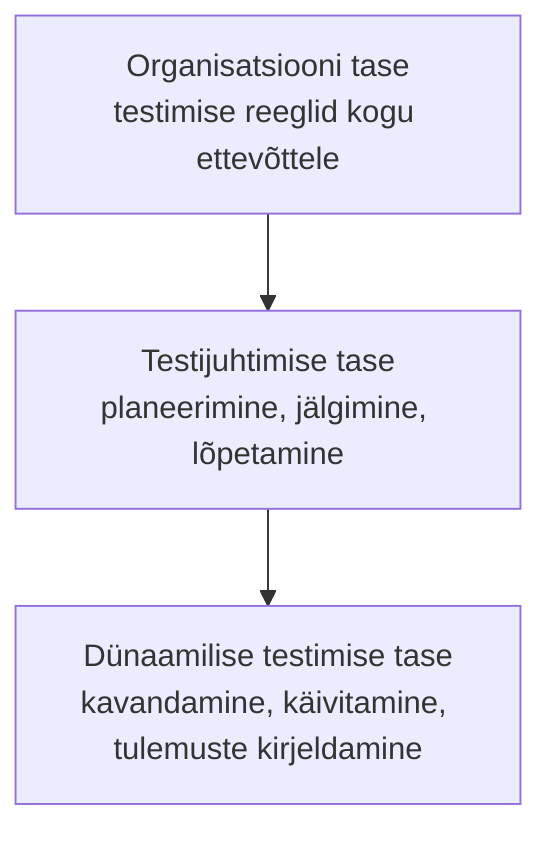

# 9. Testimise standardid

::: info Õpiväljund
Pärast tundi oskad nimetada olulisemad testimisega seotud standardid ja juhendid, kirjeldada ISO/IEC/IEEE 29119 sarja ülesehitust ning valida lähteülesande põhjal sobivad standardid (HK 1.2).
:::

Tiit kutsub Kaareli koosolekule. "Meile tuli kaks uut pakkumist," ütleb ta. "Esimene on hooldekodu, kes tahab rakendust, mis jagab hooldajatele ravimite andmise ajad. Teine on veebipood, mis hakkab võtma kaardimakseid. Kumbki kutsub meid testimisstandardit järgima. Mis see tähendab?"

Kaarel mõtleb Rannamõisale. Seal ei küsinud keegi ühtegi standardit. Kas siis oli midagi puudu?

## Miks standardid üldse?

Standard on **kokkulepe**, kuidas midagi tehakse. Testimisel on kolm põhjust:

| Põhjus | Selgitus | Näide |
| --- | --- | --- |
| **Ühine keel** | Kõik mõistavad terminit samamoodi | "Testjuhtum" tähendab samat Eestis ja Saksamaal |
| **Võrreldavus ja usaldus** | Klient saab nõuda tõendit, et testiti korralikult | Leping ütleb: "Testimine kooskõlas standardiga X" |
| **Seadus või leping nõuab** | Valdkonnas on kohustuslik | Meditsiiniseadme tarkvara |

Standardid on **ühelt poolt** abi (ei pea alustama nullist), **teiselt poolt** koormus (dokumenteerimine võtab aega). Kuna kontekst on erinev (kohtumine 4, põhimõte 6), on erinev ka vajadus.

## Standard, juhend ja sertifikaat

Need sõnad ei tähenda sama:

| Mõiste | Mis see on | Näide |
| --- | --- | --- |
| **Standard** | Ametlik dokument rahvusvahelisest või rahvuslikust organisatsioonist (ISO, IEC, IEEE) | ISO/IEC/IEEE 29119 |
| **Juhend** (*guide*) | Praktika kirjeldus, mis ei ole ametlik standard | OWASP Web Security Testing Guide |
| **Õppekava ja sertifikaat** | Teadmiste kogum ja eksam inimestele | ISTQB Certified Tester |

## ISO/IEC/IEEE 29119 sari

**ISO/IEC/IEEE 29119** on rahvusvaheline tarkvara testimise standardite sari. Selle tegid ühiselt ISO (rahvusvaheline standardiorganisatsioon), IEC (rahvusvaheline elektrotehnikakomisjon) ja IEEE (inseneride ühing). Sari kirjeldab testimise sõnavara, protsesse, dokumente ja tehnikaid, mida saab kasutada **mis tahes tarkvaraarenduse mudeli** (kaskaad, agiilne jne) korral.

| Osa | Pealkiri | Mida see kirjeldab | Rannamõisa seos |
| --- | --- | --- | --- |
| **29119-1** | Üldmõisted (*General concepts*, 2022) | Mõisted ja sõnavara | Kohtumine 1: viga, defekt, rike |
| **29119-2** | Testiprotsessid (*Test processes*, 2021) | Kuidas testimist korraldada | Planeerimine, jälgimine, lõpetamine |
| **29119-3** | Testi dokumentatsioon (*Test documentation*, 2021) | Dokumentide mallid | Testiplaan, olekuaruanne, lõpetamise aruanne |
| **29119-4** | Testimistehnikad (*Test techniques*, 2021) | Kuidas testjuhtumeid tuletada | Kohtumine 5: ekvivalentsiklassid, piirväärtused |
| **29119-5** | Märksõnapõhine testimine (*Keyword-driven testing*, uusim väljaanne 2024) | Automaattestide struktuur märksõnadega | Testi sammud on kirjeldatud nagu "Ava leht", "Sisesta nimi" |

(Aastaarvud on tänaste väljaannete omad. Osade 1–4 esimesed väljaanded ilmusid 2013. aastal ja asendati 2021–2022. aastal. Osa 5 esimene väljaanne ilmus 2016. aastal ja asendati 2024. aasta väljaandega.)

### Osa 2: kolm taset

Testiprotsessid on jaotatud tasemetesse:

| Tase | Küsimus | Näide Tammelaanes |
| --- | --- | --- |
| Organisatsioon | Millised testimise põhimõtted on meil ettevõttes? | "Iga muudatus saab ülevaatuse ja regressioonitesti" |
| Testijuhtimine | Kuidas me seda projekti testime? | Rannamõisa testiplaan |
| Dünaamiline testimine | Mida konkreetselt käivitame? | Kaareli testjuhtumid |

Testijuhtimise tasemel on kolm protsessi: **testi planeerimine**, **jälgimine ja kontroll** ning **testimise lõpetamine**.

### Osa 3: dokumendid

Standard annab mallid dokumentidele, näiteks:

| Dokument | Sisu |
| --- | --- |
| **Testiplaan** (*test plan*) | Mida testitakse, kuidas, kes, millal |
| **Testi olekuaruanne** (*test status report*) | Kuidas testimine edeneb valitud perioodil |
| **Testi lõpetamise aruanne** (*test completion report*) | Kokkuvõte, mis testiti ja mis leiti |

Kaarel märkab, et tema Rannamõisa testiplaan, mida ta nädal-nädalalt koostab, sisaldab sama põhiideed lihtsustatud kujul.

### Kriitika

ISO 29119 ei ole vaidlusteta. 2014. aastal korraldasid testijate kogukonna esindajad (näiteks Association for Software Testing ja International Society for Software Testing) vastuseisu ja nõudsid standardi tagasivõtmist. Põhilised etteheited:

- standard rõhutab dokumenteerimist, mis võib ära võtta aja päris testimiselt;
- ei arvesta **kontekstipõhise testimise** koolkonnaga, mis arvab, et testimist ei saa ette kirjutada;
- väideti, et protsess ei ole piisavalt kogukonna konsensusel põhinev.

Standardi pooldajad vastavad, et standard on **valikuline raamistik**, mida saab kohandada. Tähtis on, et õppija teaks mõlemat vaadet: standard on abivahend, mitte reegel, mida peab pimesi täitma.

## Teised olulised standardid ja juhendid

| Nimi | Liik | Kasutusvaldkond | Seos testimisega |
| --- | --- | --- | --- |
| **ISO/IEC 25010** | Standard | Mis tahes tarkvaratoode | Kvaliteediomadused, **mida** testida ([kohtumine 2](./kohtumine-02-kvaliteet)) |
| **ISO/IEC/IEEE 12207** | Standard | Tarkvara elutsükli protsessid | Verifitseerimise ja valideerimise protsessid arenduse osana |
| **IEEE 829** | Standard (asendatud) | Testi dokumentatsioon | Asendatud ISO/IEC/IEEE 29119-3-ga |
| **ISTQB** | Õppekava, sertifikaat | Testijate väljaõpe, sõnastik | Sõnavara ja põhimõtted, mida sa selles moodulis kasutad |
| **ISO/IEC 27001** | Standard | Infoturbe juhtimissüsteem | Nõuab turvameetmete kontrolli, vt [IT-taristu](/it-taristu/kohtumine-08-standardid-ja-raamistikud) |
| **OWASP Top 10, WSTG** | Juhend | Veebirakenduste turve | Mida ja kuidas turvalisust testida ([kohtumine 8](./kohtumine-08-joudlus-ja-turvalisus)) |
| **PCI DSS** | Tööstusstandard | Kaardimaksed | Nõuab turvatestimist ka makseandmetega töötavatele süsteemidele |
| **WCAG 2.2** | W3C soovitus | Veebi juurdepääsetavus | Juurdepääsetavuse testi kriteeriumid |

### Valdkonnastandardid, kus testimine on kohustuslik

Mõnes valdkonnas on viga ohtlik inimese elule ja seadus nõuab rangeid protsesse:

| Valdkond | Standard | Mida see tähendab |
| --- | --- | --- |
| Lennunduse tarkvara | **DO-178C** | Testid peavad tõendama nõuete täitmist ja katvust |
| Sõidukid | **ISO 26262** | Autode elektroonika ja tarkvara funktsionaalne ohutus |
| Meditsiiniseadmete tarkvara | **IEC 62304** | Meditsiiniseadme tarkvara elutsükkel, sh verifitseerimine |
| Tööstuse automaatika | **IEC 61508** | Elektri-, elektroonika- ja programmeeritavate süsteemide funktsionaalne ohutus |
| Raudteesignalisatsioon | **EN 50128** | Raudteesüsteemi tarkvara |

Ravimite andmise ajastamise rakendus ei pruugi olla meditsiiniseade, aga kui see **teeb otsuseid ravi kohta**, võib see seda olla. Seda otsustab õigusabi ja regulaator, mitte testija. Testija ülesanne on **märgata**, et küsimus tekib, ja viia see otsustajate ette.

## Kuidas standardit valida?

Kaarel koostab Tiidule lihtsa küsimuste nimekirja:

| Küsimus | Mida see ütleb |
| --- | --- |
| 1. Millises **valdkonnas** rakendus töötab? | Reguleeritud valdkonnas (meditsiin, finants, transport) on standard tihti kohustuslik |
| 2. Milline on **risk**, kui viga tekib? | Raha, isikuandmed, elu: range testimine |
| 3. Mida nõuab **klient või leping**? | Klient võib nõuda konkreetset standardit |
| 4. Mis on **seadused** (andmekaitse, juurdepääsetavus)? | Vastavus ei ole valikuline |
| 5. Mis **meeskond** ja ettevõte juba kasutavad? | Parim standard on see, mida jõutakse täita |

## Rannamõisa ja kaks uut pakkumist

| Projekt | Valdkond | Risk | Soovitatud standardid ja juhendid |
| --- | --- | --- | --- |
| **Rannamõisa töötubade broneerimine** | Käsitöökeskus | Madal kuni keskmine | **Sõnavara**: ISTQB. **Kvaliteet**: ISO/IEC 25010 (valitud omadused). **Turve**: OWASP Top 10. Raske standard ei ole vajalik |
| **Hooldekodu ravimite ajastamine** | Tervis | Kõrge (viga võib kahjustada inimest) | Kontrollida, kas rakendus on meditsiiniseade (**IEC 62304**). ISO/IEC/IEEE 29119 protsessid ja dokumendid. **ISO/IEC 25010** ohutus, töökindlus. Turve: **OWASP**, isikuandmed |
| **Veebipood kaardimaksetega** | Kaubandus | Keskmine kuni kõrge (raha, kaardiandmed) | **PCI DSS** (kui käitleb kaardiandmeid ise). **OWASP Top 10**. Jõudlus ja turvatestimine |

Pane tähele, et iga projekti puhul on vastus **kombinatsioon**. Üks standard ei kata kõike: ühes on sõnavara, teises kvaliteediomadused, kolmandas turve, neljandas valdkonna nõuded. Seejuures ei ole kõik **kohustuslikud**. Mõned on juhendid, mida kasutatakse oma otsusel.

## Kokkuvõte

| Mõiste | Tähendus |
| --- | --- |
| ISO/IEC/IEEE 29119 | Rahvusvaheline testimisstandardite sari (5 osa): mõisted, protsessid, dokumendid, tehnikad, märksõnapõhine testimine |
| ISO/IEC 25010 | Tarkvaratoote kvaliteedimudel (üheksa omadust) |
| IEEE 829 | Vana testi dokumentatsiooni standard, asendatud 29119-3-ga |
| ISTQB | Õppekava ja sertifikaat, ei ole standard |
| OWASP | Veebirakenduste turvajuhendid |
| DO-178C, ISO 26262, IEC 62304 jt | Valdkonnastandardid ohutuskriitilisele tarkvarale |
| PCI DSS | Kaardimaksete turvastandard |

Kolm mõtet:

- **Standard on abi, mitte eesmärk.** Vali see, mis vastab riskile ja nõuetele.
- **Üks standard ei kata kõike.** Tavaliselt kasutatakse mitut.
- **Ohutuskriitilises valdkonnas on standard sageli kohustuslik.** Mida suurem risk, seda rangem standard.

## Lisa oma testiplaanile

Koosta **standardite valiku tabel** Rannamõisa rakenduse jaoks. Iga valitud standardi või juhendi kohta kirjuta: nimi, mida see katab ja miks see sobib. Lisa ka üks standard, mida **ei kasuta**, ja põhjenda, miks mitte.

## Allikad

- [ISO/IEC/IEEE 29119-5:2024 (ISO)](https://www.iso.org/standard/87233.html): osa 5 praegune väljaanne (detsember 2024), asendab 2016. aasta väljaande.
- [Vikipeedia: ISO/IEC 29119](https://en.wikipedia.org/wiki/ISO/IEC_29119): sarja osad, aastad (osa 1: 2022, osad 2–4: 2021, osa 5: 2024) ja 2014. aasta vastuseis.
- [ISO/IEC/IEEE 29119-2:2021 (ISO)](https://www.iso.org/obp/ui/en/#!iso:std:79428:en) ja [ISO/IEC/IEEE 29119-3:2013 (ISO)](https://www.iso.org/standard/56737.html): testiprotsessid ja dokumendid. Testiplaan, olekuaruanne ja lõpetamise aruanne on osa 3 dokumendid. 2013. aasta väljaanne on asendatud 2021. aasta omaga.
- [Vikipeedia: Software test documentation](https://en.wikipedia.org/wiki/Software_test_documentation): IEEE 829 asendamine ISO/IEC/IEEE 29119-3-ga.
- [ISO/IEC 25010:2023](https://www.iso.org/standard/78176.html): kvaliteedimudel.
- [OWASP Top 10:2025](https://top10.owasp.org/2025/): turvariskid.
- Valdkonnastandardid DO-178C (lennundus), ISO 26262 (autotööstus), IEC 62304 (meditsiin), IEC 61508 (tööstus), EN 50128 (raudtee): [Software safety (Vikipeedia)](https://en.wikipedia.org/wiki/Software_safety) ja [arc42 Quality: DO-178C](https://quality.arc42.org/standards/do-178c).
- PCI DSS, WCAG 2.2 ja ISO/IEC/IEEE 12207 on kirjeldatud üldteadmisena. Täpne nõue sõltub standardi väljaandest ja kasutuskontekstist, kontrolli seda ametlikust dokumendist enne rakendamist.
- Hooldekodu ja veebipood on väljamõeldud õppenäited.
