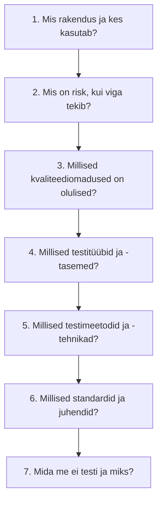

# 10. Kokkuvõte ja lähteülesanne

::: info Õpiväljund
Pärast tundi oskad lugeda lähteülesannet, valida selle jaoks testimise põhimõtted, testitüübid ja standardid ning seda põhjendada (HK 1.1, HK 1.2).
:::

Tiit annab Kaarelile paberi: "Veebipoe pakkumine. Kirjuta mulle testimise lähenemine, ma tahan seda homme kliendile näidata. Mis testitakse, mis standardeid kasutame ja miks."

Kaarel vaatab paberit. Kümme nädalat tagasi oleks see olnud segadus. Nüüd on tal terve tööriistakast. Aga kuidas teha seda **järjest** ja **põhjendatult**?

## Mooduli kokkuvõte

| Kohtumine | Peamine mõte |
| --- | --- |
| 1. Terminoloogia | Viga (inimene) → defekt (koodis) → rike (kasutaja näeb). Ootustulemus tuleb enne testi |
| 2. Kvaliteet | Testimine annab infot. ISO/IEC 25010 jagab kvaliteedi üheksaks omaduseks |
| 3. Vigade tekkimine | Defektid tulevad ka nõuetest ja disainist. Hea veaaruanne on taasesitatav. Tõsidus ≠ prioriteet |
| 4. Põhimõtted | Seitse põhimõtet. Kõike ei saa testida, vali risk järgi |
| 5. Meetodid | Must, valge ja hall kast. Ekvivalentsiklassid ja piirväärtused |
| 6. Staatiline ja dünaamiline | Ülevaatus ja linter leiavad defekte, testid rikkeid. Neli testitaset |
| 7. Testitüübid | Funktsionaalne, mittefunktsionaalne, kinnitus, regressioon, suits |
| 8. Jõudlus ja turvalisus | Koormus, stress, p95. OWASP Top 10, SAST/DAST, volitus |
| 9. Standardid | ISO/IEC/IEEE 29119, ISO/IEC 25010, ISTQB, OWASP, valdkonnastandardid |

## Lähteülesande lahendamise meetod

Lähteülesanne kirjeldab olukorda (mis rakendus, kellele, mis risk). Sinu töö on öelda, **kuidas seda testida ja milliseid standardeid kasutada**. Lahenda see seitsmes sammus:

| Samm | Küsimus | Seos kohtumisega |
| --- | --- | --- |
| 1 | Mis süsteem, kes kasutajad, mis keskkond? | Kontekst (4) |
| 2 | Mis juhtub, kui viga tekib? Raha, andmed, elu? | Põhimõte 6 (4), kvaliteet (2) |
| 3 | Mis ISO/IEC 25010 omadused on selle rakenduse jaoks olulised? | 2 |
| 4 | Mis testitüübid (funktsionaalne, jõudlus, turve, regressioon) ja tasemed? | 6, 7, 8 |
| 5 | Kas on vaja musta, valget, halli kasti? Millised tehnikad? | 5 |
| 6 | Millised standardid ja juhendid on seotud valdkonna ja riskiga? | 9 |
| 7 | Mida jätame testimata, miks ja millised riskid jäävad? | Põhimõtted 1 ja 2 (4) |

## Töönäide: veebipood kaardimaksetega

**Lähteülesanne.** Tammelaan Tarkvara arendab veebipoodi "Meremõisa Mesi", mis müüb väikese mesindaja tooteid üle Eesti. Pood võtab kaardimakseid läbi makseteenuse pakkuja, salvestab kliendi nime, aadressi ja telefoni ning saadab tellimuse kulleriga. Oodatav külastajate arv on 500 päevas, jõulude ajal kuni 3000. Arendusmeeskond on Reet ja Kaarel, aega on 8 nädalat.

### 1. Mis rakendus ja kes kasutab?

Veebipood. Kasutajad on kliendid (era), administraator (mesinik). Kaardimakse läheb makseteenuse pakkuja kaudu.

### 2. Risk

| Võimalik viga | Mõju | Risk |
| --- | --- | --- |
| Tellimus kaob või makstakse topelt | Klient kaotab raha, usaldus | Kõrge |
| Võõra kliendi andmed nähtavad | Isikuandmete leke, õiguslik vastutus | Kõrge |
| Pood ei kannata jõuluperioodi koormust | Müük läheb kaotsi | Keskmine kuni kõrge |
| Vale hind | Mesinik kaotab raha | Keskmine |
| Leht ei avane telefonis | Kliendid lähevad mujale | Keskmine |

### 3. Kvaliteediomadused (ISO/IEC 25010)

- **Funktsionaalne sobivus**: tellimus, hind, makse.
- **Turvalisus**: kliendi- ja makseandmed.
- **Jõudlus**: jõulude tipp.
- **Ühilduvus**: telefon ja brauserid.
- **Suhtlemisvõime**: kasutatavus. Vähem tähtis: paindlikkus, ohutus.

### 4. Testitüübid ja -tasemed

| Tase / tüüp | Mida | Näide |
| --- | --- | --- |
| Ühiktest | Hinna ja käibemaksu arvutus | 3 purki × 8,50 € + kohaletoimetamine |
| Integratsioonitest | Makseteenuse ühendus (testrežiim) | Maksmine õnnestub / ebaõnnestub |
| Süsteemitest | Täielik ost algusest lõpuni | Lisa korvi, maksa, kinnitus |
| Vastuvõtutest | Mesinik proovib ise | Tellimuse haldus adminis |
| Funktsionaalne | Hind, kupong, laoseis | Piirväärtused kogusel |
| Koormustest, tipukoormus | 3000 külastajat jõuludel | p95 alla 2 s |
| Turvatest | Juurdepääsukontroll, süstimine | Kasutaja A ei näe kasutaja B tellimust |
| Regressioonitest | Iga muudatuse järel | Automaatne |
| Suitsutest | Pärast paigaldust | Avaleht, ostukorv, makselehele minek |

### 5. Meetodid ja tehnikad

- Must kast: ekvivalentsiklassid ja piirväärtused kogusele, hinnale, kuponkoodile.
- Olekuüleminek: tellimus (uus → makstud → saadetud → kohale toimetatud / tagastatud).
- Valge kast: ühiktestid hinna arvutusele, harukatvus.
- Hall kast: API testid koos andmebaasi kontrolliga.
- Uuriv testimine enne väljalaset.

### 6. Standardid ja juhendid

| Standard | Miks |
| --- | --- |
| **ISTQB** | Ühine sõnavara ja põhimõtted |
| **ISO/IEC 25010** | Kvaliteediomaduste valik (samm 3) |
| **OWASP Top 10:2025** ja **WSTG** | Veebipoe turvatestimine (A01, A05 jt) |
| **PCI DSS** | Kaardimaksete turve. Kui pood ei salvesta ega töötle kaardiandmeid ise (kasutab makseteenuse pakkuja lehte), on nõuete maht väiksem, aga see tuleb makseteenuse pakkujalt üle kontrollida |
| **ISO/IEC/IEEE 29119** | Testiplaani ja testijuhtumite dokumentide ülesehitus (osad 2, 3). Täielik rakendamine on selle projekti jaoks liiga raske, kasutame vaid testiplaani ja lõpetamise aruande malli |
| **Isikuandmete kaitse** (andmekaitse üldmäärus, GDPR) | Seadus, mitte testimisstandard, aga mõjutab testandmeid (päris andmeid ei kasutata testis) |
| **WCAG 2.2** | Soovitatav, kui tahetakse juurdepääsetavat poodi |

Ei kasuta: DO-178C, ISO 26262, IEC 62304 (need on teiste valdkondade jaoks). ISO/IEC/IEEE 29119 täielikku dokumentatsiooni ei nõua ei klient ega seadus, 8 nädala jooksul ei ole see mõistlik.

### 7. Mida me ei testi

| Mida ei testi | Miks |
| --- | --- |
| Makseteenuse pakkuja enda süsteemi | Pakkuja vastutab (kasutame ainult testrežiimi) |
| Kõiki brauseri ja seadme kombinatsioone | Põhimõte 2: võimatu. Valime 4 enimlevinud |
| Läbimurdetesti välise ekspertiga | Ei mahu eelarvesse. Kasutame skannerit ja ülevaatust, tõstame riski juhile teadmiseks |

**Jääkrisk**: ilma läbimurdetestita ei saa täielikku kindlust turvalisuses. Põhimõte 1: testimine ei tõesta, et vigu ei ole. Tiit peab selle riskiga teadlikult nõustuma.

## Kaks iseseisvat lähteülesannet

Lahenda ülesanded seitsme sammu meetodil. Kirjuta iga sammu kohta selge vastus ja põhjendus.

### Lähteülesanne A: Hooldekodu ravimiajastus

> Tammelaan Tarkvara arendab hooldekodule (40 elanikku) rakendust, mis näitab hooldajatele iga elaniku ravimite andmise ajad ja hoiatab, kui annus on andmata. Hooldajad kasutavad seda tahvelarvutis. Rakendus ei määra ravimeid, ainult teatab ajad, mille arst on määranud. Andmeid hoitakse serveris, kuhu on ligipääs ainult hooldekodu töötajatel. Arendus kestab 6 kuud.

Pea silmas: mis riske tekitab vale ravimi või vale aja kuvamine? Kas see on meditsiiniseade? Mis juhtub, kui võrk katkeb?

### Lähteülesanne B: Õpilaste arvestusrakendus

> Kutsekool tahab rakendust, kus õpetajad märgivad õpilaste kohalolekut ja hindeid ning õpilased näevad oma hindeid telefonis. Kasutajaid on 600 õpilast ja 40 õpetajat. Kõige tipp on semestri lõpus, kui kõik vaatavad hindeid. Andmed on isikuandmed. Arendus kestab 4 kuud.

Pea silmas: kes tohib mida näha? Mis juhtub semestri lõpul? Milliseid isikuandmete reegleid tuleb arvestada?

Nende vastuse kontrollnimekiri on [ülesannete lehel](./assignments#10).

## Kokkuvõte

Mooduli lõpus peaksid oskama:

- **kirjeldada** testimise põhimõtteid ja testitüüpe (HK 1.1): terminoloogia, põhimõtted, meetodid, staatiline ja dünaamiline, funktsionaalne ja mittefunktsionaalne, regressioon, jõudlus, turvalisus;
- **nimetada** testimisstandardeid ja nende kasutusvaldkondi lähteülesande põhjal (HK 1.2): ISO/IEC/IEEE 29119, ISO/IEC 25010, ISTQB, OWASP, valdkonnastandardid.

Kolm mõtet kogu moodulist:

- **Testimine on riskipõhine otsustamine.** Kõike ei saa, seega vali, mis on kõige olulisem.
- **Iga testitüüp leiab teist liiki viga.** Ükski ei asenda teist.
- **Standard sõltub kontekstist.** Ohutuskriitilises valdkonnas range, väikeses projektis kerge, aga alati põhjendatud.

## Lisa oma testiplaanile

Koonda kõik eelmised osad **üheks dokumendiks** (Rannamõisa testiplaan) ja lisa algusesse üheleheline kokkuvõte: 1. mis rakendus ja riskid, 2. olulisemad kvaliteediomadused, 3. testitüübid ja tasemed, 4. standardid, 5. mida ei testi. Lisaks lahenda üks lähteülesannetest A või B (vali).

## Allikad

- Kõik viited eelmistest kohtumistest: [ISTQB CTFL v4.0.1](https://istqb.org/certifications/certified-tester-foundation-level-ctfl-v4-0/), [ISO/IEC 25010:2023](https://www.iso.org/standard/78176.html), [ISO/IEC/IEEE 29119](https://en.wikipedia.org/wiki/ISO/IEC_29119), [OWASP Top 10:2025](https://top10.owasp.org/2025/).
- Veebipood "Meremõisa Mesi", hooldekodu ja kutsekooli rakendus on väljamõeldud õppenäited. PCI DSS rakendatavus sõltub sellest, kuidas kaardiandmeid käideldakse, ja tuleb kontrollida makseteenuse pakkuja ja ametliku standardi järgi.
