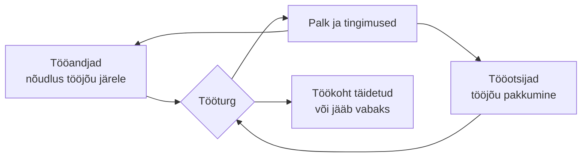

# 1. Tööturg ja majandus muutuvas maailmas

::: info Õpiväljund
Pärast tundi oskad selgitada, kuidas tööturg töötab, lugeda tööturu andmeid ja tuua näiteid, kuidas majanduse, tehnoloogia ja keskkonna muutused mõjutavad töökohti (HK 5.1 ja 5.2).
:::

Karl käib viimast semestrit. Ühel õhtul kuuleb ta kahte väidet.

- Naabrimees ütleb: "IT-s on tööd küll, sind võetakse kohe."
- Uudistes räägitakse: "Noorte töötus kasvab."

Karl ei tea, kumb on õige. Ta otsustab asja ise järele vaadata. Selles tunnis teeme sama.

## Mis on tööturg?

Karl mõtleb tööturust nii: see on koht, kus **üks pool otsib töötegijat ja teine pool otsib tööd**.

| Pool | Kes see on | Mida ta pakub | Mida ta tahab |
| --- | --- | --- | --- |
| **Tööandja** | Ettevõte, asutus | Töökoht ja palk | Inimene, kes oskab töö ära teha |
| **Töövõtja** | Karl ja teised tööotsijad | Oskused ja aeg | Töö, palk ja areng |

Kui tööandjaid on rohkem kui sobivaid inimesi, on **tööjõupuudus** ja palgad kipuvad tõusma. Kui inimesi on rohkem kui töökohti, on konkurents suurem ja töö leidmine võtab kauem. See tasakaal muutub aja jooksul.

Palk on nagu hind. Kui mingit oskust on vähe ja seda on palju vaja, siis palk tõuseb. See tõmbab sellesse valdkonda rohkem inimesi. Tööandja ja töövõtja vaatavad palka mõlemad.

### Neli numbrit, mida tööturu juures kuuled

| Mõiste | Tähendus |
| --- | --- |
| **Hõivemäär** | Mitu protsenti vanusegrupist töötab |
| **Töötuse määr** | Mitu protsenti tööjõust (töötajad ja tööd otsivad inimesed) tööd ei ole, aga otsib |
| **Keskmine palk** | Kõigi palkade summa jagatud inimeste arvuga |
| **Mediaanpalk** | Keskmise kohal oleva inimese palk: pooled saavad rohkem ja pooled vähem |

Mediaan on sageli ausam kui keskmine, sest üksikud väga suured palgad tõstavad keskmist.

## Karl vaatab numbreid: mis Eestis toimub?

Karl avab Statistikaameti ja Töötukassa lehed. Siin on see, mida ta leiab.

**Töötamine tervikuna.** Statistikaameti andmetel oli 20–64-aastaste hõivemäär 2025. aastal 81,7%. See on kõrgem kui EL-i eesmärk 2030. aastaks (78%). Samas kirjutab Majandus- ja Kommunikatsiooniministeerium, et noorte töötuse määr kasvas 2025. aastal 1,6 protsendipunkti ja see tekitab muret.

Seega on mõlemad väited tõesed. Üldiselt on töö olemas, aga **noorel, kellel on vähe kogemust, on seda raskem leida**. Karl on noor ja kogemuseta, seega puudutab teine väide teda otse.

**Palgad.** Statistikaameti andmetel oli 2025. aasta kolmandas kvartalis keskmine brutokuupalk 2075 eurot ja mediaanpalk 1722 eurot.

| Tegevusala (2025, III kvartal) | Keskmine brutopalk |
| --- | --- |
| Info ja side | 3646 € |
| Kõigi tegevusalade keskmine | 2075 € |
| Majutus ja toitlustus | 1366 € |

Info ja side on kõige kõrgema palgaga tegevusala, aga **keskmine on suure vahega ka seal**. Kõik IT-s töötavad inimesed ei saa 3646 eurot ja algaja ei alusta tavaliselt sealt. Sellest räägime kohtumisel 2.

::: tip Nii loe palgastatistikat
Brutopalk on palk enne maksude mahaarvamist. Rahakotti jõuab **netopalk**, mis on väiksem. Kuidas brutost neto saab, vaatame kohtumisel 2.
:::

## IT tööturg: nõudlus ja pakkumine

Naabrimees ütles, et IT-s on tööd küll. See oli tõsi mõne aasta eest. Vaatame, mida uuringud ütlevad.

**2021. aasta uuring (OSKA, avaldatud 2022).** Kutsekoja OSKA tööjõuvajaduse süsteem tegi prognoosi: Eesti vajab igal aastal juurde umbes **2600 uut IKT-spetsialisti**. Tasemeõppe lõpetajaid on selleks liiga vähe. Ühtlasi leiti, et 2014–2020 lõpetas või katkestas IKT-õppekavad 15 700 inimest, aga 2020. aastaks töötas neist IKT-spetsialistina ainult umbes 5500.

**2025. aasta seire (OSKA).** Kolm aastat hiljem vaadati prognoosi uuesti üle. Pilt oli teistsugune.

- Tarkvaraarendajaid oli tööle võetud isegi **660 rohkem**, kui prognoositi.
- Tööandjate sõnul on tarkvaraarendajaid nüüd **lihtsam leida kui paar aastat tagasi**, eriti juunioritasemel.
- Info- ja sidetehnika valdkonda tuli aastatel 2020–2023 juurde 2500 välismaalast.
- Töötukassas oli 2024. oktoobris arvel 900 IKT-spetsialisti ja üle 40% neist oli varem töötanud info ja side tegevusalal.

Karli jaoks tähendab see seda: **IT on endiselt hea palgaga valdkond, aga juuniori jaoks ei ole töö enam nii lihtsalt kättesaadav kui paar aastat tagasi**. Naabrimees mäletas vana olukorda. Uudised kirjeldasid uut.

::: details Kuidas lugeda prognoosi
2021. aasta uuring oli **prognoos**, mitte fakt. Prognoos ütleb, mis juhtub, kui tänased trendid jätkuvad. Kui tingimused muutuvad (majandus aeglustub, tööandjad võtavad vähem inimesi, tuleb tehisintellekt), siis prognoos ei täitu. Seepärast tehakse seire: kontrollitakse, kas prognoos läks täide.

Kui sa leiad numbri, küsi alati: kas see on **tegelik** või **prognoositud** ja **millise aasta kohta** see käib.
:::

## Kuidas keskkond tööturgu muudab

Töökohad ei ole püsivad. Neid muudavad sündmused, mis tulevad väljastpoolt ühte ettevõtet või ametit. Õppekavas on neid nimetatud neli liiki. Siin on iga liigi kohta üks näide.

| Muutuse liik | Näide | Mõju tööturule |
| --- | --- | --- |
| **Majanduslik** | Majanduskasv aeglustub, ettevõtted hoiavad kulusid kokku | Tööandjad võtavad vähem uusi inimesi, mis tabab eriti kogemuseta noori (noorte töötus kasvas 2025. aastal 1,6 protsendipunkti) |
| **Tehnoloogiline** | Tehisintellekt hakkab osa tööd tegema | Muutub, millist oskust on vaja. OSKA eksperdid hindavad, et tarkvaraarenduses ei ole mõju veel tunda, aga see võib mõjutada just nooremspetsialistide nõudlust |
| **Looduslik ja keskkonnaga seotud** | Kliimapoliitika ja üleminek vähem süsinikku kasutavale energiale | Põlevkivisektoris töökohad vähenevad (näide allpool) |
| **Teised** | Tööjõu liikumine riikide vahel | Info- ja sidetehnika valdkonda tuli aastatel 2020–2023 juurde 2500 välishõivatut, mis tõstab konkurentsi juunioritele |

### Näide: Ida-Virumaa põlevkivisektor

Ida-Virumaal on põlevkivisektor olnud aastakümneid suur tööandja. Kliimapoliitika tõttu põlevkivi kasutamine väheneb ja töökohti jääb vähemaks. Samal ajal ei ole piirkonnas kohe asendustööd samal palgatasemel.

Selle jaoks on riik teinud tööturutoetused. Alates 2024. aastast saavad põlevkivisektoris töö kaotanud inimesed:

- **Tööle asumise toetust**: 30% varasemast sissetulekust põlevkivisektoris, kuid mitte üle 1000 euro kuus, 6–12 kuud. Selleks peab uue töö leidma 100 päeva jooksul.
- **Tasemeõppe toetust**: 362 eurot kuus (2024. aasta määr).
- **Mikrokvalifikatsiooni toetust**: ühekordne 1088 eurot (2024. aasta määr).

Üleminek rahastatakse EL-i õiglase ülemineku fondist (5 miljonit eurot) ja riigi osalusest (2,1 miljonit eurot).

Sellest näitest on kaks õppetundi:

1. **Muutus ei tule sinu enda teadmata.** Põlevkivitöötaja ei otsustanud töökohta kaotada, vaid selle tegi poliitika ja turg.
2. **Oskused, mida saab ümber õppida, on kaitse.** Toetus on suunatud ümberõppele.

### Tehisintellekt on eraldi teema

Tehisintellekti mõju tööjõule on käsitletud eraldi ja suure uuringu põhjal: vaata [tehisintellekti mooduli tundi "Tööjõu ja töökorralduse mõju"](/tehisintellekt/moodul-08-rakendamine-ja-moju/tund-03-tooturg-ja-tookorraldus). Siin tuleb meelde jätta üks mõte: tehisintellekt muudab ennekõike **ülesandeid**, mitte kohe terveid ameteid.

## Kuidas teabeallikat lugeda

Karl leidis nüüd kümme numbrit. Mõned on Statistikaametist, mõned uudisest. Kuidas ta teab, kellele uskuda?

| Küsimus | Miks see loeb |
| --- | --- |
| **Kes seda avaldas?** | Statistikaamet, Töötukassa, OSKA ja Eesti Pank mõõdavad ise. Uudisteportaalid ja blogid kordavad |
| **Millise aasta kohta see käib?** | 2021. aasta pilt ei ole 2025. aasta pilt |
| **Mida see täpselt mõõdab?** | "Töötuse määr" ja "registreeritud töötute arv" ei ole sama |
| **Kas see on fakt või prognoos?** | Prognoos võib osutuda valeks |
| **Kes seda tellis ja miks?** | Ettevõte, mis müüb palgakalkulaatorit, tahab, et palgad näiksid kõrged |
| **Kas leian sama number mujalt?** | Üks allikas ei piisa |

### Kust Karl tööturu andmeid leiab

| Allikas | Mida seal on |
| --- | --- |
| [Statistikaamet](https://stat.ee) | Hõive, töötus, palgad tegevusalade kaupa |
| [Töötukassa](https://www.tootukassa.ee) | Registreeritud töötud, vabad töökohad, prognoosid |
| [OSKA (Kutsekoda)](https://oska.kutsekoda.ee) | Tööjõu- ja oskuste vajaduse uuringud valdkondade kaupa |
| [Eesti Pank](https://www.eestipank.ee) | Majanduse ja tööturu ülevaated |

## Rühmatöö: töömaailm eri tegevusvaldkondades

HK 5.2 nõuab, et iseloomustad Eesti tööturgu **eri tegevusvaldkondades** ja teed seda **juhendatud meeskonnatööna**. Õpetaja jagab klassi 4–5 rühma ja iga rühm võtab ühe tegevusvaldkonna.

**Valdkonnad:** info ja side, tervishoid ja sotsiaalhoolekanne, ehitus, töötlev tööstus, majutus ja toitlustus, haridus.

Iga rühm vastab oma valdkonna kohta kuuele küsimusele. Kasuta vähemalt **kahte** teabeallikat tabelist ülal.

1. Kui suur on keskmine brutopalk selles valdkonnas ja kuidas see erineb kõigi tegevusalade keskmisest?
2. Mis muutused (majanduslik, tehnoloogiline, keskkonnaga seotud) mõjutavad seda valdkonda kõige rohkem?
3. Mis oskusi tööandjad selles valdkonnas otsivad? (OSKA)
4. Kas valdkonnas on tööjõupuudus või -ülejääk ja mille järgi seda tuvastad?
5. Mis ameteid selles valdkonnas on? Nimeta vähemalt viis.
6. Mida peab noor tööle asuja teadma?

**Rollid rühmas:** kes otsib andmeid, kes kontrollib allikaid, kes kirjutab kokku, kes esitleb. Vaheta rolle nii, et igaüks on vähemalt ühes.

Iga rühm esitleb oma valdkonda 3 minutiga. Pärast kõiki esitlusi vaatate koos: **millised valdkonnad on Karli jaoks (IT) lähedased ja millised on väga erinevad?**

## Praktiline töö: Karli tööturu ülevaade

Töö tehakse **individuaalselt**, rühmatöö tulemusi võib kasutada. Kasuta ainult avalikke andmeid. Ära kirjuta enda palka ega isikuandmeid.

**A. Allikate kontroll**

Kolm väidet. Iga väite kohta: kas see on usaldusväärne, mille järgi sa seda otsustad ja kust kontrolliksid.

1. "IT-s on kõik töökohad täidetud juba aasta ette."
2. "Eesti keskmine palk on 2075 eurot, seega kõik saavad vähemalt nii palju."
3. "Noorte töötus kasvab, seega töö leidmine ei ole kellelgi võimalik."

**B. Muutuste tabel**

Tee tabel nelja muutuse liigi kohta (majanduslik, tehnoloogiline, looduslik, teine). Iga liigi kohta: üks näide, mõju tööturule ja ametid, mida see puudutab. Kasuta vähemalt kahte teabeallikat ja kirjuta allikate lingid.

**C. Minu valdkond**

Kirjuta 8–10 lauset, kuidas muutused mõjutavad Karli valdkonda (IT) ja mida see tähendab inimesele, kes alustab tööd järgmisel aastal.

**Esitatav töö:** tööturu ülevaade (allikate kontroll, muutuste tabel ja kokkuvõte) ning rühmatöö esitluse kokkuvõte. **Seos: HK 5.1 ja 5.2.**

## Kokkuvõte

| Mõiste | Tähendus |
| --- | --- |
| Tööturg | Koht, kus tööandjad otsivad töötajaid ja tööotsijad otsivad tööd |
| Nõudlus ja pakkumine | Tööandjate vajadus tööjõu järele ja inimeste valmidus töötada |
| Hõivemäär | Töötavate osakaal vanusegrupis |
| Mediaanpalk | Keskmise kohal oleva inimese palk |
| Prognoos | Hinnang tuleviku kohta, mis võib mitte täituda |
| Tööjõupuudus | Töökohti on rohkem kui sobivaid inimesi |
| OSKA | Kutsekoja tööjõu- ja oskuste vajaduse süsteem |

Kolm mõtet:

- Numbrit ei saa lugeda ilma **allika, aasta ja tüübita** (fakt või prognoos).
- Tööturg muutub **majanduse, tehnoloogia ja keskkonna** mõjul.
- **Üldine olukord ja sinu olukord ei pruugi olla sama**: Eesti hõivemäär on kõrge, aga noorel ja kogemuseta on raskem.

## Allikad

- [Majandus- ja Kommunikatsiooniministeerium: Majanduskommentaar, 2025. aastal töötus vähenes, kuid muret tekitab noorte töötuse kõrge tase](https://www.mkm.ee/uudised/majanduskommentaar-2025-aastal-tootus-vahenes-kuid-muret-tekitab-noorte-tootuse-korge-tase) (16.02.2026, Statistikaameti andmed)
- [Statistikaamet: Keskmine palk oli kolmandas kvartalis 2075 eurot](https://stat.ee/et/uudised/keskmine-palk-oli-kolmandas-kvartalis-2075-eurot) (27.11.2025)
- [OSKA: Eesti vajab igal aastal juurde 2600 uut IKT-spetsialisti](https://oska.kutsekoda.ee/oska-uuring-eesti-vajab-igal-aastal-juurde-2600-uut-ikt-spetsialisti/) (13.01.2022)
- [OSKA: Info- ja kommunikatsioonitehnoloogia seirearuanne 2025](https://uuringud.oska.kutsekoda.ee/uuringud/ikt-seire)
- [Ida-Viru Investeeringute Fond: Arenda oma oskusi ja leia töövõimalusi](https://idavirufond.ee/tutvu-toetusvoimalustega/arenda-oma-oskusi-ja-leia-toovoimalusi) (põlevkivisektori toetusmeetmed; määrad on 2024. aasta)
- [Töötukassa: Põlevkivisektori töötajale](https://www.tootukassa.ee/et/teenused/toootsingud/polevkivisektori-tootajale) (kohalik teenus, kontrolli tänaseid tingimusi)
