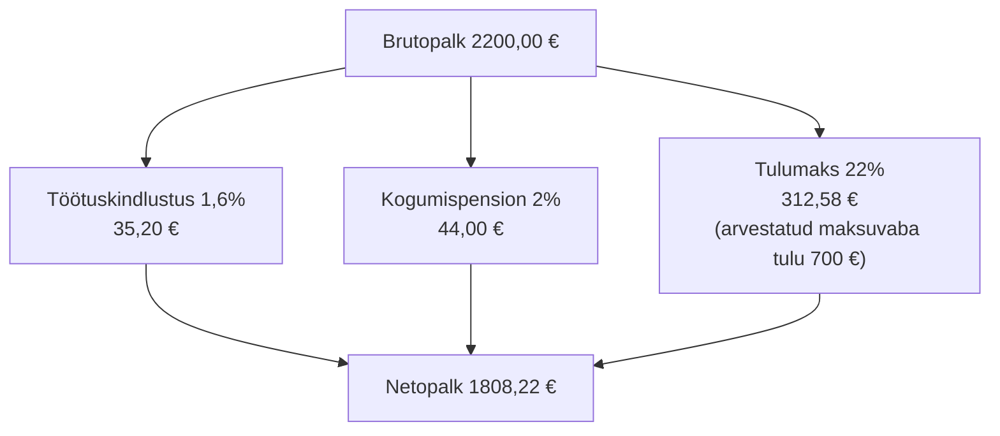

# 2. Haridus, oskused ja palk

::: info Õpiväljund
Pärast tundi oskad võrrelda erineva haridustaseme ja oskustega inimeste võimalusi tööturul, selgitada palga seost väärtusloomega ning arvutada brutopalgast netopalga (HK 5.3).
:::

Karli klassis on kolm sõpra ja igaühel on oma plaan.

- **Rasmus** läheb pärast kooli kohe tööle. Ta ütleb: "Mis mul ülikooli vaja, kogemus loeb."
- **Triin** läheb edasi õppima. Ta ütleb: "Kõrgharidusega saab rohkem palka."
- **Kadri** teeb tööd ja õpib kõrvalt veebiarenduse kursust. Ta ütleb: "Mind huvitab, mida ma oskan, mitte mis paberil on."

Karl ei tea, kellel on õigus. Ta vaatab Statistikaameti numbreid.

## Palk on hind: mille eest seda makstakse?

Eelmisel kohtumisel nägid, et palk on tööturu hind. Aga miks makstakse ühe töö eest rohkem kui teise eest? Vastuseid on kolm.

1. **Oskus on haruldane.** Mida vähem inimesi oskab, seda rohkem tööandja selle eest maksab.
2. **Töö loob rohkem väärtust.** Kui töötaja aitab ettevõttel teenida palju, saab ettevõte maksta ka palju.
3. **Töö on raske või ebameeldiv.** Sellise töö eest makstakse sageli lisatasu (öötöö, ohtlik töö).

Selles tunnis vaatame kahte esimest.

## Karl vaatab numbreid: palk haridustaseme järgi

Statistikaamet kogub iga nelja aasta tagant palgaandmeid ka haridustaseme kaupa. Viimased andmed on 2022. aasta oktoobrist. Siin on keskmine **brutotunnitasu** (tunnipalk enne maksude mahaarvamist) mõnes valitud rühmas.

| Haridustase | Kõik tegevusalad | Info ja side | Majutus ja toitlustus |
| --- | --- | --- | --- |
| Põhiharidus (7.–9. klass) | 7,90 € | 9,98 € | 6,45 € |
| Keskharidus | 8,93 € | 15,45 € | 7,23 € |
| Kutseharidus keskhariduse baasil | 8,89 € | 15,16 € | 7,30 € |
| Bakalaureus või sellega võrdsustatud | 12,44 € | 18,12 € | 9,10 € |
| Magister või sellega võrdsustatud | 13,31 € | 19,10 € | 8,67 € |
| Doktor või sellega võrdsustatud | 18,92 € | 20,20 € | andmed puuduvad |

*Allikas: Statistikaamet, tabel PA6351, 2022. aasta oktoober. Tunnipalgad on 2022. aasta tasemel, seega tänased summad on kõrgemad.*

### Mida Karl numbritest näeb

**1. Haridus tõstab keskmist palka.** Kõigi tegevusalade peale on bakalaureuse tunnipalk (12,44 €) umbes 39% kõrgem kui keskharidusega inimesel (8,93 €). Magistril on vahe umbes 49%.

**2. Valdkond loeb sama palju kui haridustase.** Info ja side valdkonnas teenib keskharidusega inimene 15,45 € tunnis. See on rohkem kui bakalaureus kõigi tegevusalade keskmisena (12,44 €) ja rohkem kui magister (13,31 €). Majutuse ja toitlustuse valdkonnas teenib magister (8,67 €) isegi vähem kui bakalaureus (9,10 €).

**3. Info ja side valdkonnas on haridus ikkagi oluline.** Seal teenib bakalaureus (18,12 €) umbes 17% rohkem kui keskharidusega inimene (15,45 €). Vahe on väiksem kui kõigi tegevusalade peale, aga see on olemas.

Rasmusel, Triinul ja Kadril on kõigil õigus, aga erinevas osas:

- **Rasmus:** valdkond ja oskus ongi palju väärt. Kui ta on IT-s, siis alustab ta kõrgemalt kui paljudes teistes valdkondades.
- **Triin:** haridus tõstab keskmist palka igas valdkonnas.
- **Kadri:** oskusi saab tõendada ka muul viisil kui diplomiga, näiteks portfoolio ja töönäidetega.

::: warning Mida need numbrid ei ütle
- Need on **keskmised**. Üksiku inimese palk võib olla palju kõrgem või madalam.
- Need on **seosed**, mitte põhjus. Kõrgem haridus ei too automaatselt kõrgemat palka. Seos on ka sellega, et kõrgharidusega inimesed töötavad sageli teistes ametites.
- Andmed on 2022. aastast, mitte tänasest päevast.
:::

## Väärtusloome: millest palk tekib?

Ettevõte maksab palka sellest, mida ta ise teenib. Selle mõõtmiseks kasutatakse **lisandväärtust**. See on summa, mille ettevõte lisab sellele, mida ta on sisse ostnud.

**Näide.** Väike veebiagentuur müüb kodulehe 5000 euro eest. Ta on selle jaoks ostnud 800 euro eest serveriteenust ja litsentse. Agentuuri **lisandväärtus** on 5000 − 800 = 4200 eurot. Sellest makstakse töötajate palgad, maksud ja kate. Mida rohkem väärtust üks töötaja aastas lisab, seda rohkem on ruumi palgaks.

Statistikaamet arvutab lisandväärtuse tegevusalade kaupa. Kui jagada see hõivatute arvuga, saame, kui palju väärtust loob aastas keskmiselt üks töötaja.

| Tegevusala (2024) | Lisandväärtus (mln €) | Hõivatuid (tuhat) | Lisandväärtus ühe hõivatu kohta |
| --- | --- | --- | --- |
| Töötlev tööstus | 4436,0 | 109,7 | umbes 40 400 € |
| Ehitus | 2280,1 | 52,3 | umbes 43 600 € |
| Info ja side | 3040,2 | 39,6 | umbes 76 800 € |
| Kogu majandus | 34 946,1 | 690,9 | umbes 50 600 € |

*Allikas: Statistikaamet, tabelid RAA0045 ja RAL0021, 2024. Jagatis on arvutatud siin.*

Info ja side valdkonnas loob üks töötaja keskmiselt umbes 1,5 korda rohkem lisandväärtust kui kogu majanduses. Samas on see ka valdkond, kus keskmine palk on kõrgeim (3646 €, 2025. aasta III kvartal, vt kohtumine 1).

Selle kaudu saab Karl selgitada, **miks tarkvaraarendaja palk on kõrge**: tarkvara saab kopeerida ja müüa paljudele, nii et ühe töötaja töö loob palju väärtust. Teenindustöötaja töö on sama vajalik, aga ta saab teenindada ühe kliendi korraga.

::: tip Ettevaatust üldistusega
Kõrge lisandväärtus ei tähenda alati kõrget palka. Näiteks kinnisvara või elektritootmise puhul tuleb väärtus suures osas seadmetest ja varadest, mitte töötaja tööst. Seos palga ja väärtusloome vahel on olemas, aga see ei ole mingi seadus.
:::

## Kolme sõbra võimalused tööturul

Siin on Karli kolm sõpra, kes on tööturul mõne aasta pärast. Andmed on väljamõeldud, aga olukord on realistlik.

| Inimene | Haridus ja oskused | Võimalused | Riskid |
| --- | --- | --- | --- |
| **Rasmus** | Kutseharidus, 3 aastat töökogemust IT-toes | Saab töö kiiresti, õpib töö käigus | Kui ta ei õpi juurde, jääb tase seisma |
| **Triin** | Bakalaureus, vähe tööd | Laiem tööpakkumiste valik, kõrgem lähtepalk | Töökogemus puudub, noorte seas on konkurents suurem |
| **Kadri** | Kutseharidus, täiendkoolitused, portfoolio | Näitab oskusi otse tööandjale | Ilma tõendita (portfoolio, sertifikaat) ei märka tööandja |

Kolme mõtet:

- **Formaalne haridus** (diplom) näitab, et sa oled midagi lõpetanud.
- **Oskused** (mida sa tegelikult suudad) näitab portfoolio, kogemus ja töökatse.
- **Täiendõpe** hoiab oskused värsked. Tehnoloogia muutub kiiresti.

## Brutopalgast netopalgani

Karl saab tööpakkumise: **brutopalk 2200 eurot kuus**. Ta küsib: "Kui palju ma kätte saan?"

Selleks tuleb teada kolme asja.

- **Brutopalk** on summa lepingus enne mahaarvamisi.
- **Netopalk** on summa, mis jõuab pangakontole.
- **Tööandja kulu** on brutopalk pluss tööandja maksud. Seda summat ei näe töötaja, aga tööandja peab selle välja maksma.

### 2026. aasta määrad

| Maks või makse | Kes maksab | Määr |
| --- | --- | --- |
| Tulumaks | Töötaja (peetakse palgast kinni) | 22% |
| Maksuvaba tulu | Töötaja arvestab kuu tulust maha | 700 € kuus |
| Töötuskindlustusmakse | Töötaja | 1,6% |
| Töötuskindlustusmakse | Tööandja | 0,8% |
| Sotsiaalmaks | Tööandja | 33% |
| Kogumispension (II sammas) | Töötaja, kui on liitunud | 2%, 4% või 6% |

*Allikas: Maksu- ja Tolliamet, "Maksumuudatused 2026". Maksuvaba tulu kasutamiseks tuleb tööandjale esitada kirjalik avaldus ja seda saab kasutada ainult ühe tööandja juures.*

### Karli arvutus

Karl on liitunud kogumispensioniga (2%). Arvutame samm-sammult.

1. Töötuskindlustus: 2200 × 1,6% = **35,20 €**
2. Kogumispension: 2200 × 2% = **44,00 €**
3. Maksustatav summa: 2200 − 35,20 − 44,00 − 700 = **1420,80 €**
4. Tulumaks: 1420,80 × 22% = **312,58 €**
5. Netopalk: 2200 − 35,20 − 44,00 − 312,58 = **1808,22 €**

**Tööandja kulu.** Tööandja maksab lisaks brutopalgale sotsiaalmaksu (2200 × 33% = 726,00 €) ja töötuskindlustust (2200 × 0,8% = 17,60 €). Kokku on kulu 2200 + 726,00 + 17,60 = **2943,60 €**.

Seega maksab tööandja Karli töö eest 2943,60 eurot, aga Karl saab kätte 1808,22 eurot. See vahe on põhjus, miks "palk" võib tähendada kolme eri summat. Tööpakkumises ja lepingus on tavaliselt brutopalk.

Kui Karl ei oleks pensioniga liitunud, oleks netopalk 1842,54 €. Kuid siis ei koguneks tal kogumispensionile raha ja riik ei lisaks sotsiaalmaksust 4%. Pensionist räägime kohtumisel 5.

::: tip Pea meeles
Kui keegi nimetab palga, küsi alati: kas see on **bruto** või **neto**? Vahe on umbes 18%, kui palk on 2200 eurot.
:::

## Praktiline töö: Karli palk ja võimalused

Töö tehakse **fiktiivsete andmetega**. Ära kirjuta oma palka ega lepingu andmeid.

**A. Netopalga arvutus**

Karli sõber Rasmus saab tööpakkumise **brutopalgaga 2400 eurot**. Ta on liitunud kogumispensioniga (2%) ja esitas maksuvaba tulu avalduse. Arvuta samm-sammult:

1. töötuskindlustus ja kogumispension
2. maksustatav summa
3. tulumaks
4. netopalk
5. tööandja kulu

Kontrolli ennast: netopalgaks peaks tulema **1958,61 €** ja tööandja kuluks **3211,20 €**.

**B. Tabeli lugemine**

Vaata ülaltoodud tunnipalkade tabelit ja vasta kirjalikult kahe lausega iga küsimuse kohta.

1. Mitu protsenti kõrgem on bakalaureuse tunnipalk keskharidusega inimese omast **info ja side** valdkonnas?
2. Mis on kolm põhjust, miks info ja side valdkonnas on keskharidusega inimese tunnipalk kõrgem kui kõigi tegevusalade bakalaureuse tunnipalk?
3. Miks ei saa tabelist järeldada, et "magistri õppimine tõstab palka"?

**C. Väärtusloome**

Ütle oma sõnadega, mis on lisandväärtus. Võta fiktiivne ettevõte (nt Karli sõbra veebiagentuur), kirjuta müügitulu, sisseostud ja arvuta lisandväärtus. Seejärel selgita kahe lausega, miks info ja side töötaja loob keskmiselt rohkem väärtust kui töötlevas tööstuses.

**D. Võimalused**

Kirjelda Rasmuse, Triini ja Kadri võimalusi tööturul viie aasta pärast. Iga inimese kohta: üks tugevus, üks risk ja üks tegevus, mida ta saaks teha, et olukorda parandada. Seo vähemalt ühe väitega Statistikaameti tabelist.

**Esitatav töö:** palgaarvutus, tabeli analüüs, lisandväärtuse selgitus ja kolme inimese võrdlus. **Seos: HK 5.3.**

## Kokkuvõte

| Mõiste | Tähendus |
| --- | --- |
| Brutopalk | Palk enne maksude ja maksete mahaarvamist |
| Netopalk | Summa, mis jõuab pangakontole |
| Tööandja kulu | Brutopalk pluss tööandja maksud |
| Maksuvaba tulu | Summa, mida tulumaksuga ei maksustata (700 € kuus, 2026) |
| Lisandväärtus | Toodangu väärtus miinus sisseostetud kaubad ja teenused |
| Väärtusloome | See, kui palju väärtust töö või ettevõte loob |
| Täiendõpe | Õppimine pärast põhiõpinguid, oskuste värskena hoidmiseks |

Kolm mõtet:

- **Haridus, valdkond ja oskused** mõjutavad palka. Ükski neist ei garanteeri seda üksi.
- Palk tuleb **väärtusest, mida töö loob**. Kõrge väärtusloome valdkonnas on palgaruumi rohkem.
- **Bruto ja neto** on eri summad. Tööandja kulu on veel kolmas.

## Allikad

- [Statistikaamet: palgastruktuuri uuring, tabel PA6351 (keskmine brutotunnitasu soo, haridustaseme ja tegevusala järgi, oktoober 2022)](https://andmed.stat.ee)
- [Statistikaamet: tabel RAA0045 (lisandväärtus tegevusala järgi) ja tabel RAL0021 (tööhõive tegevusala järgi)](https://andmed.stat.ee)
- [Statistikaamet: Keskmine palk oli kolmandas kvartalis 2075 eurot](https://stat.ee/et/uudised/keskmine-palk-oli-kolmandas-kvartalis-2075-eurot) (27.11.2025)
- [Maksu- ja Tolliamet: Maksumuudatused 2026. aastal](https://www.emta.ee/uudised/maksumuudatused-2026)
- [Minuraha.ee: II sammas](https://minuraha.ee/et/pension/ii-sammas)
