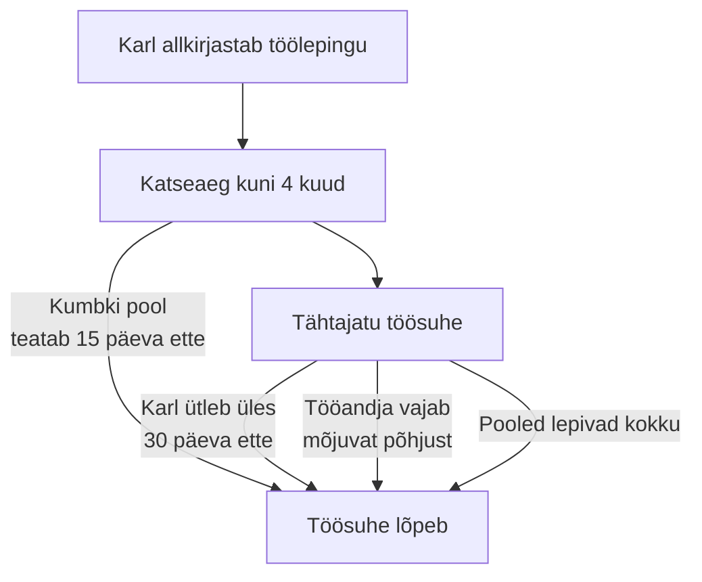

# 3. Töösuhe: õigused, kohustused ja leping

::: info Õpiväljund
Pärast tundi oskad selgitada tööandja ja töövõtja õigusi ja kohustusi, eristada tööd tegemise lepingutüüpe ning võrrelda lepingutingimusi, et tuvastada võimalikud probleemid enne allkirjastamist (HK 5.4 ja 5.5).
:::

Karl käib lõpuks töövestlusel. Nädal hiljem saabub e-kiri: "Tere, Karl! Meil on hea meel pakkuda sulle tööd. Lisame lepingu. Palun allkirjasta täna, siis saad esmaspäevast alustada."

Karl vaatab lepingut. Seal on palju tundmatuid sõnu. Ta tunneb rõõmu, aga kiire allkiri teda ei veena. Ta otsustab enne asjad selgeks teha.

::: tip Reegel number üks
Hea tööandja annab sulle aega lepingut lugeda. Kui sind sunnitakse "täna allkirjastama", on see märk, et tasub kahtlustada.
:::

## Kolm viisi tööd teha

Karlile pakutakse kolme võimalust. Need kõlavad sarnaselt, aga on seaduse ees väga erinevad.

| | **Tööleping** | **Töövõtuleping** | **Käsundusleping** |
| --- | --- | --- | --- |
| Millega on seadus? | Töölepingu seadus | Võlaõigusseadus | Võlaõigusseadus |
| Kes juhib tööd? | Tööandja annab korraldusi | Sina otsustad ise, kuidas | Sina otsustad ise, kuidas |
| Mida tellitakse? | Töötegemine | Konkreetne tulemus (nt koduleht) | Tegevus (nt konsultatsioon) |
| Palga alammäär | Kehtib | Ei kehti | Ei kehti |
| Tasuline põhipuhkus | Kehtib | Ei kehti | Ei kehti |
| Tööaja piirangud ja ületunnitöö tasu | Kehtivad | Ei kehti | Ei kehti |
| Vorm | Kirjalik | Suuline või kirjalik | Suuline või kirjalik |
| Töövahendid ja risk | Tööandja | Sinu enda | Sinu enda |

*Allikas: Tööinspektsioon, "Lepingute liigid ja töölepingu näidis".*

### Kuidas tuvastada, mis leping tegelikult on?

Karl kuuleb kasulikku nõuannet: **nimi lepingu peal ei määra, mis see on**. Kui sa töötad kindlal ajal kindlas kohas, tööandja annab sulle korraldusi ja töövahendid on tema, siis on see sisuliselt tööleping, ükskõik mida paber ütleb.

Sa küsid enda käest kolm küsimust:

1. Kas keegi ütleb mulle, **millal ja kus** ma töötan?
2. Kas ma kasutan **tema** töövahendeid?
3. Kas minu töö on **pidev**, mitte üks kindel tulemus?

Kui vastus on kolm korda "jah", siis peaks see olema tööleping. Töövõtu- või käsundusleping annab tööandjale odavama lahenduse, aga **sina kaotad puhkuse, ületunnitasu ja palga alammäära kaitse**.

## Mis peab töösuhtes selge olema?

Töölepingu seaduse § 5 ütleb, millest peab tööandja töötajat kirjalikus dokumendis teavitama. Töölepingus on tavaliselt need andmed otse sees. Loetelus on 14 punkti, siin on nad Karli jaoks rühmitatud.

| Teema | Mida lepingust leida |
| --- | --- |
| **Kes** | Tööandja ja töötaja nimi, kood, aadress |
| **Mida** | Tööülesannete kirjeldus, ametinimetus |
| **Kus ja millal** | Töö tegemise koht, tööaeg |
| **Palju** | Töötasu, arvutamise viis, palgapäev, kinnipeetavad maksud |
| **Puhkus** | Põhipuhkuse kestus |
| **Kuidas lõpeb** | Ülesütlemise vorm, põhjendamiskohustus ja etteteatamistähtajad |
| **Muu** | Koolitus ja hüved, ületunnitöö kord, töökorralduse reeglid, kollektiivleping, katseaja kestus |

Kui midagi sellest puudub, saab töötaja seda **igal ajal nõuda** ja tööandja peab andmed esitama kahe nädala jooksul. Töölepingu andmed säilitab tööandja töösuhte ajal ja kümme aastat pärast seda.

## Õigused ja kohustused: mis seadusest tuleneb?

Töölepingu seadus annab mõlemale poolele õigused ja kohustused. Mis on Karli jaoks kõige olulisem?

### Tööaeg ja ületunnitöö

- **Tööaeg.** Eeldatakse, et töötaja töötab **40 tundi nädalas** ja 8 tundi päevas, kui pooled pole leppinud lühemas tööajas (§ 43). Osaline tööaeg on kokkuleppel võimalik.
- **Ületunnitöö.** See on töö kokkulepitud tööaja kõrval. Sellest tuleb **iga kord eraldi kokku leppida**. Lepingus ei saa ette kirjutada "töötaja teeb vajadusel ületunde". Erandina võib tööandja nõuda ületunnitööd ettenägematu olukorra (nt kahju ärahoidmine) tõttu (§ 44).
- **Tasu ületunni eest.** Tööandja annab vaba aega ületunni ajaga võrdses ulatuses või maksab **1,5-kordset** töötasu, kui on kokku lepitud rahas hüvitamises.

### Puhkus

- Põhipuhkus on **28 kalendripäeva** aastas (§ 55). Seda võib kokkuleppel pikendada, aga mitte lühendada.

### Töötasu

- Töötasu makstakse rahas. Sellest arvestatakse maha seadusega ette nähtud maksud ja maksed (§ 29). Vabariigi Valitsus kehtestab töötasu alammäära.
- Palgapäev peab olema töölepingus või selle lisas teada.

### Saladuse hoidmine ja konkurentsipiirang

- **Saladuse hoidmine** (§ 22). Tööandja saab määrata, millise ärisaladuse kohta kehtib hoidmise kohustus.
- **Konkurentsipiirang** (§ 23). Tööandja ei tohi sulle üldiselt keelata teise tööandja juures töötamist. Erandiks on **konkurentsipiirangu kokkulepe**, mille võib sõlmida ainult siis, kui see on vajalik tööandja erilise majandushuvi kaitseks, näiteks töötaja tunneb kliente või ärisaladusi. Piirang peab olema **ruumiliselt, ajaliselt ja esemeliselt mõistlikult piiritletud**. Kui nõudeid rikutakse, on kokkulepe tühine.

### Katseaeg

- **Katseaeg** on seadusest tulenev (§ 10¹). Töötajale rakendub **neljakuuline katseaeg**, kui lepingus ei ole kokku lepitud, et seda ei kohaldata või see on lühem.
- Katseaja eesmärk on hinnata, kas töötaja sobib tööle. Haiguse või puhkuse aega katseaja hulka ei arvestata.
- Katseajal võib lepingu üles öelda **vähemalt 15 kalendripäeva** etteteatamisega (§ 96). Seda saavad teha mõlemad pooled. Tööandja ei või lepingut üles öelda põhjusel, mis on katseaja eesmärgiga vastuolus (§ 86).

### Ülesütlemine

| Kes? | Mis tingimusel? | Etteteatamine |
| --- | --- | --- |
| **Töötaja** | Tähtajatu töölepingu võib igal ajal korraliselt üles öelda (§ 85) | Vähemalt **30 kalendripäeva** (§ 98) |
| **Tööandja** | Tööandja **ei või** korraliselt üles öelda (§ 85 lg 5). Tal peab olema erakorralise ülesütlemise põhjus, näiteks töötajast tulenev põhjus (§ 88) või majanduslik põhjus (§ 89) | Sõltub töösuhte kestusest (§ 97): alla 1 aasta vähemalt 15 päeva, 1–5 aastat 30 päeva, 5–10 aastat 60 päeva, üle 10 aasta 90 päeva |
| **Kokkuleppel** | Töölepingu võib lõpetada poolte kokkuleppel (§ 79) | Pooled lepivad kokku |

Kui tööandja koondab töötaja, maksab ta hüvitist **ühe kuu keskmise töötasu** ulatuses ja töötajal on õigus töötuskindlustuse hüvitisele (§ 100).

### Mida teha, kui tekib vaidlus?

Töölepingu vaidlusi lahendab **töövaidluskomisjon** või kohus. Esimene samm on rääkida tööandjaga ja küsida nõu Tööinspektsioonilt. Pärast lahkumist tuleks hoida lepingut, palgalehti ja kirjavahetust.

## Karli leping: mis on probleem?

Karl vaatab oma lepingu tingimusi. Siin on tüüpilised lepingutingimused, mis võivad hiljem põhjustada probleeme.

| Tingimus Karli lepingus | Probleem | Mida teha enne allkirjastamist |
| --- | --- | --- |
| "Töötaja teeb vajadusel ületunnitööd ilma lisatasuta" | Ületunnist peab iga kord eraldi kokku leppima ja see tuleb hüvitada (§ 44) | Küsi, kuidas ületunde hüvitatakse, ja lisa see lepingusse |
| "Katseaeg on 12 kuud" | Katseaeg on seadusega kuni 4 kuud (§ 10¹) | Märgi, et see ei ole seaduslik |
| "Töötaja ei tohi lahkumise järel 3 aastat IT-s töötada" | Konkurentsipiirang peab olema mõistlikult piiritletud (§ 23). Selline piirang on tõenäoliselt tühine | Küsi, miks see on vajalik ja piiritle koht, aeg ja tegevus |
| "Palk on 2200 eurot" (ilma brutota või netota) | Pole selge, kas bruto või neto | Küsi täpsustust, lisa "bruto" |
| "Ametinimetus: IT-spetsialist" | Tööülesanded on liiga laiad | Lisa tööülesannete kirjeldus (§ 5) |
| "Puhkus: 20 päeva" | Põhipuhkus on vähemalt 28 kalendripäeva (§ 55) | Kontrolli, kas see on mõeldud tööpäevades või kalendripäevades |
| Pakutakse töövõtulepingut, aga töö toimub tööandja ruumides tema graafiku alusel | Sisult tööleping | Küsi, miks ei ole tööleping |

## Lepingutingimuste tähtsus: mis on kõige olulisem?

HK 5.5 nõuab, et **võrdled lepingutingimuste tähtsust**. Kõik tingimused ei ole võrdselt olulised ja iga inimene hindab neid erinevalt. Karl teeb endale järjestuse.

| Tingimus | Mis juhtub, kui see on halb | Kui oluline Karli jaoks |
| --- | --- | --- |
| Palk ja palgapäev | Raha ei jätku või tuleb hilja | Väga oluline |
| Tööülesanded | Teed tööd, mida sa ei lubanud | Väga oluline |
| Tööaeg ja ületunnid | Vaba aeg kaob | Oluline |
| Puhkus | Ei saa puhata | Oluline |
| Katseaeg | Kaotad töö kiiresti | Oluline |
| Konkurentsipiirang | Ei saa hiljem samas valdkonnas töötada | Sõltub ettevõttest |
| Koolitus ja arenguvõimalus | Ei õpi juurde | Karlile oluline |
| Töökoht (kodus või kontoris) | Sõidukulu ja ajakulu | Oluline |

Ära tõsta pingeritta ainult palka. **Võrdle tingimusi tervikuna**: mõnikord on 100 eurot madalam palk koos paremate õppimisvõimalustega parem pakkumine.

### Mida arendaja peaks veel küsima?

Karl küsib enne allkirjastamist, mis saab sellest, mida ta töö käigus kirjutab:

- **Kellele kuuluvad programmid ja kood**, mille ta tööaja jooksul loob? Küsi seda lepingust või ettevõtte kordadest.
- **Kas tohib teha isiklikke projekte** (nt avatud lähtekoodiga) töövälisel ajal?
- **Mis on salajane teave** (klientide andmed, lähtekood, serverite paroolid) ja mida ta ei tohi väljapoole anda?

## Praktiline töö: Karli lepingu võrdlus

Töö tehakse **fiktiivsete lepingutega**. Ära kasuta oma töölepingut ega kellegi päris lepingut. Võid võtta Tööinspektsiooni töölepingu näidise.

Karl sai kaks pakkumist.

**Pakkumine A (Kuressaare Tarkvara OÜ, fiktiivne):**
- Tööleping, tähtajatu
- Brutopalk 2100 €, palgapäev iga kuu 10. kuupäev
- Tööaeg 40 h nädalas, ületunnid kokkuleppel, hüvitatakse vaba ajaga
- Põhipuhkus 28 kalendripäeva
- Katseaeg 4 kuud
- Koolitusrahastus 500 € aastas
- Konkurentsipiirang puudub

**Pakkumine B (Saarte Veeb OÜ, fiktiivne):**
- Töövõtuleping 1 aasta, tähtajaga
- Tasu 2600 € kuus (pole märgitud, kas bruto või neto)
- Tööaeg: tööandja ruumides kell 9–17
- Puhkust ei ole
- Kolme aasta konkurentsipiirang kogu Eestis
- Koolitusi ei ole

**A. Tüübi tuvastamine**

Vasta pakkumise B kohta kolmele küsimusele ("kes juhib tööd?", "kelle vahenditega?", "kas töö on pidev?") ja otsusta, kas sisuliselt on tegu töölepinguga. Põhjenda.

**B. Probleemide leidmine**

Tee tabel pakkumise B kohta: tingimus, probleem, seadus, mida teha enne allkirjastamist. Leia vähemalt viis probleemi.

**C. Võrdlus**

Võrdle pakkumisi A ja B kokkuvõttes: kolm kõige olulisemat tingimust Karli jaoks ja kumb on parem. Arvesta, et pakkumine B sisaldab kõrgemat summat. Kirjuta 6–8 lauset.

**D. Küsimused tööandjale**

Kirjuta viis küsimust, mida Karl peaks enne allkirjastamist esitama pakkumise B tööandjale.

**Esitatav töö:** lepingutüübi tuvastus, probleemide tabel, võrdlus ja viis küsimust. **Seos: HK 5.4 ja 5.5.**

## Kokkuvõte

| Mõiste | Tähendus |
| --- | --- |
| Tööleping | Leping, kus töötaja töötab tööandja juhtimisel. Kehtib töölepingu seadus |
| Töövõtuleping | Leping konkreetse tulemuse saamiseks. Töötaja otsustab ise, kuidas |
| Käsundusleping | Leping tegevuse tegemiseks. Töötaja otsustab ise, kuidas |
| Katseaeg | Kuni 4 kuud, mil mõlemad pooled saavad lepingu lühikese etteteatamisega üles öelda |
| Ületunnitöö | Töö üle kokkulepitud tööaja. Kokku lepitakse iga kord eraldi |
| Konkurentsipiirang | Kokkulepe, mis keelab pärast töösuhet konkurendi juures töötada |
| Etteteatamistähtaeg | Aeg, mille võrra enne töösuhte lõppu peab teisele poolele teatama |
| Töövaidluskomisjon | Asutus, kes lahendab töövaidlusi |

Kolm mõtet:

- **Leping on rohkem kui palk.** Loe läbi ka puhkus, tööaeg, katseaeg ja lõpetamise tingimused.
- **Seadus kaitseb töölepingu töötajat.** Töövõtu- ja käsunduslepingu puhul on kaitse väiksem.
- **Ära allkirjasta kiirustades.** Küsimine ei vähenda sinu väärtust. Hea tööandja vastab.

## Allikad

- [Töölepingu seadus (Riigi Teataja)](https://www.riigiteataja.ee/akt/107122016012)
- [Tööinspektsioon: Töölepingu seaduse selgitused (august 2024)](https://www.ti.ee/sites/default/files/documents/2024-09/TLS%20selgitused_2024%20august.pdf). Paragrahvide numbrid ja tekstid on võetud siit.
- [Tööinspektsioon: Lepingute liigid ja töölepingu näidis](https://www.ti.ee/ennetus-ja-teave/infomaterjalid/lepingute-liigid-ja-toolepingu-naidis)
- [Tööelu.ee: Töölepingu sõlmimine](https://www.tooelu.ee/en/7/entry-employment-contract)
