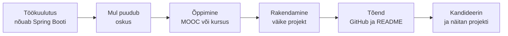

# 4. Minu oskused ja karjäärivõimalused

::: info Õpiväljund
Pärast tundi oskad võrrelda oma oskusi ametite nõuetega Oskuste Kompassi ja päris töökuulutuste abil, leida puuduvate oskuste jaoks õppetee, intervjueerida eriala vilistlast ja kavandada oma arendamist vajavate oskuste jaoks tegevusi (HK 5.6 ja 5.7).
:::

Karl on näinud tööturu andmeid, palku ja lepingut. Nüüd tuleb küsimus, mida ta enda kohta ei tea: **"Mis ametis ma tegelikult tahan ja suudan töötada?"**

IT-s ei ole ainult "programmeerija". On arendaja, testija, süsteemiadministraator, andmeanalüütik, tugispetsialist ja veel palju teisi. Igaühes on vaja veidi erinevaid oskusi.

## Esimene samm: mis mind huvitab?

Karl alustab huvidest. Töö, mis sind ei huvita, muutub kiiresti koormaks, ükskõik kui hea palk on.

### Jobpics: huvide test piltidega

**Jobpics** on veebipõhine karjääri huvitest. Sul ei ole vaja lugeda, vaid vaatad pilte erinevatest ametitest ja valid, mis sulle meeldib. Test põhineb RIASEC-süsteemil, mis jagab huvid kuue tüüpi: praktiline, uurimuslik, kunstiline, sotsiaalne, ettevõtlik ja korraldav. Testis on 139 pildikaarti, mis katavad 588 ametit Eesti tööturu kohta.

Test pärineb Norrast (2009) ja on Eestis kohandatud alates 2012. aastast, uuendatud 2023. aastal. Seda tehakse eriti neile, kellele tekstipõhised testid ei sobi.

**Mida Jobpics ütleb ja mida mitte?**

- **Ütleb:** millised tegevused sulle meeldivad.
- **Ei ütle:** mida sa oskad. Huvi ja oskus ei ole sama asi.

Seepärast kasutab Karl järgmiseks teist tööriista.

## Teine samm: mida ma oskan? Oskuste Kompass

**Oskuste Kompass** (oskused.ee) on Kutsekoja loodud veebikeskkond, mis kirjeldab oskusi ja ameteid Eesti tööturu jaoks. Selle taga on Kutsekoda koos Haridus- ja Teadusministeeriumi ja Töötukassaga ning see põhineb kutsestandarditel, OSKA uuringutel ja Euroopa oskuste ja ametite klassifikaatoril ESCO.

| Mis | Maht |
| --- | --- |
| Oskusi kirjeldatud | üle 4800 |
| Ametiprofiile | üle 450 |
| Töövaldkondi | 23 |

*Allikas: oskused.ee, "Korduma kippuvad küsimused". Arvud kasvavad pidevalt, vaata kehtivaid numbreid kodulehelt.*

### Mida Kompassiga teha saab

Kompassi kasutamiseks ei ole vaja sisse logida.

1. **Märgi oskusi.** Vali oskused, mis sul on, ja hinda oma taset.
2. **Võrdle ameteid.** Kuni kolme ameti nõudeid saab panna kõrvuti.
3. **Ametisoovitaja.** Kui oled märkinud vähemalt 30 oskust ja vastanud viiele küsimusele hariduse, õppimisvalmiduse ja töösoovide kohta, soovitab Kompass sulle sobivaid ameteid.
4. **Minu Kompass.** Siia salvestuvad märgitud oskused ja soovitused. Need on salvestatud sinu brauseris (küpsistes), mitte kontoga.

### Karli oskuste võrdlus

Karl valib Kompassist kolm ametit, mis teda huvitavad. Ta võib neid otsida nime järgi, näiteks tarkvaraarendaja, testija ja süsteemiadministraator. **Kontrolli Kompassis, mis nimedega need seal on**, sest ametite nimed võivad olla teistsugused.

Ta teeb tabeli. Siin on näide, kuidas ta oma oskusi võrdleb. Oskuste nimed ja hinnangud on väljamõeldud illustratsioon, tegelikud oskused võta Kompassist.

| Oskus | Karli tase | Amet A | Amet B | Amet C |
| --- | --- | --- | --- | --- |
| Programmeerimine | Hea | Väga vajalik | Vähem vajalik | Vajalik |
| Veaotsing | Keskmine | Vajalik | Väga vajalik | Vajalik |
| Klienditeenindus | Nõrk | Vähem vajalik | Vähem vajalik | Väga vajalik |
| Meeskonnatöö | Hea | Vajalik | Vajalik | Vajalik |
| Dokumenteerimine | Keskmine | Vajalik | Väga vajalik | Vähem vajalik |

Tabelist saab Karl kolm asja teada:

- **Tugevused:** oskused, kus ta vastab ameti nõudele või ületab seda.
- **Lüngad:** oskused, kus ametile vaja rohkem kui tal on.
- **Valik:** amet, kus on lünki vähem või kus lüngad on sellised, mida ta tahab õppida.

::: tip Oskused ei ole ainult tehnilised
Tabelis on ka meeskonnatöö, suhtlemine ja dokumenteerimine. Tööandjad otsivad neid oskusi sama palju kui tehnilisi. Pea meeles, et ka **praktika, hobid ja koolitööd** loevad oskuste tõendina.
:::

## Kolmas samm: mida tööandjad tegelikult küsivad?

Oskuste Kompass kirjeldab ameteid üldiselt. Aga Karlil on konkreetne eesmärk: tarkvaraarendaja töökoht. Selleks vaatab ta **päris töökuulutusi**. Igas kuulutuses on kirjas, milliseid oskusi tööandja ootab. Need on tänane tööturg, mitte õpik.

### Kust kuulutusi leida?

- [Töötukassa tööpakkumised](https://www.tootukassa.ee/et/toopakkumised/otsing): otsing ja filtrid, kuulutusi saab salvestada.
- Töökuulutuste portaalid (nt CV Keskus, CV.ee) ja ettevõtete enda karjäärilehed.
- LinkedIn, kui sul on seal konto.

Otsi näiteks sõnadega "tarkvaraarendaja", "junior developer", "praktikant" või "Java arendaja". Vali kuulutused, mis sobivad **algajale** või **nooremspetsialistile**.

### Karli kuulutuste analüüs

Karl leiab viis kuulutust ja loeb neist välja nõuded. Alloleval näitel on kolm **väljamõeldud** kuulutust, et näha, kuidas tabelit koostada. Päris kuulutustega tee sama.

| Oskus | Liik | Kuulutus 1 | Kuulutus 2 | Kuulutus 3 | Mitmes nõuab |
| --- | --- | --- | --- | --- | --- |
| Java | Tehniline | Nõutav | Nõutav | Pole | 2 / 3 |
| Spring Boot | Tehniline | Eeliseks | Nõutav | Pole | 2 / 3 |
| SQL ja andmebaasid | Tehniline | Nõutav | Nõutav | Nõutav | 3 / 3 |
| Git | Tehniline | Nõutav | Nõutav | Nõutav | 3 / 3 |
| Inglise keel | Keel | Nõutav | Nõutav | Nõutav | 3 / 3 |
| Meeskonnatöö | Üldine | Nõutav | Eeliseks | Nõutav | 3 / 3 |
| Docker | Tehniline | Pole | Eeliseks | Pole | 1 / 3 |

Karl märgib tabelisse ka seda, mida kuulutused kirjutavad **haridusest ja kogemusest** (nt "kõrgharidus või õpingud pooleli", "kogemus 1 aasta"). Ta kontrollib, kas mõni nõue on nii range, et sobib ainult kogenutele.

Selle tabelist saab ta kolm vastust:

1. **Mida nõutakse kõige sagedamini?** Need oskused on turu "miinimum". Siin SQL, Git ja inglise keel.
2. **Millised on eeliseks?** Need eristavad sind teistest kandidaatidest. Siin Spring Boot ja Docker.
3. **Kus on minu lüngad?** Võrdle tabelit oma oskustega.

::: tip Kuulutus ei ole seadus
Tööandjad kirjutavad kuulutusse sageli pika nimekirja. See on **soovide nimekiri**, mitte ranged nõuded. Kui sul on suurem osa nõutud oskustest ja soov õppida, tasub ikkagi kandideerida. Aga kui kuulutus nõuab viit aastat kogemust, siis see ei ole algaja töökoht.
:::

### Kuidas lünga täita? Õppimisviisid

Karl näeb, et tal puudub Spring Boot. Kuidas seda õppida? Võimalusi on mitu ja igaühel on omad plussid ja miinused.

| Viis | Mis see on | Mida see annab | Millele mõelda |
| --- | --- | --- | --- |
| **Kutse- või rakenduskõrgharidus** | Tasemeõpe koolis | Diplom, struktureeritud õpe, praktika | Võtab aastaid, õppekava ei ole alati uusim |
| **Ülikool** (bakalaureus, magister) | Akadeemiline haridus | Diplom, sügav teooria, kontaktid | Pikk aeg; teooria ja töö võivad erineda |
| **MOOC** (avatud veebikursus) | Tasuta või odav veebikursus | Oskus, sageli tunnistus | Nõuab enesedistsipliini, tõendi väärtus sõltub kursusest |
| **Mikrokvalifikatsioon / täiendõpe** | Lühike kursus ühe oskuse kohta | Konkreetne oskus ja tunnistus | Maksumus; küsi, kas on toetusi |
| **Praktika või töö** | Päris ülesanded päris meeskonnas | Kogemus, kontaktid, tagasiside | Võib olla raske esimene koht leida |
| **Isiklik projekt** | Rakendus, mida sa ise ehitad | Portfoolio, mida tööandja näeb | Vajab ideed ja aega |
| **Avatud lähtekoodiga projekt** | Panustad olemasolevasse projekti | Kogemus meeskonnatööst, nähtav GitHubis | Algul võib tunduda keeruline |
| **Mentor või kogukond** | Kogenum arendaja annab nõu | Kiirem areng ja tagasiside | Vaja leida inimene |

**Näited MOOC-idest.**

- Tartu Ülikooli Arvutiteaduse instituut korraldab eestikeelset tasuta veebikursust **"Programmeerimisest maalähedaselt"**, mis õpetab Pythoni algtõdesid ja on mõeldud ka täiskasvanule ilma eelnevate programmeerimisteadmisteta. Kursus kestab neli nädalat ja nõuab umbes 26 tundi iseseisvat tööd. See aitab alustamisel, aga ei õpeta Java't ega Spring Booti.
- Helsingi Ülikooli **MOOC.fi** pakub veebikursusi, sealhulgas Java programmeerimist. Kursused on inglisekeelsed, mis on samuti oskus, mida kuulutused nõuavad.
- Rahvusvahelised õppeplatvormid pakuvad kursusi ka konkreetsetele raamistikele, nagu Spring Boot. **Kontrolli alati**, kes kursuse on loonud, kui uuendatud see on ja mis tõendi sa saad.

::: warning Kursuse valik
MOOC-ide ja platvormide valik ning tingimused (hind, tunnistus, keel) muutuvad. Vaata kehtivaid tingimusi kursuse lehelt. Ära maksa enne, kui oled kontrollinud, mida sa saad.
:::

### Karli tee Spring Booti juurde

Karl valib oma lünga ja koostab tee. Kui ta tahab Spring Booti, siis pole vaja kohe ülikooli. Ta teeb nii:

1. **Alus.** Kontrollib, et ta tunneb Java põhitõdesid. Kui ei, siis läbib Java MOOC-i.
2. **Õppimine.** Läbib Spring Booti kursuse või dokumentatsiooni, 3 tundi nädalas.
3. **Rakendamine.** Ehitab väikese projekti (nt raamatute nimekirja REST API).
4. **Näitamine.** Paneb projekti GitHubi ja kirjutab README.
5. **Tagasiside.** Palub vilistlasel või mentoril koodi üle vaadata.

See tee annab talle **tõendi**: töötav projekt, mida tööandja saab vaadata. Sageli on see tööandjale rohkem väärt kui tunnistus.

## Neljas samm: küsi neilt, kes seal töötavad

Kompass ja numbrid ei räägi sulle, **milline on töö päriselt**. Seda teavad inimesed, kes juba töötavad. Meie eriala vilistlased on selleks parim allikas, sest nad on kõndinud sama tee.

### Õpilaste intervjuu vilistlasega

Karl intervjueerib vilistlast. Siin on soovitused, kuidas seda teha.

**Ettevalmistus**

1. Vali vilistlane, kelle amet sind huvitab. Kui ei tea, küsi õpetajalt või kooli kontaktist.
2. Kirjuta talle lühike ja viisakas sõnum. Nimeta, kes sa oled, mida sa soovid ja kui kaua see võtab (15–20 minutit).
3. Lepi aeg kokku. Tee seda tema sobival ajal.
4. Valmista küsimused ette.

**Näidissõnum**

> Tere! Mina olen Karl, õpin Kuressaare Ametikoolis tarkvaraarendust. Tahan uurida, milline on töö IT-s, ja leidsin, et Sa lõpetasid sama eriala. Kas Sul oleks 15–20 minutit aega, et vastata mõnele minu küsimusele sellest, kuidas Sa tööle sattusid ja milline Su töö on? Sobib nii kohtumine, kõne kui kiri. Aitäh!

**Küsimused (vali 6–8)**

| Teema | Küsimused |
| --- | --- |
| Tee tööle | Kuidas sa oma esimese töökoha said? Mis aitas kõige rohkem? |
| Töö sisu | Milline on tavaline tööpäev? Millised tööd võtavad kõige rohkem aega? |
| Oskused | Mis oskusi sa tööl kõige rohkem vajad? Mida sa kooli ajal oleksid soovinud rohkem õppida? |
| Algus | Mis oli esimesel aastal kõige raskem? |
| Suhted | Kuidas sa meeskonnas töötad? Kuidas sa vigu ja tagasisidet käsitled? |
| Areng | Kuidas sa end täiendad? Kust sa õpid? |
| Nõu | Mida sa ütleksid endale, kui sa alles lõpetaksid kooli? |

**Hea tava**

- **Kuula rohkem kui räägi.** Küsimus peab andma talle ruumi.
- **Ära küsi palka isiklikult.** Küsi parem: "Mis vahemikus on selle ameti algajate palgad?" ja võrdle seda Statistikaameti andmetega.
- **Küsi luba**, kui tahad tema vastuseid klassis või portfoolios kasutada. Kui ta ei soovi, ära nimeta teda.
- **Lõpeta tänuga.** Saada pärast lühike aitäh-kiri.
- **Kui vilistlast ei saa**, võid võtta ka töötaja, kes töötab sinu ametis, või kasutada õpetaja kaudu kokku lepitud külalist.

**Kokkuvõte intervjuust**

Pärast intervjuud kirjuta 8–10 lauset: mis oli kõige üllatavam, mis kinnitas sinu arusaama ja mis muutis seda. Lisa 3 oskust, mida vilistlane pidas oluliseks.

::: warning Andmekaitse
Intervjuu on päris inimesega. Ära pane ametlikku kokkuvõtet vilistlase nime, töökoha ega isikuandmetega, kui ta pole selleks luba andnud. Kasuta "vilistlane A, tarkvaraarendaja väikeses ettevõttes".
:::

## Viies samm: kuidas ma oskusi arendan?

Karli tabelitest selgus lüngad: klienditeenindus, veaotsing ja dokumenteerimine (Kompassist) ning Spring Boot ja Docker (töökuulutustest). Kuidas nende peale mõelda?

### Eesmärk, oskus, tegevus

Hea arengu plaan on **konkreetne**. "Hakkan rohkem õppima" ei ole plaan. Karl kasutab sellist tabelit:

| Oskus | Eesmärk | Tegevus | Aeg | Kuidas tean, et sain | Ressurss |
| --- | --- | --- | --- | --- | --- |
| Dokumenteerimine | Kirjutan oma projektile README, mida kaaslane saab kasutada | Kirjutan igal reedel 15 minutit | 6 nädalat | Kaaslane käivitab projekti README järgi | Õpetaja tagasiside, kaaslane |
| Veaotsing | Leian vea ise 30 minutiga | Lahendan nädalas ühe vea ilma abita | 2 kuud | Hoian logi lahendatud vigadest | Õppematerjalid, silumisvahendid |
| Klienditeenindus | Oskan kliendile selgitada | Harjutan selgitamist kaaslasele | 3 kuud | Kaaslane saab aru ilma tehniliste sõnadeta | Praktika, vilistlane |
| Spring Boot | Ehitan töötava REST API | Kursus 3 tundi nädalas, siis väike projekt | 4 kuud | Projekt on GitHubis koos README-ga | Veebikursus, vilistlane koodi üle vaatama |

### Väikesed sammud töötavad paremini

Karl ei suuda muuta kolme asja korraga. Ta valib **väikeste harjumuste** lähenemise, mida Tiny Habits® treener Martin Mark tutvustab lehel harjumused.ee Stanfordi ülikooli teadlase BJ Foggi töö põhjal. Selle mõte on, et väikesed sammud viivad suuremate eesmärkideni ja iga samm võib olla "ainult natuke parem".

**Karli näide.** Ta seob uue väikese tegevuse harjumusega, mis tal juba on: "Pärast hommikukohvi kirjutan ühe lause oma projekti README-sse." See ei tundu palju, aga 30 päeva pärast on tal 30 lauset.

Meetodi täpse sisu leiad lehelt harjumused.ee või BJ Foggi raamatust "Tiny Habits". Siin tunnis tuleb meelde jätta põhimõte: **väike, kindel ja seotud mõne olemasoleva harjumusega**.

### Ressursid arengu jaoks

Arengutegevusi saab teha mitmel viisil:

- **Kool.** Õppematerjalid, praktilised tööd, õpetaja tagasiside.
- **Praktika ja töö.** Päris ülesanded päris meeskonnas.
- **Täiendõpe.** Kursused, mikrokvalifikatsioonid, veebiõpe.
- **Võrgustik.** Vilistlased, mentorid, kogukonnad.
- **Projektid.** Isiklikud ja avatud lähtekoodiga projektid. Need annavad portfoolio.

## Praktiline töö: Karli oskused ja arengukava

Töö tehakse **iseenda kohta**, aga esitatakse **ilma isikuandmeteta** (ilma nimede, telefoninumbrite jms). Võid kasutada ka väljamõeldud tegelast, kui ei soovi oma andmeid jagada.

**A. Huvid**

Tee Jobpicsi test (jobpics.quare.ee). Kirjuta 4–5 lauset: millised tulemused üllatasid, millised kinnitasid sinu arusaama ja kas need sobivad IT-ga.

**B. Oskuste võrdlus**

Vali Oskuste Kompassist **kolm ametit** oma valdkonnast. Märgi Kompassis vähemalt 30 oskust. Tee tabel: viis oskust, sinu tase (hea, keskmine, nõrk) ja iga ameti nõue. Kirjuta 5–6 lauset: milline amet sobib sulle kõige paremini, millised on sinu tugevused ja kolm kõige suuremat lünka.

**C. Töökuulutuste analüüs ja õppetee**

See on tunni keskne töö. Sa otsid tööd, mida sa tahaksid pärast kooli teha, ja selgitad, mida selleks õppida.

1. **Otsi.** Leia vähemalt **kolm** päris töökuulutust tarkvaraarendaja ametikohale, mis sulle huvi pakub. Eelista algaja või nooremspetsialisti kohti. Salvesta lingid ja kuupäev.
2. **Loe välja nõuded.** Tee tabel nagu Karli näites: oskus, liik (tehniline, keel, üldine), kas nõutav või eeliseks igas kuulutuses ja mitmes kuulutuses seda nõutakse. Märgi ka haridus- ja kogemusnõuded.
3. **Võrdle endaga.** Lisa tabelisse veerg "Minu tase" (puudub, algaja, hea).
4. **Vali lüngad.** Vali **kaks** oskust, mida sul pole, aga mida nõutakse kõige sagedamini.
5. **Leia õppimise viisid.** Iga lünga jaoks leia vähemalt **kaks** õppimisviisi (kool, ülikool, MOOC, täiendõpe, praktika, projekt, mentor). Kirjuta iga kohta: mis see on, kui kaua võtab, mis see maksab ja millise tõendi saad. Anna lingid.
6. **Vali tee.** Vali iga lünga jaoks üks tee ja põhjenda 2–3 lausega.
7. **Kokkuvõte.** Kirjuta 6–8 lauset: mis on kuulutuste põhjal tööandjate kõige olulisemad ootused, kas sa vastaksid neile täna ja mis on sinu kolm esimest sammu.

Võid töötada paaris, kui oled valinud sama ameti. Lõppvalik ja tabel on igaühel oma.

**D. Vilistlase intervjuu**

Tee intervjuu vilistlasega (või töötajaga, kui vilistlast ei leia). Esita:

1. kasutatud küsimused (6–8)
2. kokkuvõte (8–10 lauset)
3. kolm oskust, mida vilistlane pidas oluliseks

Küsi vilistlaselt ka: "Mida sa kuulutuses nägid ja mis tegelikult tööl vaja läks?" ja võrdle vastust enda kuulutuste tabeliga. Õpetaja otsustab, kas intervjuu tehakse klassis, paaris või iseseisvalt.

**E. Arengukava**

Kirjuta tabel **kolme oskuse** arendamiseks (vt näidet ülal). Vähemalt kaks neist peavad tulema töökuulutuste analüüsist (ülesanne C). Iga oskuse jaoks: eesmärk, tegevus, aeg, kuidas tead, et sain, ressurss. Lisa üks väike harjumus, mille alustad järgmisel nädalal.

**Esitatav töö:** huvide kokkuvõte, oskuste võrdlus, töökuulutuste analüüs õppeteega, intervjuu ja arengukava. **Seos: HK 5.6 ja 5.7.**

## Kokkuvõte

| Mõiste | Tähendus |
| --- | --- |
| Oskuste Kompass | Kutsekoja veebikeskkond oskuste ja ametite kirjeldamiseks ja võrdlemiseks |
| Jobpics | Piltidel põhinev karjääri huvitest |
| RIASEC | Huvide tüpoloogia: praktiline, uurimuslik, kunstiline, sotsiaalne, ettevõtlik, korraldav |
| Vilistlane | Inimene, kes on selle kooli või eriala lõpetanud |
| Oskuste lünk | Vahe selle vahel, mis sul on, ja mida amet nõuab |
| Nõutav ja eeliseks | Kuulutuses: ilma selleta ei sobi / eristab kandidaate |
| MOOC | Avatud veebikursus, mida saab läbida iseseisvalt |
| Arengukava | Konkreetsed tegevused eesmärgi, aja ja mõõdikuga |

Neli mõtet:

- **Töökuulutus on tööturu tõeline nõudlus.** Loe seda tabelina, mitte tekstina.
- **Huvi ja oskus ei ole sama.** Mõlemad on olulised ja neid mõõdetakse eri tööriistadega.
- **Võrdle ameteid konkreetsete oskuste kaudu**, mitte nime järgi. Sama ametinimetus võib tähendada eri tööd.
- **Plaan peab olema väike ja konkreetne.** Kolm tegevust, mida sa tõesti teed, on parem kui kümme, millest sa loobud.

## Allikad

- [Oskuste Kompass: tutvustus](https://oskused.ee/tutvustus)
- [Oskuste Kompass: metoodika](https://oskused.ee/metoodika)
- [Töötukassa: Tööpakkumised](https://www.tootukassa.ee/et/toopakkumised/otsing)
- [Tartu Ülikool: Programmeerimisest maalähedaselt (veebikursus)](https://didaktika.cs.ut.ee/mooc/kursus-programmeerimisest-maalahedaselt/)
- [Helsingi Ülikool: MOOC.fi](https://www.mooc.fi/en/)
- [Jobpics: karjääri huvitest](https://jobpics.quare.ee/jobpics/)
- [Harjumused.ee](https://harjumused.ee/)
- [Kutsekoda: Oskuste Kompassi tutvustus](https://kutsekoda.ee/en/oskuste-kompassi-tutvustus/)
