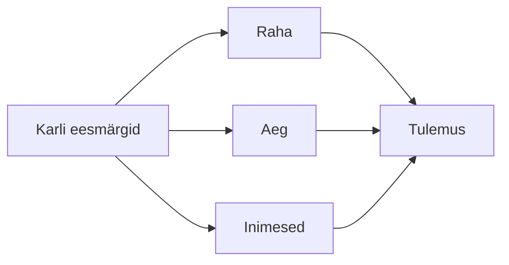

# 5. Ressursid: raha, aeg ja inimesed

::: info Õpiväljund
Pärast tundi oskad selgitada, miks on vaja raha, aega ja inimesi, ning koostada plaan, kuidas neid oma eesmärkide jaoks kasutada ja säästa (HK 5.8).
:::

Karl on töö leidnud. Esimene palk tuleb kontole kümnendal kuupäeval. Ta vaatab pangakontot ja mõtleb: "Nüüd on mul 1808 eurot. Kus see on järgmise kuu lõpus?"

Töö ei tähenda ainult raha teenimist. Karlil on kolm ressurssi, mida ta peab oskama juhtida: **raha**, **aeg** ja **inimesed**. Kõiki kolme on piiratud hulgal ja kõiki saab kasutada kas hästi või halvasti.

## Raha

### Esimene palk: kuhu see läheb?

Eelmisel kohtumisel arvutasime, et Karli brutopalgast 2200 € jääb kätte netopalk 1808,22 €. Karl hoiab alles ümardatud 1808 €.

Minuraha.ee ütleb, et ilma plaanita kaotab inimene võimaluse enda elu juhtida ja on sõltuv välistest asjaoludest. Lahendus on **kahesammuline lähenemine**:

1. **Vaata, kus sa praegu oled.** Kui palju sa teenid? Mis on sul säästudes? Kui kindel on tulu?
2. **Tee plaan.** Pane paika lühi-, kesk- ja pikaajalised eesmärgid.

### Karli kuu eelarve

Karl jälgib kuu tulusid ja kulusid. Ta eristab **vajadusi** (mida tal peab olema) ja **soove** (mida ta tahaks). Eelarve numbrid on väljamõeldud.

| Kulu | Summa | Liik |
| --- | --- | --- |
| Üür ja kommunaalid | 600 € | Vajadus |
| Toit | 330 € | Vajadus |
| Transport | 80 € | Vajadus |
| Telefon ja internet | 30 € | Vajadus |
| Riided ja hügieen | 90 € | Vajadus |
| Vaba aeg | 160 € | Soov |
| Õppimine ja kursused | 60 € | Areng |
| Ootamatud kulud | 58 € | Reserv |
| **Kulud kokku** | **1408 €** | |
| **Puhvri säästmine** | **400 €** | |
| **Tulu (neto)** | **1808 €** | |

### Puhver: miks 3–6 kuud?

Minuraha soovitab hoida **hädaolukorra puhvrit 3–6 kuu kulude ulatuses**. See katab ootamatud olukorrad: kodutehnika purunemine, haigus, töö kaotus.

Karli kulud on 1408 € kuus.

- 3 kuu puhver: 3 × 1408 = **4224 €**
- 6 kuu puhver: 6 × 1408 = **8448 €**

Kui Karl säästab 400 € kuus, siis kolme kuu puhvri kogub ta umbes 10,6 kuuga (4224 ÷ 400), ehk **ligi aastaga**. Kuue kuu puhver võtab umbes 21 kuud.

See võib tunduda pikk. Aga plaan teeb eesmärgi nähtavaks. Karl teab, et 400 € kuus viib ta eesmärgini 11 kuuga ja et see on tegelik ja saavutatav.

### Eesmärgid ajaühiku järgi

Minuraha järgi jagatakse eesmärgid ajaga:

| Aeg | Näide Karlile |
| --- | --- |
| **Lühiajaline** (kuni 1 aasta) | Puhver, telefoni asendamine |
| **Keskmine** (1–5 aastat) | Auto, kolimine omaette korterisse, kursus |
| **Pikaajaline** (20–30 aastat) | Pension, kodu |

Minuraha lisab, et kui sa räägid oma eesmärgist teistele, suureneb tõenäosus, et sa selle täidad.

### Pension: raha, mida kogud aastakümneid

Karl on 20-aastane ja pensionist rääkida tundub imelik. Aga pension on pikim eesmärk, mida ta saab praegu mõjutada.

Eesti pensionisüsteemil on **kolm sammast**.

| Sammas | Mis see on | Karli roll |
| --- | --- | --- |
| **I sammas** | Riiklik pension. Seda makstakse praeguste maksutulude arvelt | Ta maksab sotsiaalmaksu (tööandja kaudu) |
| **II sammas** | Kogumispension. Raha koguneb sinu isiklikule kontole | Karl on liitunud (vt kohtumine 2) |
| **III sammas** | Vabatahtlik lisapension | Ta võib teha omal soovil |

*Allikas: Pensionikeskus, "Eesti pensionisüsteemi ülevaade".*

**II sammas.** See toimib nii:

- Töötaja annab **2%** oma brutopalgast.
- Riik lisab **4%** sotsiaalmaksust.
- Alates 2025. aastast võib töötaja valida suurema sissemakse (**4% või 6%** brutopalgast).
- II sammas on alates 2021. aastast **vabatahtlik**.
- Riigi lisatud 4% vähendab I samba pensioni vastava summa võrra.

Karli näites oli kogumispensioni osa 44 € kuus (2% brutopalgast). Riik lisab sellele 88 € (4% 2200 eurost). Kokku koguneb temale 132 € kuus.

**Pensioniiga.** Aastal 2026 on vanaduspensioniiga 65 aastat. Alates 2027. aastast seotakse see keskmise eluea muutusega: 2027. aastal on pensioniiga 65 aastat ja üks kuu ning see võib kasvada kuni kolme kuu võrra aastas.

Karl ei pea kohe otsustama. Aga ta peab teadma, et **otsus on ta enda**, ja et mida varem ta alustab, seda rohkem aega on rahal kasvada.

::: tip Kus lisateavet saada
- [Pensionikeskus](https://www.pensionikeskus.ee): kontode ülevaade ja pensionisüsteemi selgitused
- [Minuraha.ee](https://minuraha.ee): rahaasjade planeerimine, kalkulaatorid, sõnastik
:::

## Aeg

Raha saab teenida juurde, aga aega mitte. Iga päev on 24 tundi. Mida Karl sellega teeb?

### Multitegumtöö ei tööta

Karl avab e-kirja, siis vastab sõnumile, siis kirjutab koodi, siis vaatab telefoni. Tundub, et ta teeb palju asju korraga. Aga psühholoogia näitab teist.

**Psühhobussi** artikkel selgitab: see, mida me nimetame multitegumtööks, on tegelikult **kiire ülesannete vahetamine**. Töömälu ei suuda keskenduda mitmele tegevusele korraga. Kui ülesandeid vahetada, tekib rohkem vigu ja kokku kulub rohkem aega kui ühe ülesande kaupa tehes. Artikkel viitab kolmele uuringule (Just jt, 2008; Rubinstein jt, 2001; Kushleyeva jt, 2005).

Katse, mida artikkel pakub: kirjuta sõna "PSÜHHOBUSS" ja numbrite rida kõigepealt eraldi, siis vaheldumisi täht-number. Vaheldumisi kirjutamine on aeglasem.

Kaks lisamõtet artiklist:

- **Sarnased tegevused segavad rohkem** kui erinevad. Kirja kirjutamine ja lugemine segavad üksteist rohkem kui juuste kammimine ja lugemine.
- **Ohtlikes olukordades (nt autojuhtimine)** ei tohiks multitegumtööd teha.

### Mida Karl muudab

Karl otsustab töötada nii:

1. **Ühe asja kaupa.** Ta teeb ühe ülesande, siis järgmise.
2. **Teavitused välja.** Kirjad ja sõnumid vaatab ta kindlal ajal, mitte pidevalt.
3. **Prioriteedid.** Hommikul kirjutab ta kolm asja, mis täna kindlasti valmis peavad saama.
4. **Aega hinnata.** Ta märgib, kui kaua ülesanne võtab, ja võrdleb tegeliku ajaga.

Neil nippidel on kaks eesmärki: tulemus on parem ja Karlil jääb rohkem vaba aega.

### Aeg ja eesmärgid

Karl vaatab nädala ja jagab aja:

| Valdkond | Tunde nädalas |
| --- | --- |
| Töö | 40 |
| Uni (7 tundi öösel) | 49 |
| Sõit, söök ja koduasjad | umbes 25 |
| Õppimine ja areng | umbes 5 |
| Sõbrad, hobid, puhkus | ülejäänud |

Nädalas on 168 tundi. Pärast töö (40), une (49), sõidu/söögi/kodu (25) ja arengu (5) jääb **49 tundi** vabaks. Karl ei pea neid tunde täitma, aga ta peab teadma, kuhu need lähevad.

Neid numbreid arvutas Karl ise ja need on tema isiklik näide. Sinu nädal näeb teistsugune välja.

## Inimesed

Raha ja aeg on Karli enda ressursid. Aga **inimesed** on ressurss, mida ta ei kontrolli, ometi on see tihti kõige olulisem.

### Kes on Karli ressursid?

| Inimene | Mida ta annab |
| --- | --- |
| **Meeskonnakaaslased** | Abi, tagasiside, jagatud töö |
| **Juht** | Ootused, eesmärgid, võimalused |
| **Mentor** | Kogemus ja nõuanded |
| **Vilistlased** | Teadmine, kuidas sama tee on käidud (vt kohtumine 4) |
| **Õpetajad** | Teadmised ja tagasiside |
| **Kaaslased ja sõbrad** | Tugi, ühine õppimine |
| **Kogukond** | Kohtumised, ühisprojektid, uued kontaktid |

### Võrgustik on kahesuunaline

Karl ei lähe inimeste juurde ainult siis, kui tal on midagi vaja. Hea võrgustik toimib mõlemal pool:

- **Aita teisi.** Jaga teadmist, kui sa oled midagi õppinud.
- **Küsi, kui vaja.** Inimesed aitavad meelsasti, kui küsimus on konkreetne.
- **Hoia suhet.** Lühike sõnum aeg-ajalt on parem kui kiri ainult siis, kui abi vaja.
- **Ole usaldusväärne.** Tee, mida lubad.

### Mida ma saan säästa inimeste abil?

Inimesed säästavad aega ja raha:

- **Aeg:** kogenud kolleeg lahendab sinu päevase probleemi 5 minutiga.
- **Raha:** soovitus võib viia sind kiiremini töökohale kui sadu kandideerimisi.
- **Viga:** mentor aitab sul vältida viga, mida ta ise tegi.

## Kõik koos: Karli ressursside plaan

Karl paneb nüüd kolm ressurssi ühte plaani. Ta võtab ühe oma eesmärgi: **"Aasta pärast olen juunior-arendaja, kellel on kolme kuu puhver ja töötav GitHubi portfoolio."**

| Ressurss | Mis on vaja | Kuidas säästan |
| --- | --- | --- |
| **Raha** | Puhver 4224 € (umbes 11 kuud × 400 €), kursuste maksumus 60 € kuus | Jälgin kulusid, vähendan vaba aja kulutusi |
| **Aeg** | 5 tundi nädalas õppimiseks ja projekti jaoks | Ühe asja kaupa töötamine, teavitused välja |
| **Inimesed** | Mentor või vilistlane, kes vaatab portfoolio üle | Küsin kord kuus 15 minutit tagasisidet |

Karli plaan on lihtne, aga ta on **konkreetne**: summad, tunnid ja inimesed on nimeliselt kirjas. Seetõttu saab ta ka kontrollida, kas ta liigub eesmärgi poole.

## Praktiline töö: ressursside plaan

Töö tehakse **fiktiivsete või üldistatud andmetega**. Ära kirjuta oma palka, kulusid ega sääste. Võid kasutada Karli numbreid või oma väljamõeldud tegelast.

**A. Eelarve**

Fiktiivne tegelane saab **brutopalka 2000 €** (netopalk on **1657,84 €**, arvutatud nii nagu kohtumisel 2, kui tegelane on II sambaga liitunud). Tee tema kuu eelarve vähemalt kaheksa kuluga. Eralda vajadused, soovid ja puhvri säästmine. Arvuta, kui mitu kuud kulub 3 kuu puhvri kogumiseks.

**B. Eesmärgid**

Kirjuta fiktiivsele tegelasele üks lühi-, üks kesk- ja üks pikaajaline rahaeesmärk. Iga eesmärgi jaoks: summa, tähtaeg ja kuidas ta seda jälgib.

**C. Aeg**

Katseta enda peal: tee üks ülesanne kaks korda. Esimene kord vahetades seda teise tegevusega (nt telefonis kirjutamine), teine kord segamata. Mõõda aega ja vigade arvu. Kirjuta 4–5 lauset, mida märkasid.

**D. Inimesed**

Tee nimekiri viiest inimese **tüübist** (nt õpetaja, vilistlane, mentor), kes aitaksid sind eesmärgi poole, ja iga kohta: mida sa neilt küsiksid. Ära kirjuta päris inimeste nimesid.

**E. Plaan**

Võta üks oma eesmärk (nt "olen aasta pärast ..."). Tee kolmerealine ressursside tabel (raha, aeg, inimesed): mis on vaja ja kuidas sääst. Seo see kohtumise 4 arengukavaga.

**Esitatav töö:** eelarve, eesmärgid, aja katse, inimeste nimekiri ja ressursside plaan. **Seos: HK 5.8.**

## Kokkuvõte

| Mõiste | Tähendus |
| --- | --- |
| Eelarve | Kuu tulude ja kulude plaan |
| Puhver | Hädaolukorra raha, 3–6 kuu kulude ulatuses |
| Vajadus ja soov | Mis on hädavajalik ja mis on tahtmine |
| Pensioni kolm sammast | Riiklik pension, kogumispension, vabatahtlik lisapension |
| Multitegumtöö | Tegelikult kiire ülesannete vahetamine, mis aeglustab ja suurendab vigu |
| Võrgustik | Inimesed, kes aitavad sind ja keda sa aitad |

Kolm mõtet:

- **Plaan annab kontrolli.** Konkreetsed summad ja tunnid on parem kui "peaks rohkem säästma".
- **Aeg on ainus ressurss, mida ei saa juurde teenida.** Ühe asja kaupa töötamine säästab aega.
- **Inimesed on ressurss.** Hoia suhteid ja ole ise ressurss teistele.

## Allikad

- [Minuraha.ee: Rahaasjade planeerimine](https://www.minuraha.ee/et/rahaasjade-planeerimine)
- [Minuraha.ee: II sammas](https://minuraha.ee/et/pension/ii-sammas)
- [Pensionikeskus: Eesti pensionisüsteemi ülevaade](https://www.pensionikeskus.ee/pensionisusteem/eesti-pensionisusteemi-ulevaade/)
- [Sotsiaalministeerium: 2027. aasta vanaduspensioniiga on 65 aastat ja üks kuu](https://www.sm.ee/uudised/2027-aasta-vanaduspensioniiga-65-aastat-ja-uks-kuu)
- [Psühhobuss: Mitu asja suudad Sina korraga teha](https://www.psyhhobuss.ee/post/mitut-asja-suudad-sina-korraga-teha)
- [Maksu- ja Tolliamet: Maksumuudatused 2026. aastal](https://www.emta.ee/uudised/maksumuudatused-2026)
