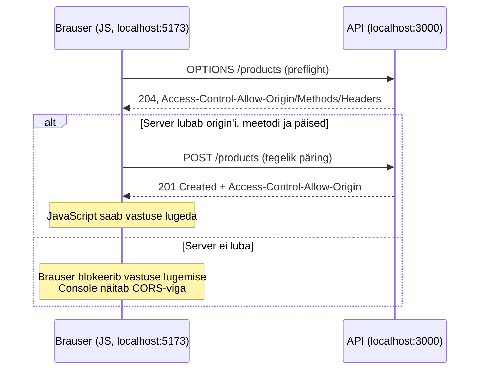

# Päritolu ja CORS

::: info Õpiväljund
Pärast õppetundi oskad selgitada CORS-i vea põhjust ning eristada brauseri turvareeglit serveri veast.
:::

Brauser ei anna ühe päritolu JavaScriptile vaikimisi vaba ligipääsu teise päritolu vastustele.

```text
rakendus: http://localhost:5173
API:      http://localhost:3000
```

Pordid erinevad, seega on päritolud erinevad.

## Same-origin põhimõte

Päritolu koosneb skeemist, hostist ja pordist. Same-origin põhimõte kaitseb kasutajat selle eest, et üks avatud veebileht ei saaks vabalt lugeda teise saidi andmeid.

## Mis on CORS?

CORS (*Cross-Origin Resource Sharing*) on HTTP-päiste süsteem, millega server ütleb brauserile, millistele teistele päritoludele võib vastuse anda.

```http
Access-Control-Allow-Origin: http://localhost:5173
```

CORS-i ligipääsu lubab server. Frontendi JavaScript ei saa puuduvat CORS-luba ise parandada.

## Lihtne ja preflight-päring

Mõne ristpäritolu päringu eel saadab brauser `OPTIONS` päringu. Seda nimetatakse preflight-päringuks — brauser kontrollib enne tegelikku päringut, kas server lubab soovitud meetodit ja päiseid.



Vastuse päised näevad välja nii:

```http
Access-Control-Allow-Origin: http://localhost:5173
Access-Control-Allow-Methods: GET, POST
Access-Control-Allow-Headers: Content-Type
```

## CORS ei kaitse serverit kõigi päringute eest

CORS on brauseri jõustatud lugemispiirang. Teised kliendid, näiteks serveriprogramm või `curl`, ei järgi brauseri same-origin reeglit.

Server peab alati ise kontrollima:

- autentimist;
- õiguseid;
- sisendi korrektsust;
- tegevuse lubatavust.

## CORS vea uurimine

Kui Console näitab CORS-i viga:

1. kontrolli rakenduse ja API origin'e;
2. vaata Network-paneelist, kas toimus `OPTIONS` päring;
3. kontrolli vastuse `Access-Control-Allow-*` päiseid;
4. kontrolli, kas server ise vastas veaga;
5. paranda serveri CORS-seadistus.

Ära kasuta juhuslikku avalikku CORS-proksit päris rakenduse lahendusena.

## Praktiline ülesanne

Võrdle:

```text
http://localhost:5173
http://localhost:3000
https://localhost:5173
http://127.0.0.1:5173
```

Kirjelda, millised paarid on sama päritolu. Selgita, miks erinev port või skeem muudab origin'i.

## Allikad

- [MDN: CORS](https://developer.mozilla.org/en-US/docs/Web/HTTP/Guides/CORS)
- [MDN: Same-origin policy](https://developer.mozilla.org/en-US/docs/Web/Security/Same-origin_policy)
