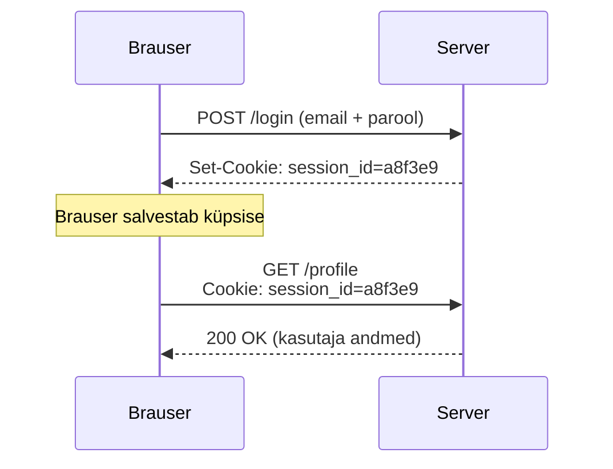

# Küpsised ja sessioonid

::: info Õpiväljund
Pärast õppetundi oskad selgitada, miks server vajab küpsiseid kasutaja äratundmiseks, ning lugeda `Set-Cookie` ja `Cookie` päiseid.
:::

HTTP on **olekuta** (*stateless*) protokoll — iga päring on server jaoks iseseisev ja server ei mäleta iseenesest, kas eelmise päringu saatis sama kasutaja. Kuid rakendus peab sageli teadma, kes on sisse logitud. Selle lahendab küpsis.

## Kuidas küpsis tekib

```http
POST /login HTTP/1.1
Host: app.example.com
Content-Type: application/json

{"email":"kasutaja@example.com","password":"..."}
```

Kui sisselogimine õnnestub, lisab server vastusesse `Set-Cookie` päise:

```http
HTTP/1.1 200 OK
Set-Cookie: session_id=a8f3e9; HttpOnly; Secure; SameSite=Lax; Max-Age=3600
```

Brauser salvestab selle küpsise ja saadab selle edaspidi **automaatselt** kaasa iga sama saidi päringuga:

```http
GET /profile HTTP/1.1
Host: app.example.com
Cookie: session_id=a8f3e9
```

Server otsib `session_id` väärtuse põhjal üles vastava sessiooni (nt mälust või andmebaasist) ja teab, kes päringu tegi — ilma et kasutaja peaks iga päringuga uuesti parooli saatma.



## Olulised küpsise atribuudid

| Atribuut | Roll |
| --- | --- |
| `HttpOnly` | JavaScript ei pääse küpsisele ligi (`document.cookie` seda ei näita) — kaitse XSS-i vastu |
| `Secure` | küpsis saadetakse ainult HTTPS-ühenduse kaudu |
| `SameSite=Lax` / `Strict` | piirab, millal küpsis läheb kaasa ristpäritolu päringutega |
| `Max-Age` / `Expires` | kui kaua küpsis kehtib |

**Sessioonipõhine küpsis** kaob, kui brauser suletakse (`Max-Age` puudub). **Püsiküpsis** (*persistent cookie*) jääb alles kuni `Max-Age`/`Expires` täitub, isegi kui brauser vahepeal suletakse.

## Seos CORS-iga

Ristpäritolu päringu puhul ([Päritolu ja CORS](./cors.md)) ei saada brauser küpsiseid kaasa vaikimisi. Klient peab seda eraldi lubama (`fetch(url, { credentials: "include" })`) ja server peab vastama konkreetse (mitte `*`) `Access-Control-Allow-Origin` väärtuse ning `Access-Control-Allow-Credentials: true` päisega. `SameSite=Strict` blokeerib küpsise ristpäritolu päringutel täielikult, isegi kui CORS seda muidu lubaks.

## Miks see turvaliselt teha

Kui `session_id` lekib (nt XSS-i või ebaturvalise ühenduse kaudu), saab ründaja end teise kasutajana esitleda ilma parooli teadmata — seda nimetatakse sessiooni kaaperdamiseks (*session hijacking*). Sellepärast on `HttpOnly` ja `Secure` vaikimisi olulised, mitte valikulised täiendused.

## Praktiline uurimine

Ava mõni sisselogimisega leht ja DevToolsi **Application** paneel (Chrome) või **Storage** paneel (Firefox).

1. Leia **Cookies** sektsioon ja vaata sisselogimisel tekkinud küpsist.
2. Kontrolli, kas sellel on `HttpOnly` ja `Secure` linnukesed.
3. Ava Network-paneelist sisselogimispäringu vastus ja leia `Set-Cookie` päis.
4. Ava mõni järgnev päring ja leia sealt `Cookie` päis.

## Allikad

- [MDN: Using HTTP cookies](https://developer.mozilla.org/en-US/docs/Web/HTTP/Cookies)
- Stanford CS 155: [Session Management](https://crypto.stanford.edu/cs155old/cs155-spring18/lectures/10-SessionMgmt.pdf)
