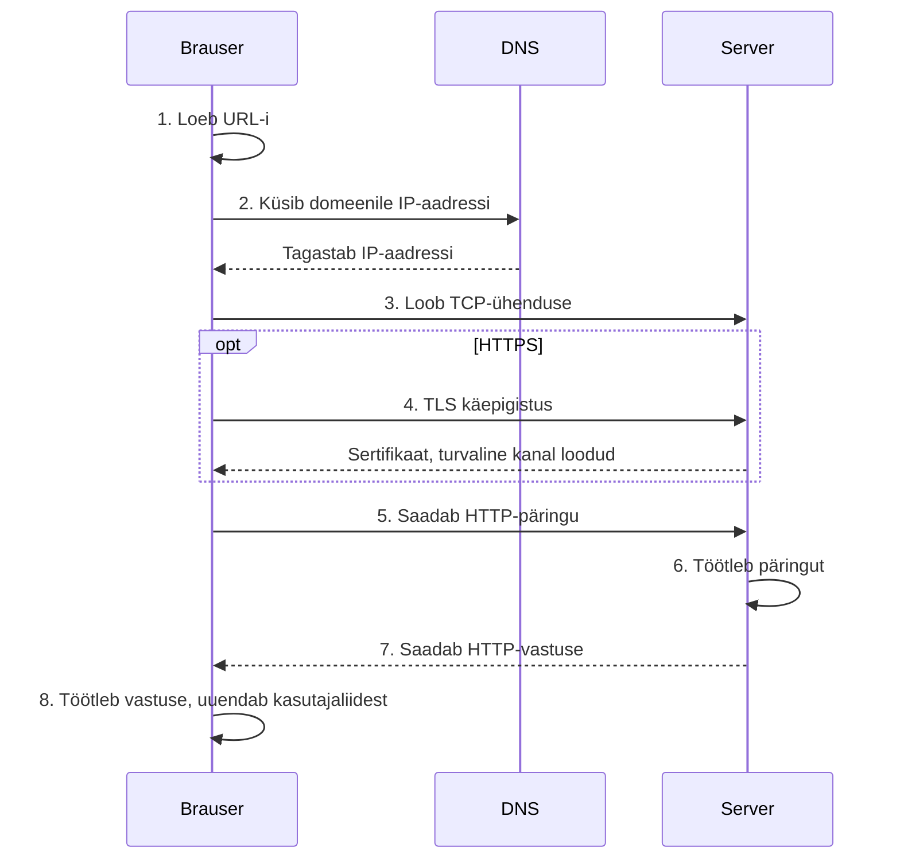

# Veebipäringu teekond

::: info Õpiväljund
Pärast õppetundi oskad järjestada veebipäringu peamised sammud ning leida vea võimalikku asukohta.
:::

Kui avad aadressi või JavaScript käivitab `fetch()` päringu, peab brauser leidma serveri, looma ühenduse, saatma päringu ja töötlema vastuse.

## Lihtsustatud teekond



Kõik sammud ei toimu iga päringu puhul nullist. Brauser võib kasutada vahemälu, olemasolevat ühendust ja varem leitud DNS-vastust.

## Miks HTTPS? TLS lühidalt

Samm 4 ("TLS käepigistus") ei ole detail, mille võib vahele jätta — see on põhjus, miks veebis üldse saab turvaliselt andmeid saata.

Ilma TLS-ita liiguks HTTP-päring võrgus avatud tekstina: iga vahepealne võrguseade (nt sama WiFi-võrgu teine kasutaja) saaks seda lugeda või muuta. TLS-käepigistuse käigus:

1. brauser ja server lepivad kokku ühises krüpteerimisvõtmes;
2. server tõendab oma identiteeti sertifikaadiga, mille on välja andnud usaldusväärne sertifitseerimisasutus;
3. kõik selle järel saadetud andmed krüpteeritakse.

```text
https://example.com  → TLS tagab konfidentsiaalsuse, tervikluse ja serveri autentsuse
http://example.com   → andmed liiguvad krüpteerimata
```

TLS-käepigistus lisab enne esimest päringut ühe täiendava võrgu edasi-tagasi käigu (*round trip*) — seepärast on esimene HTTPS-päring alati veidi aeglasem kui hilisemad sama ühenduse päringud.

## Brauser ja server täidavad eri rolle

Brauser:

- käivitab kasutajaliidese;
- saadab päringuid;
- rakendab brauseri turvareegleid;
- kuvab vastuse tulemuse.

Server:

- kuulab kindlal aadressil ja pordil;
- töötleb päringut;
- loeb või muudab andmeid;
- koostab vastuse.

## Kus võib viga tekkida?

| Sümptom | Võimalik koht |
| --- | --- |
| domeeni ei leitud | URL või DNS |
| ühendus ebaõnnestus | server, port, võrk või TLS |
| vastus on `404` | server ei leidnud ressurssi |
| vastus on `500` | serveri töötlemine ebaõnnestus |
| Network näitab vastust, JavaScript viskab vea | vastuse töötlemine või andmekuju |
| Console näitab CORS-i viga | brauseri päritolureegel ja serveri päised |

## Praktiline uurimine

Ava tootekataloog ja DevToolsi Network-paneel.

1. Laadi leht uuesti.
2. Leia HTML-, JavaScripti- ja API-päring.
3. Märgi iga päringu URL, meetod, staatus ja tüüp.
4. Selgita, millise sammu tulemust iga Network-paneeli rida kinnitab.

## Mõtesta

- Mis vahe on sellel, et server ei vasta, ja sellel, et server vastab `500` koodiga?
- Milliseid samme brauser teeb enne, kui `fetch()` saab `Response` objekti?
- Miks ei pruugi aeglane rakendus tähendada aeglast JavaScripti?

## Allikad

- [MDN: How the web works](https://developer.mozilla.org/en-US/docs/Learn_web_development/Getting_started/Web_standards/How_the_web_works)
- Brown University CSCI-1680: [TCP käepigistus (Transport Layer I)](https://cs.brown.edu/courses/csci1680/f17/lectures/13-tcp1.pdf)
- Brown University CSCI-1680: [TLS ja PKI](https://cs.brown.edu/courses/csci1680/f24/lectures/f24/24-tls-pki-notes.pdf)
- Ilya Grigorik, [*High Performance Browser Networking* — TLS peatükk](https://hpbn.co/transport-layer-security-tls/)
