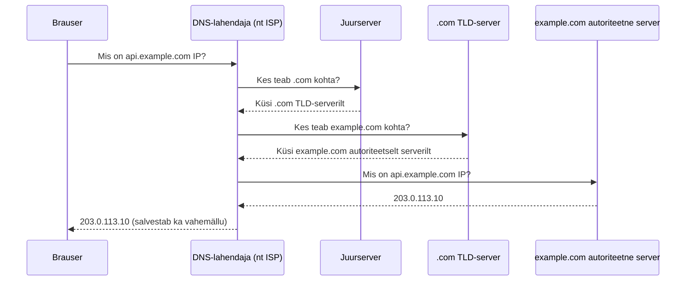

# URL, domeen ja DNS

::: info Õpiväljund
Pärast õppetundi oskad URL-i osadeks jagada ning selgitada DNS-i ja pordi rolli serveri leidmisel.
:::

```text
https://api.example.com:8443/products/7?lang=et#details
```

| Osa | Väärtus | Roll |
| --- | --- | --- |
| skeem | `https` | suhtlusprotokoll |
| host | `api.example.com` | serveri nimi |
| port | `8443` | serveris kuulav teenus |
| tee | `/products/7` | soovitud ressurss |
| päring | `?lang=et` | lisaparameetrid |
| fragment | `#details` | kliendipoolne asukoht |

Fragmenti brauser tavaliselt HTTP-päringuga serverile ei saada.

## Domeen ja IP-aadress

Inimesel on lihtne kasutada domeeni:

```text
example.com
```

Võrgus suheldakse IP-aadressiga. DNS seob domeeninime sobiva IP-aadressiga.

```text
api.example.com → DNS → 203.0.113.10
```

Üks domeen võib anda mitu IP-aadressi ning sama IP võib teenindada mitut domeeni.

### Kuidas DNS-vastus tegelikult leitakse?

Brauser ei küsi vastust otse "internetilt" — päring liigub läbi mitme serveri, kellest igaüks teab ainult osa vastusest:



Kui vastus on juba vahemälus (*cache*), jäetakse ülemised sammud vahele ja DNS-lahendaja vastab kohe.

## Port

IP-aadress leiab arvuti või võrguteenuse asukoha. Port aitab valida selles asukohas õige programmi.

Levinud vaikimisi pordid:

- HTTP: `80`;
- HTTPS: `443`;
- Vite arendusserver: sageli `5173`;
- Node.js õppeserver: sageli `3000`.

## Päritolu

Päritolu (*origin*) koosneb:

```text
skeem + host + port
```

Need on eri päritolud:

```text
http://example.com
https://example.com
https://api.example.com
https://example.com:8443
```

Päritolu mõiste on CORS-i aluseks.

## Praktiline ülesanne

Jaga osadeks:

```text
http://localhost:5173/products?category=books#top
https://fakestoreapi.com/products/1
```

Leia mõlema puhul skeem, host, port, tee, päring, fragment ja origin.

## Allikad

- [MDN: What is a URL?](https://developer.mozilla.org/en-US/docs/Learn_web_development/Howto/Web_mechanics/What_is_a_URL)
- [MDN: Origin](https://developer.mozilla.org/en-US/docs/Glossary/Origin)
- Brown University CSCI-1680: [DNS](https://cs.brown.edu/courses/csci1680/s12/lectures/15-dns.pdf)
